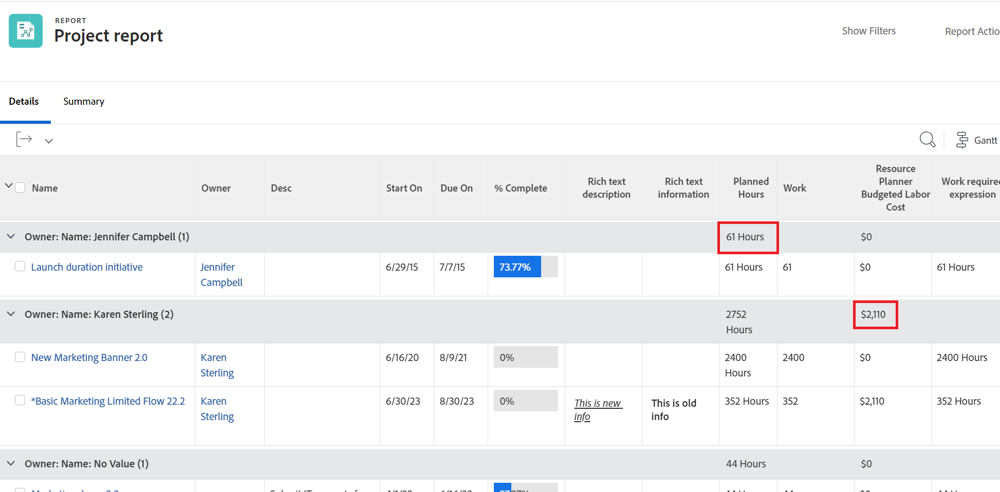

# Criar um relatório personalizado

Entender como criar relatórios ajuda a fornecer acesso às informações de que sua organização precisa no Adobe Workfront. Você pode usar qualquer um dos relatórios internos disponíveis no Workfront ou criar seus próprios relatórios do zero.

Para obter mais informações sobre relatórios internos, consulte [Usar relatórios integrados do Adobe Workfront](../../../reports-and-dashboards/reports/using-built-in-reports/use-workfront-built-in-reports.md). Para obter informações sobre como criar um relatório copiando-o, consulte [Criar uma cópia de um relatório](../../../reports-and-dashboards/reports/creating-and-managing-reports/create-copy-report.md).

## Requisitos de acesso

Você deve ter o seguinte acesso para executar as etapas deste artigo:

<table style="table-layout:auto"> 
 <col> 
 <col> 
 <tbody> 
  <tr> 
   <td role="rowheader">plano do Adobe Workfront*</td> 
   <td> 
Qualquer Um
 </td> 
  </tr> 
  <tr> 
   <td role="rowheader">Licença da Adobe Workfront*</td> 
   <td> 
Plano 
 </td> 
  </tr> 
  <tr> 
   <td role="rowheader">Configurações de nível de acesso*</td> 
   <td> 
Editar acesso a relatórios, painéis, calendários
 
Editar acesso a Filtros, Visualizações, Agrupamentos
 
Observação: se você ainda não tiver acesso, pergunte ao administrador do Workfront se ele definiu restrições adicionais em seu nível de acesso. Para obter informações sobre como um administrador do Workfront pode modificar seu nível de acesso, consulte <a href="../../../administration-and-setup/add-users/configure-and-grant-access/create-modify-access-levels.md" class="MCXref xref">Criar ou modificar níveis de acesso personalizados</a>.
 </td> 
  </tr> 
  <tr> 
   <td role="rowheader">Permissões de objeto</td> 
   <td> 
Você obterá permissões de gerenciamento para o relatório que criar
 
Para obter informações sobre como solicitar acesso adicional, consulte <a href="../../../workfront-basics/grant-and-request-access-to-objects/request-access.md" class="MCXref xref">Solicitar acesso a objetos </a>.
 </td> 
  </tr> 
 </tbody> 
</table>

&#42;Para descobrir seu plano, tipo de licença ou acesso, entre em contato com o administrador do Workfront.

## Criar um relatório {#create-a-report}

Para assistir a um vídeo sobre como criar um relatório, consulte esta [Criar um relatório personalizado](#Walk-thr) abaixo.

1. Clique em **Menu principal** ícone  no canto superior direito e clique em **Relatórios**.
1. Clique em **Novo Relatório** e, em seguida, selecione o tipo de objeto desejado para o relatório.

   O Report Builder é carregado.

   Para obter informações específicas sobre relatórios de objetos disponíveis, consulte a seção [Relatório sobre objetos](../../../workfront-basics/navigate-workfront/workfront-navigation/understand-objects.md#reporting-on-objects) no artigo [Entender objetos no Adobe Workfront](../../../workfront-basics/navigate-workfront/workfront-navigation/understand-objects.md).

   

   >[!TIP]
   >
   >Você também pode criar um relatório fazendo uma cópia de um relatório existente. Para obter mais informações, consulte [Criar uma cópia de um relatório](../../../reports-and-dashboards/reports/creating-and-managing-reports/create-copy-report.md).

1. No Report Builder, adicione o seguinte código ao seu relatório:

   <table style="table-layout:auto"> 
    <col> 
    <col> 
    <thead> 
     <tr> 
      <th>Recurso</th> 
      <th>Descrição</th> 
     </tr> 
    </thead> 
    <tbody> 
     <tr> 
      <td>Colunas (visualizar)</td> 
      <td> 
Adicionar colunas ao relatório determina quais informações ele contém.
 
Para saber como adicionar uma coluna, consulte <a href="#add-columns-view-to-a-report" class="MCXref xref">Adicionar colunas (visualização) a um relatório</a>. 
 </td> 
     </tr> 
     <tr> 
      <td>Agrupamento</td> 
      <td> 
Adicionar agrupamentos ao relatório determina como o relatório é organizado.
 
Para saber como adicionar um agrupamento, consulte <a href="#add-groupings-to-a-report" class="MCXref xref">Adicionar agrupamentos a um relatório</a>.
 </td> 
     </tr> 
     <tr> 
      <td>Filtros</td> 
      <td> 
Adicionar regras de filtro ao relatório determina as informações que você vê no relatório.
 
Para saber como adicionar um filtro, consulte <a href="#add-filters-to-a-report" class="MCXref xref">Adicionar filtros a um relatório</a>.
 </td> 
     </tr> 
     <tr> 
      <td>Gráfico</td> 
      <td> 
Adicionar um gráfico ao relatório determina como as informações nele contidas são apresentadas visualmente.
 
Para saber como adicionar um gráfico, consulte <a href="#add-a-chart-to-a-report" class="MCXref xref">Adicionar um gráfico a um relatório</a>.
 </td> 
     </tr> 
    </tbody> 
   </table>

1. Em qualquer momento durante o processo de criação do relatório, clique em **Aplicar** para salvar as alterações.
1. Quando terminar, clique em **Salvar + Fechar**.

### Adicionar colunas (visualização) a um relatório {#add-columns-view-to-a-report}

1. Comece a criar um relatório conforme descrito no [Criar um relatório](#create-a-report) neste artigo.
1. No Report Builder, selecione a variável **Colunas (Exibir)** para identificar as colunas a serem exibidas no relatório.
1. (Opcional) Clique em **Aplicar uma visualização existente** para usar uma visualização existente.

   Para obter mais informações sobre como criar uma nova visualização, consulte [Visão geral das exibições no Adobe Workfront](../../../reports-and-dashboards/reports/reporting-elements/views-overview.md).

1. Para adicionar uma nova coluna, clique em **Adicionar coluna**.

   Ou

   Para alterar uma coluna existente, selecione a coluna que deseja alterar e clique no (x) ao lado do nome atual.

1. Comece a digitar o campo que deseja adicionar. Se o campo estiver disponível, ele será preenchido para cada objeto em que puder ser associado. Clique no nome do campo para adicioná-lo à coluna.

   Para obter mais informações sobre os campos exibidos nas colunas, consulte [Glossário da terminologia do Adobe Workfront](../../../workfront-basics/navigate-workfront/workfront-navigation/workfront-terminology-glossary.md).

   

1. (Opcional) Na **Configurações de coluna** , selecione **Classificar por esta coluna** para classificar os valores na coluna em ordem alfabética crescente ou decrescente, indique se a lista deve usar essa coluna como sua primeira classificação.

   É possível ter vários níveis de classificações em uma exibição de relatório se você quiser classificar pelo valor em uma coluna primeiro, o valor em uma segunda coluna segundo, etc.

   Se vários resultados forem idênticos de acordo com o primeiro critério de classificação, eles serão classificados na ordem do segundo critério de classificação. Se vários resultados forem idênticos de acordo com a primeira e a segunda classificação, eles serão classificados de acordo com a terceira classificação etc.

   >[!NOTE]
   >
   >Se você adicionar um campo que faça referência a um objeto muito distante do objeto sobre o qual está relatando, talvez não seja possível classificar por esse campo.\
   >Por exemplo, um relatório de problemas não pode ser classificado pelo campo Proprietário do projeto porque faz referência a três objetos adicionais: Projeto, Proprietário e Nome. No entanto, você ainda pode adicionar esse campo a um relatório de problemas e ver as informações dele.

   <!--outdated: To learn more about cross-object references in reports, see the section "Advanced Reporting Part 1 of 3" in the [Reports and Dashboards Learning Path](https://one.workfront.com/s/learningpath2/workfront-reporting-MC7MZT2BOL2ZC2LMJ4MA3EMHOCNY?tabset-dc70e=2).-->

1. (Opcional) Se estiver usando agrupamentos e quiser resumir (agregar) as informações em uma coluna, clique no link **Resumir esta coluna por** lista suspensa na **Configurações de coluna** e selecione a opção que deseja usar para agregar as informações na coluna.

   As informações agregadas são exibidas na coluna nas linhas de agrupamento.

   

   Para obter mais informações sobre o resumo dos dados em uma coluna, consulte [Visão geral das exibições no Adobe Workfront](../../../reports-and-dashboards/reports/reporting-elements/views-overview.md).

   >[!NOTE]
   >
   >As exceções a seguir se aplicam a objetos pai (por exemplo, tarefas pai) quando você está agregando valores para os seguintes campos em agrupamentos:
   >
   >* Todos os campos de número e moeda, exceto Horas Reais (por exemplo, Custo de Trabalho Planejado/Efetivo, Custo de Despesas Planejado/Efetivo, Custo Planejado/Efetivo, Horas Planejadas) agregam apenas os valores das tarefas filhas e tarefas independentes. Eles não agregam os valores das tarefas pai ou pai dos pais.
   >* As Horas Reais agregam os valores das tarefas pai principal e independente; elas não agregam os números para as tarefas pai ou filho.
   >* Os campos de dados personalizados para valores de número e moeda agregam todas as tarefas: pais, filhos, pais dos pais e tarefas independentes.

   Para obter mais informações sobre o uso de agrupamentos em um relatório, consulte [Visão geral de agrupamentos no Adobe Workfront](../../../reports-and-dashboards/reports/reporting-elements/groupings-overview.md).

1. (Opcional) Clique em **Opções avançadas** para especificar as seguintes informações para a coluna:

   <table style="table-layout:auto"> 
    <col> 
    <col> 
    <tbody> 
     <tr> 
      <td role="rowheader">Personalizar rótulo da coluna</td> 
      <td> 
Especifique um rótulo personalizado para a coluna. Esse rótulo substitui o rótulo padrão.
 </td> 
     </tr> 
     <tr> 
      <td role="rowheader">Formato do campo</td> 
      <td> 
Selecione o formato no qual deseja que os valores sejam exibidos para os campos na coluna.
 </td> 
     </tr> 
     <tr> 
      <td role="rowheader">Mostrar esta coluna quando estiver em um Painel</td> 
      <td> 
Selecione essa opção para mostrar essa coluna em um painel, quando o relatório for exibido lado a lado com outro relatório. Quando essa opção não está selecionada, essa coluna não é exibida ao visualizar o relatório em um painel em que os relatórios são exibidos lado a lado.
 </td> 
     </tr> 
     <tr> 
      <td role="rowheader">Regras de colunas</td> 
      <td> 
Clique em <strong>Adicionar uma Regra para esta Coluna</strong> para adicionar formatação condicional à coluna. Após adicionar uma regra, é possível definir estilos de campo e texto para a forma como os campos que correspondem a essa regra são exibidos. Clique em <strong>Adicionar regra</strong> após concluir a definição da regra. Para obter mais informações sobre formatação condicional em uma exibição, consulte <a href="../../../reports-and-dashboards/reports/reporting-elements/use-conditional-formatting-views.md" class="MCXref xref">Usar formatação condicional em exibições</a>.
 </td> 
     </tr> 
    </tbody> 
   </table>

1. Clique em **Aplicar** para aplicar as alterações até o momento e continuar editando o relatório com as opções a seguir.

   Clique em **Salvar + Fechar** se tiver terminado de editar as colunas no relatório e quiser salvá-lo.

### Adicionar agrupamentos a um relatório {#add-groupings-to-a-report}

1. Comece a criar um relatório conforme descrito no [Criar um relatório](#create-a-report) neste artigo.
1. No Report Builder, selecione a variável **Agrupamentos** para identificar como você deseja agrupar itens no relatório.
1. Clique em **Adicionar Agrupamento** para adicionar um novo agrupamento.

   Ou

   Escolher **Aplicar um agrupamento existente** para selecionar um agrupamento existente
   

1. Comece digitando o campo que deseja adicionar como um agrupamento. Se o campo estiver disponível, ele será preenchido para cada objeto em que puder ser associado. Clique no nome do campo para adicioná-lo a esse agrupamento.
1. (Opcional) É possível optar por criar um agrupamento no modo de texto, clicando em **Alternar para modo de texto**. Para obter mais informações sobre o uso do modo de texto, consulte [Visão geral do modo de texto](../../../reports-and-dashboards/reports/text-mode/understand-text-mode.md).

   Para obter mais informações sobre como criar novos agrupamentos, consulte [Visão geral de agrupamentos no Adobe Workfront](../../../reports-and-dashboards/reports/reporting-elements/groupings-overview.md).

1. (Opcional) Selecione **Recolher este agrupamento por padrão** se desejar que os resultados desse agrupamento sejam exibidos recolhidos, em vez de expandidos.

   Essa configuração é desabilitada por padrão e os resultados do agrupamento sempre são exibidos em uma lista expandida.

   >[!TIP]
   >
   >* Quando você ajusta agrupamentos manualmente ao visualizar uma lista, o Workfront lembra de sua preferência manual até que você faça logout. Ao fazer logon novamente, a lista é exibida de acordo com essa configuração.
   >* Os resultados de um agrupamento sempre são exibidos expandidos depois de acessados de um elemento do gráfico.

1. (Opcional) É possível optar por criar um agrupamento de matriz para mostrar os resultados em um formato de grade.

   Para obter mais informações sobre a criação de um relatório de matriz, consulte [Criar um relatório de matriz](../../../reports-and-dashboards/reports/creating-and-managing-reports/create-matrix-report.md).

1. Clique em **Aplicar** para aplicar as alterações até o momento e continuar editando o relatório com as opções a seguir.

   Clique em **Salvar + Fechar** se tiver terminado de editar os agrupamentos no relatório e quiser salvá-lo.

### Adicionar filtros a um relatório {#add-filters-to-a-report}

1. Comece a criar um relatório conforme descrito no [Criar um relatório](#create-a-report) neste artigo.
1. No Report Builder, selecione a variável **Filtros** para identificar a quantidade de informações que você deseja que o relatório inclua.
1. Clique em **Adicionar uma regra de filtro** para adicionar um filtro personalizado.\
   Ou\
   Escolher **Aplicar um filtro existente** para usar um filtro existente.

   

1. Se você clicou em **Adicionar uma regra de filtro**, comece digitando o campo que deseja adicionar como filtro. Se o campo estiver disponível, ele será preenchido para cada objeto em que puder ser associado. Clique no nome do campo para adicioná-lo a esse filtro.\
   Use modificadores de filtro para criar seu filtro. Para obter mais informações sobre modificadores de filtro, consulte [Filtro e modificadores de condição](../../../reports-and-dashboards/reports/reporting-elements/filter-condition-modifiers.md).

   Para obter mais informações sobre como criar novos filtros, consulte [Visão geral dos filtros no Adobe Workfront](../../../reports-and-dashboards/reports/reporting-elements/filters-overview.md).

1. (Opcional) É possível optar por criar um filtro no modo de texto clicando em **Alternar para modo de texto**.

   Para obter mais informações sobre o uso do modo de texto, consulte [Visão geral do modo de texto](../../../reports-and-dashboards/reports/text-mode/understand-text-mode.md).

1. Clique em **Aplicar** quando você terminar de editar os filtros no relatório para aplicar suas alterações até o momento e continuar editando o relatório com as opções a seguir.

   Clique em **Salvar + Fechar** se o relatório e você desejar salvá-lo.

### Adicionar um gráfico a um relatório {#add-a-chart-to-a-report}

1. Comece a criar um relatório conforme descrito no [Criar um relatório](#create-a-report) neste artigo.
1. No Report Builder, selecione a variável **Gráfico** e selecione o tipo de gráfico que deseja adicionar.

   

   Para obter mais informações sobre a criação de um gráfico em um relatório, consulte [Adicionar um gráfico a um relatório](../../../reports-and-dashboards/reports/creating-and-managing-reports/add-chart-report.md).

1. Clique em **Aplicar** para aplicar as alterações até o momento e continuar editando o relatório com as opções a seguir.

   Clique em **Salvar + Fechar** se tiver terminado de editar o relatório e quiser salvá-lo.
