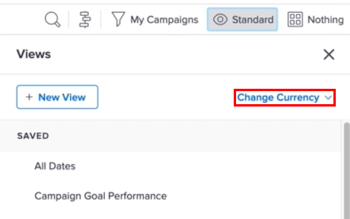

# Criar relatórios de dados financeiros com taxas de câmbio exclusivas

Se várias taxas de câmbio tiverem sido configuradas no Adobe Workfront, será possível definir valores financeiros em relatórios e listas para exibição em uma moeda diferente da moeda padrão.

>[!IMPORTANT]
>
>Se você selecionar uma moeda diferente da moeda padrão em uma Exibição, não verá mais os links **Adicionar mais tarefas** e **Adicionar mais problemas** na parte inferior de uma lista de projetos.

Para obter informações sobre como alterar a moeda padrão de um determinado projeto, consulte [Alterar a moeda do projeto](../../../manage-work/projects/project-finances/change-project-currency.md).

Se houver projetos com uma única moeda no relatório, as somas em agrupamentos também serão exibidas na moeda padrão do sistema.

## Requisitos de acesso

Você deve ter o seguinte acesso para executar as etapas deste artigo:

<table style="table-layout:auto"> 
 <col> 
 <col> 
 <tbody> 
  <tr> 
   <td role="rowheader">plano do Adobe Workfront*</td> 
   <td> 
Qualquer
 </td> 
  </tr> 
  <tr> 
   <td role="rowheader">Licença da Adobe Workfront*</td> 
   <td> 
Plano 
 </td> 
  </tr> 
  <tr> 
   <td role="rowheader">Configurações de nível de acesso*</td> 
   <td> 
Editar acesso a relatórios, painéis, calendários
 
Editar acesso a Filtros, Visualizações, Agrupamentos
 
Observação: se você ainda não tiver acesso, pergunte ao administrador do Workfront se ele definiu restrições adicionais em seu nível de acesso. Para obter informações sobre como um administrador do Workfront pode modificar seu nível de acesso, consulte <a href="../../../administration-and-setup/add-users/configure-and-grant-access/create-modify-access-levels.md" class="MCXref xref">Criar ou modificar níveis de acesso personalizados</a>.
 </td> 
  </tr> 
  <tr> 
   <td role="rowheader">Permissões de objeto</td> 
   <td> 
Gerenciar permissões para um relatório
 
Para obter informações sobre como solicitar acesso adicional, consulte <a href="../../../workfront-basics/grant-and-request-access-to-objects/request-access.md" class="MCXref xref">Solicitar acesso aos objetos </a>.
 </td> 
  </tr> 
 </tbody> 
</table>

&#42;Para saber qual plano, tipo de licença ou acesso você tem, contate o administrador do Workfront.

## Pré-requisitos

Antes de exibir moedas alternativas conforme descrito nesta seção, o administrador do Workfront deve primeiro ativar e configurar várias moedas na área Configuração do Workfront. Para obter informações, consulte [Configurar taxas de câmbio](../../../administration-and-setup/manage-workfront/exchange-rates/set-up-exchange-rates.md).

## Aplicar valores financeiros a um relatório {#apply-financial-values-to-a-report}

Para converter valores financeiros entre moedas ao trabalhar com relatórios:

1. Vá para o relatório em que deseja converter os valores financeiros para uma moeda diferente.
1. Clique na lista suspensa **Exibir**, clique em **Alterar Moeda** e selecione uma das seguintes moedas nas quais deseja exibir valores financeiros:

   * Moeda original do projeto
   * Qualquer outra moeda

     >[!TIP]
     >
     >Você pode escolher somente as moedas selecionadas anteriormente em Configurar.

   Usar essa opção permite converter rapidamente valores financeiros em um relatório entre valores de taxa.

   

   <!--
   
(NOTE: drafted this tip because I think this is confusing; this is in the step above.)

   -->

   <!--
   <note type="tip">
   You can also select the Change Currency option to convert financial values in other lists.
    
   
    
    
   </note>
   -->

## Exibir a moeda padrão em vários projetos com moedas diferentes

Quando você personaliza a moeda no nível do projeto e deseja exibir informações de todos os projetos no mesmo relatório, os seguintes cenários existem:

* Se você criar um relatório que traz informações financeiras de dois ou mais projetos que têm moedas diferentes aplicadas, por padrão, o resumo de agrupamento reflete a moeda padrão do sistema, conforme selecionado pelo administrador do Workfront.
* Se você criar um relatório para dois ou mais projetos que têm a mesma moeda, mas diferem da moeda padrão do sistema, as somas nos agrupamentos serão exibidas usando a moeda padrão do sistema.
* Se você criar um relatório para dois ou mais projetos que têm atribuições de função de trabalho associadas a uma sobreposição de moeda, o Workfront converterá as informações financeiras das taxas de moeda sobrepostas da função de trabalho para a moeda do projeto (quando você selecionar Moeda Original do Projeto na exibição) ou para qualquer moeda diferente que você selecionar ao exibir o relatório. Para obter informações sobre como substituir a moeda de uma função de trabalho, consulte [Criar e gerenciar funções de trabalho](../../../administration-and-setup/set-up-workfront/organizational-setup/create-manage-job-roles.md).

Para exibir dois projetos com moedas personalizadas em um relatório:

1. Crie dois projetos com moedas diferentes aplicadas.

   

1. Registre as horas em ambos os projetos.

   Para obter mais informações sobre o tempo de registro, consulte [Tempo de registro](../../../timesheets/create-and-manage-timesheets/log-time.md).

1. Clique no ícone  do **Menu principal** e em **Relatórios**.
1. Clique em **Novo Relatório**, depois em **Relatório de Projeto**.
1. Na guia **Colunas (Exibição)**, adicione uma coluna **Custo Real** e resuma-a por **Soma**.

   Para obter informações sobre como criar uma coluna, consulte [Visão geral das exibições no Adobe Workfront](../../../reports-and-dashboards/reports/reporting-elements/views-overview.md).

1. Na guia **Agrupamentos**, aplique um agrupamento **Data de conclusão planejada**.

   Para obter informações sobre como criar um agrupamento, consulte [Visão geral de agrupamentos no Adobe Workfront](../../../reports-and-dashboards/reports/reporting-elements/groupings-overview.md).

1. Na guia **Filtros**, adicione um filtro para **Nome do Projeto** e selecione os dois projetos com moedas diferentes.

   Para obter informações sobre como criar um filtro, consulte [Visão geral dos filtros](../../../reports-and-dashboards/reports/reporting-elements/filters-overview.md).

1. Clique em **Salvar + Fechar**.

   O total do **Custo Efetivo** é exibido no Agrupamento usando a moeda padrão do sistema, independentemente da moeda dos projetos no relatório.

   

   Se os dois projetos tiverem moedas diferentes entre si, a moeda padrão do sistema também será exibida no Agrupamento do relatório.

## Exibir a Moeda do Projeto em um relatório no nível do projeto

Se um agrupamento for aplicado em uma lista de tarefas ou horas em um projeto, as somas no agrupamento serão exibidas na moeda do projeto.

1. Crie um projeto com uma moeda personalizada, diferente da moeda padrão do sistema.
1. Vá para o projeto e verifique se ele inclui horas que foram registradas para tarefas.

   Para obter mais informações sobre o tempo de registro, consulte [Tempo de registro](../../../timesheets/create-and-manage-timesheets/log-time.md).

   >[!NOTE]
   >
   >As tarefas devem ser atribuídas a usuários ou funções de trabalho com taxas de custo por hora.

1. Clique em **Tarefas**.
1. Expanda o menu suspenso **Exibir** e selecione **Nova Exibição**.
1. Adicione o **Custo Efetivo** na nova Exibição como uma nova coluna e resuma-o pela **Soma**.
1. Clique em **Concluído** e em **Salvar exibição**.
1. Expanda o menu suspenso **Agrupamento** e selecione **Novo agrupamento**.
1. Adicione **Data de conclusão efetiva** no novo agrupamento como um novo campo, depois clique em **Salvar Agrupamento**.

   A coluna **Custo Real** resume no novo Agrupamento e exibe o total na moeda do projeto.

## Editar relatórios com moedas exclusivas

Os campos financeiros em um relatório não são editáveis até que você altere a configuração do relatório para mostrar a moeda original para projetos.

Para editar em linha um campo financeiro em um relatório:

1. Navegue até um relatório.

   >[!NOTE]
   >
   >Se a moeda padrão não for exibida para uma lista em qualquer outra área, você poderá editar a Exibição para exibir a moeda padrão.\
   >Para obter informações sobre como alterar a moeda em uma Exibição, consulte a seção neste artigo [Aplicar valores financeiros a um relatório](#apply-financial-values-to-a-report).

1. Clique em **Ações de Relatório** e selecione **Editar**.
1. Clique em **Configurações do relatório**.
1. Clique no menu suspenso **Moeda padrão** e selecione **Moeda original do projeto**.

   

1. Clique em **Concluído**.
