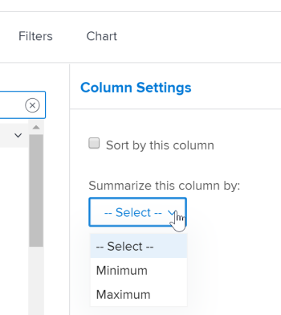

# Criar um relatório de matriz

Os relatórios de matriz apresentam as informações resumidas em um formato de tabela agregada, facilitando a visualização do que se fossem exibidas em uma lista como em um relatório tradicional.

## Quando usar um relatório de matriz

Você pode criar um relatório de matriz para qualquer relatório que contenha 2 ou mais Agrupamentos. Um relatório tradicional pode conter até 3 agrupamentos e um relatório de matriz pode conter até 4 agrupamentos.

Por exemplo, você deseja criar um relatório de Hora que exibe as horas registradas durante um período de 3 meses e deseja que o relatório seja organizado de acordo com quem digitou as horas, bem como por mês e semana.

## Como os dados são exibidos em um relatório de matriz

As informações no relatório de matriz são sempre exibidas como um valor numérico. Na maioria dos casos, as colunas que contêm um valor numérico são mais adequadas para exibição em um relatório de matriz (como horas registradas e custo real).

No entanto, outras colunas (como Status) ainda podem ser exibidas no relatório de matriz, conforme mostrado no seguinte gráfico:\

## Requisitos de acesso

Você deve ter o seguinte acesso para executar as etapas neste artigo:

<table style="table-layout:auto"> 
 <col> 
 <col> 
 <tbody> 
  <tr> 
   <td role="rowheader">Plano Adobe Workfront*</td> 
   <td> 
Qualquer Um
 </td> 
  </tr> 
  <tr> 
   <td role="rowheader">Licença da Adobe Workfront*</td> 
   <td> 
Plano 
 </td> 
  </tr> 
  <tr> 
   <td role="rowheader">Configurações de nível de acesso*</td> 
   <td> 
Editar acesso a Relatórios, Painéis, Calendários
 
Editar acesso a filtros, visualizações, agrupamentos
 
Observação: Caso ainda não tenha acesso, pergunte ao administrador do Workfront se ele definiu restrições adicionais em seu nível de acesso. Para obter informações sobre como um administrador do Workfront pode modificar seu nível de acesso, consulte <a href="../../../administration-and-setup/add-users/configure-and-grant-access/create-modify-access-levels.md" class="MCXref xref">Criar ou modificar níveis de acesso personalizados</a>.
 </td> 
  </tr> 
  <tr> 
   <td role="rowheader">Permissões de objeto</td> 
   <td> 
Gerenciar permissões de um relatório
 
Para obter informações sobre como solicitar acesso adicional, consulte <a href="../../../workfront-basics/grant-and-request-access-to-objects/request-access.md" class="MCXref xref">Solicitar acesso a objetos </a>.
 </td> 
  </tr> 
 </tbody> 
</table>

&#42;Para descobrir qual plano, tipo de licença ou acesso você tem, entre em contato com o administrador da Workfront.

## Configurar um relatório de matriz

1. Crie um relatório tradicional que contenha dados numéricos na saída do relatório.\
   Para obter informações sobre como criar um relatório, consulte [Criar um relatório personalizado](../../../reports-and-dashboards/reports/creating-and-managing-reports/create-custom-report.md).

1. Vá para o relatório criado na Etapa 1 e clique em **Ações de Relatório**, em seguida selecione **Editar**.

1. (Condicional) Se você já criou uma Exibição e deseja aplicá-la a esse relatório, clique em **Aplicar uma visualização existente** e selecione Exibir na lista suspensa.
1. (Condicional) Se você deseja criar uma nova Exibição para o relatório, conclua as seguintes etapas:

   1. Clique no botão **Colunas (Exibir)** em seguida, selecione uma coluna que deseja resumir no relatório de matriz.
   1. No **Configurações de coluna** clique no botão **Resumir esta coluna por** selecione uma das opções disponíveis para resumir as informações.

      >[!IMPORTANT]
      >
      >Se essa opção não estiver selecionada, as informações da coluna não serão exibidas corretamente no relatório de matriz.

      

   1. Repita esse processo para cada coluna na guia Colunas (Exibição) e clique em **Concluído**.

1. Clique no botão **Agrupamentos** guia .
1. (Condicional) Se você já criou um Agrupamento e deseja aplicá-lo a este relatório, clique em **Aplicar um agrupamento existente**, em seguida, selecione Grouping na lista suspensa.
1. (Condicional) Se você deseja criar um novo Agrupamento de matriz para o relatório, conclua as seguintes etapas:

   1. Selecionar **Alternar para Agrupamento de Matriz** no canto superior direito da interface do construtor.
   1. No **Agrupamentos de linhas** , identifique o agrupamento de linha, que estabelece os agrupamentos horizontais da tabela.
   1. (Opcional) Para adicionar um agrupamento de linhas adicional, clique em **Adicionar agrupamento de linha secundária**.
   1. No **Agrupamentos de colunas** , identifique o agrupamento da coluna, que estabelece os agrupamentos verticais da tabela.
   1. (Opcional) Para adicionar um agrupamento de coluna adicional, clique em **Adicionar agrupamento de coluna secundária**.
   1. (Condicional) Se você adicionar um agrupamento por data, especifique também se os resultados são agrupados por dia, semana, mês, trimestre ou ano.\
      

   1. (Condicional) Se você optou por agrupar por data e mostrar os resultados por trimestre, por exemplo, especifique se deseja mostrar trimestres sem dados selecionando o **Mostrar trimestres sem resultados** caixa de seleção.\
      

      >[!NOTE]
      >
      >O **Mostrar trimestres sem resultados** O campo só está disponível para agrupamentos de matriz e não para agrupamentos padrão.\
      >Somente os trimestres sem dados localizados entre dois trimestres com dados válidos exibirão zero para os valores de dados na guia matriz. Os trimestres que não têm dados localizados no início e no fim do período selecionado pelo filtro não aparecem de forma alguma no agrupamento de matriz. Os trimestres sem resultados não serão exibidos em um agrupamento na guia Detalhes do relatório.

1. (Opcional e condicional) Clique em **Configurações de matriz** e, em seguida, selecione uma das seguintes opções:\
   **Mostrar contagens de registro:** Selecione essa opção para exibir uma linha com o número total de entradas para um determinado campo.\
   **Mostrar coluna de valor:** Selecione esta opção para exibir as seguintes informações na matriz:

   * Contagens de Registro
   * A coluna Value

      >[!NOTE]
      >
      >Essa coluna contém informações que descrevem o que os dados em cada linha representam.\
      >As seguintes exceções se aplicam a objetos pai (por exemplo, tarefas pai) quando você está agregando valores para os seguintes campos em agrupamentos:
      >
      >   
      >   
      >   * Todos os campos de número e moeda, exceto Horas Reais (por exemplo, Custo da Mão de obra Planejada/Real, Custo da Despesa Planejada/Real, Custo Planejado/Real, Horas Planejadas) agregam apenas os valores para as tarefas filhas e tarefas independentes. Eles não agregam os valores para as tarefas pai ou pais dos pais.
      >   * As Horas reais agregam os valores do principal e das tarefas independentes; eles não agregam os números dos pais das tarefas pai ou filho.
      >   * Os campos de dados personalizados para valores numéricos e de moeda agregam todas as tarefas: pais, filhos, pais e tarefas independentes. Se você criou o relatório de matriz para exibir Horas Planejadas ou Horas Reais na **Valor** , esteja ciente de que as horas ou as informações de custo de qualquer objeto pai (como tarefas pai) não são exibidas no relatório de matriz. Para exibir horas em objetos pai, é necessário exibir a variável **Detalhes** guia .

   **Regras condicionais:** Configure quaisquer regras de formatação para valores agregados.\
   Após adicionar uma regra, é possível definir estilos de campo e texto para a forma como os campos que correspondem a essa regra são exibidos. Clique em **Adicionar regra** depois que terminar de definir a regra, **Concluído** para salvar a regra.

1. Clique no botão **Filtros** para definir quais informações serão exibidas no relatório.
1. (Condicional) Se você já criou um Filtro e deseja aplicá-lo a este relatório, clique em **Aplicar um filtro existente** e selecione o Filtro na lista suspensa.
1. (Condicional) Se você deseja criar um novo Filtro para este relatório, consulte [Modificadores de filtro e condição](../../../reports-and-dashboards/reports/reporting-elements/filter-condition-modifiers.md)

   <!--
   <MadCap:conditionalText data-mc-conditions="QuicksilverOrClassic.Draft mode">
   and
   <a href="../../../reports-and-dashboards/reports/reporting-elements/advanced-filter-condition-qualifiers.md" class="MCXref xref">Advanced Filter and condition qualifiers </a>
   </MadCap:conditionalText>
   -->

   para obter informações sobre os vários qualificadores que podem ser usados ao criar filtros.

1. Clique em **Salvar+Fechar** para salvar e exibir o relatório da matriz.
