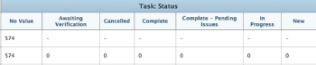

# Criar um relatório matriz

Relatórios de matriz apresentam informações resumidas em um formato de tabela agregada, tornando mais fácil a visualização do que se fossem exibidas em uma lista como em um relatório tradicional.

## Quando usar um relatório de matriz

Você pode criar um relatório de matriz para qualquer relatório que contenha 2 ou mais Agrupamentos. Um relatório tradicional pode conter até 3 agrupamentos, e um relatório de matriz pode conter até 4 agrupamentos.

Por exemplo, você deseja criar um relatório de Horas que exiba as horas registradas durante um período de 3 meses e deseja que o relatório seja organizado de acordo com quem inseriu as horas, bem como por mês e semana.

## Como os dados são exibidos em um relatório de matriz

As informações no relatório de matriz são sempre exibidas como um valor numérico. Na maioria dos casos, as colunas que contêm um valor numérico são melhores para exibição em um relatório de matriz (como horas registradas e custo real).

No entanto, outras colunas (como Status) ainda podem ser exibidas no relatório de matriz, conforme mostrado no gráfico a seguir:\

## Requisitos de acesso

+++ Expanda para visualizar os requisitos de acesso para a funcionalidade neste artigo.

Você deve ter o seguinte acesso para executar as etapas deste artigo:

<table style="table-layout:auto"> 
 <col> 
 <col> 
 <tbody> 
  <tr> 
   <td role="rowheader">plano do Adobe Workfront*</td> 
   <td> 
Qualquer
 </td> 
  </tr> 
  <tr> 
   <td role="rowheader">Licença da Adobe Workfront*</td> 
      <td> 
      
Novo:

         <ul>
         <li>
Padrão
</li>
         </ul>
      
Atual:

         <ul>
         <li>
Plano
</li>
         </ul>
   </td>
  </tr> 
  <tr> 
   <td role="rowheader">Configurações de nível de acesso*</td> 
   <td>
Editar acesso a relatórios, painéis, calendários
 
Editar acesso a Filtros, Visualizações, Agrupamentos
</td> 
  </tr> 
  <tr> 
   <td role="rowheader">Permissões de objeto</td> 
   <td> 
Gerenciar permissões para um relatório
</td> 
  </tr> 
 </tbody> 
</table>

*Para obter informações, consulte [Requisitos de acesso na documentação do Workfront](/help/quicksilver/administration-and-setup/add-users/access-levels-and-object-permissions/access-level-requirements-in-documentation.md).

+++

## Configurar um relatório de matriz

1. Crie um relatório tradicional que contenha dados numéricos na saída do relatório.\
   Para obter informações sobre como criar um relatório, consulte [Criar um relatório personalizado](../../../reports-and-dashboards/reports/creating-and-managing-reports/create-custom-report.md).

1. Vá para o relatório criado na Etapa 1, clique em **Ações de Relatório** e selecione **Editar**.

1. (Condicional) Se você já criou uma Exibição e deseja aplicá-la a este relatório, clique em **Aplicar uma Exibição Existente** e selecione a Exibição na lista suspensa.
1. (Condicional) Se quiser criar uma nova Exibição para o relatório, conclua as seguintes etapas:

   1. Clique na guia **Colunas (Exibição)** e selecione uma coluna que deseja resumir no relatório de matriz.
   1. Na área **Configurações de Coluna**, clique na lista suspensa **Resumir esta coluna por** e selecione uma das opções disponíveis para resumir as informações.

      >[!IMPORTANT]
      >
      >Se essa opção não estiver selecionada, as informações da coluna não serão exibidas corretamente no relatório de matriz.

      

   1. Repita esse processo para cada coluna na guia Colunas (Exibição) e clique em **Concluído**.

1. Clique na guia **Agrupamentos**.
1. (Condicional) Se você já criou um Agrupamento e deseja aplicá-lo a este relatório, clique em **Aplicar um Agrupamento Existente** e selecione o Agrupamento na lista suspensa.
1. (Condicional) Se quiser criar um novo Agrupamento de matriz para o relatório, conclua as seguintes etapas:

   1. Selecione **Alternar para agrupamento de matriz** no canto superior direito da interface do construtor.
   1. Na seção **Agrupamentos de Linhas**, identifique o agrupamento de linhas, que estabelece os agrupamentos horizontais da tabela.
   1. (Opcional) Para adicionar outro agrupamento de linhas, clique em **Adicionar agrupamento de linhas secundário**.
   1. Na seção **Agrupamentos de Colunas**, identifique o agrupamento de colunas, que estabelece os agrupamentos verticais da tabela.
   1. (Opcional) Para adicionar um agrupamento de coluna adicional, clique em **Adicionar agrupamento de coluna secundário**.
   1. (Condicional) Se você adicionar um agrupamento por data, especifique também se os resultados serão agrupados por dia, semana, mês, trimestre ou ano.\
      

   1. (Condicional) Se você optou por agrupar por data e mostrar resultados por trimestre, por exemplo, especifique se deseja mostrar trimestres sem dados marcando a caixa de seleção **Mostrar trimestres sem resultados**.\
      

      >[!NOTE]
      >
      >O campo **Mostrar trimestres sem resultados** está disponível apenas para agrupamentos de matriz, não para agrupamentos padrão.\
      >Somente os trimestres sem dados localizados entre dois trimestres com dados válidos exibirão zero para os valores de dados na guia de matriz. Os trimestres que não têm dados localizados no início e no final do período selecionado pelo filtro não aparecem no agrupamento de matriz. Os trimestres sem resultados não serão exibidos em um agrupamento na guia Detalhes do relatório.

1. (Opcional e condicional) Clique em **Configurações de Matriz** e selecione uma das seguintes opções:\
   **Mostrar Contagens de Registros:** Selecione esta opção para exibir uma linha com o número total de entradas para o campo especificado.\
   **Mostrar Coluna de Valor:** Selecione esta opção para exibir as seguintes informações na matriz:

   * Contagens de registros
   * A coluna Value

     >[!NOTE]
     >
     >Essa coluna contém informações que descrevem o que os dados em cada linha representam.\
     >As exceções a seguir se aplicam a objetos pai (por exemplo, tarefas pai) quando você está agregando valores para os seguintes campos em agrupamentos:
     >
     >   
     >   
     >   * Todos os campos de número e moeda, exceto Horas Reais (por exemplo, Custo de Trabalho Planejado/Efetivo, Custo de Despesas Planejado/Efetivo, Custo Planejado/Efetivo, Horas Planejadas) agregam apenas os valores das tarefas filhas e tarefas independentes. Eles não agregam os valores das tarefas pai ou pai dos pais.
     >   * As Horas Reais agregam os valores das tarefas pai principal e independente; elas não agregam os números para as tarefas pai ou filho.
     >   * Os campos de dados personalizados para valores de número e moeda agregam todas as tarefas: pais, filhos, pais dos pais e tarefas independentes. Se você criou o relatório de matriz para exibir Horas Planejadas ou Horas Efetivas na coluna **Valor**, saiba que as informações de horas ou custos de qualquer objeto pai (como tarefas pai) não são exibidas no relatório de matriz. Para exibir horas em objetos pai, você deve exibir a guia **Detalhes**.
     >   
     >   
     >**Regras Condicionais:** configure regras de formatação para valores agregados.\

   Após adicionar uma regra, é possível definir estilos de campo e texto para a forma como os campos que correspondem a essa regra são exibidos. Clique em **Adicionar regra** depois de concluir a definição da regra e em **Concluído** para salvar a regra.

1. Clique na guia **Filtros** para definir quais informações serão exibidas no relatório.
1. (Condicional) Se você já criou um Filtro e deseja aplicá-lo a este relatório, clique em **Aplicar um Filtro Existente** e selecione o Filtro na lista suspensa.
1. (Condicional) Se você deseja criar um novo Filtro para este relatório, consulte [Filtro e modificadores de condição](../../../reports-and-dashboards/reports/reporting-elements/filter-condition-modifiers.md)

   <!--
   <MadCap:conditionalText data-mc-conditions="QuicksilverOrClassic.Draft mode">
   and
   <a href="../../../reports-and-dashboards/reports/reporting-elements/advanced-filter-condition-qualifiers.md" class="MCXref xref">Advanced Filter and condition qualifiers </a>
   </MadCap:conditionalText>
   -->

   para obter informações sobre os vários qualificadores que você pode usar ao criar filtros.

1. Clique em **Salvar+Fechar** para salvar e exibir o relatório de matriz.
