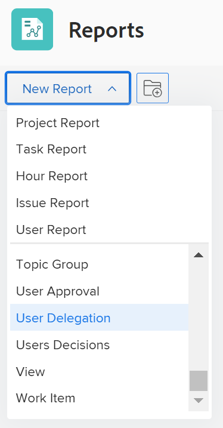

# Criar um relatório de delegação de usuários

<!--Audited: 10/2024-->

<!--

(NOTE: consider moving this to the Custom&nbsp;View, Filter, Grouping Samples section as an example of a report)

-->

No Adobe Workfront, os usuários podem delegar aprovações de projetos, tarefas e problemas a outros usuários para garantir que suas aprovações sejam gerenciadas quando estiverem fora do escritório. Os usuários com uma licença de Plano podem criar um relatório de Delegação de usuários para ver:

* Quem delegou as aprovações de tarefas, problemas e projetos a outro usuário
* Quais usuários delegaram as aprovações de tarefas, problemas e projetos a eles

* As datas de início e término das delegações

Para saber mais sobre delegação de aprovações, consulte [Delegar solicitação de aprovação](../../../review-and-approve-work/manage-approvals/delegate-approval-requests.md).

<!--

DRAFTED: To learn more about delegating work, see <a href="../../../workfront-basics/manage-your-account-and-profile/manage-time-off/personal-time-off.md" class="MCXref xref">Log personal time off and delegate your work</a>.

-->

<!--

DRAFTED: To learn how to manage delegated work in Home, see [future link here].

-->

## Requisitos de acesso

+++ Expanda para visualizar os requisitos de acesso da funcionalidade neste artigo. 

<table style="table-layout:auto"> 
 <col> 
 <col> 
 <tbody> 
  <tr> 
   <td role="rowheader">Pacote do Adobe Workfront</td> 
   <td> 
Qualquer
 </td> 
  </tr> 
  <tr> 
   <td role="rowheader">Licença do Adobe Workfront</td> 
   <td> 
      
Padrão

      
Plano

   </td>
  </tr> 
  <tr> 
   <td role="rowheader">Configuração do nível de acesso</td> 
   <td> 
Editar acesso a relatórios, painéis, calendários
 
Editar acesso a Filtros, Visualizações, Agrupamentos
 </td> 
  </tr> 
  <tr> 
   <td role="rowheader">Permissões de objeto</td> 
 <td> 
Exibir permissões para os itens cujas aprovações são delegadas e para os usuários envolvidos na delegação
</td>  
  </tr> 
 </tbody> 
</table>

Para obter mais detalhes sobre as informações contidas nesta tabela, consulte [Requisitos de acesso na documentação do Workfront](/help/quicksilver/administration-and-setup/add-users/access-levels-and-object-permissions/access-level-requirements-in-documentation.md).

+++

## Criar um relatório de delegação de usuário

1. Clique no ícone **Menu Principal**  no canto superior direito do Adobe Workfront e em **Relatórios**.

1. Clique em **Novo relatório** e selecione **Delegação de usuários**.

   

   Os seguintes campos são exibidos neste relatório por padrão:

   | Campo | Descrição |
   |---|---|
   | **Do Usuário** | Este é o usuário que está delegando suas aprovações de tarefas, problemas e projetos a outro usuário. |
   | **Para Usuário** | Esse é o usuário que tem as aprovações de tarefas, problemas e projetos delegadas a ele. |
   | **Data de Início** | Este é o início do tempo de ausência temporária do usuário que fez as delegações. |
   | **Data de término** | Esse é o fim do tempo de ausência temporária do usuário que fez as delegações. |

   {style="table-layout:auto"}

1. (Opcional) No Report Builder, modifique o seguinte:

   * Colunas (visualizar)
   * Agrupamento
   * Filtros
   * Gráfico

   Para saber mais sobre esses recursos, consulte [Criar um relatório personalizado](../../../reports-and-dashboards/reports/creating-and-managing-reports/create-custom-report.md).

1. Depois de terminar de criar o relatório, clique em **Salvar + Fechar**.

   O relatório é exibido.
