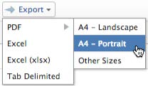

# Exportar dados

É possível exportar dados do Adobe Workfront de várias listas, relatórios, painéis e pesquisas.
As informações deste artigo não se aplicam às seguintes exportações:

* Exportação de informações de relatórios de gráficos.

   Para obter mais informações sobre como exportar um relatório de gráfico, consulte [Adicionar um gráfico a um relatório](../../../reports-and-dashboards/reports/creating-and-managing-reports/add-chart-report.md).

* Exportar informações do gráfico de Gantt.

   Para obter mais informações sobre como exportar o gráfico de Gantt, consulte [Exportar o Gráfico de Gantt para o PDF](../../../manage-work/gantt-chart/use-the-gantt-chart/export-gantt-chart-to-pdf.md).

* Exportar informações do Planejador de Recursos.

   Para obter mais informações sobre como exportar as informações do Planejador de Recursos, consulte &quot;Opção de Exportação&quot; em [Visão geral da navegação do Planejador de recursos](../../../resource-mgmt/resource-planning/resource-planner-navigation.md).

Alguns dos motivos para exportar dados são:

* Você deseja fornecer uma cópia impressa dos seus dados para alguém fora do Workfront.
* Você deseja enviar os resultados de um relatório como anexo a um usuário externo.
* Você deseja criar um backup externo dos dados do Workfront.
* Há um limite para exibir apenas 2.000 resultados em uma página dentro do aplicativo Web Workfront. Se o seu relatório produzir mais de 2.000, você poderá exportar o relatório para qualquer um dos formatos mencionados abaixo e obter todos os resultados no relatório em uma lista.

Você pode exportar um relatório manualmente da interface do Workfront ou agendar um delivery para um relatório e ele será enviado posteriormente. Para obter mais informações sobre como programar relatórios entregues, consulte [Visão geral da entrega de relatórios](../../../reports-and-dashboards/reports/creating-and-managing-reports/set-up-report-deliveries.md).

## Requisitos de acesso

Você deve ter o seguinte acesso para executar as etapas neste artigo:

<table style="table-layout:auto"> 
 <col> 
 </col> 
 <col> 
 </col> 
 <tbody> 
  <tr> 
   <td role="rowheader">Plano Adobe Workfront*</td> 
   <td> <p>Qualquer Um</p> </td> 
  </tr> 
  <tr> 
   <td role="rowheader">Licença da Adobe Workfront*</td> 
   <td> <p>Revisar ou superior</p> </td> 
  </tr> 
  <tr> 
   <td role="rowheader">Configurações de nível de acesso*</td> 
   <td> <p>Visualizar ou obter acesso superior a Relatórios, Painéis, Calendários para exportar relatórios</p> <p>Visualizar ou aumentar o acesso aos objetos exibidos em uma lista para exportar a lista</p> <p>Observação: Caso ainda não tenha acesso, pergunte ao administrador do Workfront se ele definiu restrições adicionais em seu nível de acesso. Para obter informações sobre como um administrador do Workfront pode modificar seu nível de acesso, consulte <a href="../../../administration-and-setup/add-users/configure-and-grant-access/create-modify-access-levels.md" class="MCXref xref">Criar ou modificar níveis de acesso personalizados</a>.</p> </td> 
  </tr> 
  <tr> 
   <td role="rowheader">Permissões de objeto</td> 
   <td> <p>Visualizar permissões ou permissões mais altas em um relatório ou painel para exportar o relatório ou o painel</p> <p>Visualizar permissões ou permissões superiores para os objetos que você visualiza em uma lista para exportar a lista</p> <p>Para obter informações sobre como solicitar acesso adicional, consulte <a href="../../../workfront-basics/grant-and-request-access-to-objects/request-access.md" class="MCXref xref">Solicitar acesso a objetos </a>.</p> </td> 
  </tr> 
 </tbody> 
</table>

## Pré-requisitos

O relatório deve ser criado antes que você possa exportar seus dados.

Para obter mais informações sobre como criar relatórios, consulte [Criar um relatório](../../../reports-and-dashboards/reports/creating-and-managing-reports/create-report.md).

## Exportar formatos e limites

* [Exportar formatos](#export-formats)
* [Limites de exportação](#export-limits)

### Exportar formatos {#export-formats}

As informações podem ser exportadas nos seguintes formatos:

* PDF (Paisagem ou Retrato Carta, Legal, Razão e A4)
* Excel (.xls)
* Excel (.xlsx)
* Delimitado por tabulação

>[!NOTE]
>
>Os painéis podem ser impressos ou exportados apenas para um arquivo .pdf .

### Limites de exportação {#export-limits}

<!--
NOTE: Alina: [! This information is shared between "Exporting Data" and "Setting Up Report Deliveries."]
-->

Há várias limitações no modo como os relatórios são exibidos no Workfront, bem como na maneira como são exportados por meio de uma exportação manual, de um relatório fornecido ou da API.

* **50.000 linhas:** O número de linhas de dados permitidas em uma exportação de relatório para arquivos .pdf e Delimitados por tabulação.

   * Para arquivos .xls do Excel, esse limite é **65.000 linhas**.
   * Para arquivos .xlsx do Excel, esse limite é **100.000 linhas**.
   * Esses limites excluem os cabeçalhos de coluna, bem como as linhas para agrupamentos no relatório. Por exemplo, se você tiver 6 agrupamentos em um relatório e 50.000 linhas ou dados, o arquivo exportado terá 50.000 linhas.

   >[!IMPORTANT]
   >
   >Exportar um relatório que inclui uma referência de coleção em uma coluna pode resultar em um erro, mesmo que o relatório esteja dentro dos limites de exportação listados. Se a coleção referenciada for muito grande, o processo de exportação expirará e, subsequentemente, resultará em um erro.
   >
   >Para evitar esse erro, exclua as colunas que fazem referência a coleções grandes ou reduza o tamanho das coleções referenciadas antes de exportar.

   Se o seu relatório tiver mais itens do que esses limites, você receberá um erro informando que a exportação não foi bem-sucedida. Reduza o número de itens que você vê na tela para um número menor ou igual a esses limites para poder exportar os resultados.

   Se seu relatório tiver mais de 50.000/ 65.000/ 100.000 linhas e desejar exportar todos os dados, sugerimos que você use filtros ou prompts para obter cargas menores de dados e executar várias exportações.

   Para obter informações sobre o uso de filtros, consulte [Visão geral dos filtros no Adobe Workfront](../../../reports-and-dashboards/reports/reporting-elements/filters-overview.md).

   Para obter informações sobre o uso de prompts, consulte [Adicionar um prompt a um relatório](../../../reports-and-dashboards/reports/creating-and-managing-reports/add-prompt-report.md).

* Estes limites aplicam-se a:

   * Uma exportação manual de um relatório.
   * Um relatório agendado.
   * Uma exportação por meio de uma integração com a API.
   * Dados exportados por meio de um início.

      Para obter mais informações sobre como exportar dados via início, consulte [Exportar dados do Adobe Workfront via Kick-Starts](../../../administration-and-setup/manage-workfront/using-kick-starts/export-data-from-wf-via-kick-starts.md)

      >[!NOTE]
      >
      >Você pode exportar 50.000 linhas em um arquivo de início, embora possa exportar os dados apenas para um arquivo de formato Excel. 

   * Exportação de informações de utilização de um projeto.

      Para obter mais informações sobre como exportar informações de utilização para um projeto, consulte [Visão Geral do Relatório de Utilização de Recursos](../../../reports-and-dashboards/reports/using-built-in-reports/resource-utilization-report.md#exporting-utilization-information-for-a-project).

* **Tamanho do arquivo de 10 MB:** Limite de tamanho de arquivo para qualquer relatório exportado agendado para entrega. Se um arquivo exportado anexado a um email tiver mais de 5 MB, um link onde o arquivo pode ser baixado é enviado por email em vez do relatório exportado anexado.
* **65.530 hiperlinks:** Esse é um limite imposto pelo Excel para documentos que contêm mais de 65.530 hiperlinks. Esses documentos não podem ser abertos quando são exportados manualmente ou enviados em um relatório entregue. Observe que um documento do Excel pode ter apenas 200 linhas de dados, mas se houver mais de 65.530 links dentro do documento, ele não abrirá. Esse limite existe somente em arquivos Excel, não nos outros formatos compatíveis. 
* **256 colunas**: Esse é um limite imposto pelo Excel para documentos que contêm mais de 256 colunas. Esses documentos não podem ser exportados manualmente ou enviados em um relatório entregue. Esse limite existe somente em arquivos Excel, não nos outros formatos compatíveis.

Se você tentar exportar dados além do limite, talvez não receba todos os dados esperados na exportação. Em vez disso, um relatório modificado é produzido dentro do limite.

Além disso, os relatórios que levam mais de 60 minutos para serem executados serão interrompidos.

Se tiver dúvidas ou problemas com relação ao seu limite, entre em contato com o Suporte Técnico Workfront.

## Exportar dados

* [Exportar dados de um relatório ou lista](#export-data-from-a-report-or-list)
* [Exportar dados de um painel](#export-data-from-a-dashboard)

### Exportar dados de um relatório ou lista {#export-data-from-a-report-or-list}

1. Vá para o relatório ou a lista que deseja exportar.
1. Selecione os itens que deseja exportar. (Selecionar itens individuais exporta somente os itens selecionados.)

   Por exemplo, em um projeto, selecione as tarefas que deseja exportar.

   Ou

   Deixe todos os itens desmarcados para exportar a lista inteira.

1. Clique em **Exportar** e, em seguida, selecione um formato.

   >[!NOTE]
   Para exportar um relatório de Painel, você deve ter uma licença de Plano .\
   

   Ou

   Clique no botão **Exportar** ícone e, em seguida, selecione um formato.

   As opções disponíveis para a exportação do PDF dependem das configurações de localidade nas configurações do usuário do Workfront:

   * América do Norte - letra (padrão), legal, razão, A4

      <!--   
        
     -->

   * Todas as localizações fora da América do Norte - A3, A4 (padrão), letra, legal, razão

      <!--   
        
     -->

1. (Condicional) Dependendo do sistema operacional que você usa, você pode ter a opção de abrir ou salvar o arquivo. Abra o arquivo com o aplicativo associado ou salve-o no disco rígido.
1. Continue com [Usar o documento exportado](#use-the-exported-document).

### Exportar dados de um painel {#export-data-from-a-dashboard}

Você pode imprimir as informações de um painel ou exportá-las como um arquivo .pdf .

Para obter mais informações sobre como exportar dados de um painel, consulte [Exportar um painel](../../../reports-and-dashboards/dashboards/creating-and-managing-dashboards/export-dashboard.md).

## Usar o documento exportado {#use-the-exported-document}

* [Nomes de arquivo](#file-names)
* [Títulos](#titles)
* [Carimbos de data e hora](#timestamps)
* [Formatação](#formatting)
* [Links](#links)
* [Marca](#branding)

### Nomes de arquivo {#file-names}

Se você exportar uma lista de objetos ou um relatório, o arquivo exportado terá um nome de arquivo e um título. Você pode encontrar o arquivo exportado em seu computador fazendo referência ao nome do arquivo. O título do relatório dará aos usuários uma indicação do que o arquivo exportado representa quando você o compartilha com eles.

* [Nomes de arquivo para listas exportadas](#file-names-for-exported-lists)
* [Nomes de arquivo para relatórios exportados](#file-names-for-exported-reports)

#### Nomes de arquivo para listas exportadas {#file-names-for-exported-lists}

Ao exportar uma lista de objetos, o tipo de objeto é exibido no arquivo exportado no nome do arquivo e no título da lista.

Quando você exporta uma lista de tarefas ou problemas, a variável **Nome do arquivo** pode ser um dos seguintes:

* Ao exportar Listas de Tarefas e Problemas em um Projeto:

   * *The_project_name_Exported_Tasks*(*em formatos PDF, Excel, Excel (.xlsx) ou delimitados por tabulação)*
   * *The_project_name_Exported_Issues*(*em formatos PDF, Excel, Excel (.xlsx) ou delimitados por tabulação)*

* Ao exportar Listas de Tarefas e Problemas em uma Tarefa (subtarefas):

   * **O_nome_do_projeto_do_nome_da_tarefa_Tarefas_Exportadas**(*em formatos PDF, Excel, Excel (.xlsx) ou delimitados por tabulação)*
   * **The_project_name_the_task_name_Exported_Issues**(*em formatos PDF, Excel, Excel (.xlsx) ou delimitados por tabulação)*

Quando você exporta uma lista de quaisquer outros objetos de um projeto para um arquivo PDF, o nome do arquivo do documento exportado indica o tipo de objetos que você exportou.\
Por exemplo, o nome do arquivo pode ser:

* *Usuários_exportados*, ao exportar a guia Pessoas no projeto (*em formatos PDF, Excel, Excel (.xlsx) ou delimitados por tabulação)*
* *Exportados_Riscos* ao exportar uma lista de riscos no projeto(*em formatos PDF, Excel, Excel (.xlsx) ou delimitados por tabulação)*

#### Nomes de arquivo para relatórios exportados {#file-names-for-exported-reports}

Ao exportar um relatório, o nome do arquivo do relatório exportado é:

*O_nome_do_relatório*(*em formatos PDF, Excel, Excel (.xlsx) ou delimitados por tabulação)*

### Títulos {#titles}

Ao exportar uma lista de objetos, somente o arquivo no formato PDF terá um título. Se você exportar uma lista ou um relatório para formatos Excel, Excel (.xlsx) ou delimitados por tabulação, o arquivo não terá um título.

* [Títulos para listas exportadas](#titles-for-exported-lists)
* [Títulos para relatórios exportados](#titles-for-exported-reports)

#### Títulos para listas exportadas {#titles-for-exported-lists}

Ao exportar Listas de Tarefas e Problemas em um Projeto para um arquivo PDF, o título do documento exportado é um dos seguintes:

* *Nome do projeto - Tarefas exportadas*
* *Nome do projeto - Problemas exportados*

Quando você exporta listas Tarefa e Problema em uma Tarefa para um arquivo PDF, o bloco do documento exportado é um dos seguintes:

* *Nome do projeto - Nome da tarefa - Tarefas exportadas*
* *Nome do projeto - Nome da tarefa - Problemas exportados*

Quando você exporta uma lista de quaisquer outros objetos de um projeto para um arquivo PDF, o título do documento exportado indica o tipo de objetos que você exportou.\
Por exemplo, o título pode ser:

* *Usuários exportados*, ao exportar a guia Pessoas no projeto.
* *Riscos exportados*, ao exportar uma lista de Riscos no projeto.

#### Títulos para relatórios exportados {#titles-for-exported-reports}

Um relatório que é exportado para um arquivo PDF terá um título.

Se o relatório for exportado para formatos Excel, Excel (.xlsx) ou delimitados por tabulação, o relatório exportado não terá um título. O título do arquivo exportado é o nome do relatório, como ele aparece no aplicativo Web do Workfront.

Se o relatório tiver uma descrição, ele será incluído no arquivo exportado.

### Carimbos de data e hora {#timestamps}

Um carimbo de data e hora é exibido no documento exportado do contexto do usuário que exportou o item.

O carimbo de data e hora inclui:

* Data
* Hora
* Fuso horário quando o item foi exportado

Dependendo do tipo de documento que você exportar, os carimbos de data e hora são exibidos em vários locais:

* **PDF:** Os carimbos de data e hora são exibidos no rodapé de cada página e no nome do arquivo.
* **Excel:** Os carimbos de data e hora são exibidos no nome do arquivo.

### Formatação {#formatting}

Ao exportar um projeto para .pdf, qualquer subtarefa é exibida como recuada nas tarefas pai. As listas exportadas não recolhem nenhuma tarefa principal.

Você sempre recebe a guia padrão de um relatório quando ele é enviado ou agendado para um delivery, a menos que o relatório tenha uma exibição especial.

Se o relatório tiver uma formatação especial no aplicativo da Web, ele deverá ser entregue com a formatação especial quando as guias Detalhes e Matriz forem entregues somente para arquivos .pdf e Excel.

>[!NOTE]
Se os dados que você está exportando contêm colunas compartilhadas e você exporta para um formato Excel ou Delimitado por tabulação, essas colunas são separadas no arquivo exportado.

Para obter mais informações sobre como personalizar a formatação em um relatório, consulte [Usar formatação condicional em exibições](../../../reports-and-dashboards/reports/reporting-elements/use-conditional-formatting-views.md).

### Links {#links}

Os links podem apontar para qualquer objeto no Workfront que seja compatível com links. Ao exportar uma lista no Workfront para .pdf, todos os links suportados existentes no documento original permanecerão ativos no documento exportado.

>[!TIP]
Se a linha `valueformat=HTML` for exibido no modo de texto para uma coluna de campo personalizado e os valores do link não forem exibidos em um arquivo .pdf exportado, será necessário inserir linhas de código adicionais na coluna no modo de texto.
Por exemplo, se você tiver um campo personalizado chamado Abrir projetos do primeiro trimestre que contenha links, você adicionaria o seguinte código:

```
link.url=customDataLabelsAsString(Open Q1 Projects)
linkedname=direct
```

Ao exportar para um formato Excel, somente os links para objetos no Workfront são incluídos no arquivo exportado e só são suportados em locais onde você pode selecionar para permitir links em documentos do Excel exportados, como deliveries de relatório.

## Marca {#branding}

Se o administrador do Workfront tiver adicionado marcas personalizadas à instância do Workfront para a Barra de navegação global, os arquivos .pdf exportados também incluirão o logotipo personalizado.

Os dados que são exportados em qualquer outro formato não podem ser personalizados com o logotipo.

Para obter mais informações sobre a identidade visual da instância do Workfront e da Barra de navegação global, consulte [Marca sua instância do Adobe Workfront](../../../administration-and-setup/customize-workfront/brand-workfront/brand-your-workfront-instance.md).
