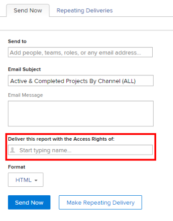

# Executar e entregar um relatório com os direitos de acesso de outro usuário

Por padrão, os usuários só podem ver os objetos em um relatório que têm permissão para visualizar.

Você pode permitir que todos os usuários vejam os mesmos resultados em um relatório que outro usuário, independentemente do nível de acesso ou de permissão nos objetos dentro do relatório.

Se você executar um relatório com os direitos de acesso de outro usuário com acesso mais alto (por exemplo, os direitos de acesso de um administrador do Adobe Workfront), todos os usuários que têm permissões para Exibir o relatório poderão ver as informações no relatório como o usuário especificado no construtor de relatórios. Você pode configurar isso para ambos os relatórios que os usuários encontram na interface do Workfront, ou para relatórios que são entregues aos usuários como anexo a um email.

>[!TIP]
>
>Você deve substituir a variável **Execute este relatório com os Direitos de acesso de:** com um usuário ativo somente quando quiser que o relatório seja exibido com os direitos de acesso desse usuário. Por exemplo, um usuário de licença de Trabalho pode não ter permissões para ver todos os itens em um relatório criado por um usuário de licença do Plano ou um Administrador do Sistema, a menos que o relatório seja exibido com os direitos de acesso de um Planejador ou Administrador do Sistema.\
Se o relatório for compartilhado com usuários com acesso semelhante ao especificado pelo usuário na **Execute este relatório com os Direitos de acesso de:** , deixe este campo em branco.

## Requisitos de acesso

Você deve ter o seguinte acesso para executar as etapas neste artigo:

<table style="table-layout:auto"> 
 <col> 
 <col> 
 <tbody> 
  <tr> 
   <td role="rowheader">Plano Adobe Workfront*</td> 
   <td> 
Qualquer Um
 </td> 
  </tr> 
  <tr> 
   <td role="rowheader">Licença da Adobe Workfront*</td> 
   <td> 
Plano 
 </td> 
  </tr> 
  <tr> 
   <td role="rowheader">Configurações de nível de acesso*</td> 
   <td> 
Editar acesso a Relatórios, Painéis, Calendários
 
Editar acesso a filtros, visualizações, agrupamentos
 
Observação: Caso ainda não tenha acesso, pergunte ao administrador do Workfront se ele definiu restrições adicionais em seu nível de acesso. Para obter informações sobre como um administrador do Workfront pode modificar seu nível de acesso, consulte <a href="../../../administration-and-setup/add-users/configure-and-grant-access/create-modify-access-levels.md" class="MCXref xref">Criar ou modificar níveis de acesso personalizados</a>.
 </td> 
  </tr> 
  <tr> 
   <td role="rowheader">Permissões de objeto</td> 
   <td> 
Exibir permissões para um relatório (para exibir o relatório fornecido)
 
Gerenciar permissões em um relatório (para executar o relatório)
 
Para obter informações sobre como solicitar acesso adicional, consulte <a href="../../../workfront-basics/grant-and-request-access-to-objects/request-access.md" class="MCXref xref">Solicitar acesso a objetos </a>.
 </td> 
  </tr> 
 </tbody> 
</table>

&#42;Para descobrir qual plano, tipo de licença ou acesso você tem, entre em contato com o administrador da Workfront.

## Exibir um relatório com os direitos de acesso de outro usuário

Preencher o **Execute este Relatório com os Direitos de Acesso de:** garante que um relatório contenha os mesmos dados, independentemente do usuário que estiver acessando o relatório. O relatório é exibido da mesma forma que para o usuário especificado.

Os usuários que acessam o relatório devem ter pelo menos permissões de Exibição no relatório para poderem vê-lo. Se o usuário listado na **Execute este Relatório com os Direitos de Acesso de:** for desativado, o relatório não será mais exibido para qualquer outro usuário com o qual o relatório for compartilhado.

Para executar um relatório com os direitos de acesso de outro usuário:

1. Clique no botão **Menu principal** ícone  no canto superior direito do Workfront, em seguida, clique em **Relatórios**.

1. Selecione o relatório que deseja exibir com os direitos de acesso de outro usuário.
1. Clique em **Ações de Relatório**, depois clique em **Editar**.

1. Clique em **Configurações do relatório**.

1. No **Execute este relatório com os Direitos de acesso de:** , comece digitando o nome do usuário que deseja que o relatório exiba como e, em seguida, selecione-o quando visualizá-lo na lista.\
   

   >[!NOTE]
   Os usuários com um nível de acesso mais baixo com permissão para criar relatórios não têm a capacidade de selecionar um usuário diferente de si mesmo para a **Execute este Relatório com os Direitos de Acesso de:** campo.

1. Clique em **Concluído**.
1. Clique em **Salvar + Fechar**.\
   O relatório agora é exibido para todos os usuários com os quais o relatório é compartilhado como se fosse exibido pelo usuário especificado na **Execute este relatório com os Direitos de acesso de:** campo.

>[!IMPORTANT]
Inserir um usuário diferente do usuário conectado do **Execute este relatório com os Direitos de acesso de:** afeta as informações exibidas no relatório se o relatório contiver um filtro que usa um curinga referindo-se ao usuário conectado. O relatório é exibido de acordo com o valor especificado na variável **Execute este relatório com os Direitos de acesso de:** em vez do que é definido no filtro curinga.
Para obter mais informações sobre curingas para campos do usuário, consulte a seção &quot;Variáveis baseadas em usuário&quot; em [Variáveis de filtro curinga](../../../reports-and-dashboards/reports/reporting-elements/understand-wildcard-filter-variables.md).

## Fornecer um relatório com os direitos de acesso de outro usuário

Você pode configurar relatórios para serem entregues como anexo a um email. Você pode configurar esses relatórios entregues para serem exibidos conforme são exibidos para usuários de nível de acesso mais alto, de modo que todos os usuários possam ver as mesmas informações nos relatórios entregues. Os usuários que verão o relatório entregue no email devem ser adicionados à lista Enviar para os recipients dentro do delivery do relatório. Para obter mais informações sobre como configurar um relatório para entrega, consulte o artigo [Visão geral da entrega de relatórios](../../../reports-and-dashboards/reports/creating-and-managing-reports/set-up-report-deliveries.md).

Para fornecer um relatório com os direitos de acesso de outro usuário:

1. Clique no botão **Menu principal** ícone  no canto superior direito do Workfront, em seguida, clique em **Relatórios**.

1. Selecione o relatório que deseja entregar com os direitos de acesso de outro usuário.
1. Clique no nome do relatório para selecioná-lo.
1. Clique em **Ações de Relatório**.
1. Clique em **Enviar relatório**.

1. No **Forneça este relatório com os Direitos de acesso de:** , comece digitando o nome do usuário que deseja que o relatório exiba quando ele for entregue em um email e, em seguida, selecione-o quando visualizá-lo na lista. O padrão é o nome do usuário que está criando o relatório.\
   

   >[!NOTE]
   Os usuários com um nível de acesso mais baixo com permissão para criar relatórios não têm a capacidade de selecionar um usuário diferente de si mesmo para a **Entregar este Relatório com os Direitos de Acesso de:** campo.

1. Selecione o **Formato** você deseja que o relatório seja exibido no email:

   * HTML
   * PDF
   * MS Excel
   * MS Excel (.xlsx)
   * TSV

1. Clique em **Enviar agora** para enviá-lo imediatamente.\
   Ou\
   Clique em **Fazer entrega repetida** para agendar um delivery recorrente para o relatório.\
   Para obter mais informações sobre deliveries de relatórios, consulte o artigo [Visão geral da entrega de relatórios](../../../reports-and-dashboards/reports/creating-and-managing-reports/set-up-report-deliveries.md).