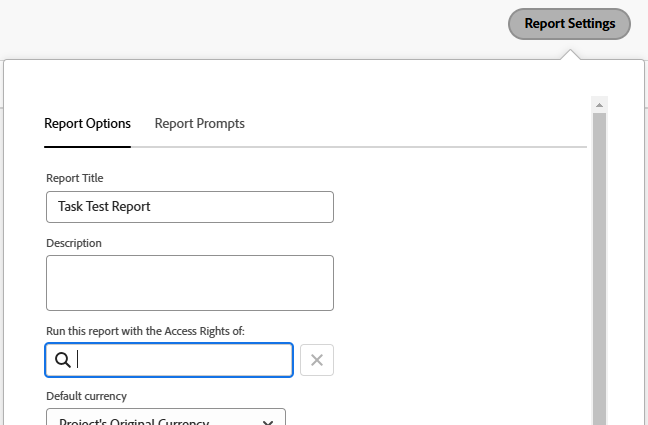

# Executar e entregar um relatório com direitos de acesso de outro usuário

<!-- Audited: 11/2024 -->

Por padrão, os usuários só podem ver os objetos em um relatório para o qual têm permissões de Exibição.

Você pode permitir que todos os usuários vejam os mesmos resultados em um relatório que outro usuário, independentemente de seu nível de acesso ou nível de permissão nos objetos dentro do relatório.

Se você executar um relatório com os direitos de acesso de outro usuário com acesso mais alto (por exemplo, os direitos de acesso de um administrador do Adobe Workfront), todos os usuários com permissões para Exibir o relatório poderão ver as informações no relatório como o usuário especificado no Report Builder. Essa configuração pode ser definida para relatórios encontrados pelos usuários na interface do Workfront ou para relatórios entregues aos usuários como um anexo de um email.

>[!TIP]
>
>Você deve substituir o campo **Executar este relatório com os Direitos de Acesso de:** por um usuário ativo somente quando quiser que o relatório seja exibido com os direitos de acesso desse usuário. Por exemplo, um usuário de licença de trabalho pode não ter permissões para ver todos os itens em um relatório criado por um usuário de licença de plano ou um Administrador do sistema, a menos que o relatório seja exibido com os direitos de acesso de um Planejador ou Administrador do sistema.\
>Se o relatório for compartilhado com usuários com acesso semelhante ao usuário especificado no campo **Executar este relatório com os Direitos de Acesso de:**, você poderá deixar este campo em branco.

## Requisitos de acesso

+++ Expanda para visualizar os requisitos de acesso para a funcionalidade neste artigo.

Você deve ter o seguinte acesso para executar as etapas deste artigo:

<table style="table-layout:auto"> 
 <col> 
 <col> 
 <tbody> 
  <tr> 
   <td role="rowheader">plano do Adobe Workfront*</td> 
   <td> <p>Qualquer</p> </td> 
  </tr> 
  <tr> 
   <td role="rowheader">Licença da Adobe Workfront*</td> 
      <td> 
      <p>Novo:</p>
         <ul>
         <li><p>Padrão</p></li>
         </ul>
      <p>Atual:</p>
         <ul>
         <li><p>Plano</p></li>
         </ul>
   </td>
  </tr> 
  <tr> 
   <td role="rowheader">Configurações de nível de acesso*</td> 
   <td> <p>Editar acesso a relatórios, painéis, calendários</p> <p>Editar acesso a Filtros, Visualizações, Agrupamentos</p></td> 
  </tr> 
  <tr> 
   <td role="rowheader">Permissões de objeto</td> 
   <td> <p>Exibir permissões para um relatório (para visualizar o relatório entregue)</p><p>Gerenciar permissões de um relatório (para executar o relatório)</p></td> 
  </tr> 
 </tbody> 
</table>

*Para obter informações, consulte [Requisitos de acesso na documentação do Workfront](/help/quicksilver/administration-and-setup/add-users/access-levels-and-object-permissions/access-level-requirements-in-documentation.md).

+++

## Exibir um relatório com os direitos de acesso de outro usuário

Preencher o campo **Executar este Relatório com os Direitos de Acesso de:** garante que um relatório contenha os mesmos dados, independentemente de qual usuário está acessando o relatório. O relatório é exibido como seria para o usuário especificado.

Os usuários que acessam o relatório devem ter pelo menos permissões de Exibição no relatório para poderem visualizá-lo. Se o usuário listado no campo **Executar este Relatório com os Direitos de Acesso de:** estiver desativado, o relatório não será mais exibido para nenhum outro usuário com quem o relatório esteja compartilhado.

Para executar um relatório com os direitos de acesso de outro usuário:

1. Clique no ícone **[!UICONTROL Menu Principal]**  no canto superior direito do Adobe Workfront ou (se disponível) clique no ícone **[!UICONTROL Menu Principal]**  no canto superior esquerdo e clique em **[!UICONTROL Relatórios]**.

1. Selecione o relatório que deseja exibir com os direitos de acesso de outro usuário.
1. Clique em **Ações de Relatório** e em **Editar**.

1. Clique em **Configurações do relatório**.

1. No campo **Executar este relatório com os Direitos de Acesso de:**, comece digitando o nome do usuário com o qual deseja que o relatório seja exibido e, em seguida, selecione-o quando o vir na lista.\
   

   >[!NOTE]
   >
   >Os usuários com um nível de acesso mais baixo que têm permissão para criar relatórios não podem selecionar um usuário diferente de si mesmos para o campo **Executar este Relatório com os Direitos de Acesso de:**.

1. Clique em **Concluído**.
1. Clique em **Salvar + Fechar**.\
   O relatório agora é exibido para todos os usuários com os quais o relatório é compartilhado como se fosse visualizado pelo usuário especificado no campo **Executar este relatório com os Direitos de Acesso de:**.

>[!IMPORTANT]
>
>Inserir um usuário diferente do usuário conectado para o campo **Executar este relatório com Direitos de Acesso de:** afetará as informações exibidas no relatório se ele contiver um filtro que use um curinga para fazer referência ao usuário conectado. O relatório é exibido de acordo com o valor especificado no **Executar este relatório com o campo Direitos de Acesso de:** em vez do definido no filtro curinga.
>
>Para obter mais informações sobre curingas para campos de usuário, consulte a seção &quot;Variáveis baseadas em usuário&quot; na [Visão geral das variáveis de filtro de curinga](../../../reports-and-dashboards/reports/reporting-elements/understand-wildcard-filter-variables.md).

## Entregar um relatório com os direitos de acesso de outro usuário

Você pode configurar relatórios para serem entregues como anexo a um email. Você pode configurar esses relatórios entregues para serem exibidos como são exibidos para usuários de nível de acesso superior, de modo que todos os usuários possam ver as mesmas informações nos relatórios entregues. Os usuários que verão o relatório entregue no email devem ser adicionados à lista Enviar para dos recipients dentro do delivery do relatório. Para obter mais informações sobre como configurar um relatório para entrega, consulte o artigo [Visão geral da entrega de relatórios](../../../reports-and-dashboards/reports/creating-and-managing-reports/set-up-report-deliveries.md).

Para fornecer um relatório com os direitos de acesso de outro usuário:

1. Clique no ícone **Menu Principal**  no canto superior direito do Workfront e em **Relatórios**.

1. Selecione o relatório que deseja entregar com os direitos de acesso de outro usuário.
1. Clique no nome do relatório para selecioná-lo.
1. Clique em **Ações de Relatório**.
1. Clique em **Enviar Relatório**.

1. No campo **Entregar este relatório com os Direitos de Acesso de:**, comece digitando o nome do usuário que você deseja que o relatório exiba como quando for entregue em um email, em seguida, selecione-o quando o vir na lista. O padrão é o nome do usuário que está criando o relatório.\
   

   >[!NOTE]
   >
   >Os usuários com um nível de acesso mais baixo que têm permissão para criar relatórios não podem selecionar um usuário diferente de si mesmos para o **Entregar este relatório com os direitos de acesso do campo:**.

1. Selecione o **Formato** que deseja que o relatório exiba no email:

   * HTML
   * PDF
   * Excel
   * Excel (.xlsx)
   * TSV

1. Clique em **Enviar Agora** para enviá-lo imediatamente.\
   Ou\
   Clique em **Fazer Entrega Repetida** para agendar uma entrega recorrente para o relatório.\
   Para obter mais informações sobre entregas de relatórios, consulte o artigo [Visão geral da entrega de relatórios](../../../reports-and-dashboards/reports/creating-and-managing-reports/set-up-report-deliveries.md).

## Limitações para relatórios com uma coluna Source

Os relatórios a seguir exibem uma coluna Source, na qual você pode exibir informações sobre o objeto pai:

* Relatórios de problemas
* Relatórios de horas
* Relatórios de documentos

Se os usuários não tiverem permissões para o objeto principal de um problema, hora ou documento, a coluna Source do relatório será exibida vazia, mesmo quando o relatório estiver configurado para exibição ou para ser entregue com os direitos de acesso de outro usuário.

Para mostrar informações sobre o objeto pai no relatório, recomendamos adicionar uma coluna para o objeto pai, onde você pode exibir o nome do objeto pai.

Por exemplo, você pode adicionar qualquer um dos itens a seguir a um relatório com uma coluna Source:

* As colunas Nome do projeto, Nome da tarefa ou Nome do problema em um documento ou relatório de horas.
* As colunas Nome do projeto ou Nome da tarefa para um relatório de problemas.
* Uma coluna usando expressões de modo de texto que faz referência a todos os três objetos. Este é um exemplo de relatório de uma hora:

  ```
  displayname=Custom Source
  
  linkedname=opTask
  
  namekey=view.relatedcolumn
  
  namekeyargkey.0=opTask
  
  namekeyargkey.1=name
  
  textmode=true
  
  valueexpression=IF(!ISBLANK({opTaskID}),{opTask}.{name},IF(!ISBLANK({taskID}),{task}.{name},IF(!ISBLANK({projectID}),{project}.{name},IF(!ISBLANK({timesheetID}),CONCAT({owner}.{name}," ",{timesheet}.{startDate}," - ",{timesheet}.{endDate}),""))))
  
  valueformat=HTML
  ```

  Para obter informações sobre modos de exibição de texto, consulte [Editar um modo usando o modo de texto](../text-mode/edit-text-mode-in-view.md).
