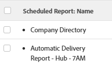

# Visão geral da entrega de relatórios

<!-- Audited: 11/2024 -->

<!--

(NOTE: This is linked to the UI in the Send Report box inside the Preview sandbox. If you change title, log bug for Dev to fix the link) 

-->

Você pode agendar relatórios para que sejam entregues automaticamente aos usuários em um agendamento definido ou pode enviar relatórios de uma só vez, manualmente. Ao enviar um relatório do Adobe Workfront, o usuário recebe um email com o relatório do Workfront em um anexo separado.

Para obter informações sobre como configurar um relatório para entrega, consulte o artigo [Agendar uma entrega automática de relatório](../../../reports-and-dashboards/reports/creating-and-managing-reports/set-up-automatic-report-delivery.md).

Não é possível agendar relatórios para entrega nem entregá-los manualmente no ambiente Visualização da sandbox. Para obter mais informações sobre a Visualização da sandbox, consulte o artigo [O Ambiente de Visualização da sandbox da Adobe Workfront](../../../administration-and-setup/set-up-workfront/workfront-testing-environments/wf-preview-sandbox-environment.md).\
Para obter mais informações sobre a entrega de relatórios no ambiente Visualização da sandbox, consulte o artigo [Enviar um relatório no ambiente Visualização da sandbox](../../../reports-and-dashboards/reports/creating-and-managing-reports/send-report-preview-sandbox-environment.md).

## Limites de entrega de relatório

<!--

(NOTE: [! This information is shared between "Exporting Data" and "Setting Up Report Deliveries."])

-->

Considere o seguinte ao agendar relatórios para entrega:

* Você pode agendar até 10 entregas de relatório repetitivo para qualquer relatório.
* Você pode programar um relatório para ser entregue somente se for o criador do relatório. Se precisar enviar um relatório que não foi criado, é possível enviá-lo manualmente.

## Exportar limites

Há vários limites de tamanho que afetam como os relatórios são exibidos no Workfront e como são exportados por meio de uma exportação manual, um relatório entregue ou pela API:

* **Tamanho do arquivo de 10 MB:** Limite do tamanho do arquivo para qualquer relatório exportado agendado para entrega. Se um arquivo exportado anexado a um email tiver mais de 5 MB, um link no qual o arquivo pode ser baixado será enviado por email, em vez do relatório exportado anexado.

  >[!NOTE]
  >
  >Arquivos .xlsx do Excel maiores que 10 MB não geram um email. É possível exportar manualmente o relatório para esse formato. Para obter informações sobre como exportar relatórios, consulte [Exportar dados](../../../reports-and-dashboards/reports/creating-and-managing-reports/export-data.md).

* **50.000 linhas:** o número de linhas de dados permitidas em uma exportação de relatório para arquivos .pdf e Delimitados por tabulação.

  Para arquivos .xls do Excel, esse limite é de **65.000 linhas**.

  Para arquivos .xlsx do Excel, esse limite é de **100.000 linhas**.

  Esses limites excluem os cabeçalhos da coluna, bem como linhas para agrupamentos no relatório. Por exemplo, se você tiver seis agrupamentos em um relatório e 50.000 linhas de dados, o arquivo exportado terá 50.000 linhas.

  Se o seu relatório tiver mais itens do que esses limites, você receberá um erro de que a exportação e a entrega do relatório não foram bem-sucedidas. Reduza o número de itens que você vê na tela para um número menor ou igual a esses limites para poder fornecer os resultados. Se quiser exportar todos os dados, sugerimos que você use filtros para obter cargas menores de dados e, em seguida, execute várias exportações. Para obter mais informações, consulte [Visão geral dos filtros](../../../reports-and-dashboards/reports/reporting-elements/filters-overview.md).

  Estes limites aplicam-se a:

   * Uma exportação manual de um relatório.
   * Um relatório agendado.
   * Uma exportação por meio de uma integração de API.
   * Dados exportados por meio de um início.

     Para obter mais informações sobre como exportar dados por meio de inicializações, consulte o artigo [Exportar dados do Adobe Workfront por meio de inicializações](../../../administration-and-setup/manage-workfront/using-kick-starts/export-data-from-wf-via-kick-starts.md).

     >[!NOTE]
     >
     >Você pode exportar 50.000 linhas em um arquivo de início rápido, mas somente para um arquivo em formato Excel.

   * Exportando informações de utilização de um projeto.

     Para obter mais informações sobre como exportar informações de utilização de um projeto, consulte [Visão Geral do Relatório de Utilização de Recursos](../../../reports-and-dashboards/reports/using-built-in-reports/resource-utilization-report.md).

* **65.530 hiperlinks:** esse é um limite imposto pelo Excel a documentos que contêm mais de 65.530 hiperlinks. Esses documentos não podem ser abertos quando são exportados manualmente ou enviados em um relatório entregue. Observe que um documento do Excel pode ter apenas 200 linhas de dados, mas se houver mais de 65.530 links dentro do documento, ele não abrirá. Esse limite existe apenas em arquivos do Excel e não em outros formatos compatíveis.
* **256 colunas**: esse é um limite imposto pelo Excel a documentos que contêm mais de 256 colunas. Esses documentos não podem ser exportados manualmente ou enviados em um relatório entregue. Esse limite existe apenas em arquivos do Excel e não em outros formatos compatíveis.

Se você tentar exportar dados além do limite, talvez não receba todos os dados esperados na exportação. Em vez disso, um relatório modificado é produzido dentro do limite.

Além disso, os relatórios que levarem mais de 60 minutos para serem executados serão interrompidos.

Se você tiver dúvidas ou problemas relacionados ao seu limite, entre em contato com o Suporte técnico da Workfront.

## Entender os carimbos de data e hora em relatórios entregues

<!--

(NOTE: Note about if this is delivered at a time based on the user's time zone settings?)

-->

Ao receber um relatório em um email, o carimbo de data e hora e o formato de hora no relatório podem não corresponder aos do Workfront, caso você visualize o relatório no Workfront ao mesmo tempo em que foi entregue.

Considere o seguinte:

* Ao visualizar um relatório no navegador, o carimbo de data e hora e o formato no relatório correspondem à localidade e ao fuso horário do seu navegador, conforme definido nas configurações do seu navegador.
* Quando o relatório é entregue em um email, ele é entregue com o carimbo de data e hora e o formato que corresponde à localidade do usuário e ao fuso horário conforme especificados no perfil do Workfront.\
  Para obter mais informações sobre a Localidade e o Fuso Horário do Usuário no Workfront, consulte o artigo [Editar perfil de usuário](../../../administration-and-setup/add-users/create-and-manage-users/edit-a-users-profile.md).

## Relatórios com uma exibição especial {#reports-with-a-special-view}

Quando você aplica uma visualização especial a um relatório, ela é exibida na guia Detalhes do relatório no Workfront.

Ao agendar a entrega de um relatório que tem uma visualização especial, a guia Details é entregue no anexo do email enviado, em vez da visualização especial.

Estas são as visões especiais:

* Exibição de marcos em um relatório de Projeto
* Exibição de Gantt em um relatório de Projeto ou de Tarefa
* Relatórios com um Gráfico como guia padrão

>[!NOTE]
>
>Se também houver uma guia Matrix no relatório, além da guia padrão com uma visualização especial, o relatório será entregue da maneira como é exibido na guia Matrix.

Para obter mais informações sobre como aplicar uma exibição especial a um relatório, consulte o artigo [Criar um relatório personalizado](../../../reports-and-dashboards/reports/creating-and-managing-reports/create-custom-report.md).

## Usar o arquivo entregue

Ao enviar um relatório do Workfront, o usuário recebe um email com o relatório em um anexo separado.

* [Linha de assunto, nome do anexo e título do relatório](#subject-line-attachment-name-and-report-title)
* [Carimbos de data/hora](#timestamps)
* [Identidade visual](#branding)
* [Formatação](#formatting)
* [Links](#links)

### Linha de assunto, nome do anexo e título do relatório {#subject-line-attachment-name-and-report-title}

Para obter mais informações sobre a linha de assunto do email de relatório entregue, consulte [Agendar uma entrega automática de relatório](../../../reports-and-dashboards/reports/creating-and-managing-reports/set-up-automatic-report-delivery.md).

O nome do relatório anexado é: *The_Name_Of_The_Report* seguido do formato de arquivo exportado.

Se você tiver programado o relatório entregue para ser formatado como um arquivo PDF ou HTML, o título do relatório será:

*O Nome do Relatório.*

Os relatórios agendados para entrega nos formatos do Excel, Excel (.xlsx) ou TSV não têm título.

>[!NOTE]
>
>Se o relatório tiver uma descrição, ele será incluído no arquivo exportado, se o arquivo estiver formatado como um arquivo PDF ou HTML.

### Carimbos de data e hora {#timestamps}

Um carimbo de data e hora é exibido no arquivo anexado somente se o formato do arquivo for um .pdf. O carimbo de data e hora está no rodapé do arquivo anexado.

O carimbo de data e hora inclui:

* Data
* Hora
* Fuso horário em que o relatório foi enviado

### Marca {#branding}

Se o administrador do Workfront tiver adicionado a marca personalizada à instância do Workfront, os relatórios enviados no formato .pdf também incluirão o logotipo personalizado.

Relatórios enviados em todos os outros formatos não podem ser personalizados com seu logotipo.

Para obter mais informações sobre como marcar sua instância do Workfront, consulte o artigo [Marcar sua instância do Adobe Workfront](../../../administration-and-setup/customize-workfront/brand-workfront/brand-your-workfront-instance.md).

### Formatação {#formatting}

Você sempre recebe a guia Detalhes de um relatório quando ele é enviado ou agendado para um delivery, a menos que o relatório tenha uma visualização especial.

Se o relatório tiver formatação especial no aplicativo web, ele deverá ser entregue com a formatação especial quando as guias Details e Matrix forem entregues somente para arquivos .pdf e Excel.

O filtro, a visualização ou o agrupamento do relatório não estão incluídos no arquivo entregue. A descrição do relatório é incluída somente quando você envia o relatório como um arquivo PDF.

Para obter mais informações sobre como receber relatórios com uma exibição especial, consulte o artigo [Relatórios com uma exibição especial](#reports-with-a-special-view).\
Para obter mais informações sobre como selecionar a guia padrão de um relatório e sobre formatação especial, consulte [Criar um relatório personalizado](../../../reports-and-dashboards/reports/creating-and-managing-reports/create-custom-report.md).

### Links {#links}

Ao enviar um relatório do Workfront para o formato do PDF ou Excel, os links de trabalho existentes no documento original permanecem ativos no arquivo enviado. Os links podem apontar para qualquer objeto no Workfront que ofereça suporte a links.

O nome do relatório na mensagem de email também é um link.

## Relatório sobre relatórios agendados

Você pode ver se um relatório foi configurado para ser entregue criando o seguinte:

* **Uma Exibição** do objeto Relatório em uma lista ou um relatório para relatórios: Crie uma exibição em uma lista de relatórios ou em um relatório para relatórios e adicione a seguinte coluna à exibição:\
  *Nome do relatório agendado.\
  *Os nomes de todos os deliveries agendados para esse relatório estão listados na coluna em uma lista com marcadores.\
  

* **Um Filtro** para o objeto de Relatório: Crie um filtro em uma lista de relatórios ou em um relatório sobre relatórios com a seguinte instrução: *A ID do Relatório Agendado não está em branco*.\
  Isso exibirá somente os relatórios que foram agendados na lista ou no relatório.\
  \
  Para obter mais informações sobre como criar relatórios, consulte [Criar um relatório personalizado](../../../reports-and-dashboards/reports/creating-and-managing-reports/create-custom-report.md). Para obter informações sobre como criar um relatório sobre relatórios, consulte [Criar um relatório sobre atividades de relatórios](../../../reports-and-dashboards/reports/report-usage/create-report-reporting-activities.md).

<!--
<h2 data-mc-conditions="QuicksilverOrClassic.Draft mode">Scheduling a Repeating Report Delivery</h2>
-->

<!--

You can schedule up to 10 repeating report deliveries for any given report.

-->

<!--

You can schedule a report to be delivered only if you are the creator of the report. If you need to send a report that you did not create, you can send it on a manual basis.

-->

<!--

To schedule a report for automatic delivery or to edit an existing report delivery: ​

-->

<!--
   <li value="1" data-mc-conditions="QuicksilverOrClassic.Draft mode">Navigate to and click the name of the report for which you want to schedule delivery. </li>
   -->

<!--
   <li value="2" data-mc-conditions="QuicksilverOrClassic.Draft mode">Click <strong>Report Actions</strong>, then <strong>Send Report</strong>.  The <strong>Send Report</strong> dialog box is displayed.</li>
   -->

<!--
   <li value="3" data-mc-conditions="QuicksilverOrClassic.Draft mode">Select the <strong>Repeating Deliveries</strong> tab. </li>
   -->

<!--
   <li value="4" data-mc-conditions="QuicksilverOrClassic.Draft mode">(Conditional) To modify an existing repeating report delivery, select the report delivery in the <strong>Repeating Deliveries</strong> section.</li>
   -->

<!--
   <li value="5" data-mc-conditions="QuicksilverOrClassic.Draft mode">Specify the following information:
   <ul>
   <li data-mc-conditions="QuicksilverOrClassic.Draft mode"><strong>Send to:</strong> Begin typing the name of the user, group, team, or role who you want to send the report to, then click the name when it appears in the drop-down list. Or Specify the email address of a person external to the Workfront system who you want to have access to the report.  Repeat this process to send the report to multiple users, groups, teams, or roles.</li>
   <li data-mc-conditions="QuicksilverOrClassic.Draft mode"><strong>Email Subject:</strong> Specify a subject for the email notification.  By default, the email subject is: <em>Workfront Report: <Name of the report> Date of the Export</em>.<strong></strong></li>
   <li data-mc-conditions="QuicksilverOrClassic.Draft mode"><strong>Email Message:</strong> Specify a message to include in the email. By default, the email message is: <em>Attached is the <report frequency> report <Name of the report> generated by Workfront on <Date>.</em> 
   <note type="note">
   For reports delivered as an Excel file only, the following message is also added to the email: "Please be aware that with MS Excel (XLS) file types, there is a limit (65,530) on the number of hyperlinks these file types support. If you exceed those limits, your file will not open and it is recommended to resend without the hyperlinks. Please go back to the report scheduler to remove hyperlinks and resend the report." The "please go back to the report scheduler" phrase is a link back to the report. 
   </note>
   </li>
   <li data-mc-conditions="QuicksilverOrClassic.Draft mode"><strong>Deliver this report with the Access Rights of:</strong> Begin typing the name of a user who has access to the report, then click the name when it appears in the drop-down list. Users who receive the report will be granted the same level of access to the report as the user that you specify here.  For more information, see <a href="../../../reports-and-dashboards/reports/creating-and-managing-reports/run-deliver-report-access-rights-another-user.md" class="MCXref xref">Run and deliver a report with the access rights of another user</a>
   <note type="note">
   This field does not support wildcards. For example, using the wildcard $$User.ID does not run the report with the access rights of the user who is receiving the report.
   </note>
   </li>
   <li data-mc-conditions="QuicksilverOrClassic.Draft mode"><strong>Format:</strong> Select in which of the following formats you want the report to be delivered:
   <ul>
   <li data-mc-conditions="QuicksilverOrClassic.Draft mode"> HTML</li>
   <li data-mc-conditions="QuicksilverOrClassic.Draft mode">PDF</li>
   <li data-mc-conditions="QuicksilverOrClassic.Draft mode">MS Excel</li>
   <li data-mc-conditions="QuicksilverOrClassic.Draft mode">MS Excel (.xlsx)</li>
   <li data-mc-conditions="QuicksilverOrClassic.Draft mode">TSV  </li>
   </ul></li>
   <li data-mc-conditions="QuicksilverOrClassic.Draft mode"><strong>Include Links:</strong> This option is available only when <strong>MS Excel</strong> is selected in the <strong>Format</strong> drop-down menu. When this option is enabled, any hyperlinks are included in the exported Excel document.  Documents that contain more than 65,530 links cannot be opened. If the exported document will contain more than 65,530 links, deselect this option. This option is enabled by default. </li>
   <li data-mc-conditions="QuicksilverOrClassic.Draft mode"><strong>Summary:</strong> Displays a summary of when the delivery repeats.</li>
   <li data-mc-conditions="QuicksilverOrClassic.Draft mode"><strong>Repeats:</strong> Select whether the report should be delivered daily, weekly, monthly, or yearly.</li>
   <li data-mc-conditions="QuicksilverOrClassic.Draft mode"><strong>Repeats Every:</strong> Select the frequency with which you want the delivery to repeat. The value you select for this option is based on the option that is selected in the <strong>Repeats</strong> drop-down list.</li>
   <li data-mc-conditions="QuicksilverOrClassic.Draft mode"><strong>Time:</strong> Select the time of day for the delivery to be sent.</li>
   
<strong>Repeats On:</strong> This option is available when the <strong>Repeats</strong> option is set to either <strong>Weekly</strong> or <strong>Monthly</strong>.

   <li data-mc-conditions="QuicksilverOrClassic.Draft mode">When the <strong>Repeats</strong> option is set to <strong>Weekly</strong>: Select the days of the week that the delivery is sent.</li>
   <li data-mc-conditions="QuicksilverOrClassic.Draft mode">When the <strong>Repeats</strong> option is set to <strong>Monthly</strong>: Select whether the delivery is sent on the day of the month, day of the week, or last day of the month (these options leverage the date that you select in the <strong>Starts On</strong> field).</li>
   <li data-mc-conditions="QuicksilverOrClassic.Draft mode"><strong>Starts On:</strong> Select the date for the scheduled delivery to begin.</li>
   <li data-mc-conditions="QuicksilverOrClassic.Draft mode"><strong>Ends On:</strong> Select a date for the scheduled delivery to end.  Or</li>
   <li data-mc-conditions="QuicksilverOrClassic.Draft mode">Select <strong>Never</strong> if you want the scheduled delivery to last indefinitely.</li>
   -->

<!--
   <li value="6" data-mc-conditions="QuicksilverOrClassic.Draft mode">Click <strong>Save</strong> to save the report delivery.  The report is saved in the <strong>Repeating Deliveries</strong> section (in the <strong>Send Report</strong> dialog box).  The report will be sent at the schedule time Or To manually send the report, click <strong>Send Now</strong>. For more information about sending the report instantly or manually, see .</li>
   -->

<!--
<h2 data-mc-conditions="QuicksilverOrClassic.Draft mode">Deleting a Scheduled Report Delivery</h2>
-->

<!--
   <li value="1" data-mc-conditions="QuicksilverOrClassic.Draft mode">Go to the report with the delivery you want to delete.</li>
   -->

<!--
   <li value="2" data-mc-conditions="QuicksilverOrClassic.Draft mode">Click <strong>Report Actions</strong>, then <strong>Send Report</strong>. </li>
   -->

<!--
   <li value="3" data-mc-conditions="QuicksilverOrClassic.Draft mode">Click <strong>Repeating Deliveries</strong>. </li>
   -->

<!--
   <li value="4" data-mc-conditions="QuicksilverOrClassic.Draft mode">Click the name of the scheduled delivery you want to delete, then click <strong>Delete</strong>. The report is no longer set up for the scheduled delivery. </li>
   -->

<!--
<h2 data-mc-conditions="QuicksilverOrClassic.Draft mode">Sending a Report Manually, on a One-Time Basis</h2>
-->

<!--

You can manually send a report that has been previously scheduled, or you can create a single-use report delivery.​

-->

<!--
  <li data-mc-conditions="QuicksilverOrClassic.Draft mode"><a title="Setting Up Report Deliveries" href="#sending-a-scheduled-report-now" class="MCXref xref">Sending a Scheduled Report Now</a> </li>
  -->

<!--
  <li data-mc-conditions="QuicksilverOrClassic.Draft mode"><a title="Setting Up Report Deliveries" href="#sending-a-report-one-time-only" class="MCXref xref">Sending a Report (One Time Only)</a> </li>
  -->

<!--
<h3 data-mc-conditions="QuicksilverOrClassic.Draft mode" id="sending-a-scheduled-report-now">Sending a Scheduled Report Now</h3>
-->

<!--

After a scheduled report has been set up, you can manually send the report rather than waiting until the scheduled time.

-->

<!--
   <li value="1" data-mc-conditions="QuicksilverOrClassic.Draft mode">Navigate to and click the name of the report that you want to send now.</li>
   -->

<!--
   <li value="2" data-mc-conditions="QuicksilverOrClassic.Draft mode">Click <strong>Report Actions</strong>, then <strong>Send Report</strong>.  The Send Report dialog box is displayed.</li>
   -->

<!--
   <li value="3" data-mc-conditions="QuicksilverOrClassic.Draft mode">Click the <strong>Repeating Deliveries</strong> tab.</li>
   -->

<!--
   <li value="4" data-mc-conditions="QuicksilverOrClassic.Draft mode">In the <strong>Repeating Deliveries</strong> section, select the report delivery that was previously created. </li>
   -->

<!--
   <li value="5" data-mc-conditions="QuicksilverOrClassic.Draft mode">Click <strong>Send Now</strong>.  The report is sent to all users identified in the scheduled delivery.</li>
   -->

<!--
<h3 data-mc-conditions="QuicksilverOrClassic.Draft mode" id="sending-a-report-one-time-only">Sending a Report (One Time Only)</h3>
-->

<!--

You can manually send a report at any time. When you send a report in this way, delivery information (such as the users you are sending to and the email subject) are not saved. If you want to create a report delivery that you can save for later use, create a repeating scheduled report. 

-->

<!--

To send a report to users (one time only):

-->

<!--
   <li value="1" data-mc-conditions="QuicksilverOrClassic.Draft mode">Navigate to and click the name of the report that you want to send now.</li>
   -->

<!--
   <li value="2" data-mc-conditions="QuicksilverOrClassic.Draft mode">Click <strong>Report Actions</strong>, then <strong>Send Report</strong>.  The <strong>Send Report</strong> dialog box is displayed. </li>
   -->

<!--
   <li value="3" data-mc-conditions="QuicksilverOrClassic.Draft mode">On the <strong>Send Now</strong> tab, specify the following information:
   <ul>
   <li data-mc-conditions="QuicksilverOrClassic.Draft mode"><strong>Send to:</strong> Begin typing the name of the user, group, team, or role who you want to send the report to, then click the name when it appears in the drop-down list. Or, specify the email address of a person external to the Workfront system who you want to have access to the report.  Repeat this process to send the report to multiple users, groups, teams, or roles.</li>
   <li data-mc-conditions="QuicksilverOrClassic.Draft mode"><strong>Email Subject:</strong> Specify a subject for the email notification.  By default, the email subject is: <em>Workfront Report: <Name of the report> Date of the Export</em>.</li>
   <li data-mc-conditions="QuicksilverOrClassic.Draft mode"><strong>Email Message:</strong> Specify a message to include in the email. By default, the email message is: <em>Attached is the <report frequency> report <Name of the report> generated by Workfront on <Date>.</em> 
   <note type="note">
   For reports delivered as an Excel file only, the following message is also added to the email: "Please be aware that with MS Excel (XLS) file types, there is a limit (65,530) on the number of hyperlinks these file types support. If you exceed those limits, your file will not open and it is recommended to resend without the hyperlinks. Please go back to the report scheduler to remove hyperlinks and resend the report." The "please go back to the report scheduler" phrase is a link back to the report. 
   </note>
   </li>
   <li data-mc-conditions="QuicksilverOrClassic.Draft mode"><strong>Deliver this report with the Access Rights of:</strong> Begin typing the name of a user who has access to the report, then click the name when it appears in the drop-down list. Users who receive the report will be granted the same level of access to the report as the user that you specify here.  For more information, see <a href="../../../reports-and-dashboards/reports/creating-and-managing-reports/run-deliver-report-access-rights-another-user.md" class="MCXref xref">Run and deliver a report with the access rights of another user</a>.
   <note type="note">
   This field does not support wildcards. For example, using the wildcard $$User.ID does not run the report with the access rights of the user who is receiving the report.
   </note>
   </li>
   <li data-mc-conditions="QuicksilverOrClassic.Draft mode"><strong>Format:</strong> Select in which of the following formats you want the report to be delivered:
   <ul>
   <li data-mc-conditions="QuicksilverOrClassic.Draft mode"> HTML</li>
   <li data-mc-conditions="QuicksilverOrClassic.Draft mode">PDF</li>
   <li data-mc-conditions="QuicksilverOrClassic.Draft mode">MS Excel</li>
   <li data-mc-conditions="QuicksilverOrClassic.Draft mode">MS Excel (.xlsx)</li>
   <li data-mc-conditions="QuicksilverOrClassic.Draft mode">TSV</li>
   </ul></li>
   <li data-mc-conditions="QuicksilverOrClassic.Draft mode"><strong>Include Links:</strong> This option is available only when <strong>MS Excel</strong> is selected in the <strong>Format</strong> drop-down menu. When this option is enabled, any hyperlinks are included in the exported Excel document.  Documents that contain more than 65,000 links cannot be opened. If the exported document will contain more than 65,000 links, deselect this option. This option is enabled by default.</li>
   </ul></li>
   -->

<!--
   <li value="4" data-mc-conditions="QuicksilverOrClassic.Draft mode">Click <strong>Send Now</strong>.  The report is sent to all users that you identified.  Or  Click <strong>Make Repeating Delivery</strong> if you want to set up a scheduled delivery with this same information, then complete the additional information regarding the frequency of when the report is sent.</li>
   -->
