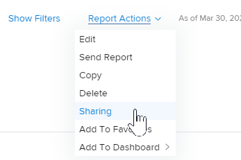

# Compartilhar um relatório no Adobe Workfront

O administrador do Adobe Workfront concede aos usuários acesso para visualizar ou editar relatórios quando eles atribuem níveis de acesso. Para obter mais informações sobre a concessão de acesso a problemas, consulte [Conceder acesso a relatórios, painéis e calendários](../../../administration-and-setup/add-users/configure-and-grant-access/grant-access-reports-dashboards-calendars.md).

Além do nível de acesso que os usuários recebem, você também pode conceder permissões para Exibir ou gerenciar relatórios específicos que você tem acesso para compartilhar. Para obter mais informações sobre níveis de acesso e permissões, consulte [Como os níveis de acesso e as permissões funcionam em conjunto](../../../administration-and-setup/add-users/access-levels-and-object-permissions/how-access-levels-permissions-work-together.md).

As permissões são específicas a um item no Workfront e definem quais ações podem ser executadas nesse item.

>[!NOTE]
>
>Um administrador do Workfront pode adicionar ou remover permissões de qualquer item no sistema, para todos os usuários, sem ser o proprietário desses itens.

## Requisitos de acesso

Você deve ter o seguinte para compartilhar objetos:

<table style="table-layout:auto"> 
 <col> 
 <col> 
 <tbody> 
  <tr> 
   <td role="rowheader">Plano Adobe Workfront*</td> 
   <td> 
Qualquer Um 
 </td> 
  </tr> 
  <tr> 
   <td role="rowheader">Licença da Adobe Workfront*</td> 
   <td> 
Revisar ou superior
 </td> 
  </tr> 
  <tr> 
   <td role="rowheader">Configurações de nível de acesso*</td> 
   <td> 
Visualizar acesso ou superior a Relatórios, Painéis, Calendários
 
Observação: Caso ainda não tenha acesso, pergunte ao administrador do Workfront se ele definiu restrições adicionais em seu nível de acesso. Para obter informações sobre como um administrador do Workfront pode modificar seu nível de acesso, consulte <a href="../../../administration-and-setup/add-users/configure-and-grant-access/create-modify-access-levels.md" class="MCXref xref">Criar ou modificar níveis de acesso personalizados</a>.
 </td> 
  </tr> 
  <tr> 
   <td role="rowheader">Permissões de objeto</td> 
   <td> 
Visualizar permissões ou acima do relatório
 
Para obter informações sobre como solicitar acesso adicional, consulte <a href="../../../workfront-basics/grant-and-request-access-to-objects/request-access.md" class="MCXref xref">Solicitar acesso a objetos </a>.
 </td> 
  </tr> 
 </tbody> 
</table>

&#42;Para descobrir qual plano, tipo de licença ou acesso você tem, entre em contato com o administrador da Workfront.

## Considerações sobre o compartilhamento de relatórios

Além das considerações abaixo, consulte também [Compartilhar relatórios, painéis e calendários](../../../workfront-basics/grant-and-request-access-to-objects/permissions-reports-dashboards-calendars.md).

* É possível compartilhar relatórios criados com outros indivíduos, equipes, grupos, funções de trabalho ou empresas. Você também pode compartilhar relatórios que outras pessoas criaram e que foram compartilhados com você.
* Também é possível compartilhá-los com toda a organização ou torná-los públicos. Tornar um relatório público gera um URL que pode ser compartilhado com outras pessoas.
* Você pode compartilhar um relatório individual ou pode compartilhar vários relatórios a partir de uma lista de relatórios.

## Maneiras de compartilhar relatórios

Você pode compartilhar relatórios no Workfront da seguinte maneira:

* Manualmente, conforme descrito na [Compartilhar um relatório](#share-a-report) abaixo.
* Automaticamente, herdando permissões de Exibição de um painel que contém o relatório que foi compartilhado. Para obter informações sobre como visualizar permissões herdadas em objetos, consulte [Exibir permissões herdadas em objetos](../../../workfront-basics/grant-and-request-access-to-objects/view-inherited-permissions-on-objects.md).

## Compartilhar um relatório {#share-a-report}

O compartilhamento de um relatório ou vários relatórios de uma lista é idêntico.

1. Vá para uma lista de relatórios, selecione um ou vários relatórios e clique em **Compartilhar**.

   Ou

   Clique no nome de um relatório e, em seguida, clique em **Ações de relatório >****Compartilhamento**.

   

1. Na caixa exibida, na **Adicionar pessoas, equipes, funções, grupos ou empresas ...** comece digitando o nome do usuário, equipe, função de trabalho, grupo ou empresa com quem deseja compartilhar o relatório e pressione **Enter** quando o nome for exibido.

1. Para ajustar o nível de acesso de um nome adicionado, clique no menu suspenso à direita do nome e escolha uma das opções abaixo.

   <table style="table-layout:auto"> 
    <col> 
    <col> 
    <tbody> 
     <tr> 
      <td role="rowheader">Visualizar o projeto</td> 
      <td> 
Permite que o destinatário acesse o relatório no <strong>Relatórios</strong>  e execute-a.
 
Você pode clicar em <strong>Configurações avançadas</strong> para especificar se você deseja que o usuário ou os usuários possam <strong>Compartilhar</strong> com qualquer pessoa no sistema.
 </td> 
     </tr> 
     <tr> 
      <td role="rowheader">Gerenciar o projeto</td> 
      <td> 
Permite que seu recipient edite completamente o relatório.
 
Você pode clicar em <strong>Configurações avançadas</strong> para especificar se você deseja que o usuário ou os usuários possam <strong>Excluir</strong> o relatório do sistema e <strong>Compartilhar</strong> com qualquer pessoa no sistema.
 </td> 
     </tr> 
    </tbody> 
   </table>

1. (Opcional) Repita as duas etapas anteriores para adicionar outros nomes à lista e configurar suas opções.
1. (Opcional) Clique no botão **Engrenagem** ícone  no canto superior direito da caixa de compartilhamento, selecione uma das seguintes opções:

   * **Tornar isso público para usuários externos:** Selecione essa opção para gerar um URL que possa ser compartilhado com outras pessoas. Qualquer pessoa com o URL pode acessar o relatório, sem ter uma licença do Adobe Workfront.

      >[!CAUTION]
      >
      >Recomendamos que você tenha cuidado ao compartilhar um objeto contendo informações confidenciais com usuários externos. Isso permite que eles visualizem informações sem ser usuários da Workfront ou parte de sua organização.

      >[!NOTE]
      >
      >Se o relatório tiver um prompt e você o compartilhar publicamente, os usuários que estiverem executando o relatório deverão estar conectados ao Workfront para poder executar o relatório usando o prompt. Caso não consigam fazer logon no Workfront, o relatório será exibido sem o prompt aplicado. Para obter mais informações sobre limitações de relatórios de compartilhamento com prompts, consulte a seção [Limitações do compartilhamento de relatórios solicitados](../../../reports-and-dashboards/reports/creating-and-managing-reports/add-prompt-report.md#limitations-of-running-public-prompted-reports) no artigo [Adicionar um prompt a um relatório](../../../reports-and-dashboards/reports/creating-and-managing-reports/add-prompt-report.md).

   * **Torne isso visível em todo o sistema:** Selecione essa opção para que todos no Workfront com acesso a relatórios possam ver o relatório.

1. Clique em **Salvar**.
