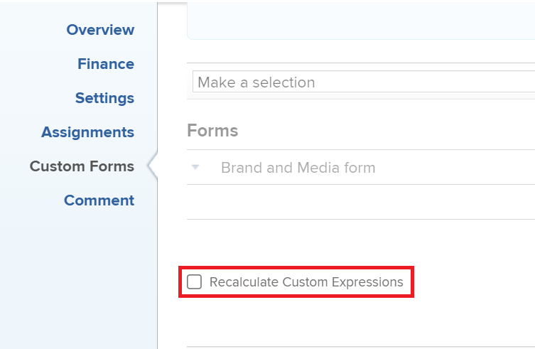

# Criar um gráfico de um relatório por um campo personalizado de várias seleções

<!--Audited: 11/2024-->

<!--The highlighted information on this page refers to functionality not yet generally available. It is available for all customers in the Preview environment and for a select group of customers in the Production environment.-->

Em vez de criar um gráfico usando um campo personalizado de seleção múltipla, recomendamos criar campos separados para cada opção de um campo personalizado de seleção múltipla.

Exemplos de campos personalizados de seleção múltipla são:

* Caixa de Seleção
* Menus suspensos de seleção múltipla

Para obter informações sobre como usar o modo de texto, consulte o artigo [Visão geral do Modo de Texto](../../../reports-and-dashboards/reports/text-mode/understand-text-mode.md).

No entanto, se não for possível ter campos separados para cada opção de um campo de seleção múltipla, você poderá criar um gráfico de um relatório por um campo personalizado de seleção múltipla usando campos personalizados calculados para agrupar as opções do campo de seleção múltipla primeiro. Depois disso, será possível mapear o relatório de acordo com os campos calculados.

>[!NOTE]
>
>Os itens que têm qualquer uma das opções selecionadas são contados apenas uma vez.
>
>Por exemplo, se você tiver um campo personalizado Caixa de seleção com Opção 1 e Opção 2 como opções e anexar o formulário a tarefas, as tarefas que têm Opção 1 e Opção 2 serão exibidas em um elemento de gráfico separado do que as tarefas que têm apenas Opção 1 ou Opção 2 selecionadas.
>
>As tarefas que têm a Opção 1 selecionada não são exibidas no mesmo elemento de gráfico que as tarefas que têm a Opção 1 e a Opção 2 selecionadas.

## Requisitos de acesso

+++ Expanda para visualizar os requisitos de acesso para a funcionalidade neste artigo.

Você deve ter o seguinte acesso para executar as etapas deste artigo:

<table style="table-layout:auto"> 
 <col> 
 <col> 
 <tbody> 
  <tr> 
   <td role="rowheader">plano do Adobe Workfront</td> 
   <td> 
Qualquer
 </td> 
  </tr> 
  <tr> 
   <td role="rowheader">Licença da Adobe Workfront*</td> 
   <td> 
    
Novo:

   <ul><li>
Colaborador para modificar um filtro 
</li>
   <li>
Padrão para modificar um relatório
</li> </ul>

Atual:

   <ul><li>
Solicitação para modificar um filtro 
</li>
   <li>
Planejar a modificação de um relatório
</li> </ul></td> 
  </tr> 
  <tr> 
   <td role="rowheader">Configurações de nível de acesso</td> 
   <td> 
Editar acesso a relatórios, painéis e calendários para modificar um relatório
 
Editar acesso a Filtros, Visualizações, Agrupamentos para modificar um filtro
 </td> 
  </tr> 
  <tr> 
   <td role="rowheader">Permissões de objeto</td> 
   <td> 
Gerenciar permissões para um relatório
  </td> 
  </tr> 
 </tbody> 
</table>

*Para obter informações, consulte [Requisitos de acesso na documentação do Workfront](/help/quicksilver/administration-and-setup/add-users/access-levels-and-object-permissions/access-level-requirements-in-documentation.md).

+++

## Pré-requisitos

Antes de começar, você deve criar um campo personalizado calculado que mostre os valores selecionados do campo personalizado de seleção múltipla. Para obter informações, consulte a seção [Criar um campo personalizado calculado que faça referência a um campo personalizado de várias seleções](#build-a-calculated-custom-field-that-references-a-multi-select-custom-field) neste artigo.

## Criar um gráfico de um relatório por campos personalizados de seleção múltipla

<!--

(NOTE: this moved to its own article, linked in the Note above!)

-->

Não é possível criar um gráfico em um relatório referenciando um campo personalizado de seleção múltipla. Em vez disso, você pode criar um campo calculado que registre os valores do campo personalizado de seleção múltipla em um determinado objeto e agrupar pelo campo calculado. 

* [Criar um campo personalizado calculado que faça referência a um campo personalizado de várias seleções](#build-a-calculated-custom-field-that-references-a-multi-select-custom-field)
* [Criar um gráfico que faça referência a um campo personalizado calculado](#build-a-chart-that-references-a-calculated-custom-field)

### Criar um campo personalizado calculado que faça referência a um campo personalizado de várias seleções {#build-a-calculated-custom-field-that-references-a-multi-select-custom-field}

Para criar um campo calculado que faça referência a um campo personalizado de várias seleções, você deve ter os seguintes pré-requisitos:

* Um campo personalizado de várias seleções em um formulário personalizado.\
  Para obter informações sobre como criar formulários personalizados e adicionar campos personalizados a eles, consulte o artigo [Criar um formulário personalizado](/help/quicksilver/administration-and-setup/customize-workfront/create-manage-custom-forms/form-designer/design-a-form/design-a-form.md).

* Um formulário personalizado com o campo personalizado de seleção múltipla anexado a objetos.
* Valores para o campo personalizado de várias seleções para cada objeto.

Para criar o campo personalizado calculado que faz referência ao campo personalizado de várias seleções:

1. Crie um formulário personalizado ou edite um existente.

   Para obter informações sobre como criar formulários personalizados, consulte [Criar um formulário personalizado](/help/quicksilver/administration-and-setup/customize-workfront/create-manage-custom-forms/form-designer/design-a-form/design-a-form.md).

1. Selecione o(s) objeto(s) que planeja usar com o formulário personalizado.
1. Clique em **Adicionar um campo**, depois em **Calculado** para adicionar o campo personalizado de várias seleções ao formulário.

1. Na caixa **Rótulo**, nomeie o novo campo calculado para indicar que ele faz referência ao campo personalizado de várias seleções.

   Por exemplo: &quot;Campo de seleção múltipla calculado&quot;.

1. Na caixa **Cálculo**, digite o seguinte código:

   `{DE:Multi-select Custom Field}`

   Isso adiciona as opções selecionadas no campo personalizado de seleção múltipla ao campo personalizado calculado. Por exemplo, se o formulário estiver anexado a tarefas e a Opção 1 for selecionada no campo personalizado de seleção múltipla, o campo personalizado calculado exibirá o valor &quot;Opção 1&quot;. Se a Opção 1 e a Opção 2 forem selecionadas para uma tarefa diferente, o campo personalizado calculado exibirá o valor &quot;Opção 1, Opção 2&quot;.

1. Substitua &quot;Campo personalizado de seleção múltipla&quot; pelo nome real do seu campo personalizado de seleção múltipla, como exibido no Workfront.

   

1. (Opcional) Se o campo personalizado de seleção múltipla já estiver neste formulário e se ele já estiver anexado a objetos, habilite a opção **Aplicar a cálculos existentes**.

   Isso garante que o novo campo calculado seja preenchido automaticamente com o valor do campo personalizado de seleção múltipla conforme for adicionado aos formulários já anexados aos objetos.

1. Clique em **Aplicar**.
1. Clique em **Salvar e fechar**.

   O campo personalizado calculado é adicionado ao formulário personalizado e, se o formulário estiver anexado atualmente a objetos, o campo será preenchido com informações do campo personalizado de várias seleções.

### Criar um gráfico que faça referência a um campo personalizado calculado {#build-a-chart-that-references-a-calculated-custom-field}

1. (Opcional) Para garantir que todos os campos calculados pelos quais você deseja criar gráficos sejam preenchidos com valores, na guia Detalhes do relatório, selecione todos os objetos que contêm o formulário personalizado com a seleção múltipla de campos personalizados e o campo personalizado calculado e clique em **Editar**.
1. (Opcional e condicional) Selecione o campo **Recalcular Expressões Personalizadas** e clique em **Salvar Alterações**.\
   

   >[!NOTE]
   >
   >Esta opção foi eliminada da edição de projetos em massa.  Você ainda pode recalcular expressões para projetos em massa clicando no ícone **Mais**  na parte superior de uma lista de projetos e **Recalcular Expressões**.

1. Vá para o relatório em que deseja adicionar o gráfico do campo calculado que faz referência ao campo personalizado de multisseleção.
1. Clique em **Ações de Relatório** e depois em **Editar**.

1. Selecione a guia <strong>Agrupamentos</strong> e clique em <strong>Adicionar agrupamento</strong>.
1. Adicione o <strong>Campo de Seleção Múltipla Calculado</strong> que você criou como seu agrupamento.
1. Selecione a guia <strong>Gráfico</strong> e adicione um gráfico ao seu relatório.

   Por exemplo, escolha um gráfico de **Coluna**.
    Para obter informações sobre como adicionar um gráfico a um relatório, consulte a seção <a href="../../../reports-and-dashboards/reports/creating-and-managing-reports/create-custom-report.md#add-a-chart" class="MCXref xref">Adicionar um gráfico a um relatório</a> no artigo <a href="../../../reports-and-dashboards/reports/creating-and-managing-reports/create-custom-report.md" class="MCXref xref">Criar um relatório personalizado</a>.
1. No campo **Eixo Inferior (X)**, selecione o <strong>Campo de Seleção Múltipla Calculado</strong> para exibir no gráfico.
1. Clique em <strong>Salvar + Fechar</strong>.

   O relatório exibe os resultados agrupados pelo Campo de seleção múltipla calculado em um gráfico.

   