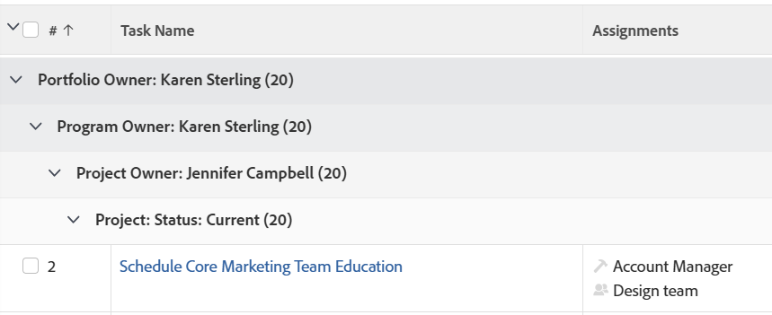

# Agrupamento: Agrupamento de tarefas em 4 níveis para Proprietário do Portfolio, Proprietário do Programa, Proprietário do Projeto e Status do Projeto

<!--Audited: 10/2024-->

Este Agrupamento de tarefas fornece quatro níveis de Agrupamento. Nesse caso, as tarefas são agrupadas por Proprietário do Portfolio, Proprietário do programa, Proprietário do projeto e Status do projeto. Você pode ter até três níveis de Agrupamento usando a interface padrão. Para adicionar um quarto nível, você deve usar o Modo de texto. Não é possível agrupar relatórios por mais de quatro critérios ao mesmo tempo.

## Requisitos de acesso

+++ Expanda para visualizar os requisitos de acesso para a funcionalidade neste artigo.

Você deve ter o seguinte acesso para executar as etapas deste artigo:

<table style="table-layout:auto"> 
 <col> 
 <col> 
 <tbody> 
  <tr> 
   <td role="rowheader">plano do Adobe Workfront</td> 
   <td> 
Qualquer
 </td> 
  </tr> 
  <tr> 
   <td role="rowheader">Licença da Adobe Workfront*</td> 
   <td> 
    
Novo:

   <ul><li>
Colaborador para modificar um filtro 
</li>
   <li>
Padrão para modificar um relatório
</li> </ul>

Atual:

   <ul><li>
Solicitação para modificar um filtro 
</li>
   <li>
Planejar a modificação de um relatório
</li> </ul></td> 
  </tr> 
  <tr> 
   <td role="rowheader">Configurações de nível de acesso</td> 
   <td> 
Editar acesso a relatórios, painéis e calendários para modificar um relatório
 
Editar acesso a Filtros, Visualizações, Agrupamentos para modificar um filtro
 </td> 
  </tr> 
  <tr> 
   <td role="rowheader">Permissões de objeto</td> 
   <td> 
Gerenciar permissões para um relatório
  </td> 
  </tr> 
 </tbody> 
</table>

*Para obter informações, consulte [Requisitos de acesso na documentação do Workfront](/help/quicksilver/administration-and-setup/add-users/access-levels-and-object-permissions/access-level-requirements-in-documentation.md).

+++

## Crie um Agrupamento de tarefas em 4 níveis para Proprietário do Portfolio, Proprietário do Programa, Proprietário do Projeto e Status do Projeto

Para aplicar esse agrupamento:

1. Ir para uma lista de tarefas.
1. No menu suspenso **Agrupamento**, selecione **Novo agrupamento**.

1. Clique em **Alternar para Modo de Texto**.
1. Remova o texto da área **Agrupar relatório**.
1. Substitua o texto na caixa exibida com o seguinte código:
   <pre>group.0.linkedname=project group.0.name=Portfolio Owner group.0.notime=false group.0.valuefield=project:portfolio:owner:name group.0.valueformat=string group.1.linkedname=project group.1.name=Program Owner group.1.notime=false group.1.valuefield=project:program:owner:name group.1.valueformat=string group.2 .linkedname=projectOwnerMM group.2.listgrouingparsedmethod=nested(project).nested(owner).string(name) group.2.namekey=projectownermm group.2.notime=false group.2.valuefield=projectOwnerMM:name group.2.valueformat=string group.3.enumclass=com.attask.common.constants.ProjectStatusEnt um group.3.linkedname=project group.3.namekey=view.relatedcolumn group.3.namekeyargkey.0=project group.3.namekeyargkey.1=status group.3.notime=false group.3.valuefield=project:status group.3.valueformat=val</pre>

1. Clique em **Concluído** e em **Salvar agrupamento**.
1. (Opcional) Atualize o nome do agrupamento e clique em **Salvar agrupamento**.
