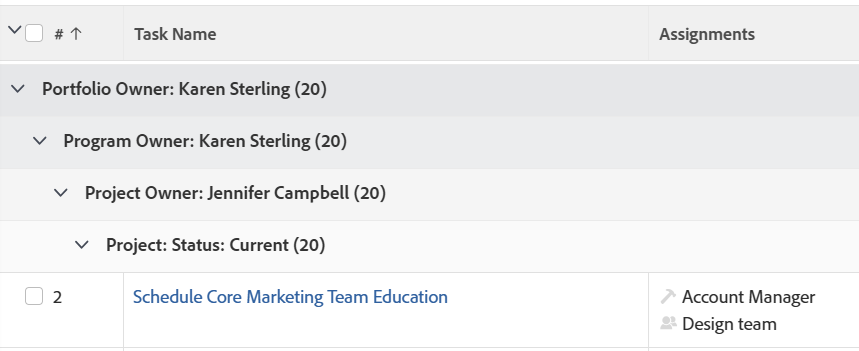

# Agrupamento: adicionar um quarto agrupamento a uma lista

<!--Audited: 10/2024-->

Você pode ter quatro agrupamentos em um relatório de matriz. Para obter mais informações sobre relatórios de matriz, consulte [Criar um relatório de matriz](../../../reports-and-dashboards/reports/creating-and-managing-reports/create-matrix-report.md).

Você pode ter somente três agrupamentos em um relatório padrão por meio da interface padrão. Para adicionar um quarto agrupamento em um relatório padrão, é necessário usar o modo de texto.



Por exemplo, você pode ter um relatório de tarefa que esteja agrupado por Nome do Projeto, Status do Andamento e Data de Conclusão Planejada, mas também deseja agrupar o relatório por Atribuído a Nome.

## Requisitos de acesso

+++ Expanda para visualizar os requisitos de acesso para a funcionalidade neste artigo.

Você deve ter o seguinte acesso para executar as etapas deste artigo:

<table style="table-layout:auto"> 
 <col> 
 <col> 
 <tbody> 
  <tr> 
   <td role="rowheader">plano do Adobe Workfront</td> 
   <td> <p>Qualquer</p> </td> 
  </tr> 
  <tr> 
   <td role="rowheader">Licença da Adobe Workfront*</td> 
   <td> 
    <p>Novo:</p>
   <ul><li><p>Colaborador para modificar um filtro </p></li>
   <li><p>Padrão para modificar um relatório</p></li> </ul>

<p>Atual:</p>
   <ul><li><p>Solicitação para modificar um filtro </p></li>
   <li><p>Planejar a modificação de um relatório</p></li> </ul></td> 
  </tr> 
  <tr> 
   <td role="rowheader">Configurações de nível de acesso</td> 
   <td> <p>Editar acesso a relatórios, painéis e calendários para modificar um relatório</p> <p>Editar acesso a Filtros, Visualizações, Agrupamentos para modificar um filtro</p> </td> 
  </tr> 
  <tr> 
   <td role="rowheader">Permissões de objeto</td> 
   <td> <p>Gerenciar permissões para um relatório</p>  </td> 
  </tr> 
 </tbody> 
</table>

*Para obter informações, consulte [Requisitos de acesso na documentação do Workfront](/help/quicksilver/administration-and-setup/add-users/access-levels-and-object-permissions/access-level-requirements-in-documentation.md).

+++

## Adicionar um quarto agrupamento a uma lista

Para adicionar um quarto agrupamento:

1. Clique em **Alternar para Modo de Texto**.
1. Remova o texto da área **Agrupar relatório**.
1. Substitua o texto na caixa exibida com o seguinte código:

   ```
   group.0.linkedname=project<br>group.0.namekey=view.relatedcolumn<br>group.0.namekeyargkey.0=project<br>group.0.namekeyargkey.1=name<br>group.0.valuefield=project:name<br>group.0.valueformat=string<br>group.1.enumclass=com.attask.common.constants.ProgressStatusEnum<br>group.1.enumtype=TASK<br>group.1.linkedname=direct<br>group.1.namekey=progressStatus<br>group.1.type=enum<br>group.1.valuefield=progressStatus<br>group.1.valueformat=val<br>group.2.groupdatesby=WY<br>group.2.linkedname=direct<br>group.2.namekey=plannedCompletionDate<br>group.2.notime=false<br>group.2.valuefield=plannedCompletionDate<br>group.2.valueformat=atDateAsWeekString<br><strong>group.3.valuefield=assignedTo:name</strong><br style="font-weight: bold;"><strong>group.3.valueformat=HTML</strong><br>textmode=true
   ```

1. Clique em **Concluído** e em **Salvar agrupamento**.
1. (Opcional) Atualize o nome do agrupamento e clique em **Salvar agrupamento**.
