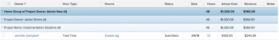

# Agrupamento: Grupo Padrão do Proprietário do Projeto em uma lista de horas

Você pode exibir o nome do Grupo Inicial do Proprietário do Projeto em uma lista de Horas ou relatório.

O agrupamento também agrupa os resultados pelo nome do Proprietário do projeto e pelo Nome do projeto.



## Requisitos de acesso

Você deve ter o seguinte acesso para executar as etapas deste artigo:

<table style="table-layout:auto"> 
 <col> 
 <col> 
 <tbody> 
  <tr> 
   <td role="rowheader">plano do Adobe Workfront*</td> 
   <td> <p>Qualquer</p> </td> 
  </tr> 
  <tr> 
   <td role="rowheader">Licença da Adobe Workfront*</td> 
   <td> <p>Solicitação para modificar um agrupamento </p>
   <p>Planejar a modificação de um relatório</p> </td> 
  </tr> 
  <tr> 
   <td role="rowheader">Configurações de nível de acesso*</td> 
   <td> <p>Editar acesso a relatórios, painéis e calendários para modificar um relatório</p> <p>Editar acesso a Filtros, Visualizações, Agrupamentos para modificar um agrupamento</p> <p><b>Nota</b>

Se você ainda não tiver acesso, pergunte ao administrador do Workfront se ele definiu restrições adicionais em seu nível de acesso. Para obter informações sobre como um administrador do Workfront pode modificar seu nível de acesso, consulte <a href="../../../administration-and-setup/add-users/configure-and-grant-access/create-modify-access-levels.md" class="MCXref xref">Criar ou modificar níveis de acesso personalizados</a>.</p> </td>
</tr>  
  <tr> 
   <td role="rowheader">Permissões de objeto</td> 
   <td> <p>Gerenciar permissões para um relatório</p> <p>Para obter informações sobre como solicitar acesso adicional, consulte <a href="../../../workfront-basics/grant-and-request-access-to-objects/request-access.md" class="MCXref xref">Solicitar acesso aos objetos </a>.</p> </td> 
  </tr> 
 </tbody> 
</table>

&#42;Para saber qual plano, tipo de licença ou acesso você tem, contate o administrador do Workfront.

## Agrupar por grupo padrão do proprietário do projeto em uma lista de horas

Para aplicar esse agrupamento:

1. Ir para uma lista de horas.
1. No menu suspenso **Agrupamento**, selecione **Novo agrupamento**.

1. Clique em **Alternar para Modo de Texto**.
1. Remova o texto da área **Agrupar relatório**.
1. Substitua o texto pelo seguinte código:

   ```
   group.0.displayname=Home Group of Project Owner<br>group.0.valuefield=project:owner:homeGroup:name<br>group.0.valueformat=HTML<br>group.1.displayname=Project Owner<br>group.1.linkedname=projectOwnerMM<br>group.1.namekey=view.relatedcolumn<br>group.1.namekeyargkey.0=projectOwnerMM<br>group.1.namekeyargkey.1=name<br>group.1.valuefield=projectOwnerMM:name<br>group.1.valueformat=string<br>group.2.displayname=Project Name<br>group.2.linkedname=project<br>group.2.namekey=view.relatedcolumn<br>group.2.namekeyargkey.0=project<br>group.2.namekeyargkey.1=name<br>group.2.valuefield=project:name<br>group.2.valueformat=string<br>textmode=true
   ```

1. Clique em **Salvar agrupamento**.
