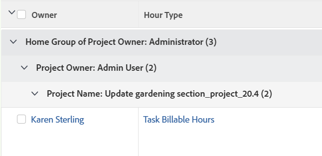

# Agrupamento: grupo de origem do proprietário do projeto em uma lista de horas

<!--Audited: 10/2024-->

Você pode exibir o nome do Grupo Doméstico do Proprietário do Projeto em uma lista de Horas ou relatório.

O agrupamento também agrupa os resultados pelo nome do Proprietário do Projeto e pelo Nome do Projeto.



## Requisitos de acesso

+++ Expanda para visualizar os requisitos de acesso da funcionalidade neste artigo. 

<table style="table-layout:auto"> 
 <col> 
 <col> 
 <tbody> 
  <tr> 
   <td role="rowheader">Pacote do Adobe Workfront</td> 
   <td> <p>Qualquer</p> </td> 
  </tr> 
  <tr> 
   <td role="rowheader">Licença do Adobe Workfront</td> 
   <td> 
   <p>Colaborador ou solicitação para modificar um filtro </p>
   <p>Padrão ou Plano para modificar um relatório</p>
  </tr> 
  <tr> 
   <td role="rowheader">Configurações de nível de acesso</td> 
   <td> <p>Acesso de edição a relatórios, painéis e calendários para modificar um relatório</p> <p>Editar acesso a filtros, exibições e agrupamentos para modificar um filtro</p> </td> 
  </tr> 
  <tr> 
   <td role="rowheader">Permissões de objeto</td> 
   <td> <p>Gerenciar permissões para um relatório</p>  </td> 
  </tr> 
 </tbody> 
</table>

Para obter mais detalhes sobre as informações contidas nesta tabela, consulte [Requisitos de acesso na documentação do Workfront](/help/quicksilver/administration-and-setup/add-users/access-levels-and-object-permissions/access-level-requirements-in-documentation.md).

+++

## Agrupar por Grupo Doméstico do Proprietário do Projeto em uma lista de horas

Para aplicar este agrupamento:

1. Vá para uma lista de horas.
1. No menu suspenso **Agrupamento**, selecione **Novo agrupamento**.

1. Clique em **Alternar para o Modo de Texto**.
1. Remova o texto na área **Agrupar por**.
1. Substitua o texto pelo seguinte código:

```
group.0.displayname=Home Group of Project Owner
group.0.valuefield=project:owner:homeGroup:name
group.0.valueformat=HTML
group.1.displayname=Project Owner
group.1.linkedname=projectOwnerMM
group.1.namekey=view.relatedcolumn
group.1.namekeyargkey.0=projectOwnerMM
group.1.namekeyargkey.1=name
group.1.valuefield=projectOwnerMM:name
group.1.valueformat=string
group.2.displayname=Project Name
group.2.linkedname=project
group.2.namekey=view.relatedcolumn
group.2.namekeyargkey.0=project
group.2.namekeyargkey.1=name
group.2.valuefield=project:name
group.2.valueformat=string
textmode=true
```

1. Clique em **Concluído** > **Salvar Agrupamento**.
1. (Opcional) Atualize o nome do agrupamento e clique em **Salvar Agrupamento**.
