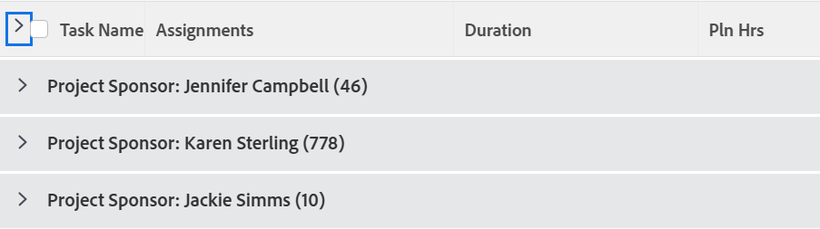

# Agrupamento: patrocinador do projeto em uma lista de tarefas

<!--Audited: 11/2024-->

Este agrupamento de tarefas permite agrupar tarefas pelo Patrocinador do Projeto.



## Requisitos de acesso

+++ Expanda para visualizar os requisitos de acesso da funcionalidade neste artigo. 

<table style="table-layout:auto"> 
 <col> 
 <col> 
 <tbody> 
  <tr> 
   <td role="rowheader">Pacote do Adobe Workfront</td> 
   <td> <p>Qualquer</p> </td> 
  </tr> 
  <tr> 
   <td role="rowheader">Licença do Adobe Workfront</td> 
   <td> 
   <p>Colaborador ou Solicitação para modificar um filtro </p>
   <p>Padrão ou Plano para modificar um relatório</p>
  </tr> 
  <tr> 
   <td role="rowheader">Configurações de nível de acesso</td> 
   <td> <p>Editar acesso a relatórios, painéis e calendários para modificar um relatório</p> <p>Editar acesso a Filtros, Visualizações, Agrupamentos para modificar um filtro</p> </td> 
  </tr> 
  <tr> 
   <td role="rowheader">Permissões de objeto</td> 
   <td> <p>Gerenciar permissões para um relatório</p>  </td> 
  </tr> 
 </tbody> 
</table>

Para obter mais detalhes sobre as informações contidas nesta tabela, consulte [Requisitos de acesso na documentação do Workfront](/help/quicksilver/administration-and-setup/add-users/access-levels-and-object-permissions/access-level-requirements-in-documentation.md).

+++

## Agrupar por Patrocinador do Projeto para uma lista de tarefas


Para aplicar esse agrupamento:

1. Ir para uma lista de tarefas.
1. No menu suspenso **Agrupamento**, selecione **Novo agrupamento**.

1. Clique em **Alternar para Modo de Texto**.
1. Remova o texto na área que é exibida e substitua-o pelo seguinte código:

   ```
   group.0.name=Project Sponsor
   group.0.valuefield=project:sponsor:name
   group.0.valueformat=string
   ```

1. Clique em **Concluído**.
1. Atualize o nome do agrupamento e clique em **Salvar agrupamento**.

