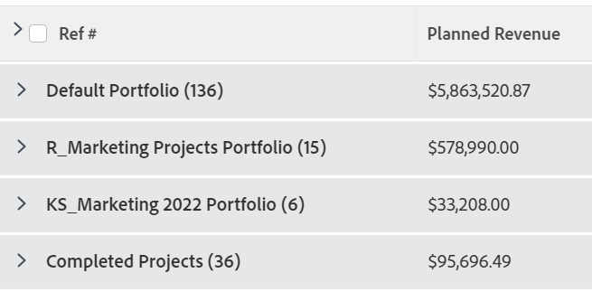

# Agrupamento: editar o nome de exibição em um agrupamento

<!--Audited: 01/2024-->

É possível renomear agrupamentos para algo mais familiar aos usuários.

Por exemplo, ao aplicar o agrupamento padrão do Portfolio Name a uma lista de projetos, o nome do agrupamento aparece como *Portfolio: Name:`<name of portfolio>`*.

Você pode modificar esse agrupamento usando o modo texto para exibir um nome mais fácil de ler.

## Requisitos de acesso

+++ Expanda para visualizar os requisitos de acesso para a funcionalidade neste artigo. 

<table style="table-layout:auto"> 
 <col> 
 <col> 
 <tbody> 
  <tr> 
   <td role="rowheader">Pacote do Adobe Workfront</td> 
   <td> 
Qualquer
 </td> 
  </tr> 
  <tr> 
   <td role="rowheader">Licença do Adobe Workfront</td> 
   <td> 
   
Colaborador ou Solicitação para modificar um filtro 

   
Padrão ou Plano para modificar um relatório

  </tr> 
  <tr> 
   <td role="rowheader">Configurações de nível de acesso</td> 
   <td> 
Editar acesso a relatórios, painéis e calendários para modificar um relatório
 
Editar acesso a Filtros, Visualizações, Agrupamentos para modificar um filtro
 </td> 
  </tr> 
  <tr> 
   <td role="rowheader">Permissões de objeto</td> 
   <td> 
Gerenciar permissões para um relatório
  </td> 
  </tr> 
 </tbody> 
</table>

Para obter mais detalhes sobre as informações nesta tabela, consulte [Requisitos de acesso na documentação do Workfront](/help/quicksilver/administration-and-setup/add-users/access-levels-and-object-permissions/access-level-requirements-in-documentation.md).

+++

## Editar o nome de exibição em um agrupamento

Para alterar o nome de exibição em um agrupamento de projeto:

1. Ir para uma lista de projetos.
1. No menu suspenso **Agrupamento**, selecione **Novo agrupamento**.

1. Clique em **Adicionar agrupamento**, comece a digitar &quot;Nome do Portfolio&quot; no campo **Agrupar por:** e selecione-o quando ele for exibido na lista.

1. Clique em **Alternar para Modo de Texto**.
1. Siga um destes procedimentos:

   * Adicione o seguinte código ao texto existente disponível na caixa **Agrupar seu relatório**:

     `group.0.displayname=Your Value`

     Por exemplo, adicione o seguinte código para alterar o nome de exibição para &quot;Portfolio&quot;:

     `group.0.displayname=Portfolio`

   * Remova todas as linhas na interface do modo de texto do agrupamento que tenham a palavra &quot;name&quot; nelas e, em seguida, adicione a linha:

     `group.0.name=Your Value`

     Por exemplo, adicione o seguinte código para alterar o nome de exibição para &quot;Portfolio&quot;:

     `group.0.name=Portfolio`

     >[!TIP]
     >
     >Você também pode deixar as linhas `group.0.name=` e `group.0.displayname=` em branco, nesse caso, o agrupamento mostra o valor pelo qual você está sendo agrupado.

     

1. Clique em **Concluído** e em **Salvar agrupamento**.
1. (Opcional) Atualize o nome do agrupamento e clique em **Salvar agrupamento**.

   O nome padrão do agrupamento é modificado de acordo com as informações do modo de texto.
