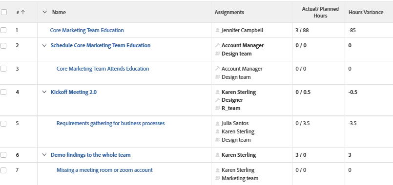

# View: Horas Reais sobre Horas Planejadas na mesma coluna de uma View de tarefa

Nesta visualização de tarefa, a quantidade real de horas registradas em uma tarefa são exibidas sobre as horas planejadas para cada tarefa.

## Requisitos de acesso

Você deve ter o seguinte acesso para executar as etapas deste artigo:

<table style="table-layout:auto"> 
 <col> 
 <col> 
 <tbody> 
  <tr> 
   <td role="rowheader">plano do Adobe Workfront*</td> 
   <td> 
Qualquer Um
 </td> 
  </tr> 
  <tr> 
   <td role="rowheader">Licença da Adobe Workfront*</td> 
   <td> 
Solicitação para modificar uma exibição 

   
Planejar a modificação de um relatório
 </td> 
  </tr> 
  <tr> 
   <td role="rowheader">Configurações de nível de acesso*</td> 
   <td> 
Editar acesso a relatórios, painéis e calendários para modificar um relatório
 
Editar acesso a Filtros, Visualizações, Agrupamentos para modificar uma visualização
 
<b>Nota</b>

Se você ainda não tiver acesso, pergunte ao administrador do Workfront se ele definiu restrições adicionais em seu nível de acesso. Para obter informações sobre como um administrador do Workfront pode modificar seu nível de acesso, consulte <a href="../../../administration-and-setup/add-users/configure-and-grant-access/create-modify-access-levels.md" class="MCXref xref">Criar ou modificar níveis de acesso personalizados</a>.
 </td>
</tr>  
  <tr> 
   <td role="rowheader">Permissões de objeto</td> 
   <td> 
Gerenciar permissões para um relatório
 
Para obter informações sobre como solicitar acesso adicional, consulte <a href="../../../workfront-basics/grant-and-request-access-to-objects/request-access.md" class="MCXref xref">Solicitar acesso a objetos </a>.
 </td> 
  </tr> 
 </tbody> 
</table>

&#42;Para descobrir seu plano, tipo de licença ou acesso, entre em contato com o administrador do Workfront.

## Visualizar Horas efetivas sobre horas planejadas em uma visualização de tarefa

Para aplicar esta exibição:

1. Ir para uma lista de tarefas.
1. No **Exibir** selecione **Nova visualização**.

1. No **Visualização da coluna** elimine todas as colunas, exceto uma.
1. Clique no cabeçalho da coluna restante e clique em **Alternar para modo de texto**.
1. Passe o mouse sobre a área do modo de texto e clique em **Clique para editar o texto**.
1. Remova o texto localizado na **Modo de texto** e substitua-o pelo seguinte código:
   <pre>column.0.descriptionkey=name column.0.link.linkproperty.0.name=ID column.0.link.linkproperty.0.valuefield=ID column.0.link.linkproperty.0.valueformat=int column.0.link.lookup=link.view column.0.link.valuefield=objCode column.0.link.valueformat=val column.0.linkedname=direct column.0.listsort=string(name) column.0.namekey=name.abbr column.0.querysort=name column.0.shortview=false column.0.stretch=100 column.0.valuefield=nome column.0.valueformat=HTML column.0.width=150 column.1.viewalias=atribuições column.1.displayname= column.1.linkedname=direct column.1.namekey=atribuições column.1.valuefield=assiassignmentListString column.1.valueformat=HTML column.1.tile.name=component.assignmentslist column.2.displayname=Horas Reais/ Planejadas column.2.linkedname=direct column.2.namekey=atualworkrequired column.2.querysort=atualWork column.2.textmode=true column.2.valueexpression=CONCAT({atualWorkRequired}/60,' / ',{workRequired}/60) column.2.valuefield=atualWorkRequired column.2.valueformat=composto column.2.viewalias=atualworkrequired column.3.aggregator.function=SUM column.3.aggregator.valueexpression=SUB({atualWork}, {workRequired}) column.3.aggregator.valueformat=composto column.3.displayname=Variação de Horas column.3.linkedname=direct column.3.textmode=true column.3.valueexpression=SUB({atualWork}, {workRequired})/60 column.3.valueformat=customNumberAsString</pre>

1. Clique em **Salvar visualização**.
