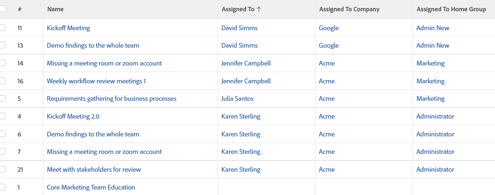

# Visualização: Empresa e grupo padrão do usuário atribuído

<!--Audited: 11/2024-->

Esta exibição de tarefa mostra a Empresa e o Grupo inicial do Proprietário principal da tarefa. Esses são valores que não estão disponíveis na interface padrão, mas são acessíveis por meio do modo de texto.



## Requisitos de acesso

+++ Expanda para visualizar os requisitos de acesso para a funcionalidade neste artigo.

Você deve ter o seguinte acesso para executar as etapas deste artigo:

<table style="table-layout:auto"> 
 <col> 
 <col> 
 <tbody> 
  <tr> 
   <td role="rowheader">plano do Adobe Workfront</td> 
   <td> <p>Qualquer</p> </td> 
  </tr> 
  <tr> 
   <td role="rowheader">Licença da Adobe Workfront*</td> 
   <td> 
    <p>Novo:</p>
   <ul><li><p>Colaborador para modificar um filtro </p></li>
   <li><p>Padrão para modificar um relatório</p></li> </ul>

<p>Atual:</p>
   <ul><li><p>Solicitação para modificar um filtro </p></li>
   <li><p>Planejar a modificação de um relatório</p></li> </ul></td> 
  </tr> 
  <tr> 
   <td role="rowheader">Configurações de nível de acesso</td> 
   <td> <p>Editar acesso a relatórios, painéis e calendários para modificar um relatório</p> <p>Editar acesso a Filtros, Visualizações, Agrupamentos para modificar um filtro</p> </td> 
  </tr> 
  <tr> 
   <td role="rowheader">Permissões de objeto</td> 
   <td> <p>Gerenciar permissões para um relatório</p>  </td> 
  </tr> 
 </tbody> 
</table>

*Para obter informações, consulte [Requisitos de acesso na documentação do Workfront](/help/quicksilver/administration-and-setup/add-users/access-levels-and-object-permissions/access-level-requirements-in-documentation.md).

+++

## Visualizar Empresa e Grupo Inicial do usuário atribuído

1. Ir para uma lista de tarefas.
1. No menu suspenso **Exibir**, selecione **Nova Exibição**.

1. Na área **Visualização da coluna**, elimine todas as colunas, exceto uma.
1. Clique no cabeçalho da coluna restante e em **Alternar para Modo de Texto**.
1. Clique em **Editar Modo de Texto**.
1. Remova o texto localizado na caixa **Editar Modo de Texto** e substitua-o pelo seguinte código:

   ```
   column.0.descriptionkey=name
   column.0.link.linkproperty.0.name=ID
   column.0.link.linkproperty.0.valuefield=ID
   column.0.link.linkproperty.0.valueformat=int
   column.0.link.lookup=link.view
   column.0.link.valuefield=objCode
   column.0.link.valueformat=val
   column.0.linkedname=direct
   column.0.listsort=string(name)
   column.0.namekey=name.abbr
   column.0.querysort=name
   column.0.shortview=false
   column.0.stretch=100
   column.0.valuefield=name
   column.0.valueformat=HTML
   column.0.width=150
   column.1.descriptionkey=assignedto
   column.1.link.linkproperty.0.name=ID
   column.1.link.linkproperty.0.valuefield=assignedTo:ID
   column.1.link.linkproperty.0.valueformat=int
   column.1.link.lookup=link.view
   column.1.link.valuefield=assignedTo:objCode
   column.1.link.valueformat=val
   column.1.linkedname=assignedTo
   column.1.listsort=nested(assignedTo).string(name)
   column.1.namekey=assignedto
   column.1.querysort=assignedTo:name
   column.1.shortview=false
   column.1.stretch=0
   column.1.valuefield=assignedTo:name
   column.1.valueformat=HTML
   column.1.width=150
   column.2.description=Assigned To Company
   column.2.displayname=Assigned To Company
   column.2.linkedname=assignedTo:company
   column.2.listsort=nested(assignedTo:company).string(name)
   column.2.namekey=assignedto
   column.2.querysort=assignedTo:company:name
   column.2.shortview=false
   column.2.stretch=0
   column.2.valuefield=assignedTo:company:name
   column.2.valueformat=HTML
   column.2.width=150
   column.3.description=Assigned To Home Group
   column.3.displayname=Assigned To Home Group
   column.3.linkedname=assignedTo:homeGroup
   column.3.listsort=nested(assignedTo:homeGroup).string(name)
   column.3.namekey=assignedto
   column.3.querysort=assignedTo:homeGroup:name
   column.3.shortview=false
   column.3.stretch=0
   column.3.valuefield=assignedTo:homeGroup:name
   column.3.valueformat=HTML
   column.3.width=150
   ```

1. Clique em **Concluído** > **Salvar exibição**.
1. (Opcional) Atualize o nome da exibição e clique em **Salvar exibição**.
