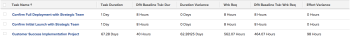

# View: variação da linha de base para Duração e Trabalho Planejado em uma View de tarefa

Essa exibição mostra o seguinte em uma exibição de tarefa:

* Informações da tarefa com informações da tarefa da linha de base.
* A diferença entre a duração e a duração da linha de base padrão.
* A diferença entre o Trabalho Planejado e o Trabalho Planejado da Linha de Base Padrão.

>[!NOTE]
>
> Os dados exibidos na visualização a seguir comparam os valores reais da tarefa com os valores associados às tarefas de Linha de Base Padrão.

 

## Requisitos de acesso

Você deve ter o seguinte acesso para executar as etapas deste artigo:

<table style="table-layout:auto"> 
 <col> 
 <col> 
 <tbody> 
  <tr> 
   <td role="rowheader">plano do Adobe Workfront*</td> 
   <td> 
Qualquer Um
 </td> 
  </tr> 
  <tr> 
   <td role="rowheader">Licença da Adobe Workfront*</td> 
   <td> 
Solicitação para modificar uma exibição 

   
Planejar a modificação de um relatório
 </td> 
  </tr> 
  <tr> 
   <td role="rowheader">Configurações de nível de acesso*</td> 
   <td> 
Editar acesso a relatórios, painéis e calendários para modificar um relatório
 
Editar acesso a Filtros, Visualizações, Agrupamentos para modificar uma visualização
 
<b>Nota</b>

Se você ainda não tiver acesso, pergunte ao administrador do Workfront se ele definiu restrições adicionais em seu nível de acesso. Para obter informações sobre como um administrador do Workfront pode modificar seu nível de acesso, consulte <a href="../../../administration-and-setup/add-users/configure-and-grant-access/create-modify-access-levels.md" class="MCXref xref">Criar ou modificar níveis de acesso personalizados</a>.
 </td>
</tr> 
  <tr> 
   <td role="rowheader">Permissões de objeto</td> 
   <td> 
Gerenciar permissões para um relatório
 
Para obter informações sobre como solicitar acesso adicional, consulte <a href="../../../workfront-basics/grant-and-request-access-to-objects/request-access.md" class="MCXref xref">Solicitar acesso a objetos </a>.
 </td> 
  </tr> 
 </tbody> 
</table>

&#42;Para descobrir seu plano, tipo de licença ou acesso, entre em contato com o administrador do Workfront.

## Exibir variação da linha de base para Duração e Trabalho Planejado em uma exibição de tarefa

1. Ir para uma lista de tarefas.
1. No **Exibir** selecione **Nova visualização**.

1. Remova todas as colunas da exibição, exceto a primeira.
1. Com a primeira coluna selecionada, clique em **Alternar para modo de texto**.
1. Copie o texto abaixo e cole-o na primeira coluna do modo de exibição:

   <pre>column.0.descriptionkey=name column.0.link.linkproperty.0.name=ID column.0.link.linkproperty.0.valuefield=ID column.0.link.linkproperty.0.valueformat=int column.0.link.lookup=link.view column.0.link.valuefield=objCode column.0.link.valueformat=val column.0.linkedname=direct column.0.listsort=string(name) column.0.namekey=name.abbr column.0.querysort=name column.0.shortview=false column.0.stretch=100 column.0.valuefield=nome column.0.valueformat=HTML column.0.width=150 column.0.displayname=Nome da Tarefa column.1.descriptionkey=duration column.1.linkedname=direct column.1.listsort=intAsInt(durationMinutes) column.1.namekey=duration.abbr column.1.querysort=durationMinutes column.1.shortview=false column.1.stretch=0 column.1.valuefield=durationFieldLong column.1.valueformat=composto column.1.viewalias=duration column.1.width=100 column.1.displayname=Task Duration column.2.descriptionkey=view.relatedcolumn column.2.descriptionkeyargkey.0=defaultbaselinetask column.2.descriptionkeyargkey.1=duração column.2.linkedname=defaultBaselineTask column.2.listsort=intAsInt(durationMinutes) column.2.namekey=duration column.2.namekeyargkey.0=defaultbaselinetask.abbr column.2.namekeyargkey.1=duration.abbr column.2.querysort=defaultBaselineTask:durationMinutes column.2.shortview=false column.2.stretch=0 column.2.valuefield=defaultBaselineTask:durationFieldLong column.2.valueformat=composto column.2.viewalias=defaultBaselineTask:duration column.2.width=100 column.2.displayname=Tarefa de Linha de Base Dflt: Dur column.2.durationunitfield=durationUnit.value column.3.description=Variação de Duração"column.3.linkedname=direct column.3.listsort=intAsInt(durationMinutes) column.3.name=Variação de duração column.3.querysort=durationMinutes column.3.shortview=false column.3.stretch=0 column.3.valueexpression=CONCAT(SUB({duration},{defaultBaselineTask}.{duration})/480," Dias") column.3.valueformat=HTML column.3.viewalias=duration column.3.width=100 column.3.displayname=Variação de Duração column.4.descriptionkey=workrequired column.4.linkedname=direct column.4.listsort=doubleAsDouble(workRequired) column.4.namekey=workrequired.abbr column.4.querysort=workRequired column.4.shortview=false column.4.stretch=0 column.4.valuefield=workFieldLong column.4.valueformat=composto column.4.viewalias=workrequired column.4.width=100 column.4.displayname=Wrk Req column.5.descriptionkey=view.relatedcolumn column.5.descriptionkeyargkey.0=defaultbaselinetask column.5.descriptionkeyargkey.1=workrequired column.5.linkedname=defaultBaselineTask column.5.listsort=doubleAsDouble(workRequired) column.5.namekey=view.relatedcolumn column.5.namekeyargkey.0=defaultbaselinetask.abbr column.5.namekeyargkey.1=workrequired.abbr column.5.querysort=defaultBaselineTask:workRequired column.5.shortview=false column.5.stretch=0 column.5.valuefield=defaultBaselineTask:workFieldLong column.5.valueformat=composto column.5.viewalias=defaultBaselineTask:workrequired column.5.width=100 column.5.displayname=Tarefa de Linha de Base Dflt: Requisição Wrk column.6.descriptionkey=workrequired column.6.linkedname=direct column.6.listsort=doubleAsDouble(workRequired) column.6.name=Variação do esforço column.6.querysort=workRequired column.6.shortview=false column.6.stretch=0 column.6.valueexpression=CONCAT(SUB({workRequired},{defaultBaselineTask}.{workRequired})/60," Horas") column.6.valueformat=HTML column.6.viewalias=workrequired column.6.width=100 column.6.displayname=Variação do Esforço</pre>

1. Clique em **Salvar visualização**.\
   
