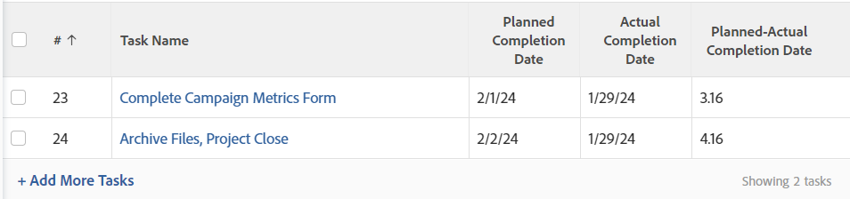

# Exibir: calcular diferenças de data e hora

<!-- Audited: 11/2024 -->

>[!IMPORTANT]
>
>Você não pode calcular a diferença de data e hora no Adobe Workfront entre dois objetos diferentes do mesmo tipo. Por exemplo, você não pode calcular a diferença de data e hora entre duas datas em dois projetos, tarefas ou problemas diferentes.

Você pode calcular a diferença entre o seguinte:

* A diferença de data e hora entre dois campos de data no mesmo objeto
* A diferença de data e hora entre um campo em um objeto e outro campo no objeto pai

>[!TIP]
>
>Esses cálculos exibem o número de dias entre as duas datas. O resultado é exibido em dias. O carimbo de data e hora no campo de data também é levado em conta, e o número de dias pode ser seguido por decimais se os carimbos de data e hora não corresponderem. Se a tarefa foi concluída com atraso, o número de dias é exibido como um valor negativo.

## Requisitos de acesso

+++ Expanda para visualizar os requisitos de acesso para a funcionalidade neste artigo.

Você deve ter o seguinte acesso para executar as etapas deste artigo:

<table style="table-layout:auto"> 
 <col> 
 <col> 
 <tbody> 
  <tr> 
   <td role="rowheader">plano do Adobe Workfront</td> 
   <td> <p>Qualquer</p> </td> 
  </tr> 
  <tr> 
   <td role="rowheader">Licença do Adobe Workfront</td> 
   <td> <p>Novo: </p><ul><li><p>Colaborador para modificar uma visualização </p></li><li>
   <p>Padrão para modificar um relatório</p></li></ul><p>Ou</p><p>Atual:</p><ul><li><p>Solicitação para modificar uma exibição </p></li><li>
   <p>Planejar a modificação de um relatório</p> </li><ul></td> 
  </tr> 
  <tr> 
   <td role="rowheader">Configurações de nível de acesso</td> 
   <td> <p>Editar acesso a relatórios, painéis e calendários para modificar um relatório</p> <p>Editar acesso a Filtros, Visualizações, Agrupamentos para modificar uma visualização</p> </td> 
  </tr>  
  <tr> 
   <td role="rowheader">Permissões de objeto</td> 
   <td> <p>Gerenciar permissões para um relatório</p>  </td> 
  </tr> 
 </tbody> 
</table>

Para obter mais detalhes sobre as informações nesta tabela, consulte [Requisitos de acesso na documentação do Workfront](/help/quicksilver/administration-and-setup/add-users/access-levels-and-object-permissions/access-level-requirements-in-documentation.md).

+++

## Calcular a diferença de data e hora entre dois campos de data no mesmo objeto

Por exemplo, você pode calcular a diferença entre a Data de conclusão planejada e a Data de conclusão real de uma tarefa.



1. Ir para uma lista de tarefas.
1. No menu suspenso **Exibir**, clique em **Nova Exibição**.

1. Clique em **Adicionar coluna** e comece a digitar &quot;Data de conclusão planejada&quot; no campo **Mostrar nesta coluna** e, em seguida, selecione-a quando ela for exibida na lista.

1. Clique em **Adicionar coluna** e comece a digitar &quot;Data de Término Efetivo&quot; no campo **Mostrar nesta coluna** e, em seguida, selecione-a quando ela for exibida na lista.

1. Clique em **Adicionar Coluna** e em **Alternar para Modo de Texto**.

1. Passe o mouse sobre a área do modo de texto e clique em **Clicar para editar o texto**.
1. Remova o texto localizado na caixa **Modo de Texto** e substitua-o pelo seguinte código:

   ```
    displayname=Planned-Actual Completion Date
    linkedname=direct
    querysort=plannedCompletionDate
    textmode=true
    valueexpression=ROUND(DATEDIFF({plannedCompletionDate},{actualCompletionDate}),2)
    valueformat=HTML
   ```

1. Clique em **Salvar** e depois em **Salvar exibição**.

## Calcular a diferença de data e hora entre o campo em um objeto e outro campo em um objeto pai

Para obter uma lista de objetos e seus pais, consulte a seção &quot;Noções Básicas sobre a Interdependência e a Hierarquia de Objetos&quot; em [Noções Básicas sobre Objetos no Adobe Workfront](../../../workfront-basics/navigate-workfront/workfront-navigation/understand-objects.md).\
Por exemplo, você pode calcular a diferença entre a Data de conclusão planejada de uma tarefa e a Data de conclusão planejada de sua tarefa pai ou do projeto em que a tarefa está.


1. Ir para uma lista de tarefas.
1. No menu suspenso **Exibir**, clique em **Nova Exibição**.

1. Clique em **Adicionar coluna** e comece digitando &quot; Data de conclusão planejada do projeto&quot; ou &quot;Data de conclusão principal&quot; no campo **Mostrar nesta coluna** e depois selecione-a quando ela for exibida na lista.

1. Clique em **Adicionar coluna** e comece a digitar &quot;Data de conclusão planejada&quot; no campo **Mostrar nesta coluna** e, em seguida, selecione-a quando ela for exibida na lista.

1. Clique em **Adicionar Coluna** e em **Alternar para Modo de Texto** > **Editar Modo de Texto**.
1. Remova o texto localizado na caixa **Editar Modo de Texto** e substitua-o por um dos seguintes códigos:

   * Para exibir a diferença entre a Data de conclusão planejada do projeto e a da tarefa:

     ```
      displayname=Project Planned Completion - Task Planned Completion (Days)
      textmode=true
      valueexpression=ROUND(DATEDIFF({project}.{plannedCompletionDate},{plannedCompletionDate}),2)
      valueformat=HTML
     ```

   * Para exibir a diferença entre a Data de Conclusão Planejada da tarefa-pai e a da tarefa:

     ```
      valueexpression=ROUND(DATEDIFF({parent}.{plannedCompletionDate},{plannedCompletionDate}),2)
      textmode=true<br>valueformat=HTML
      displayname=Parent Planned Completion - Planned Completion (Days)
     ```

1. Clique em **Concluído** e depois em **Salvar exibição**.
