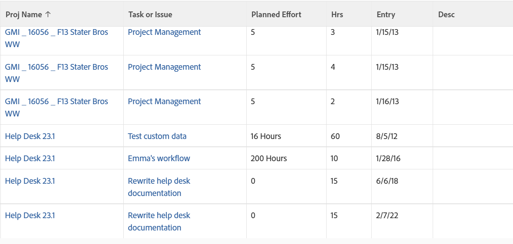

# Visualização: detalhes combinados de tarefas e problemas em uma lista de Horas

<!--Audited:11/2024-->

Esta exibição de hora combina as colunas Nome da Tarefa e Problema, bem como as Horas Planejadas da Tarefa e Problema usando a marca `sharecol`. Como uma entrada de hora só pode pertencer a uma tarefa ou problema, ambos os objetos não podem aparecer na mesma coluna ao mesmo tempo. Cada linha da visualização é preenchida com as informações de uma Tarefa ou um Problema.

Para saber mais sobre a marca `sharecol`, consulte [Exibir: mesclar informações de várias colunas em uma coluna compartilhada](../../../reports-and-dashboards/reports/custom-view-filter-grouping-samples/view-merge-columns.md).



## Requisitos de acesso

+++ Expanda para visualizar os requisitos de acesso para a funcionalidade neste artigo. 

<table style="table-layout:auto"> 
 <col> 
 <col> 
 <tbody> 
  <tr> 
   <td role="rowheader">Pacote do Adobe Workfront</td> 
   <td> <p>Qualquer</p> </td> 
  </tr> 
  <tr> 
   <td role="rowheader">Licença do Adobe Workfront</td> 
   <td> 
   <p>Colaborador ou Solicitação para modificar um filtro </p>
   <p>Padrão ou Plano para modificar um relatório</p>
  </tr> 
  <tr> 
   <td role="rowheader">Configurações de nível de acesso</td> 
   <td> <p>Editar acesso a relatórios, painéis e calendários para modificar um relatório</p> <p>Editar acesso a Filtros, Visualizações, Agrupamentos para modificar um filtro</p> </td> 
  </tr> 
  <tr> 
   <td role="rowheader">Permissões de objeto</td> 
   <td> <p>Gerenciar permissões para um relatório</p>  </td> 
  </tr> 
 </tbody> 
</table>

Para obter mais detalhes sobre as informações nesta tabela, consulte [Requisitos de acesso na documentação do Workfront](/help/quicksilver/administration-and-setup/add-users/access-levels-and-object-permissions/access-level-requirements-in-documentation.md).

+++

## Exibir detalhes combinados de tarefas e problemas em uma lista de Horas

1. Ir para uma lista de horas.
1. No menu suspenso **Exibir**, clique em **Nova Exibição**.
1. Na área **Visualização da coluna**, elimine todas as colunas, exceto uma.
1. Clique no cabeçalho da coluna restante e em **Alternar para Modo de Texto** > **Editar Modo de Texto**.
1. Remova o texto localizado na caixa **Editar Modo de Texto** e substitua-o pelo seguinte código:

   ```
   column.1.querysort=project:name
   column.1.shortview=false
   column.1.stretch=0
   column.1.valuefield=project:name
   column.1.valueformat=HTML
   column.1.width=100
   column.2.description=Task or Issue
   column.2.link.linkproperty.0.name=ID
   column.2.link.linkproperty.0.valuefield=task:ID
   column.2.link.linkproperty.0.valueformat=int
   column.2.link.lookup=link.view
   column.2.link.valuefield=task:objCode
   column.2.link.valueformat=val
   column.2.linkedname=task
   column.2.listsort=nested(task).string(name)
   column.2.name=Task or Issue
   column.2.querysort=task:name
   column.2.sharecol=true
   column.2.shortview=false
   column.2.stretch=0
   column.2.valuefield=task:name
   column.2.valueformat=HTML
   column.2.width=100
   column.3.descriptionkey=optask
   column.3.link.linkproperty.0.name=ID
   column.3.link.linkproperty.0.valuefield=opTask:ID
   column.3.link.linkproperty.0.valueformat=int
   column.3.link.lookup=link.view
   column.3.link.valuefield=opTask:objCode
   column.3.link.valueformat=val
   column.3.linkedname=optask
   column.3.listsort=nested(opTask).string(name)
   column.3.namekey=opTask
   column.3.querysort=opTask:name
   column.3.shortview=false
   column.3.stretch=0
   column.3.valuefield=opTask:name
   column.3.valueformat=HTML
   column.3.width=1
   column.4.valuefield=task:work
   column.4.sharecol=true
   column.4.linkedname=task
   column.4.valueformat=doubleAsInt
   column.4.namekey=view.relatedcolumn
   column.4.querysort=task:work
   column.4.textmode=true
   column.4.namekeyargkey.0=task
   column.4.namekeyargkey.1=work
   column.4.displayname=Planned Effort
   column.5.displayname=Planned Effort
   column.5.viewalias=opTask:workrequired
   column.5.linkedname=opTask
   column.5.valuefield=opTask:workRequired
   column.5.valueformat=compound
   column.5.querysort=opTask:workRequired
   column.5.namekeyargkey.0=opTask
   column.5.namekeyargkey.1=workrequired
   column.5.namekey=view.relatedcolumn
   column.5.textmode=true
   column.6.descriptionkey=hours
   column.6.linkedname=direct
   column.6.listsort=doubleAsDouble(hours)
   column.6.namekey=hours.abbr
   column.6.querysort=hours
   column.6.shortview=false
   column.6.stretch=0
   column.6.valuefield=hours
   column.6.valueformat=doubleAsString
   column.6.width=75
   column.7.descriptionkey=entrydate
   column.7.linkedname=direct
   column.7.listsort=atDateAsAtDate(entryDate)
   column.7.namekey=entrydate.abbr
   column.7.querysort=entryDate
   column.7.shortview=false
   column.7.stretch=0
   column.7.valuefield=entryDate
   column.7.valueformat=atDate
   column.7.width=75
   column.8.descriptionkey=description
   column.8.linkedname=direct
   column.8.listsort=string(description)
   column.8.namekey=description.abbr
   column.8.querysort=description
   column.8.shortview=false
   column.8.stretch=0
   column.8.valuefield=description
   column.8.valueformat=HTML
   column.8.width=150
   ```

1. Clique em **Concluído** > **Salvar exibição**.
1. (Opcional) Atualize o nome da exibição e clique em **Salvar exibição**.
