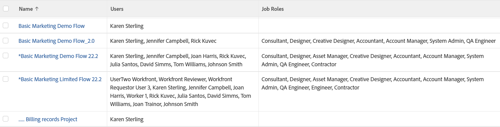

# Exibição: projeto com todos os usuários e funções da equipe do projeto

<!--Audited: 11/2024-->

Este modo de exibição de projeto mostra uma lista de usuários e funções de trabalho atribuídas à equipe do projeto.

>[!NOTE]
>
>Se a função de trabalho estiver listada na mesma linha que um usuário, isso não significa que o usuário está preenchendo essa função no projeto nem que o usuário recebe essa função em seu perfil.

## Requisitos de acesso

+++ Expanda para visualizar os requisitos de acesso da funcionalidade neste artigo.

<table style="table-layout:auto"> 
 <col> 
 <col> 
 <tbody> 
  <tr> 
   <td role="rowheader">Pacote do Adobe Workfront</td> 
   <td> 
Qualquer
 </td> 
  </tr> 
  <tr> 
   <td role="rowheader">Licença do Adobe Workfront</td> 
   <td> 
   
Colaborador ou Solicitação de modificação de uma exibição 

   
Padrão ou Plano para modificar um relatório

  </tr> 
  <tr> 
   <td role="rowheader">Configurações de nível de acesso</td> 
   <td> 
Acesso de edição a relatórios, painéis e calendários para modificar um relatório
 
Acesso de edição a filtros, visualizações, agrupamentos para modificar uma visualização
 </td> 
  </tr> 
  <tr> 
   <td role="rowheader">Permissões de objeto</td> 
   <td> 
Gerenciar permissões para um relatório
  </td> 
  </tr> 
 </tbody> 
</table>

Para obter mais detalhes sobre as informações contidas nesta tabela, consulte [Requisitos de acesso na documentação do Workfront](/help/quicksilver/administration-and-setup/add-users/access-levels-and-object-permissions/access-level-requirements-in-documentation.md).

+++

## Exibir um projeto com todos os usuários e funções da equipe do projeto

1. Ir para uma lista de projetos.
1. No menu suspenso **Exibição**, selecione **Nova Exibição**.

1. Na área **Visualização de coluna**, elimine todas as colunas, exceto uma.
1. Clique no cabeçalho da coluna restante e clique em **Alternar para o Modo de Texto** > **Editar Modo de Texto**.
1. Remova o texto encontrado na caixa **Editar Modo de Texto** e substitua-o pelo seguinte código:

   <pre>column.0.link.linkproperty.0.name=ID column.0.link.linkproperty.0.valuefield=ID column.0.link.linkproperty.0.valueformat=int column.0.link.lookup=link.view column.0.link.valuefield=objCode column.0.link.valueformat=val column.0.linkedname=direct column.0.listsort=string(name) column.0.namekey name.abbr column.0.querysort=name column.0.shortview=false column.0.stretch=60 column.0.valuefield=name column.0.valueformat=HTML column.0.width=150 column.1.description=Equipe Usuários column.1.link.linkproperty.0.name=ID column.1.link.linkproperty.0.valuefield=userID column.1.link.linkproperty.0.valueformat=int column.1.link.page=/userView.cmd column.1.listdelimiter= column.1.listmethod=nested(projectUsers).lists column.1.namekey=user.column column.column.2 1.valueformat=HTML HTML column.1.width=150 column.2.description=Equipe Roles column.2.link.linkproperty.0.name=ID column.2.link.linkproperty.0.valuefield=ID column.2.link.linkproperty.0.valueformat=int column.2.link.page=/roleView.cmd column.2.listdelimiter= column.2.listmethod=nested(roles).lists column.2.namekey=jobrole.plural column.itercolumn.2       </pre>

1. Clique em **Concluído** > **Salvar Exibição**.
