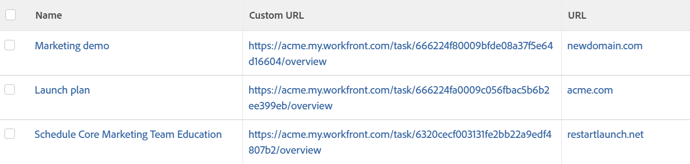

# Exibição: URL externo usando campo de dados personalizado

É possível exibir um link para um URL personalizado interno usando um **Campo personalizado calculado** chamado &quot;URL personalizado&quot; em uma **Exibição da Tarefa**.

Isso ajuda você a se vincular rapidamente de determinados objetos em uma exibição a determinadas áreas do aplicativo diretamente dos seus relatórios.

Ao criar um campo personalizado calculado, primeiro crie o campo e, em seguida, crie a Exibição.

As seções a seguir são um exemplo de um campo personalizado calculado para tarefas. O campo personalizado é chamado de URL personalizado. A exibição personalizada exibe o valor do campo, bem como a variável **URL** para tarefas.

Usando as mesmas etapas, você pode criar campos personalizados calculados semelhantes e exibições personalizadas para todos os objetos no sistema que têm um Formulário personalizado.

## Requisitos de acesso

Você deve ter o seguinte acesso para executar as etapas deste artigo:

<table style="table-layout:auto"> 
 <col> 
 <col> 
 <tbody> 
  <tr> 
   <td role="rowheader">plano do Adobe Workfront*</td> 
   <td> <p>Qualquer Um</p> </td> 
  </tr> 
  <tr> 
   <td role="rowheader">Licença da Adobe Workfront*</td> 
   <td> <p>Solicitação para modificar uma exibição </p>
   <p>Planejar a modificação de um relatório</p> </td> 
  </tr> 
  <tr> 
   <td role="rowheader">Configurações de nível de acesso*</td> 
   <td> <p>Editar acesso a relatórios, painéis e calendários para modificar um relatório</p> <p>Editar acesso a Filtros, Visualizações, Agrupamentos para modificar uma visualização</p> <p><b>Nota</b>

Se você ainda não tiver acesso, pergunte ao administrador do Workfront se ele definiu restrições adicionais em seu nível de acesso. Para obter informações sobre como um administrador do Workfront pode modificar seu nível de acesso, consulte <a href="../../../administration-and-setup/add-users/configure-and-grant-access/create-modify-access-levels.md" class="MCXref xref">Criar ou modificar níveis de acesso personalizados</a>.</p> </td>
</tr>  
  <tr> 
   <td role="rowheader">Permissões de objeto</td> 
   <td> <p>Gerenciar permissões para um relatório</p> <p>Para obter informações sobre como solicitar acesso adicional, consulte <a href="../../../workfront-basics/grant-and-request-access-to-objects/request-access.md" class="MCXref xref">Solicitar acesso a objetos </a>.</p> </td> 
  </tr> 
 </tbody> 
</table>

&#42;Para descobrir seu plano, tipo de licença ou acesso, entre em contato com o administrador do Workfront.

## Crie o campo personalizado calculado &quot;URL personalizado&quot;

Para obter informações sobre como criar um campo personalizado calculado, consulte o artigo [Adicionar dados calculados a um formulário personalizado](../../../administration-and-setup/customize-workfront/create-manage-custom-forms/add-calculated-data-to-custom-form.md).

Se você tiver acesso para criar um formulário personalizado, poderá criar um campo personalizado calculado para tarefas chamadas &quot;URL personalizado&quot;. Este campo está vinculado diretamente ao campo **Visão geral** subguia dentro da **Detalhes da tarefa** guia.

1. Crie um campo personalizado calculado.
1. No campo Calculation, insira o seguinte código:

   CONCAT(&#39;&#39;https://`<domain>`.my.workfront.com&quot;,&quot;/&quot;,&quot;task/&quot;,ID,&quot;/overview&#39;&#39;)

1. Substituir &quot;`<domain>`&quot; com o nome de domínio real, sem os colchetes.

   O

   ```
   /overview
   ```

   parte desse URL direciona o link para o **Visão geral** no painel esquerdo da tarefa.

1. Depois de criar o **Campo personalizado calculado**, anexe o **Formulário personalizado** com esse campo para várias tarefas no Adobe Workfront que você deseja exibir na nova visualização.

## Crie a exibição que mostra os campos &quot;URL personalizado&quot; e &quot;URL&quot; da tarefa

A tarefa **Exibir** no exemplo abaixo exibe o **Campo personalizado calculado** chamado de &quot;URL personalizado&quot; como um link direto para o **Visão geral** subguia na tarefa **Detalhes** , bem como a **URL** da tarefa.



Para personalizar esta exibição:

1. Ir para uma lista de tarefas.
1. Expanda a **Exibir** na parte superior da lista de tarefas.
1. Clique em **Personalizar visualização**.
1. Remova todas as colunas da exibição, exceto a primeira coluna.
1. Clique no cabeçalho da primeira coluna.
1. Clique em **Alternar para modo de texto** no canto superior direito da interface.
1. Clique em **Clique para editar o texto**.
1. Cole o modo de texto abaixo em uma coluna.\
   Neste exemplo, a &#39;column.1.&#39; exibe o valor no campo &quot;URL personalizado&quot; como um link na variável **Visão geral**. &#39;Coluna.2.&#39; exibe o valor armazenado na variável **Campo de URL** da tarefa.
   <pre>column.0.descriptionkey=name<br>column.0.link.linkproperty.0.name=ID<br>column.0.link.linkproperty.0.valuefield=ID<br>column.0.link.linkproperty.0.valueformat= int<br>column.0.link.lookup=link.view<br>column.0.link.valuefield= objCode<br>column.0.link.valueformat= val<br>column.0.linkedname=direct<br>column.0.listsort=string(name)<br>column.0.namekey=name.abbr<br>column.0.querysort=name<br>column.0.shortview=false<br>column.0.stretch=100<br>column.0.valuefield=nome<br>column.0.valueformat=HTML<br>column.0.width=150<br>column.1.description=URL personalizado<br>column.1.link.isnewwindow=true<br>column.1.link.url=customDataLabelsAsString(URL Personalizado)<br>column.1.linkedname=direct<br>column.1.listsort=customDataLabelsAsString(URL Personalizado)<br>column.1.name=URL personalizado<br>column.1.querysort=URL<br>column.1.shortview=false<br>column.1.stretch=0<br>column.1.valuefield=URL Personalizado<br>column.1.valueformat=customDataLabelsAsString<br>column.1.width=150<br>column.2.descriptionkey=url<br>column.2.linkedname=direct<br>column.2.listsort=string(URL)<br>column.2.namekey=url.abbr<br>column.2.querysort=URL<br>column.2.shortview=false<br>column.2.stretch=0<br>column.2.valuefield=URL<br>column.2.valueformat=HTML<br>column.2.width=150</pre>

1. Clique em **Salvar visualização**.
