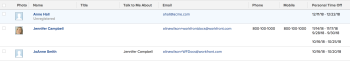

# Exibir: tempo de folga pessoal do usuário

<!--

(NOTE: consider hiding this article because this is not a custom view anymore.)

-->

Você pode criar um relatório de Folga para capturar as informações de folga dos usuários.

## Requisitos de acesso

Você deve ter o seguinte acesso para executar as etapas deste artigo:

<table style="table-layout:auto"> 
 <col> 
 <col> 
 <tbody> 
  <tr> 
   <td role="rowheader">plano do Adobe Workfront*</td> 
   <td> 
Qualquer Um
 </td> 
  </tr> 
  <tr> 
   <td role="rowheader">Licença da Adobe Workfront*</td> 
   <td> 
Solicitação para modificar uma exibição 

   
Planejar a modificação de um relatório
 </td> 
  </tr> 
  <tr> 
   <td role="rowheader">Configurações de nível de acesso*</td> 
   <td> 
Editar acesso a relatórios, painéis e calendários para modificar um relatório
 
Editar acesso a Filtros, Visualizações, Agrupamentos para modificar uma visualização
 
<b>Nota</b>

Se você ainda não tiver acesso, pergunte ao administrador do Workfront se ele definiu restrições adicionais em seu nível de acesso. Para obter informações sobre como um administrador do Workfront pode modificar seu nível de acesso, consulte <a href="../../../administration-and-setup/add-users/configure-and-grant-access/create-modify-access-levels.md" class="MCXref xref">Criar ou modificar níveis de acesso personalizados</a>.
 </td>
</tr>  
  <tr> 
   <td role="rowheader">Permissões de objeto</td> 
   <td> 
Gerenciar permissões para um relatório
 
Para obter informações sobre como solicitar acesso adicional, consulte <a href="../../../workfront-basics/grant-and-request-access-to-objects/request-access.md" class="MCXref xref">Solicitar acesso a objetos </a>.
 </td> 
  </tr> 
 </tbody> 
</table>

&#42;Para descobrir seu plano, tipo de licença ou acesso, entre em contato com o administrador do Workfront.

## Exibir tempo de folga pessoal do usuário

1. Clique em **Menu principal** ícone  no canto superior direito e clique em **Relatórios > Novo relatório**.

1. No menu suspenso, selecione **Folga**.
1. Clique em **Salvar + Fechar**.

   O relatório exibe os seguintes campos na exibição por padrão:

   | Usuário | O nome do usuário que indicou a folga em seu perfil. |
   |---|---|
   | Data de início | A Data inicial do período de folga indicado pelo usuário. |
   | Data Final | A Data final do período de folga indicado pelo usuário. |

   {style="table-layout:auto"}

1. (Opcional) Conclua a criação do relatório editando qualquer uma das guias a seguir:

   * Colunas (visualizar)
   * Agrupamento
   * Filtros
   * Gráfico

   Para obter informações sobre como criar relatórios, consulte o artigo [Criar um relatório personalizado](../../../reports-and-dashboards/reports/creating-and-managing-reports/create-custom-report.md).

   >[!TIP]
   >
   >Recomendamos adicionar um agrupamento para o objeto do usuário, para facilitar a leitura do relatório.

<!--
<h2 data-mc-conditions="QuicksilverOrClassic.Draft mode">Add Time Off information to a user report</h2>
-->

<!--

(NOTE: old way of doing this, not working anymore)

-->

<!--

To add a column to a user view or report to display a list of future days which have been marked for time off by users:

-->

<!--

  

-->

<!--
   <li value="1" data-mc-conditions="QuicksilverOrClassic.Draft mode">  Click the <strong>Main Menu</strong> icon  in the upper-right corner, then click&nbsp;<strong>Reports > New Report.</strong> </li>
   -->

<!--
   <li value="2" data-mc-conditions="QuicksilverOrClassic.Draft mode">From the&nbsp;<strong>New Report</strong> drop-down menu, select&nbsp;<strong>User Report</strong>.</li>
   -->

<!--
   <li value="3" data-mc-conditions="QuicksilverOrClassic.Draft mode">Click <strong>Add Column</strong>.</li>
   -->

<!--
   <li value="4" data-mc-conditions="QuicksilverOrClassic.Draft mode">From the <strong>View</strong> drop-down menu, select <strong>New View</strong>.</li>
   -->

<!--
   <li value="5" data-mc-conditions="QuicksilverOrClassic.Draft mode">Click the header of the new column, then click<strong>Switch to Text Mode</strong>.</li>
   -->

<!--
   <li value="6" data-mc-conditions="QuicksilverOrClassic.Draft mode">Mouse over the text mode area, and click <strong>Click to edit text</strong>.</li>
   -->

<!--
   <li value="7" data-mc-conditions="QuicksilverOrClassic.Draft mode">Remove the text you find in the <strong>Text Mode</strong> box, and replace it with the following code: <!--
   <pre data-mc-conditions="QuicksilverOrClassic.Draft mode">displayname=Personal Time Off listdelimiter= listmethod=nested(reservedTimes).lists name=Upcoming Time Off stretch=0 textmode=true type=iterate valueexpression=IF({startDate}>$$TODAY,CONCAT({startDate}," - ",{endDate}),'') valueformat=HTML width=150</pre>
   </li>
   -->

<!--
   <li value="8" data-mc-conditions="QuicksilverOrClassic.Draft mode"> Click <strong>Save</strong>+<strong>Close</strong>.</li>
   -->
