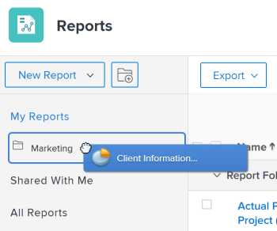

# Acessar e organizar relatórios

Você pode usar relatórios no Adobe Workfront para revisar ou editar informações sobre objetos no sistema. Você pode criar seus próprios relatórios, organizar os relatórios que criar e exibir relatórios que foram compartilhados com você ou compartilhados publicamente.

## Requisitos de acesso

Você deve ter o seguinte acesso para executar as etapas neste artigo:

<table style="table-layout:auto"> 
 <col> 
 <col> 
 <tbody> 
  <tr> 
   <td role="rowheader">Plano Adobe Workfront*</td> 
   <td> 
Qualquer Um
 </td> 
  </tr> 
  <tr> 
   <td role="rowheader">Licença da Adobe Workfront*</td> 
   <td> 
Plano 
 </td> 
  </tr> 
  <tr> 
   <td role="rowheader">Configurações de nível de acesso*</td> 
   <td> 
Editar acesso a Relatórios, Painéis, Calendários
 
Editar acesso a filtros, visualizações, agrupamentos
 
Observação: Caso ainda não tenha acesso, pergunte ao administrador do Workfront se ele definiu restrições adicionais em seu nível de acesso. Para obter informações sobre como um administrador do Workfront pode modificar seu nível de acesso, consulte <a href="../../../administration-and-setup/add-users/configure-and-grant-access/create-modify-access-levels.md" class="MCXref xref">Criar ou modificar níveis de acesso personalizados</a>.
 </td> 
  </tr> 
  <tr> 
   <td role="rowheader">Permissões de objeto</td> 
   <td> 
Gerenciar permissões de um relatório
 
Para obter informações sobre como solicitar acesso adicional, consulte <a href="../../../workfront-basics/grant-and-request-access-to-objects/request-access.md" class="MCXref xref">Solicitar acesso a objetos </a>.
 </td> 
  </tr> 
 </tbody> 
</table>

&#42;Para descobrir qual plano, tipo de licença ou acesso você tem, entre em contato com o administrador da Workfront.

## Exibir relatórios

Para acessar relatórios que você criou ou que foram compartilhados com você ou compartilhados publicamente:

1. No **Menu principal** , clique em **Relatórios**.

1. Clique em uma das seguintes opções, dependendo do relatório que deseja visualizar:

   * Clique em **Meus relatórios** para exibir relatórios que você criou.
   * Clique em **Compartilhado comigo** para visualizar relatórios que outras pessoas compartilharam com você.
   * Clique em **Todos os relatórios** para exibir ambos os relatórios que você criou e aqueles que foram compartilhados com você ou compartilhados publicamente.

## Organizar relatórios criados

Você pode usar pastas para organizar os relatórios que criar. Não é possível organizar relatórios que foram compartilhados com você, compartilhados publicamente ou relatórios do sistema.

* [Criar uma nova pasta para relatórios](#create-a-new-folder-for-reports)
* [Adicionar relatórios a uma pasta](#add-reports-to-a-folder)

### Criar uma nova pasta para relatórios {#create-a-new-folder-for-reports}

1. No **Menu principal** , clique em **Relatórios**.

1. Clique no botão **Nova pasta** ícone .\
   

1. Especifique um nome para a nova pasta e pressione Enter.
1. No **Meus relatórios** , adicione relatórios à nova pasta.\
   Para obter informações sobre como adicionar um relatório a uma nova pasta, consulte o [Adicionar relatórios a uma pasta](#add-reports-to-a-folder) neste artigo.

   >[!NOTE]
   >
   >Você só pode adicionar novas pastas ao **Meus relatórios** pasta. Não é possível adicionar novas pastas ou relatórios ao **Compartilhado comigo** ou **Todos os relatórios** pastas.

### Adicionar relatórios a uma pasta {#add-reports-to-a-folder}

1. No **Menu principal** , clique em **Relatórios**.

1. Clique em **Meus relatórios**.\
   Ou\
   Clique em qualquer pasta aninhada na **Meus relatórios** pasta.

1. Arraste um relatório da lista de relatórios para a pasta onde deseja que ele fique e solte-o ao acessar a pasta.

   >[!NOTE]
   >
   >Você só pode mover relatórios do **Meus relatórios** pasta para outras pastas aninhadas em **Meus relatórios**. Não é possível mover relatórios de ou para a **Compartilhado comigo** ou **Todos os relatórios** pasta para ou de outras pastas.

   
