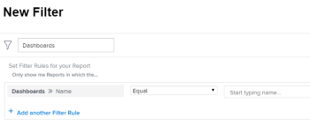

# Entenda como organizar relatórios em um painel

## Acessar informações do painel em uma lista de relatórios

Você pode ver se um relatório é adicionado a um painel no Adobe Workfront. Isso pode ser útil para decidir quais relatórios podem ser mantidos e quais podem ser excluídos do sistema. Se os relatórios estiverem em painéis, os usuários ainda poderão depender deles. Recomendamos não excluir relatórios listados em painéis que os usuários estão usando.\
Para obter mais informações sobre como adicionar relatórios a painéis, consulte o artigo [Adicionar um relatório a um painel](../../../reports-and-dashboards/dashboards/creating-and-managing-dashboards/add-report-dashboard.md).

Você pode ver se um relatório é adicionado a um painel de instrumentos seguindo um destes procedimentos:

* Criação de uma view para uma lista de relatórios e inclusão de informações do painel nas colunas
* Filtrar uma lista de relatórios por um ou vários painéis específicos que você sabe que estão sendo usados ativamente
* Criar um relatório para o objeto de relatório e usar uma exibição ou um filtro que inclua informações do painel

Qualquer pessoa pode criar uma exibição ou um filtro, mas é necessário ter acesso de Edição a Relatórios no seu nível de acesso para criar um relatório.\
Para obter mais informações sobre o acesso a relatórios, consulte o artigo [Conceder acesso a relatórios, painéis e calendários](../../../administration-and-setup/add-users/configure-and-grant-access/grant-access-reports-dashboards-calendars.md).\
Para obter mais informações sobre como criar um relatório, consulte o artigo [Criar um relatório personalizado](../../../reports-and-dashboards/reports/creating-and-managing-reports/create-custom-report.md).

## Requisitos de acesso

+++ Expanda para visualizar os requisitos de acesso da funcionalidade neste artigo. 

<table style="table-layout:auto"> 
 <col> 
 <col> 
 <tbody> 
  <tr> 
   <td role="rowheader">Pacote do Adobe Workfront</td> 
   <td> 
Qualquer
 </td> 
  </tr> 
  <tr> 
   <td role="rowheader">Licença do Adobe Workfront</td> 
   <td> 
   
Padrão

   
Plano 
 </td> 
  </tr> 
  <tr> 
   <td role="rowheader">Configurações de nível de acesso</td> 
   <td> 
Acesso de edição a relatórios, painéis e calendários
 
Editar acesso a filtros, exibições e agrupamentos
</td> 
  </tr> 
  <tr> 
   <td role="rowheader">Permissões de objeto</td> 
   <td> 
Gerenciar permissões para um relatório
</td> 
  </tr> 
 </tbody> 
</table>

Para obter mais detalhes sobre as informações contidas nesta tabela, consulte [Requisitos de acesso na documentação do Workfront](/help/quicksilver/administration-and-setup/add-users/access-levels-and-object-permissions/access-level-requirements-in-documentation.md).

+++

## Exibir informações do painel na Exibição de uma lista de relatórios

>[!WARNING]
>
>A inclusão da coluna Painéis em uma lista de relatórios pode aumentar significativamente os tempos de carregamento, especialmente em listas de relatórios longas.

Para criar uma exibição com informações do painel de controle para uma lista de relatórios:

1. Clique no ícone **Menu Principal** ícone  no canto superior direito do Workfront e clique em **Relatórios**.
1. Na lista de relatórios, clique no menu suspenso **Exibir**.
1. Clique em **Nova Exibição**.
1. Clique em **Adicionar coluna**.
1. Comece a digitar “Painéis” no campo **Comece a digitar o nome do campo**.
1. No objeto **Relatório**, selecione **Painéis**.

1. Clique em **Salvar visualização**.\
   Os painéis em que um relatório aparece são exibidos na coluna Painéis da lista de relatórios.\
   

## Filtrar uma lista de relatórios por informações do painel

Para filtrar uma lista de relatórios por informações do painel de controle:

1. Clique no ícone **Menu Principal** ícone  no canto superior direito do Workfront e clique em **Relatórios**.

1. Na lista de relatórios, clique no menu suspenso **Filtro**.
1. Clique em **Novo Filtro** e em **Adicionar uma Regra de Filtro**.

1. Comece a digitar “Painéis” no campo **Comece a digitar o nome do campo**.

1. No objeto **Painéis**, selecione **Nome**.

1. Selecione **Igual** no menu suspenso do modificador e comece a digitar o nome do painel pelo qual deseja filtrar. Você pode selecionar vários painéis para o filtro.\
   

1. Clique em **Salvar + Fechar**.\
   Isso exibe uma lista de relatórios que estão listados apenas nos painéis especificados.\
   Você também pode criar um relatório para o objeto de relatório e usar esse filtro no relatório.
