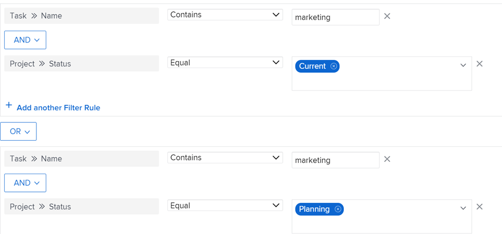

# Criar ou editar filtros no Adobe Workfront

<!--Audited: 12/2023-->

É possível limitar a quantidade de informações exibidas na tela em uma lista de itens com um filtro. Você pode definir determinados critérios com base em informações específicas sobre um objeto e exibir somente os objetos que atendem a esses critérios.

Você pode aplicar os seguintes tipos de filtros no Adobe Workfront:

* Filtros rápidos em uma lista de objetos para localizar um item usando uma palavra-chave. Esses são filtros temporários que não podem ser salvos para uso futuro.

  Para obter informações sobre filtros rápidos, consulte [Aplicar o filtro rápido a uma lista](../../../workfront-basics/navigate-workfront/use-lists/apply-quick-filter-list.md).

* Filtros permanentes que você pode salvar e usar várias vezes em várias listas e relatórios. Este artigo descreve como criar um filtro permanente ou editar um filtro existente em uma lista ou relatório.

* Filtros em outras áreas do Workfront, fora de listas e relatórios.

  Para obter uma lista de todos os filtros no Workfront e as áreas em que eles podem ser aplicados, consulte [Visão geral dos filtros](../../../reports-and-dashboards/reports/reporting-elements/filters-overview.md).

## Requisitos de acesso

Você deve ter o seguinte acesso para executar as etapas deste artigo:

<table style="table-layout:auto"> 
 <col> 
 <col> 
 <tbody> 
  <tr> 
   <td role="rowheader"><strong>plano do Adobe Workfront*</strong></td> 
   <td> 
Qualquer
 </td> 
  </tr> 
  <tr> 
   <td role="rowheader"><strong>Licença da Adobe Workfront*</strong></td> 
   <td> 
Novo: Colaborador ou superior

Ou

Atual: solicitação ou superior

<b>NOTA:</b>

Para editar um filtro em um relatório, você deve ter a seguinte licença:

Novo: Padrão

Ou

Atual: Plano

</td> 
  </tr> 
  <tr> 
   <td role="rowheader"><strong>Configurações de nível de acesso*</strong></td> 
   <td> <ul><li>
Editar acesso a Filtros, Visualizações e Agrupamentos
</li></ul>
    
<b>NOTA:</b>

   Para editar um filtro em um relatório, você deve ter a seguinte configuração de nível de acesso, além de Editar acesso a Filtros, Visualizações e Agrupamentos:

<ul><li>
Editar acesso a relatórios, painéis e calendários
</li></ul>

<b>NOTA:</b>
 
 Se você não tiver acesso, pergunte ao administrador do Workfront se ele definiu restrições adicionais em seu nível de acesso. Para obter informações sobre como um administrador do Workfront pode modificar seu nível de acesso, consulte <a href="../../../administration-and-setup/add-users/configure-and-grant-access/create-modify-access-levels.md" class="MCXref xref">Criar ou modificar níveis de acesso personalizados</a>.
 </td> 
  </tr> 
  <tr> 
   <td role="rowheader"><strong>Permissões de objeto</strong></td> 
   <td> 
Gerenciar permissões para um filtro
 
Para obter informações sobre como solicitar acesso adicional, consulte <a href="../../../workfront-basics/grant-and-request-access-to-objects/request-access.md" class="MCXref xref">Solicitar acesso a objetos </a>.
 </td> 
  </tr> 
 </tbody> 
</table>

&#42;Para descobrir seu plano, tipo de licença ou acesso, entre em contato com o administrador do Workfront.

## Tipos de interfaces de construção de filtros

Você pode criar filtros usando os tipos de construtores de filtros descritos na tabela abaixo:

<table style="table-layout:auto">
<col>
<col>
<col>
<tbody>
<tr>
<td><strong>Tipo de construtor</strong></td>
<td><strong>Filtrar objeto</strong></td>
<td><strong>Quando disponível</strong></td>
</tr>
<tr>
<td>Construtor padrão</td>
<td>
<ul>
<li> 
Projetos
 </li>
<li> 
Tarefas 
 </li>
<li> 
Problemas
 </li>
<li> 
Portfólios
 </li>
<li> 
Programas
 </li>
<li> 
Usuários
 </li>
<li> 
Modelos
 </li>
<li> 
Grupos
 </li>
</ul>
</td>
<td>
<ul>
<li> 
Listas 
 </li>
</ul>
<ul>
<li> 
A lista de Projetos no Planejador de cenários
 
O Planejador de cenários requer uma licença adicional. Para obter informações sobre o Planejador de cenários do Workfront, consulte <a href="../../../scenario-planner/scenario-planner-overview.md">A visão geral do Planejador de cenários</a>. 
 </li>
</ul>

<b>NOTA:</b>
 
Os construtores padrão para filtros não estão disponíveis nos relatórios.
</td>
</tr>
<tr>
<td>Construtor herdado</td>
<td>Todos os objetos </td>
<td>Listas e relatórios</td>
</tr>
</tbody>
</table>

Para obter informações sobre objetos do Workfront, consulte [Entender objetos no Adobe Workfront](/help/quicksilver/workfront-basics/navigate-workfront/workfront-navigation/understand-objects.md).

Considere o seguinte ao criar filtros usando as diferentes interfaces:

* Você pode encontrar o construtor padrão nos mesmos locais em que encontra a interface de filtro herdada para as áreas listadas na tabela acima.
* O construtor padrão é a experiência padrão para todas as áreas em que está disponível. Para alternar para o construtor de filtros herdado, clique no link **Mais** menu ao lado de [!UICONTROL **Filtros**] e selecione [!UICONTROL **Voltar aos filtros legados**].

  

* Os filtros salvos estão disponíveis em ambos os construtores, independentemente da experiência usada para criá-los originalmente. Por exemplo, se você criou um filtro usando o construtor herdado do, também é possível localizá-lo e modificá-lo na interface do construtor padrão.

  >[!TIP]
  >
  >Um filtro &quot;Todos&quot; não está incluído no construtor padrão, pois todos os itens da lista são exibidos quando nenhum filtro é aplicado. Clique em [!UICONTROL **Limpar tudo**] na parte superior direita do construtor para limpar todos os filtros ativos e exibir todos os itens. Se [!UICONTROL **Limpar tudo**] estiver esmaecida e nenhum filtro for aplicado.

* Os construtores padrão e herdados têm uma sintaxe ligeiramente diferente ao construir filtros de várias instruções que combinam os operadores AND e OR. Como resultado, esses filtros podem ser exibidos de forma diferente ao alternar de um construtor para outro.

  >[!INFO]
  >
  >Existe o seguinte cenário:
  >
  >1. Use o construtor padrão para criar um filtro que tenha a seguinte sintaxe:
  >
  >      `(A OR B) AND C`
  >
  >1. Alterne para o construtor herdado e edite o filtro usando a sintaxe do construtor herdado, conforme descrito na seção [Criar ou editar um filtro no construtor herdado](#create-filter-in-legacy-builder) neste artigo. A sintaxe do construtor herdado exibe as instruções de filtro da seguinte maneira:
  >
  >      `A AND C`
  >      `OR`
  >      `B AND C`
  >
  >1. Faça uma alteração no filtro na interface herdada.
  >1. Volte para o construtor padrão. A instrução de filtro é exibida de acordo com a lógica suportada no construtor herdado, conforme descrito acima.
  >
  >      O filtro é exibido na interface do construtor padrão da seguinte maneira:
  >  
  >      `A AND C`
  >      `OR`
  >      `B AND C`
  > 
  >      Isso acontece porque o filtro foi modificado na interface herdada.

## Criar ou editar um filtro no construtor padrão

Você pode criar filtros usando a interface do construtor padrão das seguintes maneiras:

* Do zero
* Editar um filtro existente
* Duplicação de um filtro existente
* Duplicar um filtro existente, editá-lo e salvá-lo como um novo filtro

Criar um filtro usando a interface padrão do construtor:

1. Vá para uma lista onde deseja criar um filtro ou que contenha o filtro que deseja personalizar.
1. Clique em **Filtro** ícone  para abrir a interface do construtor.

   

1. Revise as seguintes listas de filtros:

   <table style="table-layout:auto">
   <col>
   <col>
   <tbody>
   <tr>
   <td role="rowheader"><strong>Marcado como favorito</strong></td>
   <td>Filtros que você marcou como favoritos. Quando você adiciona um filtro como favorito, seu local original é mostrado abaixo do nome do filtro e fica oculto na lista original, a menos que você o remova como favorito.</td>
   </tr>
   <tr>
   <td role="rowheader"><strong>Salvos</strong></td>
   <td>Filtros que você criou e salvou a si mesmo. Por padrão, essa lista exibe os filtros salvos na ordem em que foram salvos mais recentemente, mas os nomes dos filtros podem ser arrastados para reordenar manualmente a lista.</td>
   </tr>
   <tr>
   <td role="rowheader"><strong>Padrões do sistema</strong></td>
   <td>Filtros padrão do sistema Workfront e filtros que o administrador do Workfront adicionou à lista de filtros, no nível do sistema ou no modelo de layout.</td>
   </tr>
   <tr>
   <td role="rowheader"><strong>Compartilhado(s) comigo</strong></td>
   <td>Filtros que outras pessoas criaram e compartilharam com você ou que são compartilhados em todo o sistema.</td>
   </tr>
   </tbody>
   </table>

1. Siga um destes procedimentos:

   * Clique em **Novo filtro** para criar um filtro do zero.
   * Passe o mouse sobre um filtro existente para gerenciar e clique no link **Editar** ícone  para editá-lo.

     Ou

     Passe o mouse sobre um filtro existente para ver, clique no link **Mais** menu e clique em **Duplicar** para copiar o filtro existente e editar uma cópia.

   

1. (Condicional) Dependendo de você querer localizar objetos que correspondam a todas ou a qualquer uma das instruções em um grupo de filtros, selecione uma das seguintes opções:

   <table style="table-layout:auto">
   <col>
   <col>
   <tbody>
   <tr>
   <td role="rowheader"><strong>Incluir, se todos forem verdadeiros</strong></td>
   <td>Os objetos encontrados pelo filtro devem corresponder a todos os critérios de filtro em um grupo de filtros. Nesse caso, as instruções de filtro são conectadas pelo operador AND. Esta é a seleção padrão.</td>
   </tr>
   <tr>
   <td role="rowheader"><strong>Incluir, se algum for verdadeiro</strong></td>
   <td>Os objetos encontrados pelo filtro devem corresponder a qualquer critério de filtro em um grupo de filtros. Nesse caso, as instruções de filtro são conectadas pelo operador OR.</td>
   </tr>
   </tbody>
   </table>

   

   Para obter mais informações sobre operadores de filtro, consulte [Visão geral dos filtros](/help/quicksilver/reports-and-dashboards/reports/reporting-elements/filters-overview.md).

1. Clique no menu suspenso do campo para exibir uma lista de campos usados recentemente e os campos sugeridos para filtrar. Os campos sugeridos são exibidos atualmente na lista que você está filtrando.

   Também é possível selecionar **Procurar campos** para exibir uma lista de todos os campos pelos quais você pode filtrar. Os campos na pesquisa avançada são agrupados por categoria de objeto.

   

1. Clique no menu suspenso do modificador para selecionar um modificador. O modificador padrão é &quot;Igual a&quot;.

   Para obter mais informações, consulte [Filtro e modificadores de condição](/help/quicksilver/reports-and-dashboards/reports/reporting-elements/filter-condition-modifiers.md).

   >[!TIP]
   >
   >À medida que você cria o filtro, os resultados são exibidos imediatamente na lista. Se o painel de filtro cobrir a lista, é possível fechá-la para ver a exibição. As informações inseridas permanecem no construtor quando você abre o painel novamente.

1. Comece a digitar o valor de um campo pelo qual deseja filtrar. Por exemplo, comece digitando o nome de um problema, se você deseja filtrar por `Issue:Name`. Selecione o valor quando ele for exibido na lista.

   >[!TIP]
   >
   >Dependendo do modificador selecionado, é possível selecionar vários valores.

1. Clique em **Adicionar filtro** para selecionar outro campo, adicione um critério de filtragem à instrução de filtro.
1. (Opcional) Clique no link **Excluir** ícone  para remover instruções de filtro existentes.

   Ou

   Clique em **Limpar tudo** para limpar todos os critérios de filtragem.

1. (Opcional) Clique em **Adicionar grupo de filtros** para adicionar outro conjunto de critérios de filtragem. O operador padrão entre os conjuntos é **E**. Clique no operador para alterá-lo para **OU**.

   >[!TIP]
   >
   >Talvez você queira usar outro grupo de filtros quando quiser que os grupos sejam conectados por um operador diferente do operador em uma instrução de filtro.

   >[!INFO]
   >
   >Ao filtrar projetos que contêm &quot;marketing&quot; no nome que não estão concluídos e não estão em espera, você pode usar os seguintes grupos de filtros múltiplos:
   >`(Project: Name Contains Marketing AND Project: Percent Complete Does not equal 100)`
   >`OR`
   >`(Project: Name Contains Marketing AND Project: Status Does not equal On Hold)`
   >Nesse caso, cada instrução de filtro é conectada por um AND, e os grupos de filtros são conectados por um OR.

1. (Opcional) Clique em **Modo de texto** para continuar criando o filtro usando o modo texto.

   

   A interface do modo de texto é aberta.

   

   >[!TIP]
   >
   >Recomendamos criar o máximo possível do filtro usando a interface padrão do construtor e somente usando o modo de texto quando for necessário modificar os filtros compatíveis apenas com o modo de texto.

   Para obter mais informações sobre como criar um filtro usando a interface de modo de texto, consulte [Editar um filtro usando o modo de texto](/help/quicksilver/reports-and-dashboards/reports/text-mode/edit-text-mode-in-filter.md).

1. Clique em **Sair do modo texto** para retornar à interface do construtor padrão.

   >[!WARNING]
   >
   >Algumas instruções de modo de texto não são suportadas no construtor padrão ou na interface herdada. Sair do modo de texto quando você criar esses tipos de instruções pode gerar uma mensagem de aviso.

1. (Opcional) Clique em **Aplicar** para aplicar o filtro à lista e ver os resultados.

   Se o filtro não produzir resultados, a lista ficará vazia.

1. Clique em **Salvar como novo** para salvar o filtro para uso futuro.

   

1. Selecionar **Filtro sem título** e digite o nome do novo filtro em vez disso.

   >[!TIP]
   >
   >Nomeie o filtro para localizá-lo posteriormente. Se você não nomear o filtro, ele será chamado de Filtro sem título no sistema.

1. Selecione um ícone para o novo filtro na **Ícone** menu suspenso.

   

1. (Opcional) Adicione uma descrição para o filtro para indicar o que é exclusivo sobre ele. A descrição é exibida sob o nome do filtro na lista de filtros.

   >[!TIP]
   >
   >Clicando **Cancelar** A qualquer momento leva você de volta à área de construção do filtro.

1. Clique em **Salvar**. O filtro é salvo na lista Saved e aplicado à lista de itens.
1. (Opcional) Para mover um filtro para a lista Favoritos, passe o mouse sobre qualquer filtro na gaveta de filtros e clique no **Favorito** ícone .

   Ou

   Passe o mouse sobre qualquer filtro na gaveta de filtros, clique no menu Mais e clique em **Favorito**.

1. (Opcional) Clique no link **Empilhar filtros** botão para ativar filtros empilhados. Essa opção permite aplicar mais de um filtro salvo. As regras de filtro são aplicadas na ordem em que você as seleciona.

   >[!TIP]
   >
   >Não há limite para o número de filtros que você pode selecionar.
   >
   >Quando você seleciona vários filtros, todas as condições devem ser atendidas simultaneamente para exibir resultados correspondentes.

   

   O número de filtros selecionados é exibido ao lado do ícone de filtro na parte superior da lista de itens.

   

1. (Opcional) Siga um destes procedimentos:

   * Compartilhe o filtro com outras pessoas ou disponibilize-o em todo o sistema. Para obter mais informações, consulte [Compartilhar um filtro, uma exibição ou um agrupamento](/help/quicksilver/reports-and-dashboards/reports/reporting-elements/share-filter-view-grouping.md).

   * Exclua o filtro se ele não for mais válido ou uma duplicata. Você só pode excluir os filtros que possui. Você pode remover filtros compartilhados com você. Para obter informações, consulte [Remover filtros, visualizações e agrupamentos](/help/quicksilver/reports-and-dashboards/reports/reporting-elements/remove-filters-views-groupings.md).

## Criar ou editar um filtro no construtor herdado {#create-filter-in-legacy-builder}

Você pode criar filtros herdados em listas e relatórios das seguintes maneiras:

* Do zero
* Editar um filtro existente e salvá-lo como um novo filtro

Independentemente do método usado para criar filtros, criar um filtro do zero ou a partir de um filtro existente é semelhante.

1. Vá para uma lista ou um relatório que contenha o filtro que você deseja personalizar.
1. Clique em **Filtro** ícone .

   >[!TIP]
   >
   >O criador do relatório deve permitir que os filtros sejam editados para exibir a lista suspensa Filtro em um relatório. O filtro Padrão de relatório é aplicado a um relatório por padrão. O filtro Padrão de relatório pode ser personalizado somente quando você edita o relatório.

   

1. Clique em **Novo Filtro** na parte superior da lista de filtros.

   Ou

   Passe o mouse sobre o filtro que deseja modificar e clique no **Editar** ícone .

   O construtor para personalizar as inicializações do filtro.

1. Siga um destes procedimentos:

   * Modifique as regras de filtro existentes clicando na regra existente e selecionando uma nova opção.
   * Adicione uma regra de filtro clicando em **Adicionar outra regra de filtro**, comece digitando o nome da opção para a qual deseja adicionar uma regra no **Comece a digitar o nome do campo** e, em seguida, clique nela quando for exibida na lista suspensa.

     Os campos associados ao objeto do filtro são listados na variável **Comece a digitar o nome do campo** caixa.

   * Clique em **E** ou **OU** ao adicionar uma regra de filtro.\
     Ao adicionar regras de filtro, use os modificadores de filtro para estabelecer a condição do filtro. Para obter mais informações sobre modificadores de filtro, consulte [Filtro e modificadores de condição](../../../reports-and-dashboards/reports/reporting-elements/filter-condition-modifiers.md).

     >[!NOTE]
     >
     >Quando você conecta um grupo de instruções AND por várias instruções OR, deve repetir os campos que não estão sendo alterados entre as instruções OR de cada grupo de instruções.
     >
     >
     >
     >Ao criar um filtro para tarefas que contenham a palavra &quot;marketing&quot; e estejam em projetos com status Atual ou Planejado, você deve ter as seguintes regras de filtro:
     >
     >`Task: Name Contains Marketing`
     >`AND`
     >`Project: Status Equals Current`
     >`OR`
     >`Task: Name Contains Marketing`
     >`AND`
     >`Project: Status Equals Planning`
     >
     >Embora Task: Name Contains &quot;marketing&quot; não mude entre os dois grupos de filtros AND, ele deve ser repetido no segundo grupo.

   * Exclua uma regra de filtro existente clicando no ícone &quot;X&quot;.

1. (Opcional) Clique em **Alternar para modo de texto** para adicionar um filtro usando a interface Text Mode.

   Para obter mais informações sobre como criar um filtro usando a interface de modo de texto, consulte [Editar um filtro usando o modo de texto](../../../reports-and-dashboards/reports/text-mode/edit-text-mode-in-filter.md).

1. Clique em **Salvar Filtro** para criar um filtro ou substituir o filtro selecionado pelas suas alterações.

   Ou

   Clique em **Salvar como novo filtro** para criar um filtro a partir do filtro selecionado.

   O novo filtro é exibido na lista de filtros e é aplicado automaticamente à lista ou ao relatório selecionado.

1. (Opcional) Siga um destes procedimentos:

   * Compartilhe filtros que você cria com outros usuários ou disponibilize-os em todo o sistema. Para obter informações, consulte [Compartilhar um filtro, uma exibição ou um agrupamento](/help/quicksilver/reports-and-dashboards/reports/reporting-elements/share-filter-view-grouping.md).
   * Remova os filtros que não deseja mais exibir na lista. Para obter informações, consulte [Remover filtros, visualizações e agrupamentos](/help/quicksilver/reports-and-dashboards/reports/reporting-elements/remove-filters-views-groupings.md).

