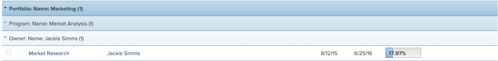

# Visão geral de agrupamentos no Adobe Workfront

<!-- Audited: 11/2024 -->

<!--(NOTE: This article was supposed to be replaced by "Groupings overview", but decided to keep this here because this is linked in too many places. "Create groupings" and "Edit existing groupings" have been added also (with videos) to replace portions of the old content here.)-->

É possível adicionar agrupamentos para gerenciar o layout das informações nos relatórios e listas.

Você pode adicionar agrupamentos aos relatórios das seguintes maneiras:

* Você pode criar agrupamentos editando os agrupamentos existentes.

  Para obter informações sobre como personalizar um agrupamento existente, consulte [Editar agrupamentos existentes](../../../reports-and-dashboards/reports/reporting-elements/edit-existing-groupings.md).

* É possível criar agrupamentos do zero.

  Para obter informações sobre como criar um agrupamento do zero, consulte [Criar agrupamentos no Adobe Workfront](../../../reports-and-dashboards/reports/reporting-elements/create-groupings.md).

Por padrão, os agrupamentos são mostrados em um destaque cinza no relatório ou lista. Os resultados do relatório ou da lista são listados em seu agrupamento individual, sem destaque.

Você pode adicionar até três agrupamentos em um relatório. Você pode organizar suas informações com até quatro agrupamentos criando um relatório de matriz. Para obter mais informações sobre relatórios de matriz, consulte [Criar um relatório de matriz](../../../reports-and-dashboards/reports/creating-and-managing-reports/create-matrix-report.md).

O número entre parênteses após o nome do agrupamento representa o número de resultados sob esse agrupamento. Se o seu relatório abrange várias páginas, certifique-se de exibir *Todos* os resultados no relatório ou lista para obter uma contagem precisa dos resultados em cada agrupamento.

Considere o seguinte ao trabalhar com agrupamentos:

* Você pode personalizar as informações em agrupamentos existentes. Todos os usuários que podem exibir os agrupamentos também podem ver suas alterações.
* O administrador do Workfront deve conceder acesso a Editar filtros, visualizações e agrupamentos para criar agrupamentos.

  Para obter informações sobre como conceder acesso a Filtros, Modos de Exibição e Agrupamentos, consulte [Conceder acesso a filtros, modos de exibição e agrupamentos](../../../administration-and-setup/add-users/configure-and-grant-access/grant-access-fvg.md).

* O nível de permissões para um agrupamento determina como ele é salvo. Se você criou o agrupamento originalmente, é possível salvar as alterações, caso contrário, será solicitado que você salve uma versão do agrupamento. Se você fizer alterações em um agrupamento que compartilhou com outras pessoas, elas também serão afetadas.
* Você pode personalizar um agrupamento que foi compartilhado com você somente se o usuário que o compartilhou tiver concedido acesso de Gerenciamento. Para obter informações sobre como compartilhar um agrupamento, consulte [Compartilhar um filtro, exibição ou agrupamento](../../../reports-and-dashboards/reports/reporting-elements/share-filter-view-grouping.md).
* Não é possível editar um agrupamento em linha.
* Não é possível agrupar por campos personalizados de seleção múltipla (por exemplo, caixas de seleção) ou por campos que podem ter vários valores (por exemplo, Gerenciador de recursos).

## Informações adicionais sobre agrupamentos

Você pode gerenciar ainda mais as informações do relatório ao usar Agrupamentos agregando os valores em cada coluna na linha Agrupamento, bem como classificar suas informações pelo campo do Agrupamento. Você também pode remover um agrupamento quando ele não é mais necessário.

* [Valores agregados em agrupamentos](#aggregate-values-in-groupings)
* [Classificar por um agrupamento](#sort-by-a-grouping)
* [Remover um agrupamento](#remove-a-grouping)

### Valores agregados em agrupamentos {#aggregate-values-in-groupings}

Você pode agregar os dados exibidos no relatório na linha de agrupamento resumindo os valores em cada coluna do relatório. Para obter mais informações sobre o resumo dos dados da coluna em um agrupamento, consulte [Visão geral das exibições no Adobe Workfront](../../../reports-and-dashboards/reports/reporting-elements/views-overview.md).

>[!NOTE]
>
>As exceções a seguir se aplicam a objetos pai (por exemplo, tarefas pai) quando você está agregando valores para os seguintes campos em >agrupamentos:
>
>* Todos os campos de número, moeda e data, exceto Horas Reais, agregam valores somente para tarefas filhas e tarefas independentes. Eles não agregam valores para tarefas pai ou pais de pais. A agregação em campos de número, moeda e data em uma lista que inclui somente tarefas pai não exibirá um valor agregado na barra de agrupamento.
>
>* As Horas Reais agregam valores para as principais tarefas pai e independentes; elas não agregam os números para tarefas filho ou pais de tarefas pai. <!--Examples of Actual hours include Planned/Actual Labor Cost, Planned/Actual Expense Cost, Planned/Actual Cost, and Planned Hours.-->
>
>* Os campos de dados personalizados para valores de número e moeda agregam todas as tarefas: pais, filhos, pais dos pais e tarefas independentes.

### Classificar por um agrupamento {#sort-by-a-grouping}

Os agrupamentos não podem ser classificados. As exibições podem ser classificadas. Para classificar uma lista pelo valor capturado no agrupamento, você deve incluir esse mesmo valor em uma das colunas da exibição e aplicar a classificação na exibição. Dessa forma, a lista classifica pelo valor no agrupamento indiretamente (classifica pelo valor na exibição que também é capturada no agrupamento). Para obter mais informações sobre como criar exibições e classificar por valores dentro das exibições, consulte [Visão geral das exibições no Adobe Workfront](../../../reports-and-dashboards/reports/reporting-elements/views-overview.md).

### Remover um agrupamento {#remove-a-grouping}

A maneira como você remove um agrupamento depende se você o criou inicialmente ou se o agrupamento foi compartilhado com você. Não é possível remover um agrupamento padrão.

* **Se você criou o agrupamento e o removeu**, o agrupamento será removido do sistema Workfront. O agrupamento não está mais disponível para os usuários com quem você o compartilhou anteriormente.
* **Se o agrupamento foi compartilhado com você e você o remove**, o agrupamento é removido somente para você. O usuário que o criou originalmente e todos os outros usuários com os quais ele foi compartilhado ainda têm acesso ao agrupamento.

Para obter informações sobre como remover um agrupamento, consulte o artigo [Remover filtros, exibições e agrupamentos](../../../reports-and-dashboards/reports/reporting-elements/remove-filters-views-groupings.md).

<!--Original note

The following exceptions apply for parent objects (for example, parent tasks) when you are aggregating values for the following fields in groupings:
All the number and currency fields except Actual Hours (for example, Planned/ Actual Labor Cost, Planned/ Actual Expense Cost, Planned/ Actual Cost, Planned Hours) aggregate only the values for the children tasks, and standalone tasks. They do not aggregate the values for the parent tasks or parents of parents.
Actual Hours aggregate the values for the main parent and the standalone tasks; they do not aggregate the numbers for the parents of parent tasks or the children tasks.
Custom data fields for number and currency values aggregate all tasks: parents, children, parents of parents, and standalone tasks.

-->
