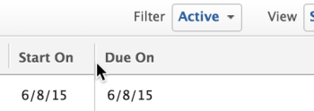

# Modificar a largura e a ordem da coluna

<!-- Audited: 11/2024 -->

A seguir estão as diretrizes sobre como as larguras de coluna funcionam no Adobe Workfront:

* Por padrão, o Workfront define a largura das colunas em listas e relatórios.
* O Workfront ajusta automaticamente a largura das colunas de acordo com as `valueformat` informações em todas as listas e relatórios, a menos que especificado de outra forma no modo de texto da coluna.

  >[!NOTE]
  >
  >O Workfront não ajusta a largura das colunas de acordo com as informações de `valueformat` nas listas disponíveis nas áreas Configuração e Relatórios.

  O valor `valueformat` define que tipo de informação é exibido na coluna. Por exemplo, as colunas que exibem um número são mais estreitas do que as colunas que exibem o campo Descrição.

* Você pode personalizar a largura das colunas em suas listas e relatórios do Workfront para atender às suas necessidades, dependendo do tipo de informação que deseja exibir nas colunas.

  Você pode modificar a largura das colunas temporariamente, ao exibir uma lista ou relatório, ou permanentemente, ajustando a largura da coluna no construtor de exibições. Para obter informações sobre como modificar temporariamente a largura das colunas, consulte a seção [Considerações ao modificar temporariamente a largura e a ordem das colunas](#considerations-when-temporarily-modifying-the-width-and-order-of-columns) neste artigo.

* As colunas que aparecem nas exibições integradas têm larguras definidas anteriormente pelo Workfront e codificadas. Para modificar essas larguras, você deve atualizar manualmente a largura dessas colunas usando o modo de texto no construtor de exibições.

  Para obter informações sobre como modificar a coluna no modo de texto, consulte [Exibir: edite permanentemente a largura de uma coluna](../../../reports-and-dashboards/reports/custom-view-filter-grouping-samples/view-edit-column-width-permanently.md).

## Requisitos de acesso

+++ Expanda para visualizar os requisitos de acesso para a funcionalidade neste artigo.

Você deve ter o seguinte acesso para executar as etapas deste artigo:

<table style="table-layout:auto"> 
 <col> 
 <col> 
 <tbody> 
  <tr> 
   <td role="rowheader"><strong>plano do Adobe Workfront*</strong></td> 
   <td> 
Qualquer
 </td> 
  </tr> 
  <tr> 
   <td role="rowheader"><strong>Licença da Adobe Workfront*</strong></td> 
   <td> 
      
Novo:

         <ul>
         <li>
Colaborador ou superior
</li>
         </ul>
      
Atual:

         <ul>
         <li>
Solicitação ou superior
</li>
         </ul>
   </td>
  </tr> 
  <tr> 
   <td role="rowheader"><strong>Configurações de nível de acesso*</strong></td> 
   <td> 
Editar acesso a Filtros, Visualizações, Agrupamentos
 
Editar acesso a Relatórios, Painéis, Calendários para editar a visualização em um relatório
</td> 
  </tr> 
  <tr> 
   <td role="rowheader"><strong>Permissões de objeto</strong></td> 
   <td> 
Gerenciar permissões de um relatório para editar uma visualização em um relatório
 
Gerenciar permissões em uma exibição para editá-la
</td> 
  </tr> 
 </tbody> 
</table>

*Para obter informações, consulte [Requisitos de acesso na documentação do Workfront](/help/quicksilver/administration-and-setup/add-users/access-levels-and-object-permissions/access-level-requirements-in-documentation.md).

+++

## Modificar a largura e a ordem da coluna

Você pode modificar a largura e a ordem das colunas em seus relatórios das seguintes maneiras:

* [Modificar temporariamente a largura e a ordem das colunas](#modify-width-and-order-of-columns-temporarily)
* [Modificar permanentemente a largura e a ordem das colunas](#modify-width-and-order-of-columns-permanently)

### Modificar temporariamente a largura e a ordem das colunas {#modify-width-and-order-of-columns-temporarily}

Você pode arrastar bordas de colunas para redimensionar colunas e arrastar e soltar colunas para reorganizá-las temporariamente na maioria das listas no site do Workfront. Isso inclui relatórios, visualizações, relatórios nos painéis e a visualização de Gantt.

Para obter mais informações sobre listas do Workfront, consulte o artigo [Introdução a listas no Adobe Workfront](../../../workfront-basics/navigate-workfront/use-lists/view-items-in-a-list.md).

* [Considerações ao modificar temporariamente a largura e a ordem das colunas](#considerations-when-temporarily-modifying-the-width-and-order-of-columns)
* [Redimensionar colunas temporariamente](#resize-columns-temporarily)
* [Reordenar colunas temporariamente](#reorder-columns-temporarily)

#### Considerações ao modificar temporariamente a largura e a ordem das colunas {#considerations-when-temporarily-modifying-the-width-and-order-of-columns}

É possível modificar temporariamente a largura e a ordem das colunas em uma lista sem editar sua visualização.

Considere o seguinte ao redimensionar e ordenar temporariamente as colunas:

* Ao redimensionar colunas, os novos tamanhos são armazenados no armazenamento local do navegador e salvos por padrão. Usar um navegador diferente ou limpar o cache ou procurar dados resulta na reversão dos tamanhos das colunas para o padrão. Atualizar a página mantém as alterações feitas na largura das colunas.

>[!NOTE]
> 
>As larguras de coluna são limitadas pelo tamanho da janela do navegador; se a página for atualizada, as colunas serão reduzidas em largura até que todas as colunas possam caber na janela sem rolagem horizontal. Para forçar uma coluna a permanecer mais larga do que o navegador pode ajustar, você deve definir a largura da coluna no modo de texto, conforme descrito em [Modificar a largura e a ordem das colunas permanentemente](#modify-width-and-order-of-columns-permanently) e evitar o ajuste manual de quaisquer larguras de coluna arrastando suas bordas.
>

* Ao reordenar colunas, a ordem escolhida é mantida somente até você sair da lista ou atualizar a página do navegador. Depois de sair da lista ou atualizar a página do navegador, as colunas retornam à ordem padrão.
* Para um desempenho ideal, as colunas que você está reordenando não devem ter mais de 100 itens na lista.
* Ao redimensionar colunas, as alterações se aplicam somente à exibição usada no momento e ficam visíveis somente para você. Compartilhar uma visualização com outro usuário não compartilha os tamanhos de coluna definidos.
* Depois de redimensionar uma coluna arrastando sua borda para a direita, a largura da coluna vizinha é preservada, exceto no seguinte:

   * A área Configuração
   * A área Relatórios
   * Listas de documentos e relatórios

  >[!NOTE]
  >
  >Não é possível mover a borda esquerda de uma coluna além da borda esquerda da coluna vizinha em nenhuma lista.

* Se você exportar qualquer lista para um arquivo, a ordem temporária das colunas não será transferida para o arquivo exportado. O arquivo exportado exibe a ordem das colunas na lista original, antes que as colunas tenham sido reordenadas.

Para obter mais informações sobre como exportar dados de listas e relatórios, consulte o artigo [Exportar dados](../../../reports-and-dashboards/reports/creating-and-managing-reports/export-data.md).

#### Redimensionar colunas temporariamente {#resize-columns-temporarily}

1. Vá para a lista que deseja modificar.
1. Arraste a borda de um cabeçalho de coluna até que a coluna atinja o tamanho desejado.\
   

#### Reordenar colunas temporariamente {#reorder-columns-temporarily}

1. Vá para a lista que deseja modificar.
1. Clique e arraste o cabeçalho da coluna que deseja mover para o local desejado.

>[!TIP]
>
>Isso é especialmente útil ao visualizar o Gráfico de Gantt e a exibição em lista simultaneamente. Ao exibir o Gráfico de Gantt, as colunas podem ficar ocultas. Para exibir uma coluna enquanto o Diagrama de Gantt é exibido, basta arrastar a coluna que deseja exibir para exibi-la no lado esquerdo da página.

### Modificar permanentemente a largura e a ordem das colunas {#modify-width-and-order-of-columns-permanently}

Para reordenar permanentemente as colunas, consulte a seção [Criar ou personalizar um modo de exibição padrão](../../../reports-and-dashboards/reports/reporting-elements/views-overview.md#customizing-a-standard-view) no artigo [Visão geral de modos de exibição no Adobe Workfront](../../../reports-and-dashboards/reports/reporting-elements/views-overview.md).

Você pode modificar permanentemente a largura de uma coluna somente usando o modo de texto.

Para obter mais informações sobre como usar o modo texto e modificar permanentemente a largura de uma coluna, consulte o artigo [Visão geral dos usos comuns do Modo Texto](../../../reports-and-dashboards/reports/text-mode/understand-common-uses-text-mode.md).
