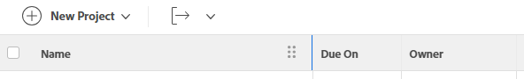

# Modificar largura e ordem das colunas

<!-- Audited: 11/2024 -->

Veja a seguir as diretrizes sobre como as larguras das colunas funcionam no Adobe Workfront:

* O Workfront define a largura de colunas em listas e relatórios, por padrão.
* O Workfront ajusta automaticamente a largura das colunas de acordo com as informações de `valueformat` em todas as listas e relatórios, a menos que especificado de outra forma no modo de texto da coluna.

  >[!NOTE]
  >
  >O Workfront não ajusta a largura das colunas de acordo com as informações de `valueformat` nas listas disponíveis nas áreas Configuração e Relatórios.

  O valor `valueformat` define o tipo de informação exibida na coluna. Por exemplo, as colunas que exibem um número são mais estreitas do que as colunas que exibem o campo Descrição.

* Você pode personalizar a largura das colunas nas listas e relatórios do Workfront para atender às suas necessidades, dependendo do tipo de informação que deseja exibir nas colunas.

  Você pode modificar a largura das colunas temporariamente, ao exibir uma lista ou relatório, ou permanentemente, ajustando a largura da coluna no construtor de exibições. Para obter informações sobre a modificação temporária da largura das colunas, consulte a seção [Considerações sobre a modificação temporária da largura e da ordem das colunas](#considerations-when-temporarily-modifying-the-width-and-order-of-columns) neste artigo.

* As colunas exibidas nas exibições integradas têm larguras definidas anteriormente pelo Workfront codificadas. Para modificar essas larguras, você deve atualizar manualmente a largura dessas colunas usando o modo de texto no construtor de exibições.

  Para obter informações sobre como modificar a coluna no modo de texto, consulte [Exibição: editar permanentemente a largura de uma coluna](../../../reports-and-dashboards/reports/custom-view-filter-grouping-samples/view-edit-column-width-permanently.md).

## Requisitos de acesso

+++ Expanda para visualizar os requisitos de acesso da funcionalidade neste artigo. 

<table style="table-layout:auto"> 
 <col> 
 <col> 
 <tbody> 
  <tr> 
   <td role="rowheader">Pacote do Adobe Workfront</td> 
   <td> 
Qualquer
 </td> 
  </tr> 
  <tr> 
   <td role="rowheader">Licença do Adobe Workfront</strong></td> 
   <td> 
    
Colaborador ou posterior

    
Solicitação ou posterior

   </td>
  </tr> 
  <tr> 
   <td role="rowheader">Configurações de nível de acesso</td> 
   <td> 
Editar acesso a filtros, exibições e agrupamentos
 
Acesso de edição a Relatórios, Painéis e Calendários para editar uma exibição em um relatório

   </td> 
  </tr> 
  <tr> 
   <td role="rowheader">Permissões de objeto</td> 
    <td> 
Gerenciar permissões para um relatório para editar uma exibição em um relatório
 
Gerenciar permissões para um modo de exibição para editá-lo
</td> 
   </td> 
  </tr> 
 </tbody> 
</table>

Para obter mais detalhes sobre as informações contidas nesta tabela, consulte [Requisitos de acesso na documentação do Workfront](/help/quicksilver/administration-and-setup/add-users/access-levels-and-object-permissions/access-level-requirements-in-documentation.md).

+++

## Modificar largura e ordem das colunas

Você pode modificar a largura e a ordem das colunas nos relatórios das seguintes maneiras:

* [Modificar temporariamente a largura e a ordem das colunas](#modify-width-and-order-of-columns-temporarily)
* [Modificar permanentemente a largura e a ordem das colunas](#modify-width-and-order-of-columns-permanently)

### Modificar temporariamente a largura e a ordem das colunas {#modify-width-and-order-of-columns-temporarily}

Você pode arrastar bordas de coluna para redimensionar colunas e arrastar e soltar colunas para reordená-las temporariamente na maioria das listas no site do Workfront. Isso inclui relatórios, exibições, relatórios em painéis e a exibição de Gantt.

Para obter mais informações sobre listas do Workfront, consulte o artigo [Introdução às listas no Adobe Workfront](../../../workfront-basics/navigate-workfront/use-lists/view-items-in-a-list.md).

* [Considerações ao modificar temporariamente a largura e a ordem das colunas](#considerations-when-temporarily-modifying-the-width-and-order-of-columns)
* [Redimensionar colunas temporariamente](#resize-columns-temporarily)
* [Reordenar colunas temporariamente](#reorder-columns-temporarily)

#### Considerações ao modificar temporariamente a largura e a ordem das colunas {#considerations-when-temporarily-modifying-the-width-and-order-of-columns}

É possível modificar temporariamente a largura e a ordem das colunas em uma lista sem editar a exibição.

Considere o seguinte ao redimensionar e ordenar colunas temporariamente:

* Ao redimensionar colunas, os novos tamanhos de coluna são armazenados no armazenamento local do navegador e são salvos por padrão. Usar um navegador diferente ou limpar o cache ou procurar dados resulta no tamanho de colunas sendo revertidas para o padrão. A atualização da página mantém as alterações feitas na largura das colunas.

>[!NOTE]
> 
>As larguras das colunas são limitadas pelo tamanho da janela do navegador; se a página for atualizada, as colunas serão reduzidas na largura até que todas as colunas se ajustem na janela sem rolagem horizontal. Para forçar uma coluna a permanecer mais larga do que a largura da coluna caberá no navegador, você deve definir a largura da coluna no modo de texto conforme descrito em [Modificar a largura e a ordem das colunas permanentemente](#modify-width-and-order-of-columns-permanently) e evitar o ajuste manual de larguras de colunas arrastando suas bordas.
>

* Ao reordenar as colunas, a ordem escolhida será mantida somente até você sair da lista ou atualizar a página do navegador. Depois de sair da lista ou atualizar a página do navegador, as colunas retornam à ordem padrão.
* Para um desempenho ideal, as colunas que você está reordenando não devem ter mais de 100 itens na lista.
* Quando você redimensiona colunas, suas alterações se aplicam apenas à exibição que está usando no momento e são visíveis apenas para você. Compartilhar uma exibição com outro usuário não compartilha os tamanhos de coluna definidos.
* Depois de redimensionar uma coluna arrastando sua borda para a direita, a largura da coluna vizinha é preservada, exceto nos seguintes itens:

   * A área Configuração
   * A área Relatórios
   * Listas de documentos e relatórios

  >[!NOTE]
  >
  >Não é possível mover a borda esquerda de uma coluna para além da borda esquerda da coluna vizinha em qualquer lista.

* Se você exportar uma lista para um arquivo, a ordem temporária das colunas não será transferida para o arquivo exportado. O arquivo exportado exibe a ordem das colunas na lista original, antes que as colunas tenham sido reordenadas.

Para obter mais informações sobre como exportar dados de listas e relatórios, consulte o artigo [Exportar dados](../../../reports-and-dashboards/reports/creating-and-managing-reports/export-data.md).

#### Redimensionar colunas temporariamente {#resize-columns-temporarily}

1. Vá para a lista que você deseja modificar.
1. Arraste a borda de um cabeçalho de coluna até que a coluna atinja o tamanho desejado.\
   

#### Reordenar colunas temporariamente {#reorder-columns-temporarily}

1. Vá para a lista que você deseja modificar.
1. Clique e arraste o cabeçalho da coluna que deseja mover para o local desejado.

>[!TIP]
>
>Isso é especialmente útil ao exibir o gráfico de Gantt e a exibição em lista simultaneamente. Ao exibir o gráfico de Gantt, as colunas podem ficar ocultas. Para exibir uma coluna enquanto o gráfico de Gantt é exibido, simplesmente arraste a coluna que você deseja exibir para que ela seja exibida no lado esquerdo da página.

### Modificar permanentemente a largura e a ordem das colunas {#modify-width-and-order-of-columns-permanently}

Para reordenar colunas permanentemente, consulte a seção [Criar ou personalizar um modo de exibição padrão](../../../reports-and-dashboards/reports/reporting-elements/views-overview.md#customizing-a-standard-view) no artigo [Visão geral de modos de exibição no Adobe Workfront](../../../reports-and-dashboards/reports/reporting-elements/views-overview.md).

É possível modificar permanentemente a largura de uma coluna somente usando o modo de texto.

Para obter mais informações sobre como usar o modo de texto e modificar permanentemente a largura de uma coluna, consulte o artigo [Visão geral dos usos comuns do Modo de Texto](../../../reports-and-dashboards/reports/text-mode/understand-common-uses-text-mode.md).
