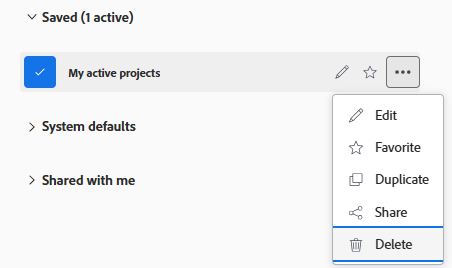

# Remover filtros, visualizações e agrupamentos

É possível remover um filtro, visualização ou agrupamento de listas e relatórios, se você os criou ou se eles foram compartilhados com você. Não é possível remover filtros, visualizações ou agrupamentos padrão.

## Requisitos de acesso

Você deve ter o seguinte:

<table style="table-layout:auto"> 
 <col> 
 </col> 
 <col> 
 </col> 
 <tbody> 
  <tr> 
   <td role="rowheader"><strong>Plano Adobe Workfront*</strong></td> 
   <td> 
Qualquer Um 
 </td> 
  </tr> 
  <tr> 
   <td role="rowheader"><strong>Licença da Adobe Workfront*</strong></td> 
   <td> 
Solicitação ou superior
 </td> 
  </tr> 
  <tr> 
   <td role="rowheader"><strong>Configurações de nível de acesso*</strong></td> 
   <td> 
Visualizar ou obter acesso superior a Filtros, Exibições, Agrupamentos
 
Observação: Caso ainda não tenha acesso, pergunte ao administrador do Workfront se ele definiu restrições adicionais em seu nível de acesso. Para obter informações sobre como um administrador do Workfront pode modificar seu nível de acesso, consulte <a href="../../../administration-and-setup/add-users/configure-and-grant-access/create-modify-access-levels.md" class="MCXref xref">Criar ou modificar níveis de acesso personalizados</a>.
 </td> 
  </tr> 
  <tr> 
   <td role="rowheader"><strong>Permissões de objeto</strong></td> 
   <td> 
Visualize permissões com acesso para compartilhar com o filtro, visualização ou agrupamento que você deseja remover
 
Para obter informações sobre como solicitar acesso adicional, consulte <a href="../../../workfront-basics/grant-and-request-access-to-objects/request-access.md" class="MCXref xref">Solicitar acesso a objetos </a>.
 </td> 
  </tr> 
 </tbody> 
</table>

&#42;Para descobrir qual plano, tipo de licença ou acesso você tem, entre em contato com o administrador da Workfront.

## Remova ou exclua um filtro usando o construtor padrão

Você pode remover um filtro que foi compartilhado com você a partir de listas de projetos, tarefas ou problemas usando a interface padrão do construtor. A interface padrão do construtor não está disponível para nenhum outro objeto ou para exibições ou agrupamentos.

Também é possível excluir filtros que você possui em listas de projetos, tarefas ou problemas usando a interface padrão do construtor.

Os filtros padrão do sistema não podem ser removidos ou excluídos.

### Considerações sobre a remoção ou exclusão de filtros usando o construtor padrão

Os seguintes cenários existem quando você remove ou exclui um filtro usando o construtor padrão:

* Se o filtro tiver sido compartilhado com você e você o remover, ele será removido somente para você. O usuário que o criou originalmente e qualquer outro usuário com o qual ele foi compartilhado ainda têm acesso ao filtro.
* Se você for o proprietário do filtro e o excluir, o filtro será removido do sistema Workfront. O filtro não está mais disponível para nenhum usuário com o qual você compartilhou anteriormente.
* Se você for um administrador do Workfront, poderá excluir o filtro e ele será excluído permanentemente para todos os usuários, incluindo o proprietário.

### Remova um filtro usando o construtor padrão

1. Acesse uma lista de projetos, tarefas, problemas, portfólios, programas, usuários, modelos ou grupos.
1. Clique no botão **Filtro** ícone .
1. Passe o mouse sobre um filtro em **Compartilhado comigo**, clique no botão **Mais** menu , depois clique em **Remover**.

   

1. Selecionar **Remover** na mensagem de confirmação para remover permanentemente o filtro.

### Excluir um filtro usando o construtor padrão

1. Acesse uma lista de projetos, tarefas, problemas, portfólios, programas, usuários, modelos ou grupos.
1. Clique no botão **Filtro** ícone .
1. Passe o mouse sobre um filtro que você tem permissões para excluir, clique no botão **Mais** menu , depois clique em **Excluir**.

   

1. (Opcional) Clique em **Cancelar** na mensagem de confirmação para evitar a exclusão e retornar à lista de filtros.
1. Clique em **Excluir** na mensagem de confirmação para confirmar a exclusão.

   O filtro é excluído para você e para todos os usuários com permissões nele.

## Remova um filtro, visualização ou agrupamento usando o construtor herdado

Você pode remover um filtro, uma visualização ou um agrupamento para todas as listas de objetos usando a interface do construtor herdado.

### Considerações sobre a remoção de filtros, visualizações e agrupamentos usando o construtor herdado

A forma como você remove um elemento de relatório depende da criação inicial ou do compartilhamento com você.

Os seguintes cenários existem quando você remove um filtro, uma visualização ou um agrupamento:

* **Se você criou o elemento e o removeu**, o elemento é removido do sistema Workfront. Não está mais disponível para qualquer usuário com o qual você compartilhou anteriormente.
* **Se o elemento foi compartilhado com você e você o removeu**, o elemento é removido somente para você. O usuário que o criou originalmente e outros usuários com os quais ele foi compartilhado ainda têm acesso a ele.

### Remova um filtro, visualização ou agrupamento usando o construtor herdado

1. Vá para uma lista de objetos ou um relatório.
1. (Condicional) Em uma lista, clique no botão **Filtro**, **Exibir** ou **Agrupamento** ícone , depois passe o mouse sobre o filtro, a visualização ou o agrupamento que deseja remover, clique no botão **Mais** ícone , em seguida **Remover**. O filtro, a visualização ou o agrupamento é removido.
1. (Condicional) Em um relatório, clique no botão **Agrupamento**, **Filtro** ou **Exibir** e selecione **Remover agrupamento**, **Remover filtro** ou **Remover Vista**.

   O **Meus Agrupamentos**, **Meus Filtros,** ou **Minhas exibições** será exibida.

   Todos os elementos de relatório que você tem direitos para remover estão disponíveis para remoção. Outros elementos de relatório são exibidos como esmaecidos.

1. Clique no botão **x** ícone ao lado de qualquer elemento de relatório que você deseja remover.
1. (Condicional) Clique em **Sim, excluir** se você optou por excluir um filtro, visualização ou agrupamento criado e posteriormente compartilhado com outras pessoas. Isso exclui o filtro, a visualização ou o agrupamento do sistema Workfront.

   >[!TIP]
   >
   >Remover um filtro, visualização ou agrupamento criado sem compartilhá-lo com outras pessoas o remove do sistema sem solicitar uma confirmação.

1. Clique em **Concluído**.

