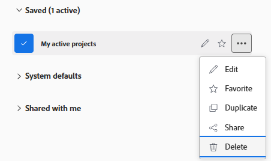
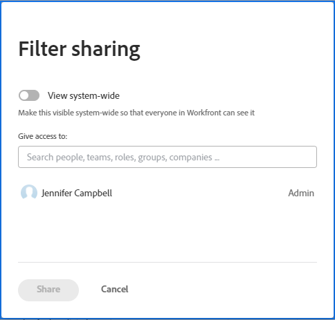

# Compartilhar um filtro, uma exibição ou um agrupamento

<!-- Audited: 11/2024 -->

<!--(NOTE: CONSIDER SPLITTING THIS in three articles for each reporting element?)
(NOTE: This is linked from the TOC article in WF Basics > permissions section)-->

O administrador do Adobe Workfront concede aos usuários acesso para visualizar ou editar objetos ao atribuir níveis de acesso. Para obter mais informações sobre como conceder acesso a objetos, consulte [Criar ou modificar níveis de acesso personalizados](../../../administration-and-setup/add-users/configure-and-grant-access/create-modify-access-levels.md).

Juntamente com o nível de acesso que os usuários recebem, você também pode conceder a eles permissões para exibir ou editar objetos específicos que você criou ou ter acesso para compartilhar. Para obter mais informações sobre níveis de acesso e permissões, consulte [Como os níveis de acesso e as permissões funcionam juntos](../../../administration-and-setup/add-users/access-levels-and-object-permissions/how-access-levels-permissions-work-together.md).

É possível compartilhar filtros, visualizações e agrupamentos que você tem acesso para visualizar com outros usuários.

Quando um filtro, exibição ou agrupamento é compartilhado com você, é possível aplicar esse filtro, exibição ou agrupamento às listas. Dependendo do acesso concedido a você, talvez você possa modificá-lo e compartilhá-lo com outros usuários.

Para obter informações sobre como criar um filtro, uma exibição ou um agrupamento, consulte os seguintes artigos:

* [Visão geral dos filtros](../../../reports-and-dashboards/reports/reporting-elements/filters-overview.md)
* [Visão geral das exibições no Adobe Workfront](../../../reports-and-dashboards/reports/reporting-elements/views-overview.md)
* [Visão geral de agrupamentos no Adobe Workfront](../../../reports-and-dashboards/reports/reporting-elements/groupings-overview.md)

## Requisitos de acesso

+++ Expanda para visualizar os requisitos de acesso para a funcionalidade neste artigo.

Você deve ter o seguinte acesso para executar as etapas deste artigo:

<table style="table-layout:auto"> 
 <col> 
 <col> 
 <tbody> 
  <tr> 
   <td role="rowheader"><strong>plano do Adobe Workfront*</strong></td> 
   <td> 
Qualquer 
 </td> 
  </tr> 
  <tr> 
   <td role="rowheader"><strong>Licença da Adobe Workfront*</strong></td> 
   <td> 
      
Novo:

         <ul>
         <li>
Colaborador ou superior
</li>
         </ul>
      
Atual:

         <ul>
         <li>
Solicitação ou superior
</li>
         </ul>
   </td>
  </tr> 
  <tr> 
   <td role="rowheader"><strong>Configurações de nível de acesso*</strong></td> 
   <td> 
Acesso de visualização ou superior a filtros, visualizações, agrupamentos
</td> 
  </tr> 
  <tr> 
   <td role="rowheader"><strong>Permissões de objeto</strong></td> 
   <td>
Exibir permissões ou mais altas com acesso para compartilhar, filtrar ou agrupar uma exibição
</td> 
  </tr> 
 </tbody> 
</table>

*Para obter informações, consulte [Requisitos de acesso na documentação do Workfront](/help/quicksilver/administration-and-setup/add-users/access-levels-and-object-permissions/access-level-requirements-in-documentation.md).

+++

## Compartilhar um filtro, uma exibição ou um agrupamento

<!--(NOTE: when the beta filters/ groupings come out either consider splitting this in different kinds of FVGs or splitting this article in FVGs for showing sharing on each one of them??)-->

O compartilhamento de filtros em listas de seleção é diferente, dependendo da interface da qual você usa para compartilhar o filtro: padrão ou herdado. Para obter informações sobre os tipos de interfaces de criação de filtros, consulte [Criar ou editar filtros no Adobe Workfront](/help/quicksilver/reports-and-dashboards/reports/reporting-elements/create-filters.md).

Você pode compartilhar visualizações e agrupamentos somente na interface herdada.

### Compartilhamento de filtros usando a interface padrão do construtor

É possível compartilhar um filtro na interface padrão a partir de listas de projetos, tarefas, problemas, portfólios, programas, usuários, modelos ou grupos. A interface padrão do construtor para filtros não está disponível para outros objetos, exibições ou agrupamentos.

Compartilhar um filtro usando a interface do construtor padrão:

1. Ir para uma lista de projetos, tarefas ou problemas.
1. Clique no ícone **Filtro** .

   

1. Revise as seguintes listas de filtros:

   <table style="table-layout:auto">
   <col>
   <col>
   <tbody>
   <tr>
   <td role="rowheader"><strong>Marcado como favorito</strong></td>
   <td>Filtros que você marcou como favoritos. Quando você adiciona um filtro como favorito, seu local original é mostrado abaixo do nome do filtro e fica oculto na lista original, a menos que você o remova como favorito.</td>
   </tr>
   <tr>
   <td role="rowheader"><strong>Salvos</strong></td>
   <td>Filtros que você criou e salvou a si mesmo. Por padrão, essa lista exibe os filtros salvos na ordem em que foram salvos mais recentemente, mas os nomes dos filtros podem ser arrastados para reordenar manualmente a lista.</td>
   </tr>
   <tr>
   <td role="rowheader"><strong>Padrões do sistema</strong></td>
   <td>Filtros padrão do sistema Workfront, bem como filtros que o administrador do Workfront adicionou à lista de filtros, no nível do sistema ou no modelo de layout.</td>
   </tr>
   <tr>
   <td role="rowheader"><strong>Compartilhado(s) comigo</strong></td>
   <td>Filtros que outras pessoas criaram e compartilharam com você ou que são compartilhados em todo o sistema.</td>
   </tr>
   </tbody>
   </table>

1. Passe o mouse sobre um filtro que você tem acesso para, pelo menos, exibir e compartilhar, em seguida, clique no menu **Mais**  e, em seguida, clique em **Compartilhar**.

   

   A caixa Filter sharing (Compartilhamento de filtro) é exibida.

1. Comece digitando os nomes de usuários, equipes, funções, grupos ou empresas com os quais deseja compartilhar no campo **Conceder acesso a**.

   

1. (Opcional) Clique na seta ao lado do nome de uma entidade para editar suas permissões para o filtro e habilitar a opção **Exibir** ou **Gerenciar**. **Exibir** é o padrão.

   

1. (Opcional) Ative ou desative as permissões adicionais de uma entidade seguindo um destes procedimentos:

   1. Clique em **Exibir** e desabilite a opção **Compartilhar**. Ela é ativada por padrão.
   1. Clique em **Gerenciar** e desabilite a opção **Compartilhar** ou **Excluir**. Elas são ativadas por padrão.

      >[!NOTE]
      >
      >Se você habilitar a opção Gerenciar acesso com exclusão, esses usuários poderão excluir o filtro de todos os usuários, mesmo que não sejam proprietários do filtro.

   >[!TIP]
   >
   >Os usuários não podem receber uma permissão maior do que seu nível de acesso. Se não tiverem acesso a Editar filtros em seus níveis de acesso, eles não poderão receber permissões para gerenciar um filtro. O Workfront desativa a opção Gerenciar para esses usuários e a opção fica esmaecida.

1. Clique em **Compartilhar**. O filtro é compartilhado com as entidades especificadas.

   >[!TIP]
   >
   >O compartilhamento com grupos dá permissões ao filtro para os membros do grupo e de todos os subgrupos.

   Os filtros que você compartilhou são exibidos na seção **Compartilhado comigo** do painel de filtros dessas entidades.

   

### Compartilhar filtros, visualizações e agrupamentos usando a interface herdada

O compartilhamento de filtros, visualizações e agrupamentos na interface herdada é idêntico.

1. Ir para uma lista de objetos ou um relatório.
1. (Condicional) Em uma lista, clique no ícone **Filtro**, **Exibição** ou **Agrupamento** e passe o mouse sobre o filtro, a exibição ou o agrupamento que deseja compartilhar, clique no ícone **Mais**  e **Compartilhar**.

   Em um relatório, clique no menu suspenso **Filtro**, **Exibir** ou **Agrupamento** e selecione o filtro, o modo de exibição ou o agrupamento que deseja compartilhar.

1. (Condicional) Se estiver compartilhando a partir de um relatório, clique novamente no menu suspenso **Filtro**, **Exibição** ou **Agrupamento** e, em seguida, clique em **Compartilhar Filtro**, **Compartilhar Exibição** ou **Compartilhar Agrupamento**.\
   A caixa de diálogo **Acesso ao Filtro**, **Acesso ao Modo de Exibição** ou **Acesso ao Agrupamento** é exibida.

   

1. Conclua qualquer uma das opções a seguir, dependendo de com quem você deseja compartilhar:

   **Para compartilhar com usuários, equipes, funções, grupos ou empresas individuais:** No campo fornecido, comece digitando o nome do usuário, equipe, função, grupo ou empresa com a qual deseja compartilhar e clique no nome quando ele aparecer na lista suspensa.\
   Repita esse processo para compartilhar o acesso com vários usuários, equipes, funções, grupos ou empresas.

   >[!TIP]
   >
   >O compartilhamento com grupos dá permissões para o filtro, exibição ou agrupamento para os membros do grupo e de todos os subgrupos.

   **Para compartilhar com todos os usuários no sistema:** Clique no ícone **Configurações** e em **Tornar isto visível em todo o sistema**.\
   O administrador deve selecionar a opção Compartilhar em todo o sistema para que essa opção fique disponível. Para obter mais informações, consulte os artigos [Criar ou modificar níveis de acesso personalizados](../../../administration-and-setup/add-users/configure-and-grant-access/create-modify-access-levels.md) e [Compartilhar relatórios, painéis e calendários](../../../workfront-basics/grant-and-request-access-to-objects/permissions-reports-dashboards-calendars.md).

1. (Condicional) Se estiver compartilhando com usuários individuais, equipes, funções, grupos ou empresas, clique no menu suspenso para definir o nível de acesso que deseja conceder.

   Você pode selecionar entre as seguintes opções:

   <table style="table-layout:auto"> 
    <col> 
    <col> 
    <tbody> 
     <tr> 
      <td role="rowheader"><strong>Visualizar o projeto</strong></td> 
      <td> 
Selecione esta opção para permitir que os destinatários compartilhados usem somente o Filtro, a Exibição ou o Agrupamento compartilhado. Quando essa opção é selecionada, os destinatários não podem fazer modificações no item compartilhado.
 </td> 
     </tr> 
     <tr> 
      <td role="rowheader"><strong>Gerenciar o projeto</strong></td> 
      <td> 
Selecione esta opção para permitir que os destinatários compartilhados usem e modifiquem o Filtro, a Exibição ou o Agrupamento compartilhado.
 </td> 
     </tr> 
     <tr> 
      <td role="rowheader"><strong>Compartilhá-lo</strong></td> 
      <td> 
Clique em <strong>Configurações Avançadas</strong> e selecione ou desmarque a opção <strong>Compartilhar</strong>, dependendo se você deseja que os destinatários compartilhem com outras pessoas.
 </td> 
     </tr> 
    </tbody> 
   </table>

1. Clique em **Salvar**.

   Os usuários com os quais você compartilhou o filtro, a exibição ou o agrupamento podem acessá-lo clicando no menu suspenso ou ícone **Filtro**, **Exibição** ou **Agrupamento** e rolando para baixo até a seção **Compartilhado comigo**.

