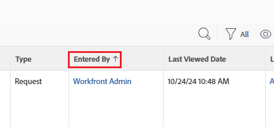

# Introdução a relatórios

<!-- Audited: 12/2023 -->

Os relatórios fornecem visibilidade sobre o que está acontecendo com os usuários e o trabalho. Com os relatórios, é possível exibir informações sobre objetos no Adobe Workfront.

Para obter informações sobre como entender objetos e como eles podem ser relatados no aplicativo Workfront, consulte [visão geral dos objetos do Adobe Workfront](../../../workfront-basics/navigate-workfront/workfront-navigation/understand-objects.md).

## Elementos do relatório

Os relatórios são uma combinação dos três elementos a seguir no Workfront:

<table style="table-layout:auto"> 
 <col> 
 <col> 
 <tbody> 
  <tr> 
   <td role="rowheader">Exibir</td> 
   <td> <li>Define as colunas no relatório e quais informações podem ser incluídas em cada coluna.</li> <li>Para obter informações sobre exibições, consulte <a href="../../../reports-and-dashboards/reports/reporting-elements/views-overview.md" class="MCXref xref">Visão geral das exibições no Adobe Workfront</a>.</li> </td> 
  </tr> 
  <tr> 
   <td role="rowheader">Agrupamento</td> 
   <td> <li>Categoriza as informações com base em informações comuns e lista os resultados do relatório em títulos.</li> <li>Para obter informações sobre agrupamentos, consulte <a href="../../../reports-and-dashboards/reports/reporting-elements/groupings-overview.md" class="MCXref xref">Visão geral sobre agrupamentos no Adobe Workfront</a>.</li> </td> 
  </tr> 
  <tr> 
   <td role="rowheader">Filtro</td> 
   <td> <li>Controla a quantidade de informações que aparece em um relatório.</li> <li>Para obter informações sobre filtros, consulte <a href="../../../reports-and-dashboards/reports/reporting-elements/filters-overview.md" class="MCXref xref">Visão geral sobre filtros</a>.</li> <li>Para obter informações sobre modificadores de filtro, consulte <a href="../../../reports-and-dashboards/reports/reporting-elements/filter-condition-modifiers.md" class="MCXref xref">Modificadores de filtro e condição</a>.</li> <li>É possível filtrar usando curingas, para tornar seus filtros mais gerais e dar a eles mais flexibilidade de uso.</li> <li>Para obter informações sobre como usar curingas em filtros, consulte <a href="../../../reports-and-dashboards/reports/reporting-elements/understand-wildcard-filter-variables.md" class="MCXref xref">Variáveis de filtro curinga</a>.</li> </td> 
  </tr> 
 </tbody> 
</table>

>[!NOTE]
>
>Quando você seleciona um novo filtro, visualização ou agrupamento em uma lista, essa seleção é mantida mesmo se você sair do Workfront ou fechar o navegador.

Para obter informações sobre elementos de relatório, consulte [Elementos de relatório: filtros, exibições e agrupamentos](../../../reports-and-dashboards/reports/reporting-elements/reporting-elements-filters-views-groupings.md).

Para aprimorar seus relatórios, você pode adicionar os seguintes elementos:

* Um gráfico: uma representação visual dos resultados no relatório.\
  Para obter informações sobre relatórios de gráfico, consulte [Adicionar um gráfico a um relatório](../../../reports-and-dashboards/reports/creating-and-managing-reports/add-chart-report.md).

* Um agrupamento de matriz: resume as informações do relatório em um formato de tabela agregada.\
  Para obter informações sobre relatórios de matriz, consulte [Criar um relatório de matriz](../../../reports-and-dashboards/reports/creating-and-managing-reports/create-matrix-report.md).

* Um prompt: um filtro aberto que pode ser personalizado e aplicado de forma diferente sempre que o relatório for executado.\
  Para obter informações sobre prompts, consulte [Adicionar um prompt a um relatório](../../../reports-and-dashboards/reports/creating-and-managing-reports/add-prompt-report.md).

Ao criar um relatório, você pode modificar qualquer um desses elementos individualmente no Report Builder.

Outra maneira de aprimorar a relevância das informações incluídas em seus relatórios é aplicar formatação condicional às suas visualizações. Para obter informações sobre como usar a formatação condicional, consulte [Usar formatação condicional nas exibições](../../../reports-and-dashboards/reports/reporting-elements/use-conditional-formatting-views.md).

## Relatórios do sistema

O Workfront fornece vários relatórios de sistema que são carregados em seu sistema por padrão.\
Depois de inserir informações em seu sistema, você pode usar esses relatórios para exibir as informações visualmente.

Para obter mais informações sobre como acessar relatórios do sistema e quais relatórios do sistema estão disponíveis, consulte [Usar relatórios internos do Adobe Workfront](../../../reports-and-dashboards/reports/using-built-in-reports/use-workfront-built-in-reports.md).

## Criar relatórios

Além dos relatórios de sistema fornecidos pela Workfront, você pode criar seus próprios relatórios personalizados para atender às necessidades de sua organização.

Para criar um relatório, você pode executar um dos seguintes procedimentos:

* Criar um relatório do zero.
* Copie um relatório existente.

  Você deve ter pelo menos a permissão Exibir para copiar um relatório criado por outra pessoa. Para obter mais informações sobre como copiar um relatório, consulte [Criar uma cópia de um relatório](../../../reports-and-dashboards/reports/creating-and-managing-reports/create-copy-report.md).

Para obter informações sobre como criar relatórios, consulte [Criar um relatório personalizado](/help/quicksilver/reports-and-dashboards/reports/creating-and-managing-reports/create-custom-report.md).

### Pré-requisitos para criar relatórios {#prerequisites-for-creating-reports}

* Você deve ter uma licença Plan (licenças atuais) ou uma licença Standard (novas licenças) para criar seus próprios relatórios.

  Para obter informações sobre os tipos de licença da Workfront, consulte [Visão geral das licenças](../../../administration-and-setup/add-users/access-levels-and-object-permissions/wf-licenses.md) para as licenças atuais e [Visão geral das novas licenças](/help/quicksilver/administration-and-setup/add-users/how-access-levels-work/licenses-overview.md) para as novas licenças.

* O administrador do Workfront deve fornecer acesso para Editar relatórios no seu nível de acesso.

  Para obter informações sobre como conceder acesso a Editar relatórios, consulte [Conceder acesso a relatórios, painéis e calendários](../../../administration-and-setup/add-users/configure-and-grant-access/grant-access-reports-dashboards-calendars.md).

* O administrador do Workfront deve fornecer acesso a Editar filtros, visualizações e agrupamentos no seu Nível de acesso.

  Para obter informações sobre como conceder acesso a Editar filtros, exibições e agrupamentos, consulte [Conceder acesso a filtros, exibições e agrupamentos](../../../administration-and-setup/add-users/configure-and-grant-access/grant-access-fvg.md).

* Você deve definir um objeto sobre o qual deseja criar relatórios. Os relatórios são objetos específicos no Workfront e você deve começar selecionando um tipo de objeto antes de começar a criar o relatório. É possível criar relatórios somente sobre objetos disponíveis na interface do Workfront.

### Propriedade do relatório {#report-ownership}

Ao criar um relatório no Workfront, você se torna o proprietário padrão do relatório e ele é exibido na seção Meus relatórios. Não é possível alterar o proprietário de um relatório.

Ao copiar um relatório, você automaticamente se torna o proprietário do relatório copiado.
Para obter informações sobre como copiar relatórios, consulte [Criar uma cópia de um relatório](../../../reports-and-dashboards/reports/creating-and-managing-reports/create-copy-report.md).

Você pode ver quem possui um relatório revisando o campo **Informado por**.

### Criar relatórios na interface do construtor {#create-reports-in-the-builder-interface}

Recomendamos que você use a interface de criação de relatório primeiro para criar um novo relatório. A interface oferece um conjunto simplificado de ferramentas que orientam você na criação dos elementos necessários para criar o relatório. Você tem objetos e campos que podem ser selecionados em listas e adicionados a todos os seus elementos de relatórios.\
Para obter mais informações sobre como criar relatórios na interface de criação de relatórios, consulte [Criar um relatório personalizado](../../../reports-and-dashboards/reports/creating-and-managing-reports/create-custom-report.md).

Para obter uma lista de objetos sobre os quais você pode criar relatórios, consulte a seção [Relatório sobre objetos](../../../workfront-basics/navigate-workfront/workfront-navigation/understand-objects.md#report-on-objects) no artigo [visão geral sobre objetos do Adobe Workfront](../../../workfront-basics/navigate-workfront/workfront-navigation/understand-objects.md).

Para obter mais informações sobre os campos que podem ser exibidos nos relatórios, consulte [Glossário da terminologia do Adobe Workfront](../../../workfront-basics/navigate-workfront/workfront-navigation/workfront-terminology-glossary.md).

### Criar relatórios no modo de texto {#create-reports-in-text-mode}

Às vezes, você pode não conseguir encontrar determinados campos na interface do construtor, mas eles podem estar disponíveis na API.\
Para obter informações sobre quais campos estão disponíveis na API, consulte o artigo [API Explorer](../../../wf-api/general/api-explorer.md).

Para obter informações sobre como usar o API Explorer, consulte o artigo [Uso do API Explorer](../../../wf-api/general/using-api-explorer.md).

>[!NOTE]
>
>Não é possível criar relatórios na interface do Workfront sobre objetos que não estão disponíveis no Report Builder. No entanto, você pode criar relatórios sobre campos associados aos objetos no Report Builder se esses campos estiverem disponíveis por meio da API. Para fazer isso, é necessário usar a interface Text Mode.

O Modo de texto permite que você crie exibições, filtros, agrupamentos e prompts mais complexos, permitindo que você use campos que não estão disponíveis na interface de modo padrão.

#### Terminologia do modo de texto {#text-mode-terminology}

Você deve usar uma sintaxe específica para usar a interface Workfront Text Mode.

Para obter mais detalhes sobre a sintaxe do Workfront para o modo de texto, consulte [Visão geral da sintaxe do modo de texto](../../../reports-and-dashboards/reports/text-mode/text-mode-syntax-overview.md).

#### Colunas calculadas, formatação condicional e outros usos do modo de texto {#calculated-columns-conditional-formatting-and-other-uses-of-text-mode}

Fora dos relatórios em campos que não estão disponíveis na interface do construtor, você pode usar o Modo de texto para exibir cálculos ou comparações entre determinados campos.

Para obter uma lista dos usos mais comuns do Modo de Texto em um relatório, consulte [Visão geral dos usos comuns do Modo de Texto](../../../reports-and-dashboards/reports/text-mode/understand-common-uses-text-mode.md).

Para obter informações sobre como incluir dados personalizados calculados em relatórios, consulte [Dados personalizados calculados em relatórios](../../../reports-and-dashboards/reports/calc-cstm-data-reports/calculated-custom-data-reports.md).

Para obter informações sobre a comparação de campos na formatação condicional, consulte [Comparar campos na formatação condicional](../../../reports-and-dashboards/reports/text-mode/compare-fields-conditional-formatting.md).

Também é possível consultar campos de coleção usando o Modo de texto nos relatórios.\
Para obter informações sobre como usar o Modo de Texto para exibir informações de coleção em um relatório, consulte [Coleções de referência em um relatório](../../../reports-and-dashboards/reports/text-mode/reference-collections-report.md).

#### Amostras do modo de texto {#text-mode-samples}

Temos uma biblioteca de amostras das exibições, filtros e agrupamentos mais usados que você pode criar com o Modo de texto.

Para navegar nesta biblioteca e usar algumas das amostras que oferecemos, consulte o artigo [Exibição personalizada, filtro e amostras de agrupamento: índice de artigo](../../../reports-and-dashboards/reports/custom-view-filter-grouping-samples/custom-view-filter-grouping-samples.md).

## As guias de um relatório

Um relatório pode conter várias guias ao executar o relatório na interface.

Para obter informações sobre como executar um relatório, consulte o artigo [Executar um relatório](../../../reports-and-dashboards/reports/creating-and-managing-reports/run-report.md).

Em cada guia, as informações incluídas no relatório são exibidas em formatos um pouco diferentes. Escolha o formato que melhor atenda às necessidades de sua organização.

Você pode tornar qualquer guia a guia padrão do relatório. A guia padrão é a primeira guia exibida ao clicar no nome de um relatório para abri-lo, e é a guia exibida ao colocar o relatório em um painel.

### Guia Detalhes {#details-tab}

A guia Detalhes de um relatório exibe o objeto dos relatórios e os atributos escolhidos para esse objeto em um formulário de lista. Todos os relatórios têm uma guia Details.

>[!IMPORTANT]
>
>As informações na guia Detalhes podem ser exibidas de forma diferente da guia Gráfico com base no fuso horário.\
>Por exemplo, um usuário na Califórnia concluiu uma tarefa às 21h30 PST em 12 de fevereiro. Quando um usuário em Nova York visualiza um relatório que inclui a conclusão dessa tarefa, a Data de conclusão real é exibida como 13 de fevereiro na guia Detalhes e nos detalhes do Gráfico porque foi concluída às 12h30 EST em 13 de fevereiro. No entanto, no gráfico, ele é incluído no agrupamento de 12 de fevereiro até que você expanda o elemento do gráfico.

### Guia Resumo {#summary-tab}

Os relatórios que incluem um agrupamento têm uma guia Summary.

As mesmas informações exibidas no formato de lista na guia Detalhes são resumidas e agregadas de acordo com os agrupamentos no relatório na guia Resumo.

Para obter informações sobre agrupamentos, consulte [Visão geral sobre agrupamentos no Adobe Workfront](../../../reports-and-dashboards/reports/reporting-elements/groupings-overview.md).

### Guia Matriz {#matrix-tab}

Os relatórios que incluem um Agrupamento de matriz têm uma guia Matriz.

As mesmas informações exibidas no formato de lista na guia Detalhes são exibidas em um formato de tabela, agrupadas pelos agrupamentos no relatório na guia Matriz.

Quando você adiciona um agrupamento Matrix a um relatório, a guia Summary é substituída pela guia Matrix.

Para obter informações sobre como criar um Agrupamento de Matriz, consulte o artigo [Criar um relatório de matriz](../../../reports-and-dashboards/reports/creating-and-managing-reports/create-matrix-report.md).

### Guia Gráfico {#chart-tab}

Os relatórios que incluem um gráfico têm uma guia Chart.

Considere incluir um gráfico em seus relatórios para obter painéis impactantes para seus executivos. Os gráficos são uma maneira concisa de exibir as informações em um relatório. Você pode expandir um elemento de gráfico clicando nele para exibir os itens incluídos nesse elemento.

>[!IMPORTANT]
>
>Ao clicar em um elemento de gráfico, as informações expandidas podem ser exibidas de forma diferente do gráfico com base no seu fuso horário.\
>Por exemplo, um usuário na Califórnia concluiu uma tarefa às 21h30 PST em 12 de fevereiro. Quando um usuário em Nova York visualiza um relatório que inclui a conclusão dessa tarefa, a Data de conclusão real é exibida como 13 de fevereiro na guia Detalhes e nos detalhes do Gráfico porque foi concluída às 12h30 EST em 13 de fevereiro. No entanto, no gráfico, ele é incluído no agrupamento de 12 de fevereiro até que você expanda o elemento do gráfico.

Para obter informações sobre como criar um relatório com um gráfico, consulte o artigo [Adicionar um gráfico a um relatório](../../../reports-and-dashboards/reports/creating-and-managing-reports/add-chart-report.md).

### Guia Prompts {#prompts-tab}

Os relatórios que incluem um prompt têm uma guia Prompts.

Um prompt permite que você adicione um filtro a um relatório sempre que executar o relatório. Ao adicionar um prompt ao relatório, a guia Prompts se torna a guia padrão do relatório automaticamente. Isso não pode ser alterado para outra guia.

Para obter informações sobre como criar um prompt para um relatório, consulte o artigo [Adicionar um prompt a um relatório](../../../reports-and-dashboards/reports/creating-and-managing-reports/add-prompt-report.md).

## Compartilhar relatórios

Após criar um relatório, você pode compartilhá-lo com outros usuários.

### Conceder permissões de compartilhamento a um relatório {#give-sharing-permissions-to-a-report}

Você pode conceder permissões de compartilhamento a outro usuário para que ele Visualize ou Gerencie um relatório que você criar. Você pode conceder a outro usuário um nível de permissões igual ou inferior ao seu. Você também pode tornar um relatório público usando permissões de compartilhamento. Para obter informações sobre como compartilhar um relatório, consulte [Compartilhar um relatório no Adobe Workfront](../../../reports-and-dashboards/reports/creating-and-managing-reports/share-report.md).

### Programar uma entrega de relatório {#schedule-a-report-delivery}

Você pode agendar um relatório para entrega. Os usuários com os quais você está compartilhando o relatório recebem um email com um anexo dos resultados do relatório. O anexo pode estar nos seguintes formatos:

* HTML
* PDF
* Excel
* .TSV

Para obter informações sobre como agendar a entrega de um relatório, consulte [Visão geral da entrega de relatórios](../../../reports-and-dashboards/reports/creating-and-managing-reports/set-up-report-deliveries.md).

### Exportar os resultados de um relatório {#export-the-results-of-a-report}

Você pode exportar os resultados de um relatório para os seguintes formatos de arquivo:

* PDF
* Excel (formatos .xls e .xlsx)
* Delimitado por tabulação

Para obter informações sobre como exportar os resultados de um relatório, consulte [Exportar dados](../../../reports-and-dashboards/reports/creating-and-managing-reports/export-data.md).

Depois que o relatório for exportado para um desses formatos, será possível compartilhá-lo com outros usuários enviando-o por email como um anexo ou imprimindo-o.

### Adicionar um relatório a um painel {#add-a-report-to-a-dashboard}

Você pode adicionar um relatório a um painel e compartilhar o painel com outros usuários. Para obter informações sobre como adicionar relatórios a um painel, consulte [Adicionar um relatório a um painel](../../../reports-and-dashboards/dashboards/creating-and-managing-dashboards/add-report-dashboard.md).

## Criar calendários

Se quiser exibir seus dados em um formato de calendário, crie calendários em vez de relatórios.

Para obter informações sobre a criação e o uso de calendários, consulte [Visão geral dos relatórios do calendário](../../../reports-and-dashboards/reports/calendars/calendar-reports-overview.md).

## Uso do relatório

Depois de criar relatórios e compartilhá-los com outros usuários, você pode rastrear a frequência com que eles usam esses relatórios.
Para obter informações sobre o uso de relatórios, incluindo a frequência com que são exibidos, por qual usuário e em quais painéis são exibidos, consulte o artigo [Visão geral do uso de relatórios](../../../reports-and-dashboards/reports/report-usage/report-usage-overview.md).

## Termos comuns usados em referência a relatórios

Os termos a seguir são usados em referência aos relatórios do Workfront:

<table style="table-layout:auto"> 
 <col> 
 <col> 
 <thead> 
  <tr> 
   <th><strong>Termo ou Frase</strong> </th> 
   <th><strong>Definição</strong> </th> 
  </tr> 
 </thead> 
 <tbody> 
  <tr> 
   <td>Opções avançadas</td> 
   <td> 
Refere-se ao link na guia Colunas (Exibição) do Report Builder que permite o seguinte:
 
    <ul> 
     <li>Defina a formatação condicional de estilo da coluna de texto e imagens com base nos critérios selecionados.</li> 
     <li>Renomeie a coluna.</li> 
     <li>Formate os valores na sua coluna.</li> 
    </ul> 
Por exemplo, você pode mostrar todas as tarefas pai em negrito ou exibir a Data de conclusão planejada em vermelho se a tarefa estiver atrasada.
 </td> 
  </tr> 
  <tr> 
   <td>Atributo</td> 
   <td> O campo de um objeto conforme definido no banco de dados. Ele é usado em uma expressão Text Mode.  Por exemplo, o campo Status é exibido como <em>status</em> quando usado em uma expressão Text Mode. </td> 
  </tr> 
  <tr> 
   <td>Bean ou JavaBean</td> 
   <td>Um Bean representa um elemento de programação reutilizável. O termo Bean identifica relações entre diferentes objetos no aplicativo Workfront. É importante conhecer esses relacionamentos ao tentar exibir atributos adicionais sobre um objeto que não estão disponíveis nas ferramentas básicas de relatórios.</td> 
  </tr> 
  <tr> 
   <td>Interface ou Report Builder do construtor</td> 
   <td>A Interface do construtor é uma série de menus suspensos que contêm campos exibidos nas guias Colunas (Exibição), Filtro e Agrupamento. Ela fornece um mapeamento intuitivo dos relacionamentos de Bean para auxiliar na identificação das colunas em uma visualização, os critérios de um filtro e os atributos comuns de um agrupamento.</td> 
  </tr> 
  <tr> 
   <td>Camel Case</td> 
   <td> 
Camel Case refere-se a uma maneira específica de escrever elementos de programação em strings com atributos de várias palavras. Ao soletrar um atributo em Camel Case, a primeira letra da primeira palavra é minúscula, não há espaço entre as palavras e a primeira letra de qualquer palavra subsequente é maiúscula.
 
Por exemplo, o Grupo Padrão seria gravado como <em>homeGroup</em>, o Pool de Recursos seria <em>resourcePool</em> e a Data de Início Real seria <em>atualStartDate</em>.
 </td> 
  </tr> 
  <tr> 
   <td>Gráfico</td> 
   <td> 
Uma guia dentro do Report Builder, uma guia Relatório, depois de salvar o relatório, bem como um elemento opcional de um relatório que permite adicionar um gráfico a qualquer relatório. Você deve definir um Agrupamento no relatório antes de criar um gráfico.
 
Veja a seguir os tipos de gráficos que podem ser adicionados a qualquer relatório: 
 
    <ul> 
     <li>Coluna</li> 
     <li>Barra</li> 
     <li>Torta</li> 
     <li>Linha</li> 
     <li>Medidor</li> 
     <li>Bolha</li> 
    </ul> 
Para obter mais informações sobre como adicionar gráficos aos relatórios, consulte o artigo <a href="../../../reports-and-dashboards/reports/creating-and-managing-reports/add-chart-report.md" class="MCXref xref">Adicionar um gráfico a um relatório</a>.
 </td> 
  </tr> 
  <tr> 
   <td>Detalhes</td> 
   <td>Esta é uma das guias de um relatório depois que você o salva. Ele exibe as descobertas do seu relatório, exibidas na visualização e no agrupamento de sua escolha.</td> 
  </tr> 
  <tr> 
   <td>Expressão</td> 
   <td>Uma expressão é uma fórmula escrita no Modo de texto para transmitir informações a serem pesquisadas ou exibidas ao usar a interface do Modo de texto. Normalmente, é uma linha em uma instrução maior Text Mode.</td> 
  </tr> 
  <tr> 
   <td>Campos</td> 
   <td> 
Refere-se aos atributos de seus objetos. Por exemplo, "Status" é um campo para Projetos, Tarefas ou Problemas. "Gerenciador de Portfolio" é um campo para o objeto Portfolio.
 
Também é possível ter campos personalizados que você mesmo cria e adiciona a formulários personalizados. Para obter informações sobre como criar formulários personalizados, consulte o artigo <a href="/help/quicksilver/administration-and-setup/customize-workfront/create-manage-custom-forms/form-designer/design-a-form/design-a-form.md">Criar um formulário personalizado</a>.
 </td> 
  </tr> 
  <tr> 
   <td>Nome do Campo </td> 
   <td>O valor de um atributo que é exibido em uma exibição ou usado na condição de um filtro ou como o elemento comum de um agrupamento. As opções para o Nome do campo dependem da seleção Source do campo.</td> 
  </tr> 
  <tr> 
   <td>Origem do Campo </td> 
   <td>O valor de um objeto exibido em uma exibição ou usado na condição de um filtro ou como o elemento comum de um agrupamento. As opções no Source de campo dependem do tipo de objeto do elemento da interface do usuário que está sendo criado. O Field Source permite referenciar atributos de objetos diferentes do tipo de objeto do elemento da interface do usuário.</td> 
  </tr> 
  <tr> 
   <td>Filtro</td> 
   <td>Um elemento de relatório principal que determina quais resultados são exibidos no relatório.</td> 
  </tr> 
  <tr> 
   <td>Formulário </td> 
   <td>Usado alternadamente com "Formulário personalizado". Os campos e as seções são adicionados aos formulários, que são anexados a um objeto para estender o número de campos que podem ser associados a um objeto.</td> 
  </tr> 
  <tr> 
   <td>Agrupamento </td> 
   <td>Um elemento de relatório principal que identifica como uma lista de resultados é organizada. O agrupamento cria barras horizontais em todo o relatório para agrupar os resultados por atributos comuns definidos ao criá-lo. Os agrupamentos são usados em Relatórios de Matriz para agregar dados, bem como em gráficos, para determinar os eixos dos gráficos.</td> 
  </tr> 
  <tr> 
   <td>Objeto ou Tipo de Objeto</td> 
   <td> Um objeto é um elemento de aplicativo do Workfront (por exemplo, Projeto, Tarefa, Grupo, Empresa, Filtro). O Tipo de objeto é usado ao criar um novo relatório, visualização, filtro ou agrupamento para identificar qual objeto é o foco do relatório. Os relatórios podem ter apenas um tipo de objeto, que é o objeto principal do relatório. Objetos pai podem ser referenciados no mesmo relatório. Para obter mais informações sobre a hierarquia de objetos, consulte a seção "Entendendo a Interdependência e a Hierarquia de Objetos" no artigo <a href="../../../workfront-basics/navigate-workfront/workfront-navigation/understand-objects.md" class="MCXref xref">visão geral de objetos do Adobe Workfront</a>.</td> 
  </tr> 
  <tr> 
   <td>Prompt</td> 
   <td> 
Um elemento de relatório opcional que pode ser adicionado a um relatório quando você precisa usar um filtro diferente toda vez que executa o relatório.
 
Para obter informações sobre prompts, consulte <a href="/help/quicksilver/reports-and-dashboards/reports/creating-and-managing-reports/add-prompt-report.md" class="MCXref xref">Adicionar um prompt a um relatório</a>.
 </td> 
  </tr> 
  <tr> 
   <td>Qualificador ou Modificadores de Condição</td> 
   <td> 
Esse campo aparece nas seguintes áreas de um relatório:
 
    <ul> 
     <li>Na guia Filtro</li> 
     <li>A tela Opções Avançadas da coluna na guia Colunas (Exibir). Ao definir um qualificador, você pode comparar o Nome do Campo com outro campo ou valor.</li> 
     <li> Em um prompt personalizado 
Para obter informações sobre prompts, consulte <a href="/help/quicksilver/reports-and-dashboards/reports/creating-and-managing-reports/add-prompt-report.md" class="MCXref xref">Adicionar um prompt a um relatório</a>.
.</li> 
    </ul> 
Por exemplo, ao criar um filtro para tarefas com uma Data de conclusão planejada de Hoje, você selecionaria <strong>Igual</strong> no campo Qualificador e a data de hoje no campo Data:
 
<em>Data de conclusão planejada&gt;(data de hoje)</em> 
 
Neste cenário, o Qualificador é <strong>Igual</strong>. Para obter mais informações sobre qualificadores, consulte o artigo <a href="../../../reports-and-dashboards/reports/reporting-elements/filter-condition-modifiers.md" class="MCXref xref">Filtro e modificadores de condição</a>.
 </td> 
  </tr> 
  <tr> 
   <td>Relatório </td> 
   <td>A combinação de uma visualização, um filtro e (às vezes) um agrupamento. O objetivo de um relatório é exibir dados de forma consistente em toda a interface, distribuir informações e eliminar a necessidade de executar a mesma pesquisa ou consulta regularmente.</td> 
  </tr> 
  <tr> 
   <td>Declaração</td> 
   <td>Consiste em várias expressões que são reunidas para definir quais informações são exibidas em um relatório ao usar o Modo de texto. Uma instrução pode ser criada para uma exibição, filtro, agrupamento ou para um Prompt personalizado em um relatório.</td> 
  </tr> 
  <tr> 
   <td>Resumo</td> 
   <td>Esta é uma das guias de um relatório depois que você o salva. Essa guia é criada somente quando você define um agrupamento para o relatório. Ele resume informações com base no agrupamento definido durante a criação do relatório e fornece uma visão geral rápida dos objetos agregados do relatório. Ele não exibe todos os objetos no relatório, apenas aqueles que são agregados.</td> 
  </tr> 
  <tr> 
   <td>Interface do modo de texto</td> 
   <td>Fornece a capacidade de criar ou modificar o código de exibições, filtros, agrupamentos e prompts personalizados originalmente criados por meio da interface do construtor. Sugere-se que os elementos de relatório sejam criados inicialmente por meio da interface do Builder e, em seguida, convertidos para o modo de texto depois de serem salvos para simplificar a codificação de exibições, filtros, agrupamentos ou prompts avançados.</td> 
  </tr> 
  <tr> 
   <td>Interface do usuário (UI)</td> 
   <td>Refere-se aos componentes ou blocos de construção do que é exibido na tela de um usuário em um determinado momento.</td> 
  </tr> 
  <tr> 
   <td>Visualização (ou colunas)</td> 
   <td>Um dos principais elementos de um relatório. Identifica os cabeçalhos de coluna que serão exibidos na lista de um relatório.</td> 
  </tr> 
 </tbody> 
</table>
