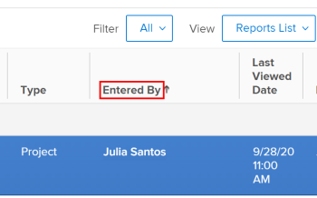

# Introdução a relatórios no Adobe Workfront

Os relatórios dão visibilidade ao que está acontecendo com os usuários e o trabalho. Usando relatórios, é possível exibir informações sobre objetos no Adobe Workfront.

Para obter informações sobre como entender objetos e como eles podem ser relatados no aplicativo Workfront, consulte [Entender objetos no Adobe Workfront](../../../workfront-basics/navigate-workfront/workfront-navigation/understand-objects.md).

## Elementos do relatório

Os relatórios são uma combinação dos três elementos a seguir no Workfront:

<table style="table-layout:auto"> 
 <col> 
 <col> 
 <tbody> 
  <tr> 
   <td role="rowheader">Exibir</td> 
   <td> <li>Define as colunas em seu relatório e quais informações você pode incluir em cada coluna.</li> <li>Para obter informações sobre visualizações, consulte o artigo <a href="../../../reports-and-dashboards/reports/reporting-elements/views-overview.md" class="MCXref xref">Visão geral das exibições no Adobe Workfront</a>.</li> </td> 
  </tr> 
  <tr> 
   <td role="rowheader">Agrupamento</td> 
   <td> <li>Categoriza as informações com base em uma informação comum e lista os resultados do relatório em cabeçalhos azuis.</li> <li>Para obter informações sobre agrupamentos, consulte o artigo <a href="../../../reports-and-dashboards/reports/reporting-elements/groupings-overview.md" class="MCXref xref">Visão geral dos agrupamentos no Adobe Workfront</a>.</li> </td> 
  </tr> 
  <tr> 
   <td role="rowheader">Filtro</td> 
   <td> <li>Controla a quantidade de informações exibidas em um relatório.</li> <li>Para obter informações sobre filtros, consulte o artigo <a href="../../../reports-and-dashboards/reports/reporting-elements/filters-overview.md" class="MCXref xref">Visão geral dos filtros no Adobe Workfront</a>.</li> <li>Para obter informações sobre modificadores de filtro, consulte o artigo <a href="../../../reports-and-dashboards/reports/reporting-elements/filter-condition-modifiers.md" class="MCXref xref">Modificadores de filtro e condição</a>.</li> <li>Você pode filtrar usando curingas, para tornar seus filtros mais gerais e dar a eles mais flexibilidade de uso.</li> <li>Para obter informações sobre o uso de curingas em filtros, consulte o artigo <a href="../../../reports-and-dashboards/reports/reporting-elements/understand-wildcard-filter-variables.md" class="MCXref xref">Variáveis de filtro curinga</a>.</li> </td> 
  </tr> 
 </tbody> 
</table>

>[!NOTE]
>
>Quando você seleciona um novo filtro, visualização ou agrupamento em uma lista, essa seleção é retida mesmo se você sair do Workfront ou fechar o navegador.

Para obter informações sobre elementos de relatório, consulte o artigo [Elementos de relatório: filtros, visualizações e agrupamentos](../../../reports-and-dashboards/reports/reporting-elements/reporting-elements-filters-views-groupings.md).

Para aprimorar seus relatórios, você pode adicionar os seguintes elementos:

* Um gráfico: uma representação visual dos resultados em seu relatório.\
   Para obter informações sobre relatórios de gráficos, consulte o artigo [Adicionar um gráfico a um relatório](../../../reports-and-dashboards/reports/creating-and-managing-reports/add-chart-report.md).

* Um agrupamento de matriz: resume as informações do relatório em um formato de tabela agregada.\
   Para obter informações sobre relatórios de matriz, consulte o artigo [Criar um relatório de matriz](../../../reports-and-dashboards/reports/creating-and-managing-reports/create-matrix-report.md).

* Um prompt: um filtro aberto que você pode personalizar e aplicar de forma diferente sempre que executar o relatório.\
   Para obter informações sobre prompts, consulte [Adicionar um prompt a um relatório](../../../reports-and-dashboards/reports/creating-and-managing-reports/add-prompt-report.md).

Ao criar um relatório, você pode modificar qualquer um desses elementos individualmente no construtor de relatórios.

Outra maneira de aprimorar a relevância das informações incluídas nos relatórios é aplicar formatação condicional às suas exibições.\
Para obter informações sobre o uso da formatação condicional, consulte [Usar formatação condicional em exibições](../../../reports-and-dashboards/reports/reporting-elements/use-conditional-formatting-views.md).

## Relatórios do sistema

O Workfront fornece vários relatórios do sistema que são carregados no seu sistema por padrão.\
Após inserir informações em seu sistema, você pode usar esses relatórios para exibir as informações visualmente.

Para obter informações sobre como acessar relatórios do sistema, consulte a seção [Usar relatórios internos do Adobe Workfront](../../../reports-and-dashboards/reports/using-built-in-reports/use-workfront-built-in-reports.md) no artigo [Usar relatórios internos do Adobe Workfront](../../../reports-and-dashboards/reports/using-built-in-reports/use-workfront-built-in-reports.md).

Para obter mais informações sobre quais relatórios do sistema estão disponíveis, consulte o artigo [Usar relatórios internos do Adobe Workfront](../../../reports-and-dashboards/reports/using-built-in-reports/use-workfront-built-in-reports.md).

## Criar relatórios

Além dos relatórios de sistema fornecidos pela Workfront, você pode criar seus próprios relatórios personalizados para atender às necessidades da organização.

Para criar um relatório, é possível fazer o seguinte:

* Crie um relatório do zero.
* Copie um relatório existente.\
   Você deve ter pelo menos a permissão Exibir para copiar um relatório criado por outra pessoa. Para obter mais informações sobre como copiar um relatório, consulte o artigo [Criar uma cópia de um relatório](../../../reports-and-dashboards/reports/creating-and-managing-reports/create-copy-report.md).

Para obter informações sobre como criar relatórios, consulte o artigo [Visão geral dos relatórios de calendário](../../../reports-and-dashboards/reports/calendars/calendar-reports-overview.md).

* [Pré-requisitos para criar relatórios](#prerequisites-for-creating-reports)
* [Propriedade do relatório](#report-ownership)
* [Criar relatórios na interface do construtor](#create-reports-in-the-builder-interface)
* [Criar relatórios no modo de texto](#create-reports-in-text-mode)

### Pré-requisitos para criar relatórios {#prerequisites-for-creating-reports}

* Você deve ter uma licença do Plan para criar seus próprios relatórios.\
   Para obter informações sobre os Tipos de licença da Workfront, consulte o artigo [Visão geral das licenças do Adobe Workfront](../../../administration-and-setup/add-users/access-levels-and-object-permissions/wf-licenses.md).

* O administrador da Workfront deve conceder acesso a Editar relatórios no Nível de acesso.\
   Para obter informações sobre como conceder acesso a Editar relatórios, consulte o artigo [Conceder acesso a relatórios, painéis e calendários](../../../administration-and-setup/add-users/configure-and-grant-access/grant-access-reports-dashboards-calendars.md).

* O administrador do Workfront deve conceder acesso a Editar filtros, exibições e agrupamentos no Nível de acesso.

   Para obter informações sobre a concessão de acesso a Editar filtros, exibições e agrupamentos, consulte [Conceder acesso a filtros, visualizações e agrupamentos](../../../administration-and-setup/add-users/configure-and-grant-access/grant-access-fvg.md).

* Você deve definir um objeto para o qual deseja criar relatórios. Os relatórios são específicos do objeto no Workfront e você deve começar com a seleção de um tipo de objeto antes de começar a criar o relatório. Você só pode criar relatórios sobre objetos disponíveis na interface do Workfront.

### Propriedade do relatório {#report-ownership}

Ao criar um relatório no Workfront, você se torna o proprietário padrão do relatório e ele é exibido na seção Meus relatórios . Não é possível alterar o proprietário de um relatório.

Ao copiar um relatório, você automaticamente se torna o proprietário do relatório copiado.

Para obter informações sobre cópia de relatórios, consulte o artigo [Criar uma cópia de um relatório](../../../reports-and-dashboards/reports/creating-and-managing-reports/create-copy-report.md).

Você pode ver quem possui um relatório marcando **Inserido por** campo.

### Criar relatórios na interface do construtor {#create-reports-in-the-builder-interface}

Recomendamos que você use a interface de criação de relatórios primeiro para criar um novo relatório. A interface oferece um conjunto simplificado de ferramentas que orienta você a reunir elementos para criar o relatório desejado. Há objetos e campos que podem ser selecionados nas listas e adicionados a todos os elementos do relatório.\
Para obter mais informações sobre como criar relatórios na interface de criação de relatórios, consulte o artigo [Criar um relatório personalizado](../../../reports-and-dashboards/reports/creating-and-managing-reports/create-custom-report.md).

Para obter uma lista de objetos que podem ser relatados, consulte a [Relatório sobre objetos](../../../workfront-basics/navigate-workfront/workfront-navigation/understand-objects.md#reporting-on-objects) no artigo [Entender objetos no Adobe Workfront](../../../workfront-basics/navigate-workfront/workfront-navigation/understand-objects.md).

Para obter mais informações sobre os campos que podem ser exibidos nos relatórios, consulte o artigo [Glossário da terminologia do Adobe Workfront](../../../workfront-basics/navigate-workfront/workfront-navigation/workfront-terminology-glossary.md).

### Criar relatórios no modo de texto {#create-reports-in-text-mode}

Às vezes, talvez não seja possível encontrar determinados campos na interface do construtor, mas eles podem estar disponíveis na API.\
Para obter informações sobre quais campos estão disponíveis na API, consulte o artigo [API Explorer](../../../wf-api/general/api-explorer.md).

Para obter informações sobre como usar o API Explorer, consulte o artigo [Uso do API Explorer](../../../wf-api/general/using-api-explorer.md).

>[!NOTE]
>
>Não é possível criar relatórios na interface do Workfront sobre objetos que não estão disponíveis no construtor de relatórios. No entanto, é possível criar relatórios sobre campos associados com os objetos no construtor de relatórios se esses campos estiverem disponíveis por meio da API. Para fazer isso, você deve usar a interface do Modo de texto .

O Modo de texto permite criar exibições, filtros, agrupamentos e prompts mais complexos, permitindo que você use campos que não estão disponíveis na interface de modo padrão.

* [Terminologia do modo de texto](#text-mode-terminology)
* [Colunas calculadas, Formatação condicional e outros usos do modo de texto](#calculated-columns-conditional-formatting-and-other-uses-of-text-mode)
* [Exemplos de modo de texto](#text-mode-samples)

#### Terminologia do modo de texto {#text-mode-terminology}

Você deve usar uma sintaxe específica para usar a interface do Workfront Text Mode .

Para obter mais detalhes sobre a sintaxe Workfront para o modo de texto, consulte [Visão geral da sintaxe do modo de texto](../../../reports-and-dashboards/reports/text-mode/text-mode-syntax-overview.md).

#### Colunas calculadas, Formatação condicional e outros usos do modo de texto {#calculated-columns-conditional-formatting-and-other-uses-of-text-mode}

Fora do relatório sobre campos que não estão disponíveis na interface do construtor, você pode usar o Modo de texto para exibir cálculos ou comparações entre determinados campos.

Para obter uma lista dos usos mais comuns do Modo de texto em um relatório, consulte o artigo [Visão geral dos usos comuns do modo de texto](../../../reports-and-dashboards/reports/text-mode/understand-common-uses-text-mode.md).

Para obter informações sobre como incluir dados personalizados calculados nos relatórios, consulte a seção [Dados personalizados calculados nos relatórios](../../../reports-and-dashboards/reports/calc-cstm-data-reports/calculated-custom-data-reports.md).

Para obter informações sobre como comparar campos na formatação condicional, consulte o artigo [Comparar campos na formatação condicional](../../../reports-and-dashboards/reports/text-mode/compare-fields-conditional-formatting.md).

Também é possível consultar campos de coleção que usam o Modo de texto nos relatórios.\
Para obter informações sobre como usar o Modo de texto para exibir informações de coleção em um relatório, consulte o artigo [Fazer referência às coleções em um relatório](../../../reports-and-dashboards/reports/text-mode/reference-collections-report.md).

#### Exemplos de modo de texto {#text-mode-samples}

Temos uma biblioteca de amostras das Exibições, Filtros e Agrupamentos mais usados que você pode criar com o Modo de texto.

Para navegar nessa biblioteca e usar algumas das amostras que oferecemos, consulte o artigo [Exibição personalizada, filtro e amostras de agrupamento](../../../reports-and-dashboards/reports/custom-view-filter-grouping-samples/custom-view-filter-grouping-samples.md).

## As guias de um relatório

Um relatório pode conter várias guias ao executar o relatório na interface.

Para obter informações sobre como executar um relatório, consulte o artigo [Executar um relatório](../../../reports-and-dashboards/reports/creating-and-managing-reports/run-report.md).

Em cada guia, as informações incluídas no relatório são exibidas em formatos ligeiramente diferentes. Escolha o formato que melhor se ajuste às necessidades de sua organização.

É possível tornar qualquer guia a guia padrão do relatório. A guia padrão é a primeira que é exibida ao clicar no nome de um relatório para abri-lo, e é a guia que é exibida ao colocar o relatório em um painel.

Dependendo de quais elementos você escolher em seu relatório, seu relatório poderá ter as seguintes guias:

* [Guia Details](#details-tab)
* [Guia Resumo](#summary-tab)
* [Guia Matrix](#matrix-tab)
* [Guia Gráfico](#chart-tab)
* [Guia Prompts](#prompts-tab)

### Guia Details {#details-tab}

A guia Details de um relatório exibe o objeto dos relatórios e os atributos escolhidos para esse objeto em um formulário de lista. Cada relatório tem uma guia Detalhes .

>[!IMPORTANT]
>
>As informações na guia Details podem ser exibidas de forma diferente na guia Chart com base no fuso horário.\
>Por exemplo, um usuário na Califórnia concluiu uma tarefa às 21h30 PST em 12 de fevereiro. Quando um usuário em Nova York exibe um relatório que inclui a conclusão da tarefa, a Data de conclusão real é exibida como 13 de fevereiro, em ambas as guias Detalhes, pois foi concluída às 12h30 EST, em 13 de fevereiro. No entanto, no gráfico, ele é incluído no agrupamento de 12 de fevereiro até que você expanda o elemento do gráfico.

### Guia Resumo {#summary-tab}

Os relatórios que incluem um Agrupamento têm uma guia Resumo.

As mesmas informações exibidas no formato de lista na guia Details são resumidas e agregadas de acordo com os agrupamentos no relatório da guia Summary .

Para obter informações sobre Grupos, consulte o artigo [Visão geral dos agrupamentos no Adobe Workfront](../../../reports-and-dashboards/reports/reporting-elements/groupings-overview.md).

### Guia Matrix {#matrix-tab}

Os relatórios que incluem um Agrupamento de matriz têm uma guia Matriz.

As mesmas informações exibidas no formato de lista na guia Details são exibidas em um formato de tabela, agrupadas pelos agrupamentos no relatório da guia Matrix .

Quando você adiciona um agrupamento Matrix a um relatório, a guia Summary é substituída pela guia Matrix .

Para obter informações sobre como criar um Agrupamento de matriz, consulte o artigo [Criar um relatório de matriz](../../../reports-and-dashboards/reports/creating-and-managing-reports/create-matrix-report.md).

### Guia Gráfico {#chart-tab}

Os relatórios que incluem um gráfico têm uma guia Gráfico.

Considere a inclusão de um gráfico em seus relatórios para painéis impactantes para seus executivos. Os gráficos são uma maneira concisa de exibir as informações em um relatório. Você pode expandir um elemento de gráfico clicando nele para exibir os itens incluídos nesse elemento.

>[!IMPORTANT]
>
>Ao clicar em um elemento de gráfico, as informações expandidas podem ser exibidas de forma diferente do gráfico com base no fuso horário.\
>Por exemplo, um usuário na Califórnia concluiu uma tarefa às 21h30 PST em 12 de fevereiro. Quando um usuário em Nova York exibe um relatório que inclui a conclusão da tarefa, a Data de Conclusão Real é exibida como 13 de fevereiro, tanto na guia Detalhes quanto nos detalhes do Gráfico, pois foi concluída às 12:30, EST, em 13 de fevereiro. No entanto, no gráfico, ele é incluído no agrupamento de 12 de fevereiro até que você expanda o elemento do gráfico.

Para obter informações sobre como criar um relatório com um gráfico, consulte o artigo [Adicionar um gráfico a um relatório](../../../reports-and-dashboards/reports/creating-and-managing-reports/add-chart-report.md).

### Guia Prompts {#prompts-tab}

Os relatórios que incluem um prompt têm uma guia Prompts .

Um prompt permite adicionar um filtro a um relatório sempre que o relatório for executado. Quando um prompt é adicionado ao relatório, a guia Prompts se torna a guia padrão do relatório automaticamente. Isso não pode ser alterado para outra guia.

Para obter informações sobre como criar um prompt para um relatório, consulte o artigo [Adicionar um prompt a um relatório](../../../reports-and-dashboards/reports/creating-and-managing-reports/add-prompt-report.md).

## Compartilhar relatórios

Após criar um relatório, é possível compartilhá-lo com outros usuários.

Você pode compartilhar um relatório com outros usuários das seguintes maneiras:

* [Conceder permissões de compartilhamento a um relatório](#give-sharing-permissions-to-a-report)
* [Programar um delivery de relatório](#schedule-a-report-delivery)
* [Exportar os resultados de um relatório](#export-the-results-of-a-report)
* [Adicionar um relatório a um painel](#add-a-report-to-a-dashboard)

### Conceder permissões de compartilhamento a um relatório {#give-sharing-permissions-to-a-report}

Você pode conceder permissões de compartilhamento a outro usuário para Exibir ou gerenciar um relatório que você criar. Você pode conceder a outro usuário um nível de permissões igual ou inferior ao seu. Você também pode tornar um relatório público usando permissões de compartilhamento. Para obter informações sobre como compartilhar um relatório, consulte [Compartilhar um relatório no Adobe Workfront](../../../reports-and-dashboards/reports/creating-and-managing-reports/share-report.md).

### Programar um delivery de relatório {#schedule-a-report-delivery}

Você pode agendar um relatório para entrega. Os usuários com os quais você está compartilhando o relatório recebem um email contendo um anexo dos resultados do relatório. O anexo pode estar nos seguintes formatos:

* HTML
* PDF
* Excel
* .TSV

Para obter informações sobre como agendar um delivery de relatório, consulte o artigo [Visão geral da entrega de relatórios](../../../reports-and-dashboards/reports/creating-and-managing-reports/set-up-report-deliveries.md).

### Exportar os resultados de um relatório {#export-the-results-of-a-report}

Você pode exportar os resultados de um relatório para os seguintes formatos de arquivo

* PDF
* Excel (formatos .xls e .xlsx)
* Delimitado por tabulação

Para obter informações sobre como exportar os resultados de um relatório, consulte o artigo [Exportar dados](../../../reports-and-dashboards/reports/creating-and-managing-reports/export-data.md).

Depois que o relatório for exportado para um desses formatos, você poderá compartilhá-lo com outros usuários, enviando-o por email como anexo ou imprimindo-o.

### Adicionar um relatório a um painel {#add-a-report-to-a-dashboard}

Você pode adicionar um relatório a um painel e compartilhá-lo com outros usuários. Para obter informações sobre como adicionar relatórios a um painel, consulte o artigo [Adicionar um relatório a um painel](../../../reports-and-dashboards/dashboards/creating-and-managing-dashboards/add-report-dashboard.md).

## Criar calendários

Se quiser exibir seus dados em um formato de calendário, crie calendários em vez de relatórios.

Para obter informações sobre como criar calendários, consulte o artigo .

Para obter informações sobre como usar calendários, consulte o artigo [Visão geral dos relatórios de calendário](../../../reports-and-dashboards/reports/calendars/calendar-reports-overview.md).

## Uso de relatórios

Depois de criar relatórios e compartilhá-los com outros usuários, é possível rastrear a frequência com que eles usam esses relatórios.\
Para obter informações sobre o uso de relatórios, incluindo a frequência com que são exibidos, por que usuário e em quais painéis são exibidos, consulte o artigo [Visão geral do uso de relatórios](../../../reports-and-dashboards/reports/report-usage/report-usage-overview.md).

## Termos comuns usados em referência a relatórios

Os termos a seguir são usados em referência aos relatórios do Workfront:

<table style="table-layout:auto"> 
 <col> 
 <col> 
 <thead> 
  <tr> 
   <th><strong>Termo ou Frase</strong> </th> 
   <th><strong>Definição</strong> </th> 
  </tr> 
 </thead> 
 <tbody> 
  <tr> 
   <td>Opções avançadas</td> 
   <td> 
Refere-se ao link na guia Colunas (Exibição) do construtor de relatórios que fornece a capacidade de fazer o seguinte:
 
    <ul> 
     <li>Definir a formatação do estilo condicional da coluna de texto e imagens com base nos critérios selecionados.</li> 
     <li>Relabilite sua coluna.</li> 
     <li>Formate os valores na coluna.</li> 
    </ul> 
Por exemplo, você pode querer mostrar todas as tarefas pai em negrito ou exibir a Data de Conclusão Planejada em vermelho se a tarefa estiver atrasada.
 </td> 
  </tr> 
  <tr> 
   <td>Atributo</td> 
   <td> O campo de um objeto, conforme definido no banco de dados. Ele é usado em uma expressão Text Mode .  Por exemplo, o campo Status é exibido como <em>status</em> quando usada em uma expressão Text Mode . </td> 
  </tr> 
  <tr> 
   <td>Bean ou JavaBean</td> 
   <td>Um Bean representa um elemento de programação reutilizável. O termo Bean identifica as relações entre diferentes objetos no aplicativo Workfront. É importante conhecer esses relacionamentos ao tentar exibir atributos adicionais sobre um objeto que não estão disponíveis nas ferramentas básicas de relatório.</td> 
  </tr> 
  <tr> 
   <td>Interface do construtor ou Report Builder</td> 
   <td>A Interface do Construtor é a série de menus suspensos contendo campos exibidos nas guias Colunas (Exibição), Filtro e Agrupamento. Ele fornece um mapeamento intuitivo dos relacionamentos Bean para auxiliar na identificação das colunas em uma exibição, os critérios de um filtro e os atributos comuns de um agrupamento.</td> 
  </tr> 
  <tr> 
   <td>Camel Case</td> 
   <td> 
Camel Case refere-se a uma maneira específica de gravar elementos de programação em atributos de várias palavras em string. Ao digitar um atributo no Camel Case, a primeira letra da primeira palavra é minúscula, não há espaço entre as palavras e a primeira letra de qualquer palavra subsequente é maiúscula.
 
Por exemplo, Grupo Doméstico seria escrito como <em>homeGroup</em>, o Pool de Recursos seria <em>resourcePool</em>e a Data de início real seria <em>atualStartDate</em>.
 </td> 
  </tr> 
  <tr> 
   <td>Gráfico</td> 
   <td> 
Uma guia dentro do construtor de relatórios, uma guia de relatório, depois de salvar o relatório, bem como um elemento opcional de um relatório que permite adicionar um gráfico a qualquer relatório. Você deve definir um Agrupamento no relatório antes de criar um gráfico.
 
A seguir estão os tipos de gráficos que podem ser adicionados a qualquer relatório: 
 
    <ul> 
     <li>Coluna</li> 
     <li>Barra</li> 
     <li>Torta</li> 
     <li>Linha</li> 
     <li>Medidor</li> 
     <li>Bolha</li> 
    </ul> 
Para obter mais informações sobre como adicionar gráficos aos relatórios, consulte o artigo <a href="../../../reports-and-dashboards/reports/creating-and-managing-reports/add-chart-report.md" class="MCXref xref">Adicionar um gráfico a um relatório</a>.
 </td> 
  </tr> 
  <tr> 
   <td>Detalhes</td> 
   <td>Esta é uma das guias de um relatório, depois de salvar o relatório. Ele exibe as conclusões do seu relatório, exibidas na visualização e no agrupamento de sua escolha.</td> 
  </tr> 
  <tr> 
   <td>Expressão</td> 
   <td>Uma Expressão é uma fórmula escrita no Modo de texto para transmitir informações a serem pesquisadas ou exibidas ao usar a interface do Modo de texto . Normalmente, é uma linha em uma declaração em Modo de texto maior.</td> 
  </tr> 
  <tr> 
   <td>Campos</td> 
   <td> 
Refere-se aos atributos de seus objetos. Por exemplo, "Status" é um campo para Projeto, Tarefa ou Problemas. "Portfolio Manager" é um campo para o objeto Portfolio.
 
Também é possível ter campos personalizados, criados e adicionados ao Forms personalizado. Para obter informações sobre como criar o Forms personalizado, consulte o artigo <a href="../../../administration-and-setup/customize-workfront/create-manage-custom-forms/create-or-edit-a-custom-form.md" class="MCXref xref">Criar ou editar um formulário personalizado</a>.
 </td> 
  </tr> 
  <tr> 
   <td>Nome do Campo </td> 
   <td>O valor de um atributo que é exibido em uma exibição ou usado na condição de um filtro ou como o elemento comum de um Agrupamento. As opções para Nome de Campo dependem da seleção de Origem de Campo.</td> 
  </tr> 
  <tr> 
   <td>Origem do Campo </td> 
   <td>O valor de um objeto exibido em uma exibição ou usado na condição de um filtro ou como o elemento comum de um Agrupamento. As opções na Fonte do campo dependem do tipo de objeto do elemento da interface do usuário que está sendo criado. A Fonte do campo permite referenciar atributos de objetos diferentes do tipo de objeto do elemento da interface do usuário.</td> 
  </tr> 
  <tr> 
   <td>Filtro</td> 
   <td>Um elemento de relatório principal que determina quais resultados são exibidos no relatório.</td> 
  </tr> 
  <tr> 
   <td>Formulário </td> 
   <td>Usado alternadamente com "Formulário personalizado". Campos e seções são adicionados a formulários, que são anexados a um objeto para estender o número de campos que podem ser associados a um objeto.</td> 
  </tr> 
  <tr> 
   <td>Agrupamento </td> 
   <td>Um elemento de relatório principal que identifica como uma lista de resultados é organizada. O Agrupamento cria barras horizontais em todo o relatório para agrupar os resultados por atributos comuns definidos ao criá-lo. Os agrupamentos são usados em Relatórios de matriz para agregar dados, bem como em gráficos, para determinar os eixos dos gráficos.</td> 
  </tr> 
  <tr> 
   <td>Tipo de objeto ou objeto</td> 
   <td> Um objeto é um elemento de aplicativo do Workfront (ou seja, Projeto, Tarefa, Grupo, Empresa, Filtro). O Tipo de objeto é usado ao criar um novo Relatório, Exibição, Filtro ou Agrupamento para identificar qual objeto é o foco do relatório. Os relatórios podem ter apenas um tipo de objeto, que é o objeto principal do relatório. Objetos pai podem ser referenciados no mesmo relatório. Para obter mais informações sobre a hierarquia de objetos, consulte a seção "Entendendo a interdependência e a hierarquia de objetos" no artigo <a href="../../../workfront-basics/navigate-workfront/workfront-navigation/understand-objects.md" class="MCXref xref">Entender objetos no Adobe Workfront</a>.</td> 
  </tr> 
  <tr> 
   <td>Solicitação de Dados</td> 
   <td> 
Um elemento de relatório opcional que pode ser adicionado a um relatório quando você precisa executar um filtro diferente antes de cada vez que executar o relatório.
 
Para obter informações sobre Prompts, consulte o artigo <a href="../../../reports-and-dashboards/reports/reporting-elements/filter-condition-modifiers.md" class="MCXref xref">Modificadores de filtro e condição</a>.
 </td> 
  </tr> 
  <tr> 
   <td>Qualificador ou Modificadores de Condição</td> 
   <td> 
Este campo aparece nas seguintes áreas de um relatório:
 
    <ul> 
     <li>Na guia Filtro</li> 
     <li>A tela Opções avançadas da coluna na guia Colunas (Exibição) . Ao definir um qualificador, você pode comparar o Nome do campo a outro campo ou valor.</li> 
     <li> Em um prompt personalizado Para obter informações sobre Prompts personalizados, consulte a seção "Criação de um prompt" no artigo <a href="../../../reports-and-dashboards/reports/reporting-elements/filter-condition-modifiers.md" class="MCXref xref">Modificadores de filtro e condição</a>.</li> 
    </ul> 
Por exemplo, ao criar um filtro para tarefas com uma Data de conclusão planejada de hoje, você selecionaria <strong>Igual</strong> no campo Qualificador e na data de hoje no campo Data :
 
<em>Tarefa &gt; Data de conclusão planejada&gt;Igual&gt;(data de hoje)</em> 
 
Nesse cenário, o Qualificador é <strong>Igual</strong>. Para obter mais informações sobre qualificadores, consulte o artigo <a href="../../../reports-and-dashboards/reports/reporting-elements/filter-condition-modifiers.md" class="MCXref xref">Modificadores de filtro e condição</a>.
 </td> 
  </tr> 
  <tr> 
   <td>Relatório </td> 
   <td>A combinação de uma Exibição, um Filtro e (às vezes) um Agrupamento. A finalidade de um relatório é exibir dados de forma consistente na interface, distribuir informações e eliminar a necessidade de executar a mesma pesquisa ou consulta regularmente.</td> 
  </tr> 
  <tr> 
   <td>Declaração</td> 
   <td>Consiste de várias expressões reunidas para definir quais informações serão exibidas em um relatório ao usar o Modo de texto. Uma instrução pode ser criada para uma Exibição, Filtro, Agrupamento ou para um Aviso personalizado em um relatório.</td> 
  </tr> 
  <tr> 
   <td>Resumo</td> 
   <td>Esta é uma das guias de um relatório, depois de salvar o relatório. Essa guia é criada somente quando você define um Agrupamento para o relatório. Ele resume as informações com base no Agrupamento definido durante a criação do relatório e fornece uma visão geral rápida dos objetos agregados do relatório. Ela não exibe todos os objetos no relatório, apenas aqueles que são agregados.</td> 
  </tr> 
  <tr> 
   <td>Interface do modo de texto</td> 
   <td>Fornece a capacidade de criar ou modificar o código de Exibições, Filtros, Agrupamentos e Prompts personalizados originalmente criados por meio da Interface do Construtor. Sugere-se que os elementos do relatório sejam inicialmente criados por meio da Interface do Construtor e depois convertidos no Modo de texto depois de terem sido salvos para simplificar a codificação de Exibições, Filtros, Agrupamentos ou Prompts avançados.</td> 
  </tr> 
  <tr> 
   <td>Interface do usuário (UI)</td> 
   <td>Refere-se aos componentes ou blocos de construção do que é exibido na tela de um usuário em um determinado momento.</td> 
  </tr> 
  <tr> 
   <td>Exibir (ou colunas)</td> 
   <td>Um dos principais elementos de um relatório. Ela identifica os cabeçalhos da coluna que serão exibidos na lista de um relatório.</td> 
  </tr> 
 </tbody> 
</table>
