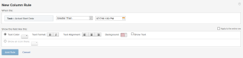

# Comparar campos na formatação condicional

Você pode usar a formatação condicional para comparar dois campos diferentes em uma exibição e destacá-los quando determinados critérios forem atendidos entre os campos.

## Requisitos de acesso

Você deve ter o seguinte acesso para executar as etapas deste artigo:

<table style="table-layout:auto"> 
 <col> 
 <col> 
 <tbody> 
  <tr> 
   <td role="rowheader">plano do Adobe Workfront*</td> 
   <td> <p>Qualquer</p> </td> 
  </tr> 
  <tr> 
   <td role="rowheader">Licença da Adobe Workfront*</td> 
   <td> <p>Plano </p> </td> 
  </tr> 
  <tr> 
   <td role="rowheader">Configurações de nível de acesso*</td> 
   <td> <p>Editar acesso a Filtros, Visualizações, Agrupamentos</p> <p>Editar acesso a Relatórios, Painéis, Calendários para editar a visualização em um relatório</p> <p>Observação: se você ainda não tiver acesso, pergunte ao administrador do Workfront se ele definiu restrições adicionais em seu nível de acesso. Para obter informações sobre como um administrador do Workfront pode modificar seu nível de acesso, consulte <a href="../../../administration-and-setup/add-users/configure-and-grant-access/create-modify-access-levels.md" class="MCXref xref">Criar ou modificar níveis de acesso personalizados</a>.</p> </td> 
  </tr> 
  <tr> 
   <td role="rowheader">Permissões de objeto</td> 
   <td> <p>Gerenciar permissões em um relatório para editar a visualização em um relatório</p> <p>Gerenciar permissões para uma exibição</p> <p>Para obter informações sobre como solicitar acesso adicional, consulte <a href="../../../workfront-basics/grant-and-request-access-to-objects/request-access.md" class="MCXref xref">Solicitar acesso aos objetos </a>.</p> </td> 
  </tr> 
 </tbody> 
</table>

&#42;Para saber qual plano, tipo de licença ou acesso você tem, contate o administrador do Workfront.

## Exemplo: Comparar a Data Inicial Real com a Data Inicial Planejada

Por exemplo, se a Data Inicial Real de uma tarefa for posterior à Data Inicial Planejada, você poderá realçar a coluna Data Inicial Planejada usando a formatação condicional.

Para comparar a Data Inicial Planejada e a Data Inicial Real da tarefa usando a formatação condicional:

1. Ir para uma exibição de tarefa ou um relatório.
1. (Condicional) Se estiver trabalhando com um relatório, na guia **Colunas (Exibição)**, clique no cabeçalho da coluna que deseja formatar condicionalmente para selecioná-la.\
   Por exemplo, selecione a coluna **Data de Início Efetivo** se desejar adicionar a formatação condicional a ela comparando os campos Data de Início Planejada e Data de Início Efetivo.

1. Clique em **Opções Avançadas** e em Adicionar uma **Regra para esta Coluna**.

1. Informe os critérios de comparação usando os valores existentes encontrados no construtor e especifique sua formatação condicional.\
   Por exemplo, queremos destacar tarefas em que a Data de Início Efetivo seja posterior (ou posterior) à Data de Início Planejada. Selecione o modificador Maior que e selecione uma data real no campo de data.\
     

1. (Opcional) Selecione **Aplicar à linha inteira** se desejar aplicar a formatação à linha inteira.
1. Clique em **Adicionar regra** e **Concluído**.

1. Selecione a coluna **Data de Início Efetiva** e clique em **Alternar para Modo de Texto**.

1. **Clique para editar o modo de texto** e adicione a seguinte linha de texto:

   ```
   styledef.case.0.comparison.rightmethod= <field to compare>
   ```

   No nosso exemplo: 

   ```
   styledef.case.0.comparison.rightmethod=plannedStartDate
   ```

   >[!NOTE]
   >
   >Se você estiver comparando um campo nativo do Workfront, use a sintaxe de camel case para o nome do campo. Se você estiver comparando um campo personalizado, use **DE:Nome Real do Campo** para o campo de nome que você está comparando com o primeiro campo.\
   >Por exemplo, se você estiver comparando a **Data de início efetiva** com um campo personalizado rotulado como **Data de entrega**, adicione a seguinte instrução no código do modo de texto:
   >
   >`styledef.case.0.comparison.rightmethod=DE:Delivery Date`

1. Verifique se a linha de código `righttext` corresponde à instrução na linha de código `rightmethod`.

   

1. Clique em **Salvar**.
1. Clique em **Salvar + Fechar**.

   A coluna destaca os campos que atendem aos seus critérios.
