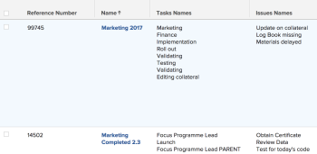
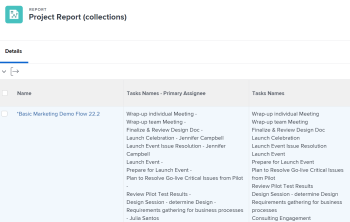
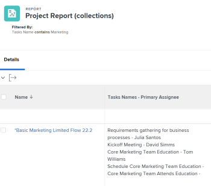

# Fazer referência a coleções em um relatório

<!-- Audited: 1/2025 -->

Criar um relatório no Adobe Workfront permite exibir um conjunto de objetos, seus respectivos campos ou objetos vinculados em um formato de lista, grade ou gráfico.

Para obter mais informações sobre como criar um relatório no Workfront, consulte [Criar um relatório personalizado](../../../reports-and-dashboards/reports/creating-and-managing-reports/create-custom-report.md).

## Requisitos de acesso

+++ Expanda para visualizar os requisitos de acesso da funcionalidade neste artigo.

<table style="table-layout:auto"> 
 <col> 
 <col> 
 <tbody> 
  <tr> 
   <td role="rowheader">Pacote do Adobe Workfront</td> 
   <td> <p>Qualquer</p> </td> 
  </tr> 
  <tr> 
   <td role="rowheader">Licença do Adobe Workfront</td> 
   <td> 
     <p>Padrão</p>
     <p>Plano</p>
   </td> 
  </tr> 
  <tr> 
   <td role="rowheader">Configurações de nível de acesso</td> 
   <td> <p>Editar acesso a Filtros, Visualizações, Agrupamentos</p> <p>Editar acesso a relatórios, painéis, calendários</p> </td> 
  </tr> 
  <tr> 
   <td role="rowheader">Permissões de objeto</td> 
   <td> <p>Gerenciar permissões para um relatório</p> <p>Gerenciar permissões para uma exibição, filtro ou agrupamento </p> </td> 
  </tr> 
 </tbody> 
</table>

Para obter mais detalhes sobre as informações contidas nesta tabela, consulte [Requisitos de acesso na documentação do Workfront](/help/quicksilver/administration-and-setup/add-users/access-levels-and-object-permissions/access-level-requirements-in-documentation.md).

+++

## Entender coleções

Uma coleção é uma lista de objetos vinculados a outro objeto.

Você tem os dois relacionamentos a seguir entre objetos no Workfront:

* **Uma relação um-para-um**: um objeto pode ser vinculado a apenas um outro objeto por vez.\
  Por exemplo, um projeto só pode ser vinculado a um portfólio por vez.

* **Uma relação um-para-muitos**: um objeto pode ser vinculado a vários outros objetos por vez.\
  Por exemplo, um projeto pode ter várias tarefas. Nesse caso, a lista de tarefas forma uma coleção para o projeto.

>[!IMPORTANT]
>
>Você pode criar um relatório que mostre a relação um para um entre os objetos usando o Report Builder padrão. No entanto, você só pode criar um relatório que mostre a relação um para muitos entre objetos usando a interface do modo de texto no Report Builder.

Para obter mais informações sobre como criar um relatório no construtor de relatórios padrão, consulte [Criar um relatório personalizado](../../../reports-and-dashboards/reports/creating-and-managing-reports/create-custom-report.md).

Para obter mais informações sobre como criar um relatório usando a interface do modo de texto, consulte:

* [Visão geral do Modo Texto](../../../reports-and-dashboards/reports/text-mode/understand-text-mode.md)
* [Visão geral dos usos comuns do Modo de Texto](../../../reports-and-dashboards/reports/text-mode/understand-common-uses-text-mode.md).
* [Visão geral da sintaxe do modo texto](../../../reports-and-dashboards/reports/text-mode/text-mode-syntax-overview.md)

## Find collection objects and their fields in the API Explorer {#find-collection-objects-and-their-fields-in-the-api-explorer}

Not all collections can be reported on.

To understand what objects can be associated with a collection of other, you must use the API Explorer.\
For more information about the API Explorer table, see the [API Explorer](../../../wf-api/general/api-explorer.md).

To find out what collections can be reported on:

1. Vá para o [API Explorer](../../../wf-api/general/api-explorer.md).
1. Localize o objeto de seu relatório.
1. Selecione a guia **coleções**.

   >[!NOTE]
   >
   >Somente os objetos listados nessa guia podem ser representados como uma coleção em um relatório do objeto selecionado.

1. Expanda o objeto da sua coleção clicando nele.
1. Clique no link exibido para ir para o objeto da sua coleção.\
   Isso abre a guia **campos** para o objeto da sua coleção.

   >[!NOTE]
   >
   >Somente os campos listados nesta guia podem ser referenciados no relatório de coleta ou nos campos associados aos objetos listados nesta guia.

## Coleções de referência em relatórios

Você pode fazer referência a objetos de uma coleção nos seguintes elementos de relatório:

* Exibições
* Filtros
* Prompts

You cannot reference objects from a collection in the following reporting elements:

* Agrupamento
* Gráfico

Por exemplo, você pode fazer referência à tarefa ou às coleções de ocorrências de um relatório de projeto para mostrar informações sobre a tarefa ou a ocorrência no nível do projeto.

* [Fazer referência a uma coleção na Exibição de um relatório](#reference-a-collection-in-the-view-of-a-report)
* [Referenciar uma coleção no Filtro de um relatório](#reference-a-collection-in-the-filter-of-a-report)
* [Fazer referência a uma coleção no prompt personalizado de um relatório](#reference-a-collection-in-the-custom-prompt-of-a-report)

### Fazer referência a uma coleção na Exibição de um relatório {#reference-a-collection-in-the-view-of-a-report}

Você pode fazer referência a uma coleção de objetos na exibição de um relatório para mostrar atributos de objetos associados ao objeto do relatório.

Por exemplo, você pode mostrar informações de tarefas ou problemas em um relatório de projeto, criando uma coluna de coleção para tarefas ou problemas na exibição do relatório.

Você pode exibir informações sobre as tarefas ou problemas, como nomes, datas, principais atribuídos, percentual concluído etc. na exibição de coleção.

A exibição mostra informações de tarefas ou problemas em um formato de lista, com cada linha da lista representando informações sobre uma tarefa ou um problema. A lista de tarefas ou problemas e seus campos aparecem na mesma linha do projeto ao qual as tarefas ou problemas pertencem.

{width=400}

* [Adicionar uma coluna de coleção em uma Exibição de relatório](#add-a-collection-column-in-a-report-view)
* [Understand the lines of a collection View in Text Mode](#understand-the-lines-of-a-collection-view-in-text-mode)
* [Limitações de uma Exibição de coleção](#limitations-of-a-collection-view)

### Adicionar uma coluna de coleção em uma Exibição de relatório {#add-a-collection-column-in-a-report-view}

Para adicionar uma coluna de coleção em uma exibição de relatório:

1. Clique no **Menu principal**  e em **Relatórios**.
1. Clique em **Novo Relatório**.
1. Selecione o objeto do relatório.
1. Saia do seu relatório e, usando o [API Explorer](../../../wf-api/general/api-explorer.md), determine quais coleções estão disponíveis para o objeto selecionado para o seu relatório.

   Para obter mais informações sobre como selecionar o objeto de sua coleção, consulte a seção [Localizar objetos de coleção e seus campos no API Explorer](#find-collection-objects-and-their-fields-in-the-api-explorer) neste artigo.

   Anote qual é o nome do objeto da coleção.

1. Usando o [API Explorer](../../../wf-api/general/api-explorer.md), vá para a lista de campos do objeto que deseja exibir na coleção.

   Para obter mais informações sobre como localizar os campos do objeto de sua coleção, consulte a seção [Localizar objetos de coleção e seus campos no API Explorer](#find-collection-objects-and-their-fields-in-the-api-explorer) neste artigo.

   Anote qual é o nome do campo que deseja exibir na coleção.

1. Volte para o relatório e, na guia **Colunas (Exibição)**, clique em **Adicionar Coluna**.
1. Clique em **Alternar para Modo de Texto**.
1. Clique em **Editar Modo de Texto**.
1. Selecione todo o texto na caixa de diálogo **Modo de Texto** e remova-o. Em seguida, cole o seguinte código se estiver fazendo referência a um campo do objeto da coleção:

   ```
   valueformat=HTML
   textmode=true
   type=iterate
   listdelimiter=<p>
   displayname=Column Name
   listmethod=nested(collection object name).lists
   valuefield=collection object field
   ```

1. Substitua o **Nome da Coluna** pelo nome da sua coluna na linha `displayname`.
1. Substitua o **nome do objeto da coleção** pelo nome do objeto da coleção na linha `listmethod`, como aparece no [API Explorer](../../../wf-api/general/api-explorer.md).

1. Substitua o **campo do objeto de coleção** pelo nome do campo do objeto de coleção na linha `valuefield`, como aparece no [API Explorer](../../../wf-api/general/api-explorer.md).

   Você pode substituir **valuefield** por **valueexpression**, se desejar criar uma expressão personalizada em sua exibição.

   Para obter mais informações sobre expressões personalizadas calculadas, consulte [Visão geral de expressões de dados calculadas](../../../reports-and-dashboards/reports/calc-cstm-data-reports/calculated-data-expressions.md).

   Por exemplo, se você deseja exibir uma lista de tarefas em um relatório de projeto. Esta coleção usa uma linha `valuefield` para fazer referência aos nomes das tarefas.

   Siga um destes procedimentos:

   * Use o código a seguir para criar a coluna:

     ```
     valueformat=HTML
     textmode=true
     type=iterate
     listdelimiter=<p>
     displayname=Project Tasks Names
     listmethod=nested(tasks).lists
     valuefield=name
     ```

   * Use o código a seguir para exibir uma lista de problemas no relatório:

     ```
     displayname=Project Issues Names
     listdelimiter=<p>
     listmethod=nested(issues).lists
     textmode=true
     type=iterate
     valuefield=name
     valueformat=HTML
     ```

     Observe que em uma coleção você deve usar **problemas** para a linha **listmethod**, em vez de **opTasks**, que é o nome do banco de dados para Problemas. Para obter informações sobre quando usar **issue** e quando usar **opTask** ao se referir a problemas, consulte [Usar “opTask” e “issue” ao fazer referência a problemas](../../../manage-work/issues/issue-information/use-optask-instead-of-issue.md).

   * If you want to display a list of the tasks in a project report along with their primary assignee, you would use a **valueexpression** line for referencing the names of the tasks adjacent to the names of their primary assignees instead of **valuefield**.

     Use the following code to build your column:

     ```
     valueformat=HTML
     textmode=true
     type=iterate
     listdelimiter=<p>
     displayname=Tasks Names - Primary Assignee
     listmethod=nested(tasks).lists
     valueexpression=CONCAT({name},' - ',{assignedTo}.{name})
     ```

1. The following column displays in the project report, listing all tasks in each project alongside their primary assignees:

   {width=400}

1. Clique em **Salvar**.
1. (Opcional) Continue editando o relatório.

   Ou

   Clique em **Salvar + Fechar** para salvar o relatório.

#### Entender as linhas de uma coleção Ver no Modo de Texto

As linhas em uma exibição do modo de texto para uma coleção estão contornadas na tabela a seguir:

<table style="table-layout:auto"> 
 <col> 
 <col> 
 <thead> 
  <tr> 
   <th><strong>Linha de Exemplo</strong> </th> 
   <th><strong>Descrição</strong> </th> 
  </tr> 
 </thead> 
 <tbody> 
  <tr> 
   <td><code>valueformat=HTML</code> </td> 
   <td> <p>Você pode usar vários valores para esta linha, mas recomendamos que o <code style="font-weight: normal;">valueformat</code> de uma lista de coleção seja <strong>HTML.</strong></p>
   </td> 
  </tr> 
  <tr> 
   <td><code>textmode=true</code> </td> 
   <td> <p>Esta linha indica que a coluna foi configurada usando o modo de texto. Se você remover essa linha, o Workfront a adicionará de volta por padrão.</p> </td> 
  </tr> 
  <tr> 
   <td><code>type=iterate</code> </td> 
   <td> <p>O <code>type</code> de uma lista é sempre <code>iterate</code>, ao criar um modo de exibição.</p> </td> 
  </tr> 
  <tr> 
   <td><code>listdelimiter=&lt;p&gt;</code> </td> 
   <td> <p>Esse é o delimitador usado para separar os valores na lista.<br>Recomendamos usar <code>&lt;p&gt;</code>, que adiciona uma quebra de linha entre os valores.</p> <p>You can also use the following:</p> <p><code>&zwj;</code> (zero-width joiner). The values of the collection have no separation between them.<br><strong>,</strong> =comma separator. The values of the collection are separated by a comma followed by no space.<br><strong>/</strong> = slash separator. The values of the collection are separated by a slash.<br><strong>-</strong> = separador de traço. Os valores da coleção são separados por um traço.<br>Deixar esta linha vazia adiciona uma vírgula seguida de um espaço entre os valores da coleção, por padrão.</p> </td> 
  </tr> 
  <tr> 
   <td><code>displayname=</code><em>Nome da Coluna</em> </td> 
   <td> <p>Substitua <strong>Nome da coluna</strong> pelo nome real da nova coluna.</p> </td> 
  </tr> 
  <tr> 
   <td><code>listmethod=nested(collection object name).list</code> </td> 
   <td> <p> Esta linha define a coleção à qual você está fazendo referência.</p> <p>Substitua o <strong>nome do objeto da coleção</strong> pelo nome do objeto ao qual você está fazendo referência na sua coleção, como aparece no <a href="../../../wf-api/general/api-explorer.md" class="MCXref xref">API Explorer</a>. Normalmente, esse valor é a forma plural do nome do objeto da coleção.</p> </td> 
  </tr> 
  <tr> 
   <td><code>valuefield=collection object field</code> </td> 
   <td> <p>Essa linha define qual campo você está referenciando a partir do objeto de coleção.</p> <p>Substitua o <strong>campo de objeto da coleção</strong> pelo nome do campo do objeto que você está referenciando na sua coleção, como aparece no <a href="../../../wf-api/general/api-explorer.md" class="MCXref xref">API Explorer</a>.</p> <p>É possível substituir essa linha por:</p> <p><strong>valueexpression</strong>=campo/campos de objeto de coleção calculada</p> <p>Usando a <strong>expressão de valor</strong>, você pode  exiba uma expressão personalizada calculada na coluna.</p> <p>For more information about how to format <strong>valueexpression</strong> lines, see <a href="../../../reports-and-dashboards/reports/text-mode/text-mode-syntax-overview.md" class="MCXref xref">Text mode syntax overview</a>.</p> </td> 
  </tr> 
 </tbody> 
</table>

#### Limitações de uma Exibição de coleção {#limitations-of-a-collection-view}

Considere as seguintes limitações ao criar uma exibição de coleção:

* Não é possível controlar a ordem na qual os dados da coleção são exibidos.
* Não é possível aplicar formatação condicional a uma exibição de coleção.
* Não é possível transformar um objeto em uma coleção em um link clicável.
* Não é possível criar uma visualização de coleção de outra coleção.\
  Por exemplo, não é possível exibir todos os atribuídos em cada tarefa em um relatório de projeto. Você só pode exibir o responsável principal em cada tarefa em uma visualização de projeto.

### Referência a uma coleção no Filtro de um relatório {#reference-a-collection-in-the-filter-of-a-report}

Você pode fazer referência a uma coleção de objetos no filtro de um relatório para filtrar os atributos de objetos associados ao objeto do relatório.

Por exemplo, você pode filtrar por informações de tarefas ou problemas em um relatório de projeto usando uma referência aos atributos de tarefas ou problemas no projeto na instrução de filtro.

>[!NOTE]
>
>Quando aplicado a campos que contêm vários valores (como uma coleção de notas em um projeto), o filtro determina a inclusão da seguinte maneira:
>
>* Se todos os itens em uma coleção contiverem o valor especificado, todo o registro será excluído dos resultados.
>* Se pelo menos um item na coleção não contiver o valor especificado, o registro permanecerá nos resultados.


Para adicionar uma referência a uma coleção em um filtro de relatório:

1. Clique no **Menu principal**  e em **Relatórios**.
1. Clique em **Novo Relatório**.
1. Selecione o objeto do relatório.
1. Afaste-se do relatório e, usando o [API Explorer](../../../wf-api/general/api-explorer.md), determine quais coleções estão disponíveis para o objeto selecionado para o relatório.

   Para obter mais informações sobre como selecionar o objeto da sua coleção, consulte a seção [Localizar objetos da coleção e seus campos no API Explorer](#find-collection-objects-and-their-fields-in-the-api-explorer) neste artigo.

   Anote qual é o nome do objeto da coleção.

1. Usando o [API Explorer](../../../wf-api/general/api-explorer.md), vá para a lista de campos do objeto que deseja exibir na coleção.

   Para obter mais informações sobre como localizar os campos do objeto de sua coleção, consulte a seção [Localizar objetos de coleção e seus campos no API Explorer](#find-collection-objects-and-their-fields-in-the-api-explorer) neste artigo.

   Anote o campo que deseja exibir na coleção.

1. Volte para o seu relatório e, na guia **Filtros**, clique em **Alternar para Modo de Texto** e depois em **Editar Modo de Texto**.

1. Na área **Definir regras de filtro para seu Relatório**, cole o seguinte código:

   ```
   collection object name:collection object field=collection object value
   collection object name:collection object field_Mod=value of the modifier
   ```

1. Substitua o **nome do objeto de coleção** pelo nome do objeto de coleção como ele aparece no [API Explorer](../../../wf-api/general/api-explorer.md). Normalmente, esse valor é a forma plural do nome do objeto da coleção.

1. Substitua o **campo do objeto de coleção** pelo nome do campo do seu objeto de coleção em, como ele aparece no [API Explorer](../../../wf-api/general/api-explorer.md).

1. Substitua o **valor do objeto de coleção** pelo valor do objeto de coleção como ele aparece no Workfront.
1. Substitua **o valor do modificador** por um modificador válido.

   Para obter uma lista de modificadores, consulte [Modificadores de filtro e condição](../../../reports-and-dashboards/reports/reporting-elements/filter-condition-modifiers.md).\
   Por exemplo, para criar um relatório de projeto que exiba somente projetos com tarefas que tenham &quot;Marketing&quot; em seu nome, use o seguinte código:

   ```
   tasks:name=Marketing
   tasks:name_Mod=cicontains
   ```

   Esse relatório só exibe projetos que tenham pelo menos uma tarefa com a palavra &quot;marketing&quot; no nome.

   {width=400}

1. Para filtrar o nome de uma ocorrência, use o seguinte código:

   ```
   issues:name=Marketing
   issues:name_Mod=cicontains
   ```

   >[!TIP]
   >
   >Observe que você deve usar `issues` para o nome do objeto da coleção, em vez de `optask`, que é como os problemas aparecem no API Explorer.

1. Clique em **Concluído**.
1. (Opcional) Continue editando o relatório.

   Ou

   Clique em **Salvar + Fechar** para salvar o relatório.

### Referenciar uma coleção no prompt personalizado de um relatório {#reference-a-collection-in-the-custom-prompt-of-a-report}

Você pode fazer referência a uma coleção de objetos no prompt personalizado de um relatório para filtrar os resultados do relatório para os atributos de objetos associados ao objeto do relatório.

Por exemplo, você pode solicitar informações sobre tarefas em um relatório de projeto usando uma referência aos atributos de tarefas no projeto no prompt personalizado do relatório.

>[!NOTE]
>
>Não é possível fazer referência a coleções em um prompt padrão.

A custom prompt is a custom filter where the statements are joined by ampersand symbols. We recommend that you build your statement in a filter, first, then join the lines of the statements with ampersands.

For more information about building a filter statement with a collection reference, see the section [Reference a collection in the Filter of a report](#reference-a-collection-in-the-filter-of-a-report) in this article.

To add a reference to a collection in the custom prompt of a report:

1. Click the **Main** menu , then click **Reports**.
1. Clique em **Novo Relatório**.
1. Selecione o objeto do relatório.
1. Crie um filtro com uma referência de coleção conforme descrito na seção [Faça referência a uma coleção no Filtro de um relatório](#reference-a-collection-in-the-filter-of-a-report) neste artigo.
1. Clique em **Configurações de Relatório**.
1. Clique em **Prompts de Relatório**.
1. Clique em **Adicionar prompt**.
1. Clique em **Personalizar prompt**.
1. Especifique o nome do prompt no campo **Campo***nome**.

1. Especifique um **Rótulo de Item Suspenso**.
1. Especifique o seguinte no campo **Condição**:

   ```
   collection object name:collection object field_Mod=value of the modifier
   ```

1. (Opcional) Especifique se essa opção é exibida por padrão no prompt.
1. Replace **collection object name** with the name of your collection object as it appears in the [API Explorer](../../../wf-api/general/api-explorer.md). Normalmente, esse valor é a forma plural do nome do objeto da coleção.
1. Substitua o **campo do objeto de coleção** pelo nome do campo do seu objeto de coleção, como ele aparece no [API Explorer](../../../wf-api/general/api-explorer.md).
1. Substitua o **valor do objeto de coleção** pelo valor do objeto de coleção como ele aparece no Workfront.

   Por exemplo, se estiver filtrando projetos nos quais o nome da tarefa contém &quot;Marketing&quot;, substitua o **valor do objeto de coleção** por **marketing**.

1. Substitua **o valor do modificador** por um modificador válido.

   Para obter uma lista de modificadores, consulte [Modificadores de filtro e condição](../../../reports-and-dashboards/reports/reporting-elements/filter-condition-modifiers.md).

   **Exemplo:** Por exemplo, para criar um relatório de projeto com um prompt personalizado no qual você deseja exibir somente projetos que tenham pelo menos uma tarefa atribuída a um usuário específico, use o código abaixo:

   ```
   tasks:assignedToID=57cf1b7a000077c9f02f66cb09c8f86c&tasks:assignedToID_Mod=in
   ```

   Isso gera um relatório em que todos os projetos listados têm pelo menos uma tarefa atribuída ao usuário cuja GUID é 57cf1b7a000077c9f02f66cb09c8f86c.

   >[!NOTE]
   >
   >Você não pode referenciar o nome do destinatário primário (campo &quot;Atribuído a&quot;) de uma tarefa, de acordo com a [API Explorer](../../../wf-api/general/api-explorer.md). Você só pode fazer referência à ID do responsável principal.

   Por exemplo, para filtrar qualquer projeto em que qualquer um dos problemas do projeto seja atribuído a um usuário específico, use o seguinte código para o seu prompt personalizado:

   ```
   issues:assignedToID=57cf1b7a000077c9f02f66cb09c8f86c&issues:assignedToID_Mod=in
   ```

   Isso gera um relatório em que todos os projetos listados têm pelo menos um problema atribuído ao usuário cuja GUID é 57cf1b7a000077c9f02f66cb09c8f86c.

   >[!NOTE]
   >
   >Observe que você deve usar **problemas** para o nome do objeto da coleção. No momento, a API Explorer não oferece um nome de objeto de coleção para problemas.

1. Clique em **Concluído**.
1. (Opcional) Continue editando o relatório.

   Ou

   Clique em **Salvar + Fechar** para salvar o relatório.
