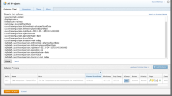

# Usar formatação condicional no Modo de texto

<!--Audited: 01/2024-->

<!--
(NOTE: Alina: this article might need to be split in its sections. Tony asked that numbers and dates should be in separate articles (??))
-->

O construtor de interface padrão oferece uma grande variedade de flexibilidade ao criar elementos de relatórios para atender às necessidades em sua organização.

Você pode aplicar formatação condicional em uma view usando a interface padrão.\
Para obter mais informações sobre como aplicar formatação condicional a uma view, consulte [Usar formatação condicional em exibições](../../../reports-and-dashboards/reports/reporting-elements/use-conditional-formatting-views.md).

## Requisitos de acesso

Você deve ter o seguinte acesso para executar as etapas deste artigo:

<table style="table-layout:auto"> 
 <col> 
 <col> 
 <tbody> 
  <tr> 
   <td role="rowheader">plano do Adobe Workfront*</td> 
   <td> <p>Qualquer</p> </td> 
  </tr> 
  <tr> 
   <td role="rowheader">Licença da Adobe Workfront*</td> 
   <td> <p>Novo: Padrão </p> 
   <p>Atual: Plano</p> 
   </td> 
  </tr> 
  <tr> 
   <td role="rowheader">Configurações de nível de acesso*</td> 
   <td> <p>Editar acesso a Filtros, Visualizações, Agrupamentos</p> <p>Editar acesso a Relatórios, Painéis, Calendários para editar visualizações em um relatório</p> </td> 
  </tr> 
  <tr> 
   <td role="rowheader">Permissões de objeto</td> 
   <td> <p>Gerenciar permissões de um relatório para editar exibições em um relatório</p> <p>Gerenciar permissões em uma exibição para editá-la</p> </td> 
  </tr> 
 </tbody> 
</table>

&#42;Para descobrir seu plano, tipo de licença ou acesso, entre em contato com o administrador do Workfront.

*Para obter mais informações sobre requisitos de acesso, consulte [Requisitos de acesso na documentação do Workfront](/help/quicksilver/administration-and-setup/add-users/access-levels-and-object-permissions/access-level-requirements-in-documentation.md).

## Formatação condicional no modo de texto

O modo de texto permite que você crie exibições, filtros, agrupamentos e prompts mais complexos, permitindo que você use campos que não estão disponíveis na interface padrão.

Para obter uma lista completa de todos os campos reportáveis, consulte  [API Explorer](../../../wf-api/general/api-explorer.md).

Para obter mais informações sobre o uso da sintaxe do modo de texto, consulte [Visão geral da sintaxe do modo de texto](../../../reports-and-dashboards/reports/text-mode/text-mode-syntax-overview.md).

Você também pode usar o modo texto para formatar exibições em relatórios e listas. Usando a formatação condicional, você pode alterar as exibições dos relatórios alterando o tipo de fonte e o plano de fundo dos resultados no relatório, bem como ícones e sinalizadores. Recomendamos que você sempre crie suas visualizações usando primeiro a interface padrão e alterne para a interface do modo de texto somente quando absolutamente necessário.

>[!NOTE]
>
> Não há suporte para o uso do estilo CSS para personalizar a formatação condicional. Em vez disso, você deve usar as opções de formatação pré-criadas disponíveis no Adobe Workfront.

## Adicionar formatação condicional a Exibições

Para obter mais informações sobre como aplicar formatação condicional a uma view na interface do construtor padrão, consulte [Usar formatação condicional em exibições](../../../reports-and-dashboards/reports/reporting-elements/use-conditional-formatting-views.md).

Para adicionar formatação condicional a uma exibição na interface do modo de texto:

1. Ir para uma lista de objetos.
1. Expanda o menu suspenso de uma exibição à qual você deseja adicionar formatação condicional.
1. Clique em **Personalizar visualização**.
1. Clique na coluna na exibição à qual deseja aplicar a formatação condicional.
1. Clique em **Alternar para modo de texto**.
1. No **Mostrar nesta coluna:** clique em **Clique para editar o texto**.
1. Adicione as amostras de código fornecidas em [Formatar Visualizações usando o Modo de Texto](#format-views-using-text-mode) na parte inferior do texto na coluna selecionada.
1. Clique em **Salvar** e, em seguida, clique em **Salvar visualização**.

## Formatar Visualizações usando o Modo de Texto {#format-views-using-text-mode}

Você pode adicionar os seguintes componentes a uma coluna em uma exibição para formatá-la condicionalmente no modo de texto:

* [Configurações de coluna](#column-settings)
* [Regras de coluna](#column-rules)
* [Formatar condicionalmente uma expressão de valor](#conditionally-format-a-valueexpression)

### Configurações de coluna {#column-settings}

Familiarize-se com a interface do modo de texto antes de adicionar formatação condicional às visualizações.

Você pode personalizar os seguintes elementos de uma coluna ao usar formatação condicional em uma exibição:

* [Cabeçalhos de coluna](#column-headers)
* [Formatar datas](#format-dates)
* [Formatar números](#format-numbers)

#### Cabeçalhos de coluna {#column-headers}

Para alterar o cabeçalho da coluna exibida, adicione o seguinte código à coluna: `displayname= [Name of column]`. Por exemplo, para nomear uma coluna como Proprietário do projeto, o código de texto seria semelhante a:

`displayname=Project Owner`

#### Formatar datas {#format-dates}

As datas podem ser configuradas para exibir em vários formatos.

Para obter mais informações, consulte [Formatar datas em relatórios do modo texto](../../../reports-and-dashboards/reports/text-mode/format-dates-in-text-mode-reports.md).

<!--
<div data-mc-conditions="QuicksilverOrClassic.Draft mode"> 
<p data-mc-conditions="QuicksilverOrClassic.Draft mode">(NOTE: this is drafted and replaced by the article linked above)</p>
<p>To establish a date format, you must modify the <code>valueformat</code> line of the text mode code in the column.</p>
<pre>valueformat= [new date format]</pre>
<p>For example, if you wanted the Projected Completion Date to be displayed as MM/DD/YY the code would look like:</p>
<pre>valueformat=atDate<br>valuefield=projectedCompletionDate </pre>
<p>If you wanted to show the Planned Completion Date as <em>Mth, DD, Year</em>, the code would look like:</p>
<pre>valueformat=mediumAtdate<br>valuefield=plannedCompletionDate</pre>
<p>You can format dates using the following <code>valueformat</code> text mode values:</p>
<table style="table-layout:auto">
<col>
<col>
<col>
<thead>
<tr>
<th scope="col"><strong>Format</strong> </th>
<th scope="col">Example </th>
<th scope="col"><em><strong>valueformat=</strong></em> </th>
</tr>
</thead>
<tbody>
<tr>
<td>MM/DD/YY</td>
<td>10/11/18</td>
<td><pre>atDate</pre> </td>
</tr>
<tr>
<td>MM/DD/YY Time</td>
<td>10/11/18 12:00pm</td>
<td><pre>longAtDate</pre> </td>
</tr>
<tr>
<td>MM/DD/YY</td>
<td>10/11/18</td>
<td><pre>shortAtDate</pre> </td>
</tr>
<tr>
<td>Mth, DD, YR</td>
<td>Oct, 11, 2018</td>
<td><pre>mediumAtDate</pre> </td>
</tr>
<tr>
<td>DW, Mth, Day, YR</td>
<td>Mon, Oct, 11, 2018</td>
<td><pre>partialAtDate</pre> </td>
</tr>
<tr>
<td>DW, Mth, Day, YR Time</td>
<td>Mon, Oct, 11, 2018 12:00 pm</td>
<td><pre>fullAtDate</pre> </td>
</tr>
</tbody>
</table>
</div>
-->

#### Formatar números {#format-numbers}

Você pode formatar valores numéricos para exibir informações que melhor se ajustam às suas necessidades de relatórios.

Para obter mais informações, consulte [Formatar números, valores de moeda e porcentagem em relatórios de modo de texto](../../../reports-and-dashboards/reports/text-mode/format-numbers-in-text-mode-reports.md).

<!--
<div data-mc-conditions="QuicksilverOrClassic.Draft mode">
<p>To modify the format of a numeric value, you must edit the <strong>valueformat</strong> line of your column.</p> 
<p data-mc-conditions="QuicksilverOrClassic.Draft mode">(NOTE: this is drafted and replaced by the article linked above) </p>
<p>For example, if you wanted to display the Budget column as $1000, the value format line would look like:</p>
<pre>valueformat=currencyStringCurrencyRounded<br>valuefield=budget</pre>
<p>You can format numbers using the following values for the <code>valueformat</code> line of your column:</p>
<table border="2" cellspacing="15" cellpadding="1">
<col>
<col>
<thead>
<tr>
<th scope="col"><strong>Example</strong> </th>
<th scope="col"><em><code>valueformat=</code></em> </th>
</tr>
</thead>
<tbody>
<tr>
<td>1234</td>
<td><pre>doubleAsString</pre> or <pre>int</pre></td>
</tr>
<tr>
<td>1,234</td>
<td><pre>doubleAsInt</pre> </td>
</tr>
<tr>
<td>$1,234</td>
<td><pre>currencyStringCurrencyRounded</pre> </td>
</tr>
<tr>
<td>1234.56</td>
<td><pre>doubleAsDouble</pre> </td>
</tr>
<tr>
<td>$1,234.56</td>
<td><pre>currencyStringCurrency</pre> </td>
</tr>
<tr>
<td>12%</td>
<td><pre>doubleAsPercentRounded</pre> </td>
</tr>
<tr>
<td>12.34%</td>
<td><pre>doubleAsPercent</pre> </td>
</tr>
<tr>
<td>(1,234.56)</td>
<td><pre>doubleAsFinancial</pre> </td>
</tr>
<tr>
<td>(1,234)</td>
<td><pre>doubleAsFiancialRounded</pre> </td>
</tr>
</tbody>
</table>
</div>
-->

### Regras de coluna {#column-rules}

As regras de coluna permitem a adição de imagens, cores, formatação e substituições de texto em uma exibição. As regras de coluna podem ser estabelecidas de forma independente ou podem conter várias condições para uma coluna.

* [Formatação condicional](#conditional-formatting)
* [Vários formatos condicionais](#multiple-conditional-formats)
* [Aplicar texto](#apply-text)
* [Aplicar formatos de linha](#apply-row-formats)
* [Aplicar imagens](#apply-images)

#### Formatação condicional {#conditional-formatting}

Uma instrução de modo de texto específica deve ser aplicada ao incorporar texto de cor ou formatação.

>[!NOTE]
>
>A formatação condicional pode não ser suportada em colunas mescladas.\
>Para obter mais informações sobre como mesclar colunas com o Modo de Texto, consulte [Exibição: mesclar informações de várias colunas em uma coluna compartilhada](../../../reports-and-dashboards/reports/custom-view-filter-grouping-samples/view-merge-columns.md).

Insira o seguinte código em qualquer coluna à qual você deseja adicionar formatação condicional:

```
styledef.case.0.comparison.leftmethod= [field name]
styledef.case.0.comparison.lefttext= [field name]
styledef.case.0.comparison.righttext= [field value]
styledef.case.0.comparison.operator= [qualifier]
styledef.case.0.comparison.operatortype= [data type]
styledef.case.0.comparison.icon=false
styledef.case.0.comparison.truetext= 
styledef.case.0.comparison.trueproperty.0.name= [format option]
styledef.case.0.comparison.trueproperty.0.value= [format style]
```

>[!NOTE]
>
>A variável `styledef.case.0.comparison.icon` A linha é sempre falsa, a menos que esteja trabalhando com ícones.
>
>A variável `styledef.case.0.comparison.truetext` linha fica sempre em branco até trabalhar com a substituição de texto.
>
>A variável `styledef.case.0.comparison.righttext` está em branco quando o qualificador não está em branco.

Por exemplo, se quisermos mostrar o Nome da empresa em texto verde em um relatório de projeto, você pode usar o seguinte código:

```
styledef.case.0.comparison.leftmethod=company:name
styledef.case.0.comparison.lefttext=company:name ;
styledef.case.0.comparison.righttext= 
styledef.case.0.comparison.operator=notblank
styledef.case.0.comparison.operatortype=string
styledef.case.0.comparison.icon=false
styledef.case.0.comparison.truetext=
styledef.case.0.comparison.trueproperty.0.name=textcolor
styledef.case.0.comparison.trueproperty.0.value=03a219
```

>[!NOTE]
>
>* Embora essa instrução possa ser aplicada a uma coluna de Nome da empresa, ela também pode ser aplicada a qualquer outra coluna no relatório. O texto em verde só seria exibido se o projeto tivesse uma Empresa associada a ele. Lembre-se do `[field name]`, `[value]`, e `[qualifier]` indique se o condicionamento aparece ou não na coluna.
>* Ao trabalhar com qualificadores, recomendamos usar `cicontains` em vez de `equal`. Por padrão, `equal` O procura números de ID. Usar o `cicontains` qualificador, você pode acessar os itens pelo seu nome.


Se Cor do texto, Alinhamento, Estilo da fonte ou Cor do plano de fundo forem aplicados a um modo de texto, a mesma instrução (mostrada acima) será usada.

As seguintes linhas devem ser modificadas para refletir a formatação correspondente necessária para a coluna:

```
styledef.case.0.comparison.trueproperty.0.name= [format option]
styledef.case.0.comparison.trueproperty.0.value= [format style]
```

Use as tabelas a seguir para identificar quais linhas devem ser modificadas e quais valores você deve especificar para definir o estilo de formato da coluna:

| **Cor do texto** | **Linha: textcolor=** |
|---|---|
| Preto | `000000` |
| Azul escuro | `0c6aca` |
| Azul-petróleo | `1b878c` |
| Verde | `03a219` |
| Roxo | `6408c4` |
| Cinza | `767676` |
| Vermelho | `d30519` |
| Amarelo | `e19503` |

{style="table-layout:auto"}

| **Alinhamento** | **Linha: align=** |
|---|---|
| Alinhamento esquerdo | `left` |
| Alinhamento direito | `right` |
| Alinhamento Central | `center` |

{style="table-layout:auto"}

| Fonte | Linha: ***fontstyle=*** |
|---|---|
| Negrito | `bold` |
| Itálico | `italic` |

{style="table-layout:auto"}

| **Cor do plano de fundo** | **Linha: bgcolor=** |
|---|---|
| Azul-petróleo | `dcf6f7` |
| Verde | `def6e2` |
| Cinza | `e8e8e8` |
| Azul | `e8f1ff` |
| Roxo | `e9def4` |
| Vermelho | `eac6c9` |
| Amarelo | `feecc8` |
| Branco | `ffffff` |

{style="table-layout:auto"}

#### Vários formatos condicionais {#multiple-conditional-formats}

É possível aplicar mais de um estilo de formatação a uma instrução. A instrução principal permaneceria inalterada e qualquer expressão de formatação adicional seria adicionada à instrução.

Por exemplo, usar a instrução anterior para incluir o Nome da empresa em texto verde em negrito. A declaração seria escrita usando o seguinte código:

```
styledef.case.0.comparison.leftmethod=company:name
styledef.case.0.comparison.lefttext=company:name
styledef.case.0.comparison.righttext=
styledef.case.0.comparison.operator=notblank
styledef.case.0.comparison.operatortype=string
styledef.case.0.comparison.icon=false
styledef.case.0.comparison.truetext= 
styledef.case.0.comparison.trueproperty.0.name=textcolor
styledef.case.0.comparison.trueproperty.0.value=03a219
styledef.case.0.comparison.trueproperty.1.name=fontstyle
styledef.case.0.comparison.trueproperty.1.value=bold
```

>[!NOTE]
>
>Ao incluir mais de uma expressão de formatação condicional, é necessário identificar numericamente cada expressão na instrução. Observe que a expressão 0 e a expressão 1 foram identificadas.

#### Aplicar texto {#apply-text}

Se quiser substituir os valores padrão que são preenchidos em uma coluna por um valor de sua escolha, será possível ao aplicar texto à coluna.

Por exemplo, em um relatório de projeto, defina o valor da coluna Data inicial planejada para não exibir a data inicial planejada para o projeto, e sim o texto &#39;Não hoje&#39;. Use o seguinte código para a coluna Data Inicial Planejada:

```
case.0.comparison.leftmethod=plannedStartDate
case.0.comparison.lefttext=plannedStartDate
case.0.comparison.righttext=2013-04-10T10:45:00:000
case.0.comparison.operator=ne
case.0.comparison.operatortype=date
case.0.comparison.icon=false
case.0.comparison.truetext=not today
styledef.case.0.comparison.leftmethod=plannedStartDate
styledef.case.0.comparison.lefttext=plannedStartDate
styledef.case.0.comparison.righttext=2013-04-10T10:45:00:000 
styledef.case.0.comparison.operator=ne
styledef.case.0.comparison.operatortype=date&
styledef.case.0.comparison.icon=false
styledef.case.0.comparison.truetext=not today
```

>[!NOTE]
>
>As linhas que começam com `case.0.` comparações de casos de uso para identificar o uso do texto. As linhas que começam com `styledef.case.0.` são declarações de formatação condicional antecipada em que identificamos o uso de texto por meio do `truetext` expressão. Defina `truetext` para um valor, em vez de deixá-lo em branco.




#### Aplicar formatos de linha {#apply-row-formats}

Se você quiser aplicar uma condição à linha inteira, use o seguinte código com o código da coluna:


```
styledef.case.0.comparison.icon=false
styledef.case.0.comparison.isrowcase=true
styledef.case.0.comparison.leftmethod= [field name]
styledef.case.0.comparison.lefttext= [field name]
styledef.case.0.comparison.operator= [qualifier]
styledef.case.0.comparison.operatortype= [data type]
styledef.case.0.comparison.righttext= [field value]
styledef.case.0.comparison.trueproperty.0.name= [format option]
styledef.case.0.comparison.trueproperty.0.value= [format style]
styledef.case.0.comparison.truetext=
row.0.styledef.applyallcases=true
row.0.styledef.case.0.comparison.icon=false
row.0.styledef.case.0.comparison.isrowcase=true
row.0.styledef.case.0.comparison.leftmethod= [field name]
row.0.styledef.case.0.comparison.lefttext= [field name]
row.0.styledef.case.0.comparison.operator= [qualifier]
row.0.styledef.case.0.comparison.operatortype= [data type]
row.0.styledef.case.0.comparison.righttext= [field value]
row.0.styledef.case.0.comparison.trueproperty.0.name= [format option]
row.0.styledef.case.0.comparison.trueproperty.0.value= [format style]
row.0.styledef.case.0.comparison.truetext=
```


#### Aplicar imagens {#apply-images}

Da mesma forma que a formatação com texto, as imagens podem ser usadas para exibir informações nos relatórios. O Workfront tem várias imagens integradas para transmitir informações visuais em uma configuração de relatório. Para usar imagens na configuração de formatação condicional, a seguinte instrução é necessária:

```
image.case.0.comparison.leftmethod= [field name]
image.case.0.comparison.lefttext= [field name]
image.case.0.comparison.righttext= [field value]
image.case.0.comparison.operator= [qualifier]
image.case.0.comparison.operatortype= [data type]
image.case.0.comparison.icon=true
image.case.0.comparison.truetext=
```

Por exemplo, em um relatório de projeto, você deseja criar uma coluna na qual você mostraria uma face frontal para cada Data de conclusão planejada que não seja igual à data de hoje. Use o seguinte código do modo de texto para adicionar o ícone à coluna:


```
image.case.0.comparison.leftmethod=plannedCompletionDate
image.case.0.comparison.lefttext=plannedCompletionDate
image.case.0.comparison.righttext=2013-04-10T13:00:00:000 
image.case.0.comparison.operator=ne 
image.case.0.comparison.operatortype=date
image.case.0.comparison.icon=true
image.case.0.comparison.truetext=/interface/images/v4_redux/icons/casebuilder/emoticon_frown.gif
```

>[!NOTE]
>
>Observe que a instrução usa o `icon=true` expressão. Essa instrução também é diferente de outras instruções de formatação condicional, pois não usa o `style.def` formato, mas um formato de imagem exclusivo.


Para usar as imagens disponíveis, aplique os seguintes códigos e valores:

| **Ícone** | **Linha: image.case.0.comparison.truetext=** |
|---|---|
| Rosto Triste  | =`/interface/images/v4_redux/icons/casebuilder/emoticon_frown.gif` |
| Rosto feliz  | =`/interface/images/v4_redux/icons/casebuilder/emoticon_smile.gif` |
| Sinalizador azul   | =`/interface/images/v4_redux/icons/casebuilder/flag_blue.gif` |
| Sinalizador verde   | =`/interface/images/v4_redux/icons/casebuilder/flag_green.gif` |
| Sinalizador vermelho   | =`/interface/images/v4_redux/icons/casebuilder/flag_red.gif` |
| Sinalizador amarelo   | =`/interface/images/v4_redux/icons/casebuilder/flag_yellow.gif` |
| Círculo Preto   | =`/interface/images/v4_redux/icons/casebuilder/light_black.gif` |
| Círculo azul  | =`/interface/images/v4_redux/icons/casebuilder/light_blue.gif` |
| Círculo cinza  | =`/interface/images/v4_redux/icons/casebuilder/light_grey.gif` |
| Círculo verde  | =`/interface/images/v4_redux/icons/casebuilder/light_green.gif` |
| Círculo Laranja  | =`/interface/images/v4_redux/icons/casebuilder/light_orange.gif` |
| Círculo Rosa  | =`/interface/images/v4_redux/icons/casebuilder/light_pink.gif` |
| Círculo roxo  | =`/interface/images/v4_redux/icons/casebuilder/light_purple.gif` |
| Círculo Vermelho  | =`/interface/images/v4_redux/icons/casebuilder/light_red.gif` |
| Círculo Branco  | =`/interface/images/v4_redux/icons/casebuilder/light_white.gif` |
| Círculo amarelo  | =`/interface/images/v4_redux/icons/casebuilder/light_yellow.gif` |

{style="table-layout:auto"}

### Formatar condicionalmente um `valueexpression` {#conditionally-format-a-valueexpression}

Para exibir um valor calculado em uma coluna, você pode substituir o `valuefield` linha de código na coluna com uma `valueexpression`. Um valor calculado permite exibir um novo valor para um objeto com base no cálculo entre dois campos existentes no mesmo objeto.

Para obter mais informações sobre como formatar a variável `valueexpression line`, consulte [Visão geral da sintaxe do modo de texto](../../../reports-and-dashboards/reports/text-mode/text-mode-syntax-overview.md).

Não é possível formatar condicionalmente uma coluna que contém um `valueexpression` linha de código. Em vez disso, você pode adicionar um Campo personalizado calculado a um Formulário personalizado e associá-lo aos objetos que você está exibindo no relatório. Em seguida, é possível formatar condicionalmente as colunas que exibem esse campo.

Para obter mais informações sobre Campos personalizados calculados, consulte [Adicionar dados calculados a um formulário personalizado](../../../administration-and-setup/customize-workfront/create-manage-custom-forms/add-calculated-data-to-custom-form.md).

## Adicionar um valor de agregador em uma coluna Text Mode

Recomendamos que você crie a coluna na interface do construtor primeiro, adicione o valor do agregador lá e edite a coluna no Modo de texto.

Considere o seguinte ao adicionar agregadores a uma coluna no Modo de Texto:

* Os valores na coluna devem ter um formato que possa ser resumido. Por exemplo, eles devem ter um dos seguintes formatos:

   * Número
   * Data
   * Moeda

* Você pode adicionar um agregador a uma coluna que exibe um cálculo. O valor agregado é exibido no agrupamento da exibição ou do relatório. Para obter mais informações, consulte [Grouping: exibe o resultado da agregação de vários valores calculados em um agrupamento](../../../reports-and-dashboards/reports/custom-view-filter-grouping-samples/grouping-calculation-between-two-fields-aggregated-in-grouping.md).
* As linhas de código para a definição da coluna devem ser idênticas às linhas de código que introduzem o agregador e precedidas por &quot;agregador&quot;. Por exemplo, se você tiver uma coluna em que exibe Horas planejadas em um projeto, o modo de texto das linhas principais da coluna será:

```
  valuefield=workRequired
  valueformat=compound
```

Quando você quiser agregar os valores de todas as linhas no agrupamento da exibição, podemos adicionar o seguinte código para adicionar os valores do agregador:

`aggregator.valuefield=workRequired` (o `aggregator.valuefield` a linha deve ser igual à `valuefield` que descreve a coluna)

`aggregator.valueformat=compound` (o `aggregator.valueformat` linha deve ter o mesmo valor que `valueformat` que descreve a coluna)

`aggregator.function=SUM` (esta é uma linha obrigatória que indica como você deseja agregar a coluna; neste caso, você deseja adicionar todas as Horas Planejadas individuais em um número na linha de agrupamento)

`aggregator.displayformat=minutesAsHoursString` (como as horas são armazenadas no Workfront em minutos, queremos indicar a `displayformat` para horas quando são armazenadas em minutos)
