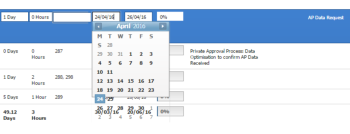

# Datas de edição embutidas turnos calendário exibir fora da caixa

## Problema

Ao editar datas em linha em uma lista de objetos, o calendário exibe mais datas do que deveria. Isso faz com que os dias sejam exibidos fora da caixa de calendário.\

## Causa

A exibição da janela do navegador foi modificada para ser exibida em um nível de zoom superior a 100%.

## Solução

Você deve alterar o nível de zoom do navegador para 100% ou menos.

Alterar o nível de zoom do navegador depende do navegador usado.

Para alterar o nível de zoom no Google Chrome:

1. Em uma janela do navegador, navegue até **Exibir**.
1. Clique em **Ampliar** para reduzir o nível de zoom na janela atual do navegador.\
   A área de exibição do seu navegador é reduzida.
