# Ícones de status integrados nas visualizações

<!-- Audited: 11/2024 -->

<!--(NOTE: ALina: ***Link this from the Understanding Fields in Lists and Reports.)-->

Você pode adicionar o campo Ícones de status internos como uma coluna nas exibições para melhorar a visibilidade dos pontos principais sobre os objetos. Usando os Ícones de status, você pode ver rapidamente quando as seguintes condições existem:

* Um objeto tem documentos em anexo
* Um objeto está associado a um processo de aprovação
* Um objeto tem notas adicionais associadas a ele
* Uma despesa é faturável ou reembolsável
* Uma tarefa está em um caminho crítico
* Um usuário pertence a uma empresa, equipe ou está localizado pessoalmente em um fuso horário diferente

Considere o seguinte:

* A maioria dos indicadores no campo Ícones de status são links rápidos para o objeto ou a área real do objeto que eles representam.

* Se algum item representado pelos ícones estiver ausente do objeto, o ícone que representa o item ausente aparecerá esmaecido na coluna Ícones de status em vez de uma imagem colorida.

  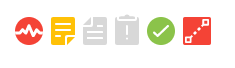

  Para obter mais informações, consulte a seção [Visão Geral de Ícones e Sinalizadores de Status](#overview-of-status-icons-and-flags) neste artigo.

* Em algumas exibições, o campo **Ícones de Status** é chamado de **Sinalizadores** ou **Ícones de Exibição**.\
  Não é possível personalizar a aparência dos ícones incluídos no campo Ícones de status.

* Não é possível editar o número de ícones no campo Ícones de status.

## Requisitos de acesso

+++ Expanda para visualizar os requisitos de acesso da funcionalidade neste artigo. 

<table style="table-layout:auto"> 
 <col> 
 <col> 
 <tbody> 
  <tr> 
   <td role="rowheader">Pacote do Adobe Workfront</td> 
   <td> 
Qualquer
 </td> 
  </tr> 
  <tr> 
   <td role="rowheader">Licença do Adobe Workfront</td> 
   <td> 
      
Colaborador ou posterior

      
Solicitação ou posterior

   </td>
  </tr>
  <tr> 
   <td role="rowheader">Configurações de nível de acesso</td> 
   <td> 
Editar acesso a Filtros, Visualizações, Agrupamentos
 
Editar acesso a relatórios, painéis, calendários para adicionar colunas a um relatório
</td> 
  </tr> 
  <tr> 
   <td role="rowheader">Permissões de objeto</td> 
   <td> 
Gerenciar permissões para uma exibição existente
 
Gerenciar permissões de um relatório para adicionar colunas a ele
</td> 
  </tr> 
 </tbody> 
</table>

Para obter mais detalhes sobre as informações contidas nesta tabela, consulte [Requisitos de acesso na documentação do Workfront](/help/quicksilver/administration-and-setup/add-users/access-levels-and-object-permissions/access-level-requirements-in-documentation.md).

+++

## Adicionar o campo Ícones de status a uma exibição

Algumas exibições e relatórios internos já têm o campo Ícones de status incluído.

Não é possível adicionar o campo Ícones de status a todas as exibições.

Para adicionar o campo Ícones de status a uma exibição personalizada criada do zero:

1. Vá para uma lista de qualquer um dos seguintes objetos:

   * Tarefas
   * Problemas
   * Projetos
   * Modelo de Tarefa
   * Modelos
   * Despesas
   * Documentos
   * Usuários\
     Apenas esses objetos têm o campo **Ícones de Status** disponível.\
     Para obter informações sobre listas de objetos, consulte [Introdução às listas no Adobe Workfront](../../../workfront-basics/navigate-workfront/use-lists/view-items-in-a-list.md).

1. No menu suspenso **Exibição**, selecione **Nova Exibição**.

1. Clique em **Adicionar coluna**.
1. Na caixa **Mostrar nesta coluna**, comece a digitar qualquer um dos seguintes nomes de campo e selecione-o quando ele aparecer na lista:

   * *Ícones de Status*
   * *Sinalizadores*
   * *Exibir Ícones* (somente em exibições de Documento).

   Os ícones internos são listados sob qualquer um desses nomes.\
   O modo de exibição Modelo contém os **Ícones de Status** e os **Sinalizadores** campos. Nesse caso, as duas colunas contêm ícones idênticos.\
   Os modos de exibição de documento contêm um campo **Exibir Ícones**.

1. Clique em **Salvar visualização**.
1. (Opcional) Especifique um novo nome para o modo de exibição e clique em **Salvar Modo de Exibição**.\
   Isso adiciona a coluna **Ícones de Status** ao Modo de Exibição.
1. (Opcional) Passe o mouse sobre um ícone para entender o que ele representa.
1. (Opcional) Clique em um ícone para ir até a área do objeto representado por ele.\
   Nem todos os ícones são vínculos a objetos.\
   Para obter uma lista completa de atributos para cada ícone, consulte a seção [Visão Geral de Ícones e Sinalizadores de Status](#overview-of-status-icons-and-flags).

## Visão Geral de Ícones e Sinalizadores de Status {#overview-of-status-icons-and-flags}

A tabela a seguir lista todos os Ícones de status disponíveis no Workfront, os tipos de objetos que podem ser associados a eles e o que acontece quando você clica neles.

Você deve ter permissões para pelo menos Exibir os objetos para poder clicar em alguns dos ícones a seguir e acessar esses objetos.

<table style="table-layout:auto"> 
 <col> 
 <col> 
 <col> 
 <col> 
 <col> 
 <thead> 
  <tr> 
   <th><strong>Ícone ou Sinalizador de Status</strong> </th> 
   <th><strong>Descrição</strong> </th> 
   <th><strong>Objeto</strong> </th> 
   <th>Ao clicar</th> 
   <th> </th> 
  </tr> 
 </thead> 
 <tbody> 
  <tr> 
   <td> ou  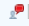 ou   ou </td> 
   <td>Indica que a condição do projeto é No destino (verde), Em problema (vermelho) ou Em risco (amarelo). Para obter informações sobre a Condição do projeto, consulte <a href="../../../manage-work/projects/manage-projects/project-condition-and-condition-type.md" class="MCXref xref">Visão Geral da Condição do Projeto e do Tipo de Condição</a>.</td> 
   <td>Projetos</td> 
   <td>Clique para abrir a lista de tarefas do projeto. </td> 
   <td> </td> 
  </tr> 
  <tr> 
   <td>  </td> 
   <td>Indica que o objeto tem observações (atualizações) na guia Atualizações.</td> 
   <td> 
Projetos Tarefas Problemas Modelos Tarefas de Modelo
 </td> 
   <td> 
Clique em para abrir a guia Atualizações do objeto. 
 </td> 
   <td> </td> 
  </tr> 
  <tr> 
   <td> ou </td> 
   <td>Indica que o objeto tem documentos anexados. </td> 
   <td> Projetos Tarefas Problemas Modelos Tarefas de Modelo </td> 
   <td>Clique em para abrir a guia Documentos do objeto. </td> 
   <td> </td> 
  </tr> 
  <tr> 
   <td> ou </td> 
   <td>Indica que há ocorrências abertas no projeto ou na tarefa.</td> 
   <td> Projetos Tarefas </td> 
   <td>Clique para abrir o objeto. </td> 
   <td> </td> 
  </tr> 
  <tr> 
   <td>  ou </td> 
   <td>Indica que há uma aprovação no objeto.</td> 
   <td> Projetos Tarefas Problemas Modelos Tarefas de Modelo </td> 
   <td>Clique para abrir o objeto. </td> 
   <td> </td> 
  </tr> 
  <tr> 
   <td>  </td> 
   <td> 
Você pode adicionar uma coluna Ícone de Despesas em sua exibição para exibir esse ícone. Isso indica que o projeto ou a tarefa tem despesas associadas a eles.
 </td> 
   <td> 
Projetos
 
Tarefas
 </td> 
   <td>Clique para abrir a guia Despesas do projeto ou da tarefa. </td> 
   <td> </td> 
  </tr> 
  <tr> 
   <td>    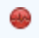      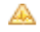 </td> 
   <td> 
Indica que o Status do Andamento de uma tarefa é um dos seguintes:
 
    <ul> 
     <li>No prazo (quadrado verde)</li> 
     <li>Atrasado (círculo vermelho)</li> 
     <li>Em risco (diamante azul)</li> 
     <li>Atrás (triângulo amarelo)</li> 
    </ul> 
Para obter informações sobre o Status do Progresso das tarefas, consulte <a href="../../../manage-work/tasks/task-information/task-progress-status.md" class="MCXref xref">Visão geral do Status do Progresso da Tarefa</a>.
 </td> 
   <td>Tarefas</td> 
   <td>Clique em para abrir a tarefa. </td> 
   <td> </td> 
  </tr> 
  <tr> 
   <td>  ou 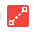</td> 
   <td>Indica que a tarefa está atualmente no Caminho Crítico.  Para obter informações sobre tarefas em um Caminho Crítico do projeto, consulte <a href="../../../manage-work/tasks/manage-tasks/critical-path.md" class="MCXref xref">Visão geral do Caminho Crítico do projeto</a>.</td> 
   <td>Tarefas</td> 
   <td>Clique em para abrir a tarefa.</td> 
   <td> </td> 
  </tr> 
  <tr> 
   <td>  </td> 
   <td>Indica que a tarefa está associada a uma etapa. O administrador do sistema pode personalizar a cor do diamante do ambiente. Para obter informações sobre etapas, consulte <a href="../../../administration-and-setup/customize-workfront/configure-approval-milestone-processes/create-milestone-path.md" class="MCXref xref">Criar um caminho de etapa do projeto</a>.</td> 
   <td>Tarefas</td> 
   <td>Clique em para abrir a tarefa. </td> 
   <td> </td> 
  </tr> 
  <tr> 
   <td> 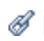 </td> 
   <td>Vincule ao objeto de origem de uma ocorrência. O objeto de origem de uma ocorrência é o objeto em que a ocorrência foi registrada. Uma tarefa ou um projeto pode ser objetos de origem para ocorrências. </td> 
   <td>Problemas</td> 
   <td>Clique para abrir o objeto de origem (tarefa ou projeto) de uma ocorrência. </td> 
   <td> </td> 
  </tr> 
  <tr> 
   <td>  </td> 
   <td>Indica que há um objeto de resolução que finalmente resolve o problema. Nesse caso, você não pode concluir o problema. É concluído quando o objeto de resolução é concluído.  Para obter informações sobre como resolver objetos, consulte <a href="../../../manage-work/issues/convert-issues/resolving-and-resolvable-objects.md" class="MCXref xref">Visão Geral de Resolvendo e Resolvendo Objetos </a>.</td> 
   <td>Problemas</td> 
   <td>Clique em para abrir o objeto de resolução do problema. </td> 
   <td> </td> 
  </tr> 
  <tr> 
   <td> 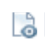 </td> 
   <td>Visualizar um documento.</td> 
   <td>Documentos</td> 
   <td>Clique em para baixar o documento.</td> 
   <td> </td> 
  </tr> 
  <tr> 
   <td>  </td> 
   <td>Baixe um documento.</td> 
   <td>Documentos</td> 
   <td>Clique em para baixar o documento.</td> 
   <td> </td> 
  </tr> 
  <tr> 
   <td> 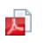 </td> 
   <td>Indica o tipo de documento.</td> 
   <td>Documentos</td> 
   <td>Clique em para baixar o documento.</td> 
   <td> </td> 
  </tr> 
  <tr> 
   <td>  </td> 
   <td>Indica que o usuário está associado a uma Empresa. </td> 
   <td>Usuários</td> 
   <td>Indisponível</td> 
   <td> </td> 
  </tr> 
  <tr> 
   <td>  </td> 
   <td>Indica que o usuário está associado a uma Equipe.</td> 
   <td>Usuários</td> 
   <td>Clique em para abrir o perfil do usuário.</td> 
   <td> </td> 
  </tr> 
  <tr> 
   <td>  </td> 
   <td>Atalho para a guia Alocação do usuário. </td> 
   <td>Usuários</td> 
   <td>Clique para abrir a guia Alocação do usuário e saber a quais itens de trabalho o usuário está atribuído.</td> 
   <td> </td> 
  </tr> 
  <tr> 
   <td>  </td> 
   <td>Indica que o usuário está em um fuso horário diferente do do sistema.</td> 
   <td>Usuários</td> 
   <td>Indisponível</td> 
   <td> </td> 
  </tr> 
  <tr> 
   <td> 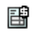 </td> 
   <td>Indica que uma despesa é faturável. Para obter informações sobre despesas, consulte <a href="../../../manage-work/projects/project-finances/manage-project-expenses.md" class="MCXref xref">Gerenciar despesas do projeto </a>.</td> 
   <td>Despesas</td> 
   <td>Indisponível</td> 
   <td> </td> 
  </tr> 
  <tr> 
   <td> 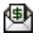 </td> 
   <td> Indica que uma despesa é reembolsável. Para obter informações sobre despesas, consulte <a href="../../../manage-work/projects/project-finances/manage-project-expenses.md" class="MCXref xref">Gerenciar despesas do projeto </a>.</td> 
   <td>Despesas</td> 
   <td>Indisponível</td> 
   <td> </td> 
  </tr> 
  <tr> 
   <td> 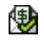</td> 
   <td> Indica que uma despesa foi reembolsada. Para obter informações sobre despesas, consulte <a href="../../../manage-work/projects/project-finances/manage-project-expenses.md" class="MCXref xref">Gerenciar despesas do projeto </a>.</td> 
   <td>Despesas</td> 
   <td>Indisponível</td> 
   <td> </td> 
  </tr> 
 </tbody> 
</table>
