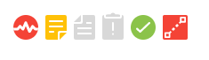

# Ícones de status embutidos em Exibições

<!--

(NOTE: ALina: ***Link this from the Understanding Fields in Lists and Reports.) 

-->

Você pode adicionar o campo Ícones de status como uma coluna em suas visualizações para melhorar a visibilidade sobre pontos-chave em seus objetos. Ao usar os Ícones de status, você pode ver rapidamente quando as seguintes condições existem:

* Um objeto tem documentos anexados
* Um objeto está associado a um processo de aprovação
* Um objeto tem observações adicionais associadas a ele
* Uma despesa é faturável ou reembolsável
* Uma tarefa está em um caminho crítico
* Um usuário pertence a uma empresa, equipe ou está localizado em um fuso horário diferente

Considere o seguinte:

* A maioria dos indicadores no campo Ícones de status são links rápidos para o objeto ou área real do objeto que eles representam.

* Se qualquer um dos itens representados pelos ícones estiver ausente no objeto, o ícone que representa o item ausente aparecerá esmaecido na coluna Ícones de status em vez de uma imagem colorida.

  

  Para obter mais informações, consulte a seção [Visão Geral de Ícones e Sinalizadores de Status](#overview-of-status-icons-and-flags) neste artigo.

* Em algumas exibições, o campo **Ícones de Status** é denominado **Sinalizadores** ou **Ícones de Exibição**.\
  Não é possível personalizar a aparência dos ícones incluídos no campo Ícones de status.

* Não é possível editar o número de ícones no campo Status Icons.

## Requisitos de acesso

Você deve ter o seguinte acesso para executar as etapas deste artigo:

<table style="table-layout:auto"> 
 <col> 
 <col> 
 <tbody> 
  <tr> 
   <td role="rowheader">plano do Adobe Workfront*</td> 
   <td> 
Qualquer
 </td> 
  </tr> 
  <tr> 
   <td role="rowheader">Licença da Adobe Workfront*</td> 
   <td> 
Solicitação ou superior
 </td> 
  </tr> 
  <tr> 
   <td role="rowheader"> </td> 
   <td> </td> 
  </tr> 
  <tr> 
   <td role="rowheader">Configurações de nível de acesso*</td> 
   <td> 
Editar acesso a Filtros, Visualizações, Agrupamentos
 
Editar acesso a relatórios, painéis, calendários para adicionar colunas a um relatório
 
Observação: se você ainda não tiver acesso, pergunte ao administrador do Workfront se ele definiu restrições adicionais em seu nível de acesso. Para obter informações sobre como um administrador do Workfront pode modificar seu nível de acesso, consulte <a href="../../../administration-and-setup/add-users/configure-and-grant-access/create-modify-access-levels.md" class="MCXref xref">Criar ou modificar níveis de acesso personalizados</a>.
 </td> 
  </tr> 
  <tr> 
   <td role="rowheader">Permissões de objeto</td> 
   <td> 
Gerenciar permissões para uma exibição existente
 
Gerenciar permissões de um relatório para adicionar colunas a ele
 
Para obter informações sobre como solicitar acesso adicional, consulte <a href="../../../workfront-basics/grant-and-request-access-to-objects/request-access.md" class="MCXref xref">Solicitar acesso aos objetos </a>.
 </td> 
  </tr> 
 </tbody> 
</table>

&#42;Para saber qual plano, tipo de licença ou acesso você tem, contate o administrador do Workfront.

## Adicionar o campo Ícones de Status a uma exibição

Algumas exibições e relatórios internos já têm o campo Ícones de status incluído.

Não é possível adicionar o campo Ícones de Status a todas as exibições.

Para adicionar o campo Ícones de status a uma exibição personalizada criada do zero:

1. Vá para uma lista de qualquer um dos seguintes objetos:

   * Tarefas
   * Problemas
   * Projetos
   * Modelo de Tarefa
   * Modelos
   * Despesas
   * Documentos
   * Usuários\
     Somente estes objetos têm o campo **Ícones de Status** disponível.\
     Para obter informações sobre listas de objetos, consulte [Introdução a listas no Adobe Workfront](../../../workfront-basics/navigate-workfront/use-lists/view-items-in-a-list.md).

1. No menu suspenso **Exibir**, selecione **Nova Exibição**.

1. Clique em **Adicionar coluna**.
1. Na caixa **Mostrar nesta coluna**, comece digitando qualquer um dos seguintes nomes de campo e, em seguida, selecione-o quando ele aparecer na lista:

   * *Ícones de Status*
   * *Sinalizadores*
   * *Ícones de Exibição *(somente em Exibições de documentos).

   Os ícones integrados estão listados em qualquer um desses nomes.\
   Um modo de exibição de Modelo contém os campos **Ícones de Status** e **Sinalizadores**. Nesse caso, as duas colunas contêm ícones idênticos.\
   Exibições de documentos contêm um campo **Exibir Ícones**.

1. Clique em **Salvar visualização**.
1. (Opcional) Especifique um novo nome para o modo de exibição e clique em **Salvar Modo de Exibição**.\
   Isso adiciona a coluna **Ícones de Status** à sua Exibição.
1. (Opcional) Passe o mouse sobre um ícone para entender o que ele representa.
1. (Opcional) Clique em um ícone para ir até a área do objeto representado por ele.\
   Nem todos os ícones são links para objetos.\
   Para obter uma lista completa de atributos para cada ícone, consulte a seção [Visão Geral de Ícones e Sinalizadores de Status](#overview-of-status-icons-and-flags).

## Visão Geral dos Ícones e Sinalizadores de Status {#overview-of-status-icons-and-flags}

A tabela a seguir lista todos os Ícones de Status disponíveis no Workfront, o tipo de objetos que podem ser associados a eles, bem como o que acontece quando você clica neles.

Você deve ter permissões para pelo menos Exibir os objetos para poder clicar em alguns dos ícones a seguir e acessar esses objetos.

<table style="table-layout:auto"> 
 <col> 
 <col> 
 <col> 
 <col> 
 <col> 
 <thead> 
  <tr> 
   <th><strong>Ícone ou Sinalizador de Status</strong> </th> 
   <th><strong>Descrição</strong> </th> 
   <th><strong>Objeto</strong> </th> 
   <th>Ao clicar</th> 
   <th> </th> 
  </tr> 
 </thead> 
 <tbody> 
  <tr> 
   <td> ou   ou   ou </td> 
   <td>Indica que a condição do projeto é No alvo (verde), Com problema (vermelho) ou Em risco (amarelo). Para obter informações sobre a Condição do projeto, consulte <a href="../../../manage-work/projects/manage-projects/project-condition-and-condition-type.md" class="MCXref xref">Visão Geral da Condição do Projeto e do Tipo de Condição</a>.</td> 
   <td>Projetos</td> 
   <td>Clique em para abrir a lista de tarefas do projeto. </td> 
   <td> </td> 
  </tr> 
  <tr> 
   <td>  </td> 
   <td>Indica que o objeto tem observações (atualizações) na guia Atualizações.</td> 
   <td> 
Projetos Tarefas Problemas Modelos Tarefas de Modelo
 </td> 
   <td> 
Clique em para abrir a guia Atualizações do objeto. 
 </td> 
   <td> </td> 
  </tr> 
  <tr> 
   <td> ou </td> 
   <td>Indica que o objeto tem documentos anexados. </td> 
   <td> Projetos Tarefas Problemas Modelos Tarefas de Modelo </td> 
   <td>Clique em para abrir a guia Documentos do objeto. </td> 
   <td> </td> 
  </tr> 
  <tr> 
   <td> ou </td> 
   <td>Indica que há problemas em aberto no projeto ou na tarefa.</td> 
   <td> Projetos Tarefas </td> 
   <td>Clique em para abrir o objeto. </td> 
   <td> </td> 
  </tr> 
  <tr> 
   <td>  ou </td> 
   <td>Indica que há uma aprovação no objeto.</td> 
   <td> Projetos Tarefas Problemas Modelos Tarefas de Modelo </td> 
   <td>Clique em para abrir o objeto. </td> 
   <td> </td> 
  </tr> 
  <tr> 
   <td>  </td> 
   <td> 
Você pode adicionar uma coluna Expenses Icon em sua visualização para exibir esse ícone. Isso indica que o projeto ou a tarefa tem despesas associadas a eles.
 </td> 
   <td> 
Projetos
 
Tarefas
 </td> 
   <td>Clique para abrir a guia Despesas do projeto ou da tarefa. </td> 
   <td> </td> 
  </tr> 
  <tr> 
   <td>           </td> 
   <td> 
Indica que o Status do Progresso de uma tarefa é um dos seguintes:
 
    <ul> 
     <li>No Prazo (quadrado verde)</li> 
     <li>Atrasado (círculo vermelho)</li> 
     <li>Em Risco (diamante azul)</li> 
     <li>Atrás (triângulo amarelo)</li> 
    </ul> 
Para obter informações sobre o Status de Progresso das tarefas, consulte <a href="../../../manage-work/tasks/task-information/task-progress-status.md" class="MCXref xref">Visão geral do Status de Progresso da Tarefa</a>.
 </td> 
   <td>Tarefas</td> 
   <td>Clique em para abrir a tarefa. </td> 
   <td> </td> 
  </tr> 
  <tr> 
   <td>  ou </td> 
   <td>Indica que a tarefa está atualmente no Caminho Crítico.  Para obter informações sobre tarefas em um Caminho Crítico do projeto, consulte <a href="../../../manage-work/tasks/manage-tasks/critical-path.md" class="MCXref xref">Visão Geral do Caminho Crítico do projeto</a>.</td> 
   <td>Tarefas</td> 
   <td>Clique em para abrir a tarefa.</td> 
   <td> </td> 
  </tr> 
  <tr> 
   <td>  </td> 
   <td>Indica que a tarefa está associada a uma etapa. O administrador do sistema pode personalizar a cor do diamante em seu ambiente. Para obter informações sobre etapas, consulte <a href="../../../administration-and-setup/customize-workfront/configure-approval-milestone-processes/create-milestone-path.md" class="MCXref xref">Criar um caminho de etapas</a>.</td> 
   <td>Tarefas</td> 
   <td>Clique em para abrir a tarefa. </td> 
   <td> </td> 
  </tr> 
  <tr> 
   <td>  </td> 
   <td>Vincular ao objeto de origem de um problema. O objeto de origem de um problema é o objeto no qual o problema foi registrado. Uma tarefa ou um projeto podem ser objetos de origem para problemas. </td> 
   <td>Problemas</td> 
   <td>Clique para abrir o objeto de origem (tarefa ou projeto) de um problema. </td> 
   <td> </td> 
  </tr> 
  <tr> 
   <td>  </td> 
   <td>Indica que há um objeto de resolução que resolve o problema. Nesse caso, não é possível concluir o problema. Ele é concluído quando o objeto de resolução é concluído.  Para obter informações sobre a resolução de objetos, consulte <a href="../../../manage-work/issues/convert-issues/resolving-and-resolvable-objects.md" class="MCXref xref">Visão Geral de Objetos Resolventes e Resolvíveis </a>.</td> 
   <td>Problemas</td> 
   <td>Clique em para abrir o objeto de resolução do problema. </td> 
   <td> </td> 
  </tr> 
  <tr> 
   <td>  </td> 
   <td>Visualizar um documento.</td> 
   <td>Documentos</td> 
   <td>Clique em para baixar o documento.</td> 
   <td> </td> 
  </tr> 
  <tr> 
   <td>  </td> 
   <td>Baixe um documento.</td> 
   <td>Documentos</td> 
   <td>Clique em para baixar o documento.</td> 
   <td> </td> 
  </tr> 
  <tr> 
   <td>  </td> 
   <td>Indica o tipo de documento.</td> 
   <td>Documentos</td> 
   <td>Clique em para baixar o documento.</td> 
   <td> </td> 
  </tr> 
  <tr> 
   <td>  </td> 
   <td>Indica que o usuário está associado a uma Empresa. </td> 
   <td>Usuários</td> 
   <td>Indisponível</td> 
   <td> </td> 
  </tr> 
  <tr> 
   <td>  </td> 
   <td>Indica que o usuário está associado a uma Equipe.</td> 
   <td>Usuários</td> 
   <td>Clique em para abrir o perfil do usuário.</td> 
   <td> </td> 
  </tr> 
  <tr> 
   <td>  </td> 
   <td>Atalho para a guia Alocação do usuário. </td> 
   <td>Usuários</td> 
   <td>Clique em para abrir a guia Alocação do usuário e saber a quais itens de trabalho o usuário está atribuído.</td> 
   <td> </td> 
  </tr> 
  <tr> 
   <td>  </td> 
   <td>Indica que o usuário está em um fuso horário diferente do do sistema.</td> 
   <td>Usuários</td> 
   <td>Indisponível</td> 
   <td> </td> 
  </tr> 
  <tr> 
   <td>  </td> 
   <td>Indica que uma despesa é faturável. Para obter informações sobre despesas, consulte <a href="../../../manage-work/projects/project-finances/manage-project-expenses.md" class="MCXref xref">Gerenciar despesas do projeto </a>.</td> 
   <td>Despesas</td> 
   <td>Indisponível</td> 
   <td> </td> 
  </tr> 
  <tr> 
   <td>  </td> 
   <td> Indica que uma despesa é reembolsável. Para obter informações sobre despesas, consulte <a href="../../../manage-work/projects/project-finances/manage-project-expenses.md" class="MCXref xref">Gerenciar despesas do projeto </a>.</td> 
   <td>Despesas</td> 
   <td>Indisponível</td> 
   <td> </td> 
  </tr> 
  <tr> 
   <td> </td> 
   <td> Indica que uma despesa foi reembolsada. Para obter informações sobre despesas, consulte <a href="../../../manage-work/projects/project-finances/manage-project-expenses.md" class="MCXref xref">Gerenciar despesas do projeto </a>.</td> 
   <td>Despesas</td> 
   <td>Indisponível</td> 
   <td> </td> 
  </tr> 
 </tbody> 
</table>
