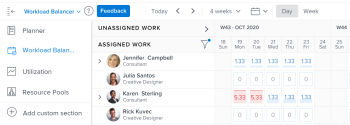

# Migrar do Recurso [!UICONTROL Agendamento] para [!UICONTROL Balanceador de Carga de Trabalho]

As informações destacadas nesta página se referem à funcionalidade ainda não disponível no geral. Está disponível somente no ambiente de Visualização.

<!-- drafted for res scheduling deprecation blurb for PREVIEW release - Oct 2022 - CHANGE THIS BLURB TO SOMETHING ELSE AT PRODUCTION:-->

>[!CAUTION]
>  
>  
> As áreas de Agendamento foram removidas do ambiente de Visualização e serão removidas do ambiente Produção no **Janeiro de 2023**. \
>  Após janeiro de 2023, você deverá programar seus recursos no Balanceador de Carga de Trabalho. 
>  
> Para obter informações sobre como programar recursos usando o Balanceador de Carga de Trabalho, consulte a seção [O Balanceador de Carga de Trabalho](../../resource-mgmt/workload-balancer/workload-balancer.md).

As informações neste artigo se aplicam a você somente se você tiver gerenciado o agendamento de seus recursos no Recurso [!UICONTROL Agendamento] áreas do Adobe Workfront. O Workfront iniciou a desaprovação do [!UICONTROL Agendamento] em novembro de 2020 e os substituiu pelo [!UICONTROL Balanceador de Carga de Trabalho].

Para obter informações sobre o plano de descontinuação do [!UICONTROL Agendamento de recursos] ferramentas e a linha do tempo para sua substituição com o [!UICONTROL Balanceador de Carga de Trabalho], consulte [Substituição das ferramentas de Agendamento de Recursos no Adobe Workfront](../../resource-mgmt/resource-mgmt-overview/deprecate-resource-scheduling.md).

Queremos que você experimente o mínimo possível de interrupções do trabalho, ajudando você a projetar um plano de migração. As etapas abaixo ajudarão você a treiná-lo e determinar o melhor momento para alternar para o [!UICONTROL Balanceador de Carga de Trabalho].

## Localize as ferramentas de Agendamento de recursos

Você e suas equipes podem estar usando alguns dos recursos [!UICONTROL Agendamento] ferramentas nas seguintes áreas do Workfront:

* O [!UICONTROL Agendamento] na seção [!UICONTROL Recursos] area
* O [!UICONTROL Agendamento] seção de um projeto
* O [!UICONTROL Agendar] seção de uma equipe

Com essa descontinuação, a variável [!UICONTROL Balanceador de Carga de Trabalho] substitui todas as  [!UICONTROL Agendamento de recursos] ferramentas em todas as áreas listadas acima.

## Etapa 1: Treinamento para suas equipes

Faça o treinamento [Programa de gerenciamento de recursos para a nova experiência da Adobe Workfront](https://one.workfront.com/s/resource-management-program-nwe) (75 minutos) no Workfront One.

Se você tiver dificuldade em fazer logon ou acessar o curso, entre em contato com o Suporte ao cliente. Para obter mais informações, consulte [Entre em contato com o Suporte ao cliente](../../workfront-basics/tips-tricks-and-troubleshooting/contact-customer-support.md).

## Etapa 2: Determine o melhor momento para migrar {#step-2-determine-the-best-time-to-migrate}

Siga as etapas abaixo para determinar quando é o melhor momento para migrar:

1. Determine quais recursos do recurso [!UICONTROL Agendamento] as ferramentas que sua equipe usa mais e verifique se esses recursos estão disponíveis no [!UICONTROL Balanceador de Carga de Trabalho]. Para obter informações sobre quais recursos estão disponíveis atualmente na [!UICONTROL Balanceador de Carga de Trabalho], consulte a seção &quot;Disponibilidade de recursos&quot; no artigo [Substituição das ferramentas de Agendamento de Recursos no Adobe Workfront](../../resource-mgmt/resource-mgmt-overview/deprecate-resource-scheduling.md).

   >[!IMPORTANT]
   >
   >Quase todos os recursos das ferramentas de Agendamento estão agora no Balanceador de Carga de Trabalho.

1. Determine se sua equipe gerencia alocações de usuários em atribuições. Ajustar ou modificar alocações de usuários significa modificar as horas planejadas por dia para cada usuário durante a duração de um item de trabalho.

   As alocações editadas nas ferramentas de Agendamento não são transferidas para o Balanceador de Carga de Trabalho. Por padrão, o sistema distribui igualmente o total de Horas Planejadas de um item de trabalho durante toda a duração do item.

   Você deve gerenciar manualmente as alocações no Balanceador de Carga de Trabalho para garantir que as alocações correspondam àquelas que você tem nas ferramentas de Agendamento. Para obter mais informações, consulte [Gerenciar alocações de usuários no Balanceador de Carga de Trabalho](../workload-balancer/manage-user-allocations-workload-balancer.md).

1. Todos os filtros salvos na área Agendamento não serão transferidos automaticamente para o Balanceador de Carga de Trabalho. Reserve tempo para criar os filtros necessários no Balanceador de Carga de Trabalho. Para obter informações sobre como criar filtros no Balanceador de Carga de Trabalho, consulte [Filtrar informações no Balanceador de Carga de Trabalho](../workload-balancer/filter-information-workload-balancer.md).

<!--
1. Using the information gathered from Steps 1 and Step 2, decide which version of Step 3 you should continue with based on the needs of your organization.
-->

## Etapa 3: Migrar para o [!UICONTROL Balanceador de Carga de Trabalho]{#step-3-migrate-to-the-workload-balancer}

Identificamos as seguintes versões para esta etapa, dependendo de suas conclusões na Etapa 2:

* [Etapa 3a: Você ou suas equipes usam o [!UICONTROL Agendamento] ferramentas, mas não modificam a alocação de usuários](#step-3a-you-or-your-teams-use-the-scheudling-tools-but-do-not-modify-user-allocation)
* [Etapa 3b: Você ou suas equipes gerenciam as alocações de usuários na [!UICONTROL Agendamento] ferramentas](#step-3b-you-or-your-teams-manage-user-allocations-in-the-scheduling-tools)

### Etapa 3a: Você ou suas equipes usam o [!UICONTROL Agendamento] ferramentas, mas não modificam a alocação de usuários

Se você ou suas equipes não modificarem as alocações diárias de horas em atribuições de trabalho, você estará pronto para alternar os recursos de programação para a [!UICONTROL Balanceador de Carga de Trabalho].

Faça o seguinte:

* Escolha uma data de transição.

   >[!TIP]
   >
   >Dê à sua equipe algum tempo para participar do treinamento sobre como usar o Balanceador de carga de trabalho antes da data de transição. Para obter informações sobre treinamento, consulte a seção [Migrar do Agendamento de Recursos para o Balanceador de Carga de Trabalho](#migrate-from-resource-uicontrol-scheduling-to-the-uicontrol-workload-balancer) neste artigo.

* Siga estas diretrizes para ajudar suas equipes:

   * Incentive suas equipes a visitar a [Visão geral da [!UICONTROL Balanceador de Carga de Trabalho]](../../resource-mgmt/workload-balancer/overview-workload-balancer.md) e todas as páginas vinculadas a partir daí para pesquisar mais a fundo sobre como a [!UICONTROL Balanceador de Carga de Trabalho] funciona.
   * Hospede reuniões de perguntas frequentes para suas equipes responderem perguntas na semana anterior à transição, fazerem a mudança e, em seguida, realizam outra reunião de perguntas frequentes para responder perguntas de acompanhamento.
   * Envie feedback para a Workfront usando o botão Feedback na barra de ferramentas superior. Nossos desenvolvedores de produtos estão sempre interessados em ouvir seus casos de uso sobre como podemos fazer a variável [!UICONTROL Balanceador de Carga de Trabalho] forneça mais valor.

### Etapa 3b: Você ou suas equipes gerenciam as alocações de usuários na [!UICONTROL Agendamento] ferramentas

Se o workflow corresponder a esse cenário, você deverá ser mais estratégico em seu plano de transição. As alocações diárias exibidas na variável [!UICONTROL Agendamento] as ferramentas são armazenadas em um banco de dados diferente das alocações diárias exibidas na variável [!UICONTROL Balanceador de Carga de Trabalho]. Isso significa que os ajustes das alocações diárias são feitos no Recurso [!UICONTROL Agendamento] as ferramentas não são transferidas para as alocações diárias na [!UICONTROL Balanceador de Carga de Trabalho].

>[!CAUTION]
>
>Você tem até **Janeiro de 2023** para garantir que a alocação de usuários nas áreas de Agendamento corresponda à do Balanceador de Carga de Trabalho em seu ambiente de Produção. Nesse momento, estamos removendo as ferramentas de Agendamento do ambiente de Produção. Você deve ajustar manualmente as alocações no Balanceador de Carga de Trabalho para corresponder àquelas nas ferramentas de Agendamento. As ferramentas de Agendamento já foram removidas do ambiente de Visualização.

Considere o seguinte ao fazer a transição para o [!UICONTROL Balanceador de Carga de Trabalho] ao usar [!UICONTROL Agendamento] funcionalidade:

* Colocado em espera, gestão de atribuições no [!UICONTROL Agendamento] ferramentas à medida que seus gerentes de recursos fazem o switch. Para fazer isso:

   * Descubra a duração média das tarefas em seus projetos atuais e considere isso ao determinar quanto tempo você precisa manter o gerenciamento das alocações de usuários.

      >[!TIP]
      >
      >Você precisa apenas ver seus projetos atuais ou de planejamento, que são aqueles para os quais suas equipes estão fazendo atribuições e gerenciando alocações diárias ativamente.

   * Crie um relatório de tarefa e adicione o campo Duration da tarefa na exibição e o agrupe por Nome do projeto. Resuma a coluna Duração na Exibição pela Média e salve o relatório.

      Para obter informações sobre como criar um relatório, consulte [Criar um relatório personalizado](../../reports-and-dashboards/reports/creating-and-managing-reports/create-custom-report.md) .

   * Analise seu relatório de tarefas. Por exemplo, se a duração média da tarefa for de 3 dias, uma transição de uma semana pode ser a melhor. Faça com que a equipe pare de gerenciar alocações de usuários por uma semana. Na semana seguinte, faça a transição da equipe para o [!UICONTROL Balanceador de Carga de Trabalho] e comece a gerenciar alocações de usuários na semana seguinte.
   >[!NOTE]
   >
   >Essa sugestão pode não funcionar se a duração média da tarefa for maior que o tempo restante até a remoção das ferramentas de Agendamento.

   

   >[!TIP]
   >
   >Você pode continuar fazendo atribuições de tarefa e emissão durante o período de transição. As atribuições feitas serão refletidas no Agendador de Recursos e [!UICONTROL Balanceador de Carga de Trabalho].

* Se você for uma organização maior com equipes gerenciando recursos para centenas de projetos, poderá considerar a transição do [!UICONTROL Agendamento] ferramentas para [!UICONTROL Balanceador de Carga de Trabalho] um portfólio de cada vez. Considere uma implantação em fases ao criar filtros personalizados na [!UICONTROL Balanceador de Carga de Trabalho] para analisar um portfólio específico de cada vez.

* Permitir que os gerentes de recursos se juntem: tem uma atribuição de revisão de pessoa feita na  [!UICONTROL Agendamento de recursos] , bem como os ajustamentos adequados da [!UICONTROL Balanceador de Carga de Trabalho]. Depois que a equipe de dois reconciliar as duas ferramentas, faça com que eles alternem seus fluxos de trabalho para a [!UICONTROL Balanceador de Carga de Trabalho].

## Precisa de mais assistência

Se precisar de informações adicionais com essa migração, entre em contato com o Suporte personalizado. Para obter informações sobre como entrar em contato com o Suporte, consulte [Entre em contato com o Suporte ao cliente](../../workfront-basics/tips-tricks-and-troubleshooting/contact-customer-support.md).
