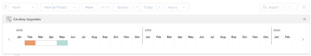

# Ajustar datas de orçamento no Planejador de recursos

Se você descobrir que há superalocações de seus recursos depois de tê-los orçado no Planejador de Recursos, poderá explorar cenários hipotéticos movendo as Horas Orçadas, FTE ou Custos para outro intervalo de tempo. Com base nos resultados nesses cenários, você pode ajustar as Horas orçadas, o FTE ou o Custo.

As superalocações podem aparecer quando as Horas Orçadas, o FTE ou os Custos dos recursos forem maiores que as Horas Disponíveis, o FTE ou os Custos. Isso gera um valor líquido negativo.

## Requisitos de acesso

+++ Expanda para visualizar os requisitos de acesso para a funcionalidade neste artigo.

Você deve ter o seguinte acesso para executar as etapas deste artigo:

<table style="table-layout:auto"> 
 <col> 
 <col> 
 <tbody> 
  <tr> 
   <td role="rowheader">plano do Adobe Workfront</td> 
    <td>
Novo: Qualquer um

       
ou

       
Atual: Pro ou superior
 </td> 
  </tr> 
  <tr> 
   <td role="rowheader">Licença do Adobe Workfront</td> 
   <td>
Novo: Padrão

       
ou

       
Atual: Plano
</td> 
  </tr> 
  <tr> 
   <td role="rowheader">Configurações de nível de acesso</td> 
   <td> 
Editar acesso ao Gerenciamento de recursos que inclui acesso a Editar prioridades e horas de orçamento no Planejador de recursos
 
Editar acesso a Dados Financeiros, Projetos e Usuários
</td> 
  </tr> 
  <tr> 
   <td role="rowheader">Permissões de objeto</td> 
   <td> 
Gerenciar permissões para os projetos para os quais você deseja orçar informações com a capacidade de Gerenciar Finanças
</td> 
  </tr> 
 </tbody> 
</table>

Para obter mais detalhes sobre as informações nesta tabela, consulte [Requisitos de acesso na documentação do Workfront](/help/quicksilver/administration-and-setup/add-users/access-levels-and-object-permissions/access-level-requirements-in-documentation.md).

+++

## Ajustar Datas de Orçamento

1. Vá para o Planejador de recursos e selecione **Visualizar por projeto**.

   >[!NOTE]
   >
   >Você pode usar a opção Ajustar Datas Orçadas somente quando visualiza o Planejador de Recursos por projeto.

1. Passe o mouse sobre o nome de um projeto, em seguida, clique no menu **Mais**.
1. Clique em **Ajustar Datas de Orçamento**.\
   A linha do tempo de alocação do projeto é exibida.\
   O período em que as horas são orçadas no momento é destacado em laranja se houver um conflito de orçamento e em azul se não houver conflitos.

   

1. Arraste e solte o intervalo de tempo destacado para outro horário para entender onde não há conflitos de orçamento para o projeto selecionado. Quando você encontra um intervalo de tempo em que o valor Líquido é positivo, o intervalo de tempo destacado muda para azul.
1. Clique no &quot;x&quot; no canto superior direito da linha do tempo de alocação do projeto para fechá-lo.
1. Remova as horas orçadas da linha do tempo existente do projeto e adicione-as à linha do tempo que mostra mais disponibilidade.
1. Clique em **Salvar**.
1. (Condicional e opcional) Se os intervalos de tempo sem conflitos de orçamento estiverem fora da linha do tempo do projeto, clique no nome do projeto para acessá-lo.
1. (Condicional e opcional) Clique em **Editar projeto** e edite a **Data de início planejada** ou a **Data de conclusão planejada** para modificar a linha do tempo do projeto para o período sem conflitos de orçamento.\
   Para obter mais informações sobre como editar projetos, consulte o artigo [Editar projetos](../../manage-work/projects/manage-projects/edit-projects.md).

1. (Condicional e opcional) Clique em **Salvar alterações**.
1. Retorne ao Planejador de recursos e insira novamente as Horas Orçadas, FTEs ou Custos no período sem conflitos de orçamento.
1. Clique em **Salvar**.
