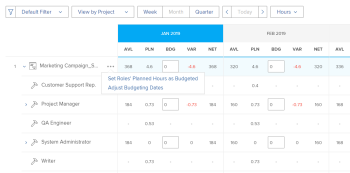

# Recursos de orçamento no Planejador de Recursos usando as exibições Projeto e Função

<!--
<p data-mc-conditions="QuicksilverOrClassic.Draft mode">(NOTE: broken off of another larger article (Planning in the RP); reformat, restructure, relink)</p>
-->

A principal função do Planejador de Recursos é orçar seus recursos para o trabalho que deve ser concluído nos projetos.

>[!IMPORTANT]
>
>Você só pode orçar seus recursos se aplicar a variável **Exibir por projeto** ou **Exibir por função** para o Planejador de Recursos.

Antes de começar a orçar informações no Planejador de Recursos, consulte os seguintes artigos:

* [Visão geral do Planejador de recursos](../../resource-mgmt/resource-planning/get-started-resource-planner.md)
* [Acesso necessário para recursos de orçamento no Adobe Workfront](../../resource-mgmt/resource-planning/access-needed-to-budget-resources.md)
* [Visão geral de horas, FTE e informações de custo nas exibições Projeto e Função do Planejador de Recursos](../../resource-mgmt/resource-planning/overview-of-planner-hour-fte-cost-information-in-role-project-views.md)

## Requisitos de acesso

Você deve ter o seguinte acesso para executar as etapas neste artigo:

<table style="table-layout:auto"> 
 <col> 
 <col> 
 <tbody> 
  <tr> 
   <td role="rowheader">Plano Adobe Workfront*</td> 
   <td> <p>Pro e superior</p> </td> 
  </tr> 
  <tr> 
   <td role="rowheader">Licença da Adobe Workfront*</td> 
   <td> <p>Plano </p> </td> 
  </tr> 
  <tr> 
   <td role="rowheader">Configurações de nível de acesso*</td> 
   <td> <p>Edite o acesso ao Gerenciamento de Recursos que inclui acesso a Editar prioridades e horas orçamentárias no Planejador de Recursos</p> <p>Editar acesso aos Dados Financeiros para recursos de orçamento por Custo</p> <p>Editar acesso a Projetos e Usuários</p> <p><b>Nota</b>

Caso ainda não tenha acesso, pergunte ao administrador do Workfront se ele definiu restrições adicionais em seu nível de acesso. Para obter informações sobre como um administrador do Workfront pode alterar seu nível de acesso, consulte <a href="../../administration-and-setup/add-users/configure-and-grant-access/create-modify-access-levels.md" class="MCXref xref">Criar ou modificar níveis de acesso personalizados</a>.</p> </td>
</tr> 
  <tr> 
   <td role="rowheader">Permissões de objeto</td> 
   <td> <p>Gerencie permissões dos projetos para os quais deseja obter informações de orçamento</p> <p>Para obter informações sobre como solicitar acesso adicional, consulte <a href="../../workfront-basics/grant-and-request-access-to-objects/request-access.md" class="MCXref xref">Solicitar acesso a objetos </a>.</p> </td> 
  </tr> 
 </tbody> 
</table>

&#42;Para descobrir qual plano, tipo de licença ou acesso você tem, entre em contato com o administrador da Workfront.

## Recursos de orçamento no Planejador de Recursos

* [Recursos de orçamento na exibição Projeto](#budget-resources-in-the-project-view)
* [Recursos de orçamento na exibição Função](#budget-resources-in-the-role-view)
* [Recursos orçamentais em massa](#budget-resources-in-bulk)

### Recursos de orçamento na exibição Projeto {#budget-resources-in-the-project-view}

<!--
<p data-mc-conditions="QuicksilverOrClassic.Draft mode">(NOTE: this section is linked to the Budgeting Project Resources in the Business Case article)</p>
-->

1. Clique no botão **Menu principal** ícone  no canto superior direito do Adobe Workfront.

1. Clique em **Recursos**.
1. O **Planejador** é exibido por padrão.
1. (Condicional) Selecione o **Exibir por projeto** exibir.
1. Expanda os projetos e as funções de trabalho para gerenciar a alocação do projeto, as funções de trabalho ou os usuários.
1. Para alocação de orçamento para usuários, siga um destes procedimentos:

   * No **BDG** , especifique manualmente um número de horas orçadas, FTE ou custo para os usuários.

   * Clique no botão **Mais** para a função de trabalho do usuário e clique em **Definir as Horas Planejadas dos Usuários como Orçadas**.\
      As Horas Orçadas de cada usuário são calculadas usando a seguinte fórmula:

      ```
      User Budgeted Hours = User Planned Hours
      ```

1. Para alocação de orçamento para funções de cargo, execute um dos seguintes procedimentos:

   * No **BDG** , especifique manualmente um número de horas orçamentadas, FTE ou custo para a função da tarefa.

      >[!NOTE]
      >
      >A Função Horas Orçamentadas é adicionada às Horas Orçamentadas do Projeto.

   * (Condicional) Se tiver orçado horas para usuários, clique no botão **Mais** para a função de trabalho, em seguida, clique em **Total de Horas Orçadas dos Usuários para a Função**.\
      As Horas Orçadas para cada função são calculadas usando a seguinte fórmula:

      ```
      Role Budgeted Hours = SUM(User Budgeted Hours)
      ```

   * Clique no botão **Mais** para o projeto, em seguida, clique em **Definir as Horas Planejadas das Funções como Orçadas**.\
      As Horas Orçadas para cada função são calculadas usando a seguinte fórmula:\
      *

      ```
      Role Budgeted Hours = Role Planned Hours
      ```

      >[!NOTE]
      >   
      >* A Função Horas Orçamentadas é adicionada às Horas Orçamentadas do Projeto.
      >* Os usuários podem ser orçados para Funções primárias e outras (ou secundárias).
      >* O **Porcentagem de disponibilidade de FTE** para as funções do usuário deve ser um número diferente de 0% para as Horas Disponíveis exibir um valor no Planejador de Recursos para uma função de trabalho. Se um usuário estiver associado a uma função com 0% **Porcentagem de disponibilidade de FTE**, o valor Horas Disponíveis é zero para essa função de trabalho. Nesse caso, a função pode mostrar um negativo **Valor líquido**.\
         >Para obter mais informações sobre o **Porcentagem de disponibilidade de FTE** para funções de trabalho, consulte o artigo [Editar o perfil de um usuário](../../administration-and-setup/add-users/create-and-manage-users/edit-a-users-profile.md).


   * No **BDG** , especifique manualmente um número de horas orçamentadas, FTE ou custo para o projeto. Isso distribui o número de Horas Orçadas do Projeto para cada função no projeto. Os seguintes cenários existem:

      * Se o número de Horas Orçadas do Projeto especificado for igual às Horas Planejadas do Projeto, as Horas da Função Orçadas corresponderão às Horas Planejadas da Função.
      * Se o número de Horas Orçadas do Projeto especificado não for igual às Horas Planejadas do Projeto, as Horas da Função Orçadas serão distribuídas de acordo com a porcentagem de Horas Planejadas necessária para cada função.\
         Por exemplo, se um projeto tem 20 Horas Planejadas e são distribuídas entre duas funções de trabalho (o Consultor requer 12 Horas Planejadas e o Engenheiro requer 8 Horas Planejadas), e você orçou 30 horas para o Projeto, as horas são distribuídas da seguinte maneira: a função de Consultor recebe 18 Horas Orçadas e a função Engenheiro recebe 12 Horas Orçamentadas.

1. Para alocação de orçamento para o projeto, execute um dos seguintes procedimentos:

   * Faça o orçamento das funções no projeto, conforme descrito na Etapa 7.\
      As Horas Orçamentadas do Projeto são calculadas pela seguinte fórmula:

      ```
      Project Budgeted Hours = SUM(Role Budgeted Hours)
      ```

   * No **BDG** , especifique manualmente um número de horas orçamentadas, FTE ou custo para o projeto.\
      Isso atualiza a Função Orçada Horas, conforme descrito na Etapa 7.\
      

1. Clique em **Salvar**.\
   Depois de orçar seus recursos no Planejador de Recursos, as Horas Orçadas para seus recursos e qualquer custo associado a eles são listadas no Caso de Negócios de cada projeto.\
   Para obter mais informações sobre como entender a área de Orçamento de Recursos do Caso de Negócios, consulte a seção &quot;Orçamento de Recursos&quot; no artigo [Visão geral das áreas do caso comercial](../../manage-work/projects/define-a-business-case/areas-of-business-case.md).

1. (Opcional) Selecione a Visualização de usuário para notar qualquer sobrecarga ou subutilização de usuário entre as Horas Disponíveis e Planejadas para cada usuário. As Horas Orçadas não estão visíveis na exibição Usuário.

   Para obter informações sobre como o Workfront calcula a disponibilidade de um usuário, consulte [Configurar preferências do Gerenciamento de recursos](../../administration-and-setup/set-up-workfront/configure-system-defaults/configure-resource-mgmt-preferences.md).

### Recursos de orçamento na exibição Função {#budget-resources-in-the-role-view}

<!--
<div data-mc-conditions="QuicksilverOrClassic.Draft mode">
<p>(NOTE: THIS IS WRONG - I LOGGED A BUG TO FIX THIS LINK - IT SHOULD GO TO"ACCESS NEEDED TO BUDGET IN THE RP":</p>
<p>Planning in the resource planner has links to the UI - ensure Flare notes are there for this: https://workfront.zendesk.com/hc/en-us/articles/115006356928 - the "Budgeting resources in the role view" is linked to this tooltip: ***This is linked to the product in the RP when the user does not have Manage rights on one of the projects under the role. This tool tip is linked here: "You don't have Manage permissions for all projects. Budget hours by individual project instead. Learn more...")</p>
</div>
-->

Você deve ter o acesso Editar ao Gerenciamento de Recursos e Dados Financeiros e as permissões Gerenciar Finanças nos projetos para orçar recursos no Planejador de Recursos. Se você só tiver acesso de Exibição a pelo menos um projeto listado em uma função de cargo, não poderá orçar alocações para a função na exibição Função. Ainda é possível alocar orçamento para os projetos nos quais você tem permissões de gerenciamento.

Para obter informações sobre o acesso necessário para recursos de orçamento, consulte o artigo [Acesso necessário para recursos de orçamento no Adobe Workfront](../../resource-mgmt/resource-planning/access-needed-to-budget-resources.md).

Para alocações de orçamento no Planejador de Recursos na exibição de Função***:

1. Clique no botão **Menu principal** ícone  no canto superior direito do Adobe Workfront.

1. Clique em **Recursos**.
1. O **Planejador** é exibido por padrão.
1. (Condicional) Selecione o **Exibir por função** exibir.
1. Expanda as funções do trabalho e os projetos para gerenciar a alocação do projeto, as funções do trabalho ou os usuários.
1. Para alocação de orçamento para usuários, siga um destes procedimentos:

   * No **BDG** , especifique manualmente um número de horas orçadas, FTE ou custo para os usuários.
   * Clique no botão **Mais** para o projeto, em seguida, clique em **Definir as Horas Planejadas dos Usuários como Orçadas**.\
      As Horas Orçadas de cada usuário são calculadas usando a seguinte fórmula:

      ```
      User Budgeted Hours = User Planned Hours
      ```

1. Para alocação de orçamento para funções de cargo, execute um dos seguintes procedimentos:

   * No **BDG** , especifique manualmente um número de horas orçamentadas, FTE ou custo para as funções do job.\
      Isso distribui as Horas com Função Orçada para as Horas do Projeto Orçadas para os projetos que você tem acesso para gerenciar.

   * Clique no botão **Mais** para a função de trabalho, em seguida, clique em **Definir as Horas Planejadas dos Projetos como Orçadas.**As Horas de Função Orçadas são calculadas usando a seguinte fórmula:\
      *

      ```
      Role Budgeted Hours = SUM(Project Budgeted Hours)
      ```

      *As Horas Orçadas do Projeto são calculadas usando a seguinte fórmula:

      ```
      Project Budgeted Hours = Project Planned Hours
      ```

   * No **BDG** , especifique manualmente um número de horas orçadas, FTE ou custo para os projetos listados na função de trabalho.\
      Isso adiciona o número de Horas Orçadas do Projeto à função .
   >[!NOTE]
   >
   >Os usuários podem ser orçados para Funções primárias e outras (ou secundárias). O **Porcentagem de disponibilidade de FTE** para as funções do usuário deve ser um número diferente de 0% para as Horas Disponíveis exibir um valor no Planejador de Recursos para uma função de trabalho. Se um usuário estiver associado a uma função com 0% **Porcentagem de disponibilidade de FTE**, o valor Horas Disponíveis é zero para essa função de trabalho. Nesse caso, a função pode mostrar um negativo **Valor líquido**.\
   >Para obter mais informações sobre o **Porcentagem de disponibilidade de FTE** para funções de trabalho, consulte o artigo [Editar o perfil de um usuário](../../administration-and-setup/add-users/create-and-manage-users/edit-a-users-profile.md).

1. Para alocação de orçamento para o projeto, execute um dos seguintes procedimentos:

   * No **BDG** , especifique manualmente um número de horas orçadas, FTE ou custo para os projetos.\
      Isso também atualiza as Horas Orçadas para as funções sob as quais o projeto está listado.

   * Clique no botão **Mais** para a função de trabalho, em seguida, clique em **Definir as Horas Planejadas dos Projetos como Orçadas**.\
      As Horas Orçamentadas do Projeto são calculadas pela seguinte fórmula:

      ```
      Project Budgeted Hours = Project Planned Hours
      ```

      As Horas Orçadas do Projeto são adicionadas à Função Horas Orçamentadas.

   * (Condicional) Se tiver orçado as horas para os usuários, clique no botão **Mais** para o projeto, em seguida, clique em **Total de Horas Orçadas dos Usuários para o Projeto**.\
      As Horas Orçadas do Projeto são calculadas usando a seguinte fórmula:

      ```
      Project Budgeted Hours = SUM(User Budgeted Hours)
      ```

      

1. Clique em **Salvar**.\
   Depois de orçar seus recursos no Planejador de Recursos, as Horas Orçadas para seus recursos e qualquer custo associado a eles são listadas no Caso de Negócios de cada projeto.\
   Para obter mais informações sobre como entender a área de Orçamento de Recursos do Caso de Negócios, consulte o artigo [Recursos orçamentários no Caso de Negócios](../../manage-work/projects/define-a-business-case/budget-resources-in-business-case.md).

1. (Opcional) Selecione o **Exibir por usuário** exibição para notar qualquer excesso ou subutilização de usuário entre as Horas Disponíveis e Planejadas para cada usuário. As Horas Orçadas não estão visíveis na exibição Exibir por Usuário.

### Recursos orçamentais em massa {#budget-resources-in-bulk}

Você pode orçar alocações para seus recursos em massa ao usar links rápidos. Os links rápidos estão disponíveis somente para as Exibições de Projeto e Função.



>[!NOTE]
>
>Ao usar os links rápidos para alocações de orçamento para recursos, o orçamento é aplicado automaticamente somente aos períodos exibidos na tela. Se a linha do tempo de um projeto se estender por um período maior que o exibido na tela, você deverá rolar da esquerda para a direita e usar os links rápidos para automaticamente orçar seus recursos.

Para orçar os recursos em massa:

1. Vá para .\
   Para obter mais informações sobre como acessar o Planejador de Recursos, consulte a seção &quot;Acessar o Planejador de Recursos&quot; no artigo [Visão geral do Planejador de recursos](../../resource-mgmt/resource-planning/get-started-resource-planner.md).\
   Uma lista de projetos que você pode gerenciar é exibida na lista.

1. (Opcional) Expanda cada projeto para ver uma lista de funções de trabalho associadas a ele.\
   Ou
1. (Opcional) Selecione **Exibir por função** em seguida, expanda cada função para ver uma lista de projetos associados a ela.
1. Passe o mouse sobre o nome de um projeto ou de uma função de trabalho.
1. Clique no botão **Mais** ícone que é exibido à direita do nome do projeto ou da função.

1. Clique em uma das opções disponíveis para especificar automaticamente a quantidade de Horas Orçadas (BDG) para outros objetos.

   Dependendo de você ter clicado no ícone Mais em um projeto ou em uma função, as opções de orçamento em massa serão diferentes. A tabela abaixo ilustra as opções disponíveis para projetos e funções:

   <table style="table-layout:auto"> 
    <col> 
    <col> 
    <col> 
    <tbody> 
     <tr> 
      <td> </td> 
      <td><strong>Visualização do Projeto</strong> </td> 
      <td><strong>Exibição da função</strong> </td> 
     </tr> 
     <tr> 
      <td>Opções de projeto</td> 
      <td> 
       <ul> 
        <li><strong>Definir as Horas Planejadas das Funções como Orçadas</strong>: Selecione essa opção para fazer com que as Horas Orçadas da função se tornem idênticas às Horas Planejadas. O total de Horas Orçadas para as funções será exibido para as Horas Orçadas do Projeto. </li> 
        <li><strong>Ajustar datas de orçamento</strong> : Selecione essa opção para mover as Horas Orçadas para um período de tempo diferente.<br>Para obter mais informações sobre o ajuste de datas do orçamento, consulte <a href="../../resource-mgmt/resource-planning/adjust-budgeting-dates.md" class="MCXref xref">Ajustar datas de orçamento no Planejador de Recursos</a>.</li> 
       </ul> </td> 
      <td> 
       <ul> 
        <li><strong>Definir as Horas Planejadas dos Usuários como Orçadas</strong>: Selecione essa opção para tornar as Horas Orçadas do usuário idênticas às Horas Planejadas. </li> 
        <li><strong>Total de Horas Orçadas dos Usuários para o Projeto</strong>: Selecione essa opção para adicionar todas as Horas Orçadas do usuário e exibir o total como as Horas Orçadas para o projeto e para a função. Recomendamos que você use essa opção depois de ter feito o orçamento manual dos usuários ou ter usado a opção anterior primeiro. </li> 
       </ul> </td> 
     </tr> 
     <tr> 
      <td>Opções de função</td> 
      <td> 
       <ul> 
        <li><strong>Definir as Horas Planejadas dos Usuários como Orçadas</strong>: Selecione essa opção para tornar as Horas Orçadas do usuário idênticas às Horas Planejadas. </li> 
        <li><strong>Total de Horas Orçadas dos Usuários para a Função</strong>: Selecione essa opção para adicionar todas as Horas Orçadas do usuário juntas e exibir o total como as Horas Orçadas para a função e o projeto. Recomendamos que você use essa opção depois de ter feito o orçamento manual dos usuários ou ter usado a opção anterior primeiro. </li> 
       </ul> </td> 
      <td> 
       <ul> 
        <li><strong>Definir as Horas Planejadas dos Projetos como Orçadas</strong>: Selecione essa opção para tornar o projeto Horário orçado idêntico às Horas Planejadas do projeto. </li> 
       </ul> </td> 
     </tr> 
    </tbody> 
   </table>

   >[!NOTE]
   >
   >Algumas das opções podem não ser exibidas se algum dos pré-requisitos de trabalho no Planejador de Recursos estiver ausente.
   >
   >
   >Para obter mais informações sobre os pré-requisitos que devem ser atendidos para um orçamento preciso no Planejador de Recursos, consulte a seção &quot;Pré-requisitos para trabalhar no Planejador de Recursos&quot; na seção [Visão geral do Planejador de recursos](../../resource-mgmt/resource-planning/get-started-resource-planner.md) artigo 10. o\
   >Por exemplo, algumas das opções podem não ser exibidas nos seguintes cenários:
   >
   >   
   >   
   >   * Quando os projetos não estão associados ao Pool de Recursos
   >   * Quando os Pools de Recursos associados aos projetos não contêm usuários
   >   * Quando os Pools de Recursos associados aos projetos contêm usuários sem função de trabalho associada a eles.

