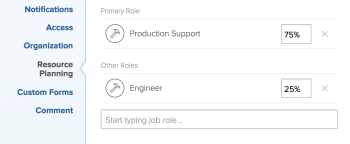

# Visão geral do cálculo de horas e FTE para usuários e funções no Planejador de recursos

<!--

(NOTE: Alina:KEEP THIS:***Linked to: Configuring My Settings, Editing User Accounts, Planning in the Resource Planner -- *** Some of this documentation is also duplicated in this article (Scheduling): https://support.workfront.com/hc/en-us/articles/360000557174)

-->

Você pode exibir a alocação e a disponibilidade de seus recursos no Planejador de Recursos por Horas, FTE ou Custo.\
Para obter mais informações sobre como calcular Custos no Planejador de Recursos, consulte [Calcular custos no Planejador de Recursos](../../resource-mgmt/resource-planning/calculate-costs-resource-planner.md).

&quot;FTE&quot; significa Equivalente a Tempo Integral. É uma medida de tempo que representa a quantidade de horas dedicadas ao trabalho real durante um dia ou semana para um usuário ou função de trabalho.

Os conjuntos de informações de recursos a seguir são calculados de forma diferente no Planejador de recursos:

* Os valores de Horas Disponíveis ou FTE são calculados com base na forma como o Administrador do Sistema configura as preferências de Gerenciamento de Recursos no sistema.\
  Para obter mais informações sobre como as Horas Disponíveis e os valores de FTE são calculados, consulte [Calcular Horas Disponíveis ou FTE para usuários e funções de trabalho no Planejador de Recursos](#calculate-available-hours-or-fte-for-users-and-job-roles-in-the-resource-planner).\
  Para obter mais informações sobre como definir as preferências de Gerenciamento de Recursos para o sistema Adobe Workfront, consulte [Configurar preferências de Gerenciamento de Recursos](../../administration-and-setup/set-up-workfront/configure-system-defaults/configure-resource-mgmt-preferences.md).

* Todos os outros valores de FTE são calculados com base no agendamento Padrão do sistema.\
  Para obter mais informações sobre como todos os outros valores são exibidos no Planejador de recursos ao usar o FTE, consulte a seção [Calcular todos os outros valores de hora e FTE para usuários e funções de trabalho no Planejador de recursos](#calculate-all-other-hour-and-fte-values-for-users-and-job-roles-in-the-resource-planner) neste artigo.

É importante entender o que é o FTE para cada um dos usuários e suas funções de trabalho para gerenciar com precisão os recursos à medida que você os atribui para trabalhar.

## Calcular Horas Disponíveis ou FTE para usuários e funções de trabalho no Planejador de Recursos {#calculate-available-hours-or-fte-for-users-and-job-roles-in-the-resource-planner}

* [Calcular as Horas Disponíveis e o FTE de um usuário no Planejador de Recursos](#calculate-the-available-hours-and-fte-for-a-user-in-the-resource-planner)
* [Calcular as Horas Disponíveis e o FTE para uma função de trabalho no Planejador de Recursos](#calculate-the-available-hours-and-fte-for-a-job-role-in-the-resource-planner)
* [Calcular as Horas Disponíveis e o FTE de um usuário no Planejador de Recursos (Exemplo)](#calculate-the-available-hours-and-fte-for-a-user-in-the-resource-planner-example)

### Calcular as Horas Disponíveis e o FTE de um usuário no Planejador de Recursos {#calculate-the-available-hours-and-fte-for-a-user-in-the-resource-planner}

O administrador do Workfront determina como o tempo disponível para um usuário é calculado ao selecionar para usar um dos seguintes itens na área Gerenciamento de recursos em Configuração:

* O Cronograma Padrão do sistema e o FTE do usuário.
* A programação do usuário.

>[!NOTE]
>
>Isso determina como calcular a disponibilidade de recursos no nível do sistema. Para obter mais informações sobre como definir as preferências de Gerenciamento de Recursos para o sistema, consulte [Configurar preferências de Gerenciamento de Recursos](/help/quicksilver/administration-and-setup/set-up-workfront/configure-system-defaults/configure-resource-mgmt-preferences.md).

Com base em como essa configuração é definida, a disponibilidade dos usuários no Planejador de recursos (horas, bem como a disponibilidade de FTE) é calculada usando os seguintes métodos:

* **O Calendário Padrão**: o Calendário Padrão do sistema e o FTE do usuário são usados para determinar as Horas Disponíveis e o valor de FTE do usuário no Planejador de Recursos. O Cronograma do usuário é ignorado. Neste caso:

   * As **Horas Disponíveis** no Planejador de Recursos são calculadas usando a seguinte fórmula:

     `User Available Hours = Default Schedule Hours * User FTE value`

     Por exemplo, se o Calendário padrão tiver 40 horas por semana disponíveis para trabalho e o FTE do usuário for 0,5, o usuário estará disponível para trabalhar 20 horas por semana no Planejador de recursos.

     Para obter mais informações sobre agendas, incluindo a Agenda Padrão, consulte [Criar uma agenda](/help/quicksilver/administration-and-setup/set-up-workfront/configure-timesheets-schedules/create-schedules.md).

   * O **FTE Disponível** para o usuário no Planejador de Recursos é igual ao FTE do usuário especificado nas configurações do usuário.

     Por exemplo, se o FTE do usuário for 0,5 nas configurações do usuário, o FTE disponível do usuário será 0,5 no Planejador de recursos. Para obter mais informações sobre o valor do FTE do usuário conforme exibido nas configurações do usuário, consulte [Editar perfil de usuário](/help/quicksilver/administration-and-setup/add-users/create-and-manage-users/edit-a-users-profile.md).

* **A Agenda do Usuário**: a Agenda do usuário é usada para determinar a disponibilidade do usuário no Planejador de Recursos. O valor do FTE do usuário é ignorado. Neste caso:

   * As **Horas Disponíveis** no Planejador de Recursos são iguais às Horas do Cronograma do usuário.

     Por exemplo, se o Cronograma do usuário tiver 40 horas por semana disponíveis para trabalho, o usuário estará disponível para trabalhar 40 horas por semana no Planejador de recursos.

   * O **FTE** disponível no Planejador de Recursos é calculado pela seguinte fórmula:

     `User Available FTE = Hours from the Schedule of the User/ Default Schedule Hours`

     Por exemplo, se o Cronograma do usuário tiver 20 horas disponíveis para trabalhar e o Cronograma padrão no Workfront tiver 40 horas disponíveis para trabalhar, o FTE do usuário será 0,5.

     Para obter mais informações sobre agendas, incluindo a Agenda Padrão, consulte [Criar uma agenda](/help/quicksilver/administration-and-setup/set-up-workfront/configure-timesheets-schedules/create-schedules.md).

>[!NOTE]
>
>Se o usuário não estiver associado a um agendamento, as Horas Disponíveis para o usuário serão calculadas usando o Agendamento Padrão.

### Calcular as Horas Disponíveis e o FTE para uma função de trabalho no Planejador de Recursos {#calculate-the-available-hours-and-fte-for-a-job-role-in-the-resource-planner}

Primeiro, é necessário calcular a disponibilidade do usuário e, em seguida, calcular a disponibilidade de cada uma de suas funções de trabalho.

A disponibilidade de funções de trabalho no Planejador de Recursos leva em conta a disponibilidade total do usuário e a **Porcentagem de Disponibilidade de FTE** associada a cada função do usuário.\

Para obter mais informações sobre como associar um valor de **Porcentagem de Disponibilidade de FTE** a uma função de trabalho para um usuário, consulte [Editar perfil de um usuário](../../administration-and-setup/add-users/create-and-manage-users/edit-a-users-profile.md).

Por exemplo, se o valor de Horas Disponíveis para um usuário for 40 e ele puder cumprir uma Função Primária por 75% desse tempo, e uma Outra Função por 25% desse tempo, o Planejador de Recursos mostrará que o valor de **Horas Disponíveis** para a Função Primária por uma semana é 30 horas, e que o valor de **Horas Disponíveis** para a Outra Função é 10 horas. Nesse caso, o FTE da Função principal é 0,75 e o FTE da outra função é 0,25.

>[!NOTE]
>
>O tempo total disponível para o usuário é calculado por um dos dois métodos descritos no [Calcular as Horas Disponíveis e o FTE de um usuário na seção Planejador de Recursos](#calculate-the-available-hours-and-fte-for-a-user-in-the-resource-planner) deste artigo.

Ao visualizar o Planejador de recursos na visualização Função, a disponibilidade de uma função de trabalho é um total da disponibilidade de todos os usuários que podem desempenhar essa função de trabalho.\
Para obter mais informações sobre a disponibilidade de recursos no Planejador de recursos, consulte a [visão geral do Planejador de recursos](../../resource-mgmt/resource-planning/get-started-resource-planner.md).

### Calcular as Horas Disponíveis e o FTE de um usuário no Planejador de Recursos (Exemplo) {#calculate-the-available-hours-and-fte-for-a-user-in-the-resource-planner-example}

A tabela a seguir ilustra como as Horas Disponíveis e o FTE Disponível são calculados para o usuário no Planejador de Recursos, dependendo de qual método é usado pelo administrador do sistema para o cálculo do FTE nas Preferências de Gerenciamento de Recursos.

Neste exemplo, estamos usando os seguintes números:

* Um calendário padrão do sistema de 40 horas
* Uma programação de usuário de 20 horas
* Um FTE de usuário de 0,8

| Método de Cálculo de FTE (Configuração do Sistema) | **Horas a partir do Cronograma do Usuário** | **Horas a partir do Calendário Padrão** | **Campo FTE do usuário** | **Horas Disponíveis no Planejador de Recursos** | **FTE Disponível no Planejador de Recursos** |
|---|---|---|---|---|---|
| **O Calendário Padrão** | Ignorada | 40 | 0,8 | **32** (calculado) | **0.8** |
| **Agenda do Usuário** | 20 | 40 | Ignorada | **20** | **0.5** (calculado) |

Exceções de cronograma e folga podem afetar a quantidade de Horas planejadas ou FTE. Para obter mais informações, consulte [Configurar preferências de Gerenciamento de Recursos](../../administration-and-setup/set-up-workfront/configure-system-defaults/configure-resource-mgmt-preferences.md).

Exemplo de visualização do Planejador de recursos por usuário e horas:

Exemplo de visualização do Planejador de recursos por usuário e FTE:

## Calcular todos os outros valores de hora e FTE para usuários e funções de trabalho no Planejador de recursos {#calculate-all-other-hour-and-fte-values-for-users-and-job-roles-in-the-resource-planner}

Além das Horas Disponíveis ou FTE, as seguintes informações de tempo também são exibidas no Planejador de Recursos:

* Horas planejadas
* Horas orçadas
* Variação de Hora
* Horas líquidas\
  Para obter mais informações sobre esses valores, consulte [Visão geral de horas, FTE e informações de custo nas exibições de Projeto e Função do Planejador de Recursos](../../resource-mgmt/resource-planning/overview-of-planner-hour-fte-cost-information-in-role-project-views.md)

* Diferença de Hora\
  Para obter mais informações sobre o que este valor representa, consulte [Visão geral de horas, FTE e informações de custo nas exibições de Projeto e Função do Planejador de Recursos](../../resource-mgmt/resource-planning/overview-of-planner-hour-fte-cost-information-in-role-project-views.md).

Você pode exibir as mesmas informações no Planejador de recursos que o FTE ou as horas.

O Workfront usa a seguinte fórmula para exibir todos os outros valores como FTE no Planejador de Recursos:

`FTE = Resource Planner Hours/ Default Schedule Hours`

>[!NOTE]
>
>O cronograma do usuário é ignorado ao calcular o FTE para todos os valores, exceto para os valores de FTE Disponíveis (AVL) no Planejador de recursos. Somente o Cronograma Padrão é considerado para o cálculo.

Esse cálculo se aplica aos seguintes valores:

* ETC planejado (PLN)
* FTE orçado (BDG)
* Variação FTE (VAR)
* FTE LÍQUIDO
* Diferença FTE (DIF)
