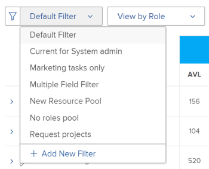
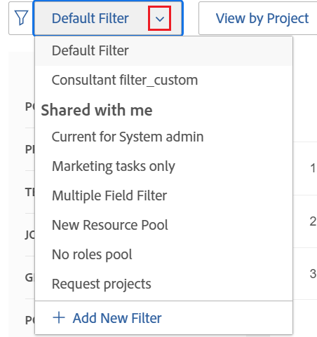

# Filtrar informações no Planejador de recursos

<!--

(AL:*Iterate on this article: filtering by custom data. Other enhancements? Special characters caveat might change - follow the story to know when. It originally came in Beta 3 17.3.)

-->

Usando filtros, você pode modificar quais informações são exibidas no Planejador de recursos de todas as informações armazenadas no sistema.

## Requisitos de acesso

+++ Expanda para visualizar os requisitos de acesso para a funcionalidade neste artigo.

Você deve ter o seguinte acesso para executar as etapas deste artigo:

<table style="table-layout:auto"> 
 <col> 
 <col> 
 <tbody> 
  <tr> 
   <td role="rowheader">plano do Adobe Workfront</td> 
   <td>
Novo: Qualquer um

       
ou

       
Atual: Pro ou superior
 </td> 
  </tr> 
  <tr> 
   <td role="rowheader">Licença do Adobe Workfront</td> 
   <td>
Novo: Claro ou superior

       
ou

       
Atual: revisão ou superior
</td>
  </tr> 
  <tr> 
   <td role="rowheader">Configurações de nível de acesso</td> 
   <td> 
Acesso de visualização ou superior para Projetos, Usuários e Gerenciamento de recursos
 </td> 
  </tr> 
  <tr> 
   <td role="rowheader">Permissões de objeto</td> 
   <td> 
Exibir permissões ou superiores para projetos
 </td> 
  </tr> 
 </tbody> 
</table>

Para obter mais detalhes sobre as informações nesta tabela, consulte [Requisitos de acesso na documentação do Workfront](/help/quicksilver/administration-and-setup/add-users/access-levels-and-object-permissions/access-level-requirements-in-documentation.md).

+++

## Visão geral dos filtros do Planejador de recursos

Para minimizar a quantidade de informações exibidas no Planejador de recursos, o Adobe Workfront fornece um Filtro padrão com critérios pré-configurados. Para obter informações sobre o Filtro Padrão, consulte a seção [Visão Geral do Filtro Padrão no Planejador de Recursos](#overview-of-the-default-filter-in-the-resource-planner) neste artigo.

Também é possível criar filtros personalizados. Para obter informações sobre como personalizar filtros no Planejador de recursos, consulte a seção [Criar filtros do Planejador de recursos](#create-resource-planner-filters) neste artigo.

Considere o seguinte ao usar filtros no Planejador de recursos:

* Os filtros que você criar estarão visíveis apenas para você. É possível compartilhar filtros para disponibilizá-los a outros usuários.
* Como administrador do Workfront, você só pode ver os filtros criados ou compartilhados com você.
* Os resultados filtrados não são alterados quando você seleciona uma visualização diferente para o Planejador de recursos.\
  Para obter mais informações sobre como alterar a exibição no Planejador de recursos, consulte a seção de seleção &quot;Projeto/ Função/ Usuário&quot; na [Visão geral da navegação do Planejador de recursos](../../resource-mgmt/resource-planning/resource-planner-navigation.md).

* A aplicação de um filtro não altera os dados de alocação e disponibilidade no Planejador de recursos para projetos, funções ou usuários. Um filtro altera somente o número de objetos que você vê no Planejador de recursos.
* A filtragem se aplica a todos os objetos exibidos no Planejador de recursos ao mesmo tempo. Por exemplo, se você filtrar por um usuário específico, o Planejador de recursos exibirá apenas os seguintes resultados:

   * Projetos em que esse usuário faz parte do Conjunto de recursos (para as exibições Projeto e Função) ou tem uma atribuição no projeto (para a exibição Usuário)
   * Funções associadas ao usuário nesses projetos\
     Outras funções ou usuários nos projetos aos quais o usuário está associado não são exibidos.

## Visão geral do filtro padrão no Planejador de recursos {#overview-of-the-default-filter-in-the-resource-planner}

Quando você abre o Planejador de recursos pela primeira vez, o Workfront aplica o filtro Padrão. É possível editar o filtro Padrão para filtrar apenas os itens que deseja exibir. Para obter informações sobre como modificar filtros, consulte a seção [Editar um filtro no Planejador de Recursos](#edit-a-filter-in-the-resource-planner) neste artigo.

Considere o seguinte ao usar o filtro Padrão:

* O Filtro padrão recupera informações somente de projetos com o seguinte:

   * Uma Data de conclusão planejada que ocorre após a primeira data do mês atual
   * Uma Data de Início Planejada que ocorre antes do último dia do quarto mês a partir da data atual
   * Um Status de Atual ou de Planejamento

  >[!IMPORTANT]
  >
  >O filtro Padrão recupera informações dos projetos que ocorrem sempre dentro de quatro meses, começando no primeiro dia do mês atual, independentemente do período selecionado para a exibição no Planejador de recursos.

* Na Exibição de usuário, todos os usuários no sistema são exibidos, mas somente os usuários associados aos projetos filtrados mostram informações sobre horas.
* É possível editar as informações no filtro Padrão sem salvar o filtro.
* É possível duplicar e editar uma cópia do filtro Default, alterar os critérios desejados e salvá-lo como um novo filtro.
* Não é possível excluir ou compartilhar o filtro Padrão.

  

## Criar filtros do Planejador de recursos {#create-resource-planner-filters}

<!--

(Alina: **^ This section is somewhat duplicated (format more than content) from the "Filtering Utilization Information" section in "Viewing Utilization Information for Projects, Programs, and Portfolios.")

-->

A criação de um filtro no Planejador de recursos é idêntica para todas as exibições.

Verifique se os pré-requisitos para exibir as informações corretas no Planejador de recursos estão em vigor antes de criar um filtro.\
Para obter informações sobre como atender aos pré-requisitos necessários para trabalhar com o Planejador de recursos, consulte a seção &quot;Pré-requisitos para trabalhar no Planejador de recursos&quot; no artigo [Visão geral do Planejador de recursos](../../resource-mgmt/resource-planning/get-started-resource-planner.md).

Considere o seguinte ao criar um filtro:

* Não há limite para o número de objetos que você pode filtrar de uma vez.
* Os campos disponíveis que você pode adicionar a um filtro mudam de acordo com o objeto da visualização aplicada ao Planejador de recursos. Por exemplo, você pode filtrar por campos de Problema ou Tarefa somente na Exibição do usuário, pois esses objetos são exibidos somente na Exibição do usuário. Se você criar um filtro para Problemas ou Tarefas no modo de exibição Usuário e, em seguida, aplicá-lo aos modos de exibição Projeto ou Função, ele será ignorado, pois os campos não existem nos modos de exibição Projeto ou Função. Nesse caso, o filtro parece indisponível.

Para criar um filtro no Planejador de recursos:

{{step1-to-resourcing}}

O **Planejador** é exibido por padrão.

Por padrão, na primeira vez que você acessa o Planejador de recursos, o <strong>Filtro padrão</strong> é aplicado. Para obter mais informações sobre o filtro Padrão, consulte a <a href="#overview-of-the-default-filter-in-the-resource-planner" class="MCXref xref">Visão Geral do Filtro Padrão na seção Planejador de Recursos</a> neste artigo.

1. No canto superior esquerdo do, clique no ícone **Filtro**.
   
Ou
Expanda o menu suspenso **Filtro** e clique em **Adicionar Novo Filtro**.
   

1. Para criar um filtro usando os critérios internos, especifique qualquer um dos seguintes campos:

   * **Portfolio**: comece digitando o nome do portfólio que contém as informações que você deseja incluir no Planejador de recursos, em seguida, clique no nome quando ele aparecer na lista.\
     Repita esse processo para incluir informações de vários portfólios.

   * **Status do Projeto**: expanda o menu suspenso Status do Projeto e selecione um ou vários status de projeto disponíveis na lista.
   * **Equipe**: comece a digitar o nome de uma ou várias equipes associadas aos usuários atribuídos às tarefas nos projetos que você deseja exibir.
   * **Função de trabalho**: comece a digitar o nome de uma ou várias funções de trabalho associadas aos usuários atribuídos às tarefas nos projetos que você deseja exibir.
   * **Pools**: comece a digitar o nome de um ou vários Pools de Recursos associados aos projetos (para o Modo de Exibição de Projeto), aos usuários (para o Modo de Exibição de Usuário) ou associados aos projetos e usuários (para o Modo de Exibição de Função) que você deseja exibir.
   * **Grupo**: comece a digitar o nome de um ou vários grupos associados aos usuários (no modo de exibição Usuário) ou projetos (nos modos de exibição Projeto e Função) que você deseja exibir.

1. Clique em **Adicionar regra de filtro** e comece a digitar o nome do campo pelo qual você deseja filtrar na caixa **Digitar para filtrar itens**. Se o campo estiver disponível, ele será preenchido para cada objeto em que puder ser associado.

   >[!IMPORTANT]
   >
   >Ao fazer referência a campos personalizados, você deve digitar o nome do campo, não o rótulo do campo. O rótulo do campo é exibido em um formulário personalizado anexado a um objeto. Para obter informações sobre a diferença entre o rótulo e o nome de um campo personalizado, consulte [Criar um formulário com o designer de formulário](/help/quicksilver/administration-and-setup/customize-workfront/create-manage-custom-forms/form-designer/design-a-form/design-a-form.md).

1. Clique no nome do campo para adicioná-lo ao filtro quando ele aparecer na lista.\
   Para obter mais informações sobre os campos que você vê na lista, consulte [Glossário da terminologia do Adobe Workfront](../../workfront-basics/navigate-workfront/workfront-navigation/workfront-terminology-glossary.md).

1. (Opcional) Selecione o filtro e os modificadores de condição para o filtro. Os modificadores disponíveis estão descritos em [Filtro e modificadores de condição](../../reports-and-dashboards/reports/reporting-elements/filter-condition-modifiers.md).

   É possível usar curingas baseados em usuário ou em data para filtrar informações associadas ao usuário conectado.\
   Para obter informações sobre curingas aceitos em filtros, consulte [Visão geral das variáveis de filtro curinga](../../reports-and-dashboards/reports/reporting-elements/understand-wildcard-filter-variables.md).

1. Clique em **Salvar** para salvar a regra de filtro.
1. (Opcional) Clique em **Adicionar regra de filtro** para adicionar uma nova regra para outro objeto ou campo.
1. Clique em **Aplicar** para aplicar o filtro sem salvá-lo.

   Ou

   Clique em **Salvar Filtro** para salvar o filtro.\
   

1. (Condicional) Depois de clicar em **Salvar**, especifique um nome para o filtro na caixa **Nome do Filtro** dentro da caixa de diálogo **Salvar Filtro**. Este campo é obrigatório.\
   

   >[!NOTE]
   >
   >Se o nome do filtro incluir caracteres especiais, use apenas os seguintes caracteres:
   >
   >* Vírgula
   >* Barra
   >* Hífen
   >* Sublinhado

1. Clique em **Salvar**.

   Os resultados no Planejador de recursos agora são filtrados pelas informações incluídas nas regras de filtro.

## Aplicar um filtro existente

Quando você ou alguém com acesso ao Planejador de recursos salva um filtro, ele fica disponível para todos que usam o Planejador de recursos.

Para aplicar um filtro existente:

1. Vá até o Planejador de recursos.
1. No canto superior esquerdo, expanda o menu suspenso **Filtro**.

   Você pode ver os filtros que criou ou outros criados e compartilhados com você neste menu.\
   

1. Selecione um filtro no menu suspenso. Você pode ver os filtros que você ou outros usuários criaram neste menu.\
   Ao selecionar um filtro, ele reduz automaticamente a quantidade de informações exibidas no Planejador de recursos.

## Editar um filtro no Planejador de recursos {#edit-a-filter-in-the-resource-planner}

Você pode editar um filtro no Planejador de recursos seguindo um destes procedimentos:

* [Renomear um filtro](#rename-a-filter)
* [Editar as informações em um filtro](#edit-the-information-in-a-filter)
* [Duplicação de um filtro](#duplicate-a-filter)

Quando você edita um filtro, ele é atualizado para todos os usuários no sistema que têm acesso ao Planejador de recursos.

### Renomear um filtro {#rename-a-filter}

É possível alterar o nome de um filtro sem alterar seus critérios. Recomendamos informar outros usuários no sistema sobre essa alteração, pois os filtros estão visíveis para outros usuários. Essa alteração afeta as listas de filtros para todos que podem ver o Planejador de recursos.

1. Vá para o Planejador de recursos e expanda o menu suspenso **Filtro** para selecionar um filtro salvo.
1. Expanda o menu suspenso **Filtro**. Localize o filtro que deseja renomear e passe o mouse sobre seu nome.
1. Selecione o ícone **Renomear filtro** ao lado do nome do filtro.

   

1. Especifique um novo nome para o filtro na caixa **Nome do Filtro**.
1. Clique em **Salvar**.\
   As informações incluídas no filtro são iguais e o nome é atualizado.

### Editar as informações em um filtro {#edit-the-information-in-a-filter}

É possível alterar as informações incluídas em um filtro sem alterar seu nome. Recomendamos informar outros usuários no sistema sobre essa alteração, pois os filtros ficam visíveis para eles. Essa alteração afeta as listas de filtros para todos que podem ver o Planejador de recursos.

1. Vá para o Planejador de recursos e expanda o menu suspenso **Filtro** no canto superior esquerdo.
1. Selecione um filtro existente que deseja editar.
1. Clique no ícone **Filtro**.\
   

1. Adicione novos campos ao filtro.\
   Para obter informações sobre a criação de filtros, consulte [Criar filtros do Planejador de Recursos](#create-resource-planner-filters).

1. Passe o mouse sobre os campos existentes selecionados para o filtro e clique no ícone **Editar** para selecionar outro campo ou no ícone **Excluir** para excluir o campo.\
   

1. (Opcional) Clique em **Adicionar regra de filtro** para adicionar novos campos ao filtro.\
   Para obter mais informações sobre como definir critérios de filtro, consulte [Criar filtros do Planejador de Recursos](#create-resource-planner-filters).

1. Clique em **Aplicar** para aplicar o filtro sem salvá-lo.

   Ou

   Clique em **Salvar** para salvar o filtro.\
   O filtro é salvo com o mesmo nome, mas com novos critérios de filtragem.

### Duplicação de um filtro {#duplicate-a-filter}

É possível duplicar um filtro existente. Os critérios de filtragem originais permanecem os mesmos no filtro duplicado e você pode salvar o novo filtro com um novo nome.

1. Vá para o Planejador de recursos e expanda o menu suspenso **Filtro** no canto superior esquerdo.
1. Passe o mouse sobre o nome de um filtro salvo que deseja duplicar.
1. Clique no ícone **Duplicar**.

   \
   A caixa Duplicar Filtro é exibida.

1. No campo **Nome do Filtro**, especifique um novo nome para o filtro duplicado.\
   O nome padrão do novo filtro é *`<Original Filter Name>`(cópia)*.

1. Clique em **Salvar**. Um novo filtro é criado com os mesmos critérios do filtro original e com um novo nome.

   >[!NOTE]
   >
   >Embora você possa ter dois filtros com o mesmo nome e critérios idênticos, recomendamos que salve filtros com critérios de filtragem e nomes exclusivos no Planejador de recursos para evitar confusão.

## Excluir um filtro

Você pode excluir um filtro quando ele não é mais necessário. Não é possível excluir o filtro padrão.

Para obter informações sobre o Filtro Padrão, consulte a [Visão Geral do Filtro Padrão na seção Planejador de Recursos](#overview-of-the-default-filter-in-the-resource-planner) neste artigo.

Quando você exclui um filtro, ele é excluído para todos os usuários do Workfront que têm acesso ao Planejador de recursos. Antes de removê-lo, verifique se o filtro que você deseja remover não é mais usado por outra pessoa que esteja trabalhando no Planejador de recursos. Um filtro excluído não pode ser recuperado.

Para remover um filtro:

1. Vá até o Planejador de recursos.
1. Expanda o menu suspenso **Filtro**.
1. Localize o filtro que deseja remover e passe o mouse sobre seu nome.
1. Selecione o ícone **Excluir filtro** ao lado do nome do filtro.

   

1. Clique em **Excluir** na caixa de diálogo **Excluir Filtro**.

1. O filtro é excluído e removido do Planejador de recursos.

## Compartilhar um filtro

Você pode compartilhar um filtro que criou ou que tem acesso para compartilhar com outros usuários. Não é possível compartilhar o Filtro padrão, mas você pode duplicá-lo e compartilhar a cópia.

>[!NOTE]
>
>Todos os usuários, incluindo administradores do Workfront, podem acessar somente os filtros que criaram ou que foram compartilhados com eles. Você pode compartilhar um filtro com usuários específicos para disponibilizá-lo para todos os usuários do Planejador de recursos.

Para obter informações sobre o Filtro Padrão, consulte a [Visão Geral do Filtro Padrão na seção Planejador de Recursos](#overview-of-the-default-filter-in-the-resource-planner) neste artigo.

Para obter informações sobre duplicação de filtros, consulte a seção [Duplicar um filtro](#duplicate-a-filter) neste artigo.

1. Vá até o Planejador de recursos.
1. Expanda o menu suspenso **Filtro**.
1. Localize o filtro que deseja compartilhar e passe o mouse sobre seu nome.
1. Selecione o ícone **Compartilhar filtro** ao lado do nome do filtro.

   

   A caixa de diálogo Filtrar acesso será exibida.

1. (Opcional) Para disponibilizar o filtro para todos os usuários do Planejador de Recursos, clique no ícone **Configurações** e selecione **Tornar isto visível em todo o sistema**.

   

1. Na caixa **Conceder acesso ao filtro do planejador de recursos para:**, comece a digitar os nomes de usuários, equipes, funções, grupos ou empresas com as quais deseja compartilhar o filtro.
1. Selecione entre os seguintes níveis de permissões:

   * Exibir
   * Gerenciar

     Para obter informações sobre permissões no Workfront, consulte [Visão geral das permissões de compartilhamento em objetos](../../workfront-basics/grant-and-request-access-to-objects/sharing-permissions-on-objects-overview.md)

1. (Opcional) Clique em **Configuração Avançada** s para adicionar permissões para cada nível, selecionando-as ou removendo permissões para cada nível, desmarcando-as.

   

1. Clique em **Salvar**.

   O filtro é compartilhado com as entidades selecionadas e aparece na área **Compartilhado comigo**.

   
