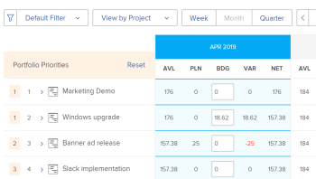

# Priorizar projetos no Planejador de Recursos

Os projetos são listados em ordem de prioridade no Planejador de Recursos com o projeto mais importante no topo.

## Requisitos de acesso

Você deve ter o seguinte:

<table style="table-layout:auto"> 
 <col> 
 <col> 
 <tbody> 
  <tr> 
   <td role="rowheader">Plano Adobe Workfront*</td> 
   <td> 
Pro e superior
 </td> 
  </tr> 
  <tr> 
   <td role="rowheader">Licença da Adobe Workfront*</td> 
   <td> 
Plano 
 </td> 
  </tr> 
  <tr> 
   <td role="rowheader">Configurações de nível de acesso*</td> 
   <td> 
Edite o acesso ao Gerenciamento de Recursos que inclui acesso a Editar prioridades e horas orçamentárias no Planejador de Recursos
 
Editar acesso a dados financeiros, projetos e usuários
 
<b>Nota</b>

Caso ainda não tenha acesso, pergunte ao administrador do Workfront se ele definiu restrições adicionais em seu nível de acesso. Para obter informações sobre como um administrador do Workfront pode alterar seu nível de acesso, consulte <a href="../../administration-and-setup/add-users/configure-and-grant-access/create-modify-access-levels.md" class="MCXref xref">Criar ou modificar níveis de acesso personalizados</a>.
 </td>
</tr> 
  <tr> 
   <td role="rowheader">Permissões de objeto</td> 
   <td> 
Gerencie permissões dos projetos para os quais deseja obter informações de orçamento com a capacidade de Gerenciar finanças
 
Para obter informações sobre como solicitar acesso adicional, consulte <a href="../../workfront-basics/grant-and-request-access-to-objects/request-access.md" class="MCXref xref">Solicitar acesso a objetos </a>.
 </td> 
  </tr> 
 </tbody> 
</table>

&#42;Para descobrir qual plano, tipo de licença ou acesso você tem, entre em contato com o administrador da Workfront.

## Ordem padrão dos projetos no Planejador de Recursos

Por padrão, os projetos são listados na Visualização de projeto do Planejador de recursos levando em consideração os critérios abaixo.

>[!IMPORTANT]
>
>Os projetos são listados de acordo com os três critérios abaixo somente na primeira vez que você abrir o Planejador de Recursos. No entanto, essa prioridade padrão torna-se automaticamente sua prioridade personalizada e não pode ser revertida para a prioridade original sempre que você executar um dos seguintes procedimentos:
>
>* Ao clicar em Salvar a qualquer momento.
>* Ao alterar manualmente a prioridade de planejamento do projeto. Para obter informações sobre como alterar a prioridade de planejamento do projeto manualmente, consulte a seção [Alterar manualmente a prioridade de planejamento do projeto](#manually-change-the-project-planning-priority) neste artigo.
>
>Depois que a prioridade do projeto se tornar sua prioridade personalizada, qualquer alteração nas informações do projeto não afetará mais a ordem dos projetos usando esses critérios. Depois disso, é possível priorizar projetos apenas manualmente.

Os critérios padrão originais para listar os projetos na Exibição do projeto são os seguintes, nesta ordem:

1. Pela Pontuação de alinhamento do projeto.\
   Para obter mais informações sobre a Pontuação de alinhamento do projeto, consulte [Aplicar um scorecard a um projeto e gerar uma Pontuação de alinhamento](../../manage-work/projects/define-a-business-case/apply-scorecard-to-project-to-generate-alignment-score.md) .

1. Pela Data inicial planejada do projeto (se o campo Alinhamento for nulo ou for o mesmo para vários projetos).
1. Em ordem alfabética (se o campo Alinhamento for nulo ou igual a, e a data inicial planejada for a mesma para vários projetos).

Considere o seguinte ao trabalhar com as prioridades do projeto no Planejador de Recursos:

* Você pode personalizar manualmente a prioridade do projeto somente quando aplicar a Exibição do projeto. Isso também altera a ordem dos projetos no Planejador de Recursos.
* Quando você aplica a Função ou as Exibições do usuário no Planejador de Recursos, os projetos são exibidos na mesma ordem de prioridade estabelecida na Exibição do Projeto.
* A ordem dos projetos no Planejador de Recursos é exclusiva para você. Outros usuários podem visualizar os mesmos projetos no Planejador de Recursos, mas em uma ordem diferente. Não é possível relatar no campo Prioridade de planejamento do projeto . Isso é visível apenas no Planejador de recursos e serve como um sinalizador para priorizar seus projetos.

Os projetos associados a um portfólio podem ter uma prioridade no nível do portfólio. Você pode ativar a exibição da prioridade do portfólio de um projeto no Planejador de Recursos, além da prioridade do Planejador de Recursos. Também é possível ordenar os projetos de acordo com a prioridade do portfólio.

## Alterar manualmente a prioridade de planejamento do projeto {#manually-change-the-project-planning-priority}

Você deve ter o acesso Editar ao Gerenciamento de Recursos e as permissões de Gerenciamento para gerenciar projetos, para reordenar os projetos no Planejador de Recursos.

Ao dar aos projetos uma nova prioridade, você pode classificá-los em ordem de importância.

Para editar a Prioridade de planejamento do projeto:

1. Vá para o **Planejador de recursos**.

1. Clique dentro do campo à esquerda do nome do projeto que contém um número, insira um número para alterar a Prioridade de Planejamento e pressione Enter.\
   \
   Ou\
   Passe o mouse sobre o nome do projeto e clique no indicador à esquerda do nome do projeto, arraste-o e solte-o no local correto para alterar a prioridade.

   

   Ao selecionar números para priorizar projetos, selecione números mais baixos para prioridades mais altas (mais importantes) e números mais altos para prioridades mais baixas (menos importantes). Quando você altera o número de prioridade de um projeto para um número menor (prioridade mais alta), todos os outros projetos no Planejador de Recursos são deslocados para baixo na lista (tornam-se menos importantes).\
   Quando você altera o número de prioridade de um projeto para um número mais alto (prioridade mais baixa), todos os outros projetos no Planejador de Recursos são deslocados para cima na lista (tornam-se mais importantes).

1. Clique em **Salvar**.\
   A ordem dos projetos muda de acordo com suas seleções e isso se torna a prioridade de projeto personalizado no Planejador de Recursos. Outros usuários não podem ver sua ordem de prioridade dos projetos no Planejador de Recursos, embora possam visualizar os mesmos projetos em seus Planejadores de Recursos.

## Ordenar projetos de acordo com sua Prioridade de Portfolio no Planejador de Recursos

>[!IMPORTANT]
>
>Sua empresa deve ter um plano de negócios ou Workfront superior para priorizar projetos no Portfolio Otimizer.
>
>Para obter mais informações sobre os planos da Workfront, consulte [Nossos planos](https://www.workfront.com/plans).
>
>Para obter informações sobre como priorizar projetos no Portfolio Otimizer, consulte [Priorizar projetos no Portfolio Otimizer](../../manage-work/portfolios/portfolio-optimizer/prioritize-projects-in-portfolio-optimizer.md).

1. Abra o **Planejador de recursos** no **Exibição do projeto**.
1. Clique no botão **Configurações** ícone .
1. Ative o **Exibir prioridades de Portfolio** definição para exibir as prioridades do projeto de acordo com a Portfolio a que estão atribuídas. A prioridade dos projetos de acordo com seus portfólios é exibida ao lado da prioridade do Planejador de Recursos. Esta configuração é desativada por padrão.

   <!--
   
(NOTE: check screen shot to see if this is accurate still - should say Order, and not Sort:)

   -->

   

   As prioridades de portfólio dos projetos são exibidas somente na exibição Projeto do Planejador de Recursos.

1. Clique em **Pedido** ordenar os projetos de acordo com as prioridades da carteira.

   Se você tiver projetos que pertencem a mais de um portfólio, poderá ver vários projetos com a mesma prioridade de portfólio no Planejador de Recursos. Nesse caso, os projetos com a mesma prioridade de portfólio são listados pelos seguintes critérios, nesta ordem:

   1. Pontuação do Alinhamento
   1. Data de início planejado
   1. Nome do Projeto

   

1. Clique em **Salvar**.

## O efeito da alteração da Prioridade de Planejamento do Projeto nas Horas Disponíveis do Usuário

A Prioridade de planejamento do projeto afeta as Horas disponíveis dos usuários. Os usuários associados ao projeto com a prioridade mais alta mostram a maior disponibilidade da coluna Horas Disponíveis (AVL) para esse projeto, de acordo com suas programações.

Os mesmos usuários associados ao segundo projeto por ordem de prioridade mostrarão um valor Horas Disponíveis, que é a diferença entre o valor total de Horas Disponíveis e o que já foi orçado para o primeiro projeto na coluna Horas Orçamentadas e assim por diante. Para obter informações sobre como orçar recursos no Planejador de Recursos, consulte [Recursos de orçamento no Planejador de Recursos usando as exibições Projeto e Função](../../resource-mgmt/resource-planning/budget-resources-project-role-views-resource-planner.md).

Se nenhuma hora tiver sido orçada para o primeiro projeto (em ordem de prioridade) de um usuário, mas as horas tiverem sido orçadas para o segundo projeto para o mesmo usuário, o usuário mostrará a quantidade total de horas disponíveis para ambos os projetos.

Recomendamos a atualização da coluna Horas Orçadas para seus usuários na ordem dos projetos no Planejador de Recursos, para garantir que você possa ver com precisão as Horas Disponíveis para o usuário o tempo todo.

>[!NOTE]
>
>Como a Prioridade de planejamento do projeto é exclusiva de cada gerenciador de recursos, seu segundo projeto de prioridade pode ser um projeto de primeira prioridade para outro usuário que visualiza os mesmos projetos em seu Planejador de recursos. Se outro gerenciador de recursos orçar um recurso para seu primeiro projeto, as Horas Disponíveis diminuirão para esse recurso para seu primeiro projeto com base nessa alteração.
>
>O usuário que orçar as horas primeiro aloca esse recurso e reduz o número de Horas Disponíveis para esse recurso no sistema. A quantidade de Horas Disponíveis deve ser atualizada para todos os usuários assim que as Horas Orçadas forem salvas para um recurso no Planejador de Recursos.
>
>Para obter mais informações sobre Horas disponíveis, consulte [Disponibilidade e afetação de recursos](../../resource-mgmt/resource-planning/resource-availability-allocation-resource-planner.md#availability-and-allocation-of-resources).
