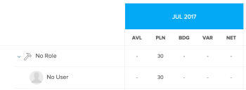

# Visão geral da navegação do Planejador de recursos

Ao usar o Planejador de recursos da Adobe Workfront, você pode entender facilmente a disponibilidade de seus recursos, bem como o tempo planejado necessário para concluir o trabalho em seus projetos. Em seguida, é possível gerenciar a alocação dos usuários e suas funções de trabalho nos projetos aos quais eles estão atribuídos.

>[!TIP]
>
>Não é possível gerenciar a alocação de equipes nas tarefas às quais elas estão atribuídas no Planejador de recursos.

Você deve atender aos pré-requisitos necessários para usar totalmente o Planejador de recursos. Para obter mais informações sobre o Planejador de recursos, consulte [Visão geral do Planejador de recursos](../../resource-mgmt/resource-planning/get-started-resource-planner.md).

As seções a seguir descrevem todas as áreas do Planejador de Recursos.

## Linha do tempo dos projetos

Use o calendário na parte superior do Planejador de recursos para navegar pela linha do tempo dos projetos que você está visualizando. Por padrão, a linha do tempo começa com o mês de hoje.\
Para obter mais informações sobre como alterar o período da linha do tempo que você está exibindo no Planejador de recursos, consulte a seção [Seleção de período](#timeframe-selection) neste artigo.

## Seleção de período  {#timeframe-selection}

Por padrão, o Planejador de recursos mostra as informações do recurso para três ou quatro meses de cada vez, começando com o mês atual. O número de períodos exibidos depende da largura da tela.

>[!TIP]
>
>Você não pode exibir mais de quatro períodos de tempo de cada vez no Planejador de recursos.

Para navegar na linha do tempo:

1. Clique nas setas para trás e para a frente para mover-se para trás e para frente na linha do tempo.
1. Selecione entre as seguintes opções de intervalo de datas no Planejador de recursos clicando nos botões apropriados:

   <table style="table-layout:auto"> 
    <col> 
    <col> 
    <tbody> 
     <tr> 
      <td role="rowheader">Semana</td> 
      <td>Exibe informações por semana. O número da semana é exibido próximo às datas no cabeçalho da coluna. </td> 
     </tr> 
     <tr> 
      <td role="rowheader">Mês</td> 
      <td> Exibe informações por mês.</td> 
     </tr> 
     <tr> 
      <td role="rowheader">Trimestre</td> 
      <td>Exibe informações por trimestre. O número do trimestre é exibido próximo às datas no cabeçalho da coluna. Trimestres personalizados não são exibidos no Planejador de Recursos. </td> 
     </tr> 
     <tr> 
      <td role="rowheader">Hoje</td> 
      <td>Retorna ao mês, semana ou trimestre de hoje.</td> 
     </tr> 
    </tbody> 
   </table>

## Seleção da visualização do projeto/ função/ usuário

Você pode alterar a exibição no Planejador de recursos dependendo de como deseja que as informações sejam exibidas.

Por padrão, o Planejador de recursos é exibido na Exibição de usuário. Você pode alterar o modo de exibição para Projeto ou Função. Ao alterá-la para outra exibição, sua escolha se tornará a exibição padrão.

Quando você altera a exibição, as seguintes informações também são alteradas:

* A hierarquia de objetos (informações nas linhas do Planejador de recursos).
* As informações de alocação de horas (informações nas colunas do Planejador de recursos).

  Para obter mais informações sobre o que as colunas mostram no Planejador de Recursos, dependendo da exibição selecionada, consulte [Revisar a disponibilidade e a alocação de recursos usando o Planejador de Recursos da Adobe Workfront](../../resource-mgmt/resource-planning/resource-availability-allocation-resource-planner.md).

Para exibir informações precisas no Planejador de recursos, você deve atender a um conjunto de pré-requisitos. Para obter mais informações sobre os pré-requisitos, consulte a seção &quot;Pré-requisitos para trabalhar no Planejador de Recursos&quot; no artigo [Visão geral do Planejador de Recursos](../../resource-mgmt/resource-planning/get-started-resource-planner.md).  Para alterar a exibição no Planejador de recursos:

1. Vá para o **Planejador de recursos**.\
   Para obter mais informações sobre como acessar o Planejador de Recursos, consulte a seção [Localizar o Planejador de Recursos](../../resource-mgmt/resource-planning/get-started-resource-planner.md#accessing-the-resource-planner) no artigo [Visão geral do Planejador de Recursos](../../resource-mgmt/resource-planning/get-started-resource-planner.md).

1. No menu suspenso **Exibir por**, selecione uma das seguintes exibições:

   * [Visualizar por Projeto](#view-by-project)
   * [Visualizar por Função](#view-by-role)
   * [Visualizar por Usuário](#view-by-user)

### Visualizar por Projeto {#view-by-project}

Considere o seguinte ao selecionar a Exibição do projeto no Planejador de recursos:

* Você pode ver projetos que tem permissões para, pelo menos, visualizar.
* Ao acessar o Planejador de recursos pela primeira vez, você pode ver projetos filtrados pelo Filtro padrão.\
  Para obter mais informações sobre como filtrar informações no Planejador de Recursos, consulte [Informações de filtro no Planejador de Recursos](../../resource-mgmt/resource-planning/filter-resource-planner.md).

* O número de itens exibidos ou que podem ser exportados da Exibição de projeto é limitado para melhorar o desempenho.\
  Para obter mais informações sobre limitações ao visualizar o Planejador de Recursos na Exibição do Projeto, consulte a seção [Limitações na Exibição do Projeto](../../resource-mgmt/resource-planning/resource-planner-display-limitations.md#project-view-limits) no artigo [Limitações de exibição do Planejador de Recursos](../../resource-mgmt/resource-planning/resource-planner-display-limitations.md).

* Os projetos são listados na ordem de prioridade na Visualização de projeto.\
  Para obter mais informações sobre a prioridade do projeto no Planejador de recursos, consulte a seção [Prioridade de planejamento do projeto](#project-planning-priority) neste artigo.

* À medida que expande cada projeto, você pode exibir as funções de trabalho associadas a ele.\
  À medida que você expande cada função, é possível exibir usuários associados a ela.\
  Role para carregar mais funções e usuários em cada projeto.

* Quando esta visualização é aplicada, as horas da função, FTE ou custo somam-se às horas do projeto, FTE ou custo.\
  

* Você pode exibir as seguintes informações de hora, FTE ou Custo na exibição Projeto:

   * Disponível
   * Planejado
   * Estimado
   * Variação
   * Líquido

     Para obter mais informações, consulte [Recursos de orçamento no Planejador de recursos usando as exibições de Projeto e Função](../../resource-mgmt/resource-planning/budget-resources-project-role-views-resource-planner.md).

### Visualizar por Função {#view-by-role}

Considere o seguinte ao selecionar a Exibição de função no Planejador de recursos:

* Você deve ter pelo menos o acesso de Visualização ao Gerenciamento de recursos e permissões de visualização nos projetos para visualizar as funções associadas a esses projetos.
* Você pode expandir cada função para exibir uma lista de projetos, e cada projeto para exibir uma lista de usuários que podem desempenhar essas funções nos projetos.
* O número de itens que você exibe ou pode exportar da Exibição de função é limitado para melhorar o desempenho.\
  Para obter mais informações sobre limitações ao visualizar o Planejador de Recursos na Exibição de Funções, consulte a seção [Limitações na Exibição de Funções](../../resource-mgmt/resource-planning/resource-planner-display-limitations.md#role-view-limits) em [Limitações de exibição do Planejador de Recursos](../../resource-mgmt/resource-planning/resource-planner-display-limitations.md).

* Os projetos são listados na função de trabalho na mesma ordem de prioridade que são listados na Exibição do projeto.
* Quando essa exibição é aplicada, as Horas do projeto, FTE ou Custo somam as Horas da função, FTE ou Custo.\
  

* Você pode exibir as seguintes informações de hora, FTE ou Custo na exibição Função:

   * Disponível
   * Planejado
   * Estimado
   * Variação
   * Líquido

     Para obter mais informações, consulte [Recursos de orçamento no Planejador de recursos usando as exibições de Projeto e Função](../../resource-mgmt/resource-planning/budget-resources-project-role-views-resource-planner.md).

### Visualizar por Usuário {#view-by-user}

Você pode exibir o Planejador de recursos na Exibição do Usuário para entender a diferença entre as Horas Planejadas e Disponíveis ou FTE para seus usuários ou para ver a quantidade de Horas Reais que eles registraram.

Você não pode estimar seus recursos ao aplicar a Exibição de usuário ao Planejador de recursos. Você deve estimar seus recursos usando as exibições de Projeto ou Função, e usar a exibição Usuário para revisar a alocação e a disponibilidade de seus usuários em relação ao trabalho planejado.* *

A Exibição do usuário é a exibição padrão do Planejador de recursos.

Considere o seguinte ao selecionar a Exibição de Usuário no Planejador de Recursos:

* Você pode ver todos os usuários aos quais tem permissões para exibir, até 2000 usuários, que estão ativos e fizeram logon no Adobe Workfront pelo menos uma vez.\
  Filtre a lista de usuários por Equipe, Função de trabalho ou Pools para ver os usuários associados apenas a essas entidades.
* Se você tiver filtrado a lista de usuários por projetos, somente os usuários associados aos projetos filtrados poderão ser expandidos e também exibir informações sobre as horas.\
  Para obter mais informações sobre a filtragem de informações no Planejador de recursos, consulte [Filtrar informações no Planejador de recursos](../../resource-mgmt/resource-planning/filter-resource-planner.md).

* O número de itens exibidos ou que podem ser exportados da Exibição do usuário é limitado para melhorar o desempenho.\
  Para obter mais informações sobre limitações ao visualizar o Planejador de Recursos no Modo de Exibição do Usuário, consulte a seção [Limitações no Modo de Exibição do Usuário](../../resource-mgmt/resource-planning/resource-planner-display-limitations.md#user-view-limits) em [Limitações de exibição do Planejador de Recursos](../../resource-mgmt/resource-planning/resource-planner-display-limitations.md) .

* Os projetos são listados sob o nome do usuário na mesma ordem de prioridade que são listados na Visualização de projeto.\
  Para obter mais informações sobre a prioridade do projeto no Planejador de recursos, consulte a seção [Prioridade de planejamento do projeto](#project-planning-priority) neste artigo.

* Se os usuários não tiverem nenhuma função de trabalho associada a eles, as horas ou os valores de FTE serão listados na seção **Nenhuma função**.
* Quando essa visualização é aplicada, as Horas do projeto ou FTE somam as Horas do usuário ou FTE.

  >[!TIP]
  >
  >Não é possível exibir a alocação e a disponibilidade dos usuários por Custo na Exibição do Usuário.

* Suas permissões para projetos e tarefas determinam o que é exibido sob os nomes dos usuários que você vê na Exibição de usuário.\
  Existem os seguintes cenários:

   * Quando você não tem permissões para ver projetos e as tarefas ou problemas atribuídos aos usuários exibidos no Planejador de recursos, esses itens são listados nas seções **Itens Inacessíveis**. As seções **Itens Inacessíveis** substituem as seções Projeto ou Tarefa neste caso.

   * Quando você não tem permissões para ver os projetos, mas tem acesso para ver as tarefas ou problemas nos projetos, os projetos, tarefas e problemas são listados nos nomes dos usuários atribuídos a eles.
   * Quando você tem permissões para ver os projetos, mas não tem nenhuma tarefa ou problema nos projetos, o nome do projeto é exibido e as tarefas e problemas são listados na seção **Itens Inacessíveis**.\
     Para obter mais informações sobre permissões no Workfront, consulte [Visão geral das permissões de compartilhamento em objetos](../../workfront-basics/grant-and-request-access-to-objects/sharing-permissions-on-objects-overview.md).

     

   

* Você pode exibir as seguintes informações de hora e FTE na exibição Usuário:

   * Disponível
   * Planejado
   * Efetivo
   * Diferença entre Planejado e Real
   * Porcentagem de alocação planejada

     Para obter mais informações, consulte [Exibir Horas Disponíveis, Planejadas e Efetivas ou FTE no Planejador de Recursos ao usar a exibição Usuário](../../resource-mgmt/resource-planning/view-hours-fte-user-view-resource-planner.md)

## Nome do Projeto

Você pode ver os seguintes projetos no Planejador de recursos:

* Projetos que você tem permissão para pelo menos visualizar.

  Você também deve ter acesso a pelo menos Exibir gerenciamento de recursos no seu nível de acesso.

  Para obter informações sobre o acesso necessário para usar o Planejador de Recursos, consulte [Acesso necessário para fazer o orçamento de recursos no Adobe Workfront](../../resource-mgmt/resource-planning/access-needed-to-budget-resources.md).

* Projetos limitados pelo filtro aplicado ao Planejador de recursos.

  Para obter mais informações sobre como filtrar informações no Planejador de Recursos, consulte [Informações de filtro no Planejador de Recursos](../../resource-mgmt/resource-planning/filter-resource-planner.md).

  >[!NOTE]
  >
  >Recomendamos o uso de filtros para reduzir o número de projetos exibidos no Planejador de recursos.

## Prioridade de Planejamento do Projeto {#project-planning-priority}

Os projetos são listados em ordem de prioridade no Planejador de recursos, com o projeto mais importante na parte superior. A prioridade é indicada por um número na frente do nome do projeto.

Você também pode ativar uma configuração para exibir as prioridades do projeto de acordo com seus portfólios, quando elas estiverem associadas a um portfólio. Para obter informações sobre como priorizar projetos e exibir prioridades de portfólio no Planejador de recursos, consulte [Priorizar projetos no Planejador de recursos](../../resource-mgmt/resource-planning/prioritize-projects-resource-planner.md).

## Nome Função

As seguintes categorias de funções de trabalho estão listadas no Planejador de recursos:

* As funções de trabalho atribuídas às tarefas.
* As funções de trabalho que não são atribuídas a tarefas, mas são as funções de trabalho principais dos usuários associados ao conjunto de recursos dos projetos.
* As funções de trabalho secundárias dos usuários atribuídos às tarefas nessas funções de trabalho.
* As funções de trabalho secundário dos usuários que têm um **Percentual de Disponibilidade de FTE** válido em seus perfis.\
  Para obter mais informações sobre a **Porcentagem de Disponibilidade de FTE** para funções de trabalho, consulte [Editar perfil de um usuário](../../administration-and-setup/add-users/create-and-manage-users/edit-a-users-profile.md).

>[!NOTE]
>
>Funções de trabalho atribuídas a problemas também são listadas quando a configuração **Incluir horas a partir do Problema** está habilitada. Para obter mais informações sobre como habilitar horas de problemas no Planejador de Recursos, consulte a seção [Configurações](#settings).

## Nome do usuário

Os usuários listados nas visualizações Projeto e Função no Planejador de recursos pertencem aos conjuntos de recursos associados aos projetos.\
Para obter mais informações sobre como preencher pools de recursos com usuários, consulte [Associar pools de recursos a usuários](../../resource-mgmt/resource-planning/resource-pools/associate-resource-pools-with-users.md).

Todos os usuários que você tem acesso à Exibição e que fizeram logon no Workfront pelo menos uma vez são exibidos na Exibição de usuário.

Nas Exibições de projetos e funções, os usuários podem aparecer listados nos seguintes tipos de funções de trabalho:

* Sua função principal de trabalho
* Sua função de trabalho secundário, nos seguintes cenários:

   * Se a função de trabalho secundário tiver um número válido para a **Porcentagem de Disponibilidade de FTE** em seu perfil de usuário.
   * Se o usuário estiver atribuído a tarefas nessas funções.

Para obter mais informações sobre a **Porcentagem de Disponibilidade de FTE** para uma função de trabalho, consulte [Editar perfil de um usuário](../../administration-and-setup/add-users/create-and-manage-users/edit-a-users-profile.md).

## Seções &quot;Sem função&quot; e &quot;Sem usuário&quot;

* [ seção &quot;Nenhuma Função&quot;](#no-role-section)
* [Seção &quot;Nenhum usuário&quot;](#no-user-section)

### Seção &quot;Nenhuma função&quot;  {#no-role-section}

Quando um usuário pertence a um pool de recursos associado a um projeto, mas não tem uma função de trabalho associada a ele, ele aparece na seção **Sem função**, em vez de em uma função de trabalho específica.

Você não pode estimar horas para um usuário em uma seção **Sem função**. O usuário deve ter pelo menos uma função de trabalho associada a ele para ser orçado para trabalho.\

### Seção &quot;Nenhum usuário&quot;  {#no-user-section}

Quando você atribui uma tarefa a uma equipe ou a deixa sem atribuição, as Horas planejadas aparecem na seção **Nenhum usuário**, que aparece na seção **Nenhuma função** do Planejador de recursos. Estas tarefas não aparecem no Planejador de Recursos ao usar a exibição **Exibir por Usuário**.

Você pode ver a quantidade de Horas planejadas atribuídas às tarefas no projeto na seção **Nenhum usuário** do Planejador de recursos, mas não pode fazer um orçamento para essas alocações.

 

## Filtros

Usando filtros, você pode limitar as informações exibidas no Planejador de recursos.

Para obter mais informações sobre filtragem no Planejador de recursos, consulte [Filtrar informações no Planejador de recursos](../../resource-mgmt/resource-planning/filter-resource-planner.md).

## Configurações {#settings}

Na área Configurações, você pode ativar ou desativar as opções para exibir ou ocultar informações no Planejador de recursos.

Para ativar as configurações no Planejador de recursos:

1. Abra o Planejador de recursos.
1. Clique no ícone **Configurações**.

   

   A caixa Configurações do Planejador de Recursos é exibida.

   

1. Habilite a configuração **Incluir horas de Problemas** para exibir Horas Planejadas de problemas no Planejador de Recursos. Essa configuração é desativada por padrão.

   Considere o seguinte ao habilitar essa configuração:

   * O nome do usuário atribuído aos problemas é exibido na função de trabalho associada a eles no problema e você pode especificar Horas orçadas para o usuário e a função de trabalho nas visualizações Projeto e Função.
   * Os problemas aos quais os usuários estão atribuídos são listados nos nomes das funções de trabalho na exibição Usuário.

     >[!IMPORTANT]
     >
     >**Quando o problema das datas de início e de conclusão planejadas estiver fora da linha do tempo do projeto, as horas planejadas para o problema serão exibidas de acordo com as datas do problema. Por exemplo, se a linha do tempo do projeto estiver entre janeiro e março, mas a linha do tempo das ocorrências estiver em agosto, as horas planejadas para as ocorrências aparecerão no período de agosto.**

1. (Condicional e opcional) Se você selecionou a visualização Projeto, ative a configuração Exibir prioridades de Portfolio para exibir as prioridades do projeto de acordo com o Portfolio ao qual estão atribuídas. A prioridade dos projetos de acordo com seus portfólios é exibida ao lado da prioridade Planejador de recursos. Essa configuração é desativada por padrão.

   Para obter informações sobre a priorização de projetos no Planejador de recursos, consulte [Priorizar projetos no Planejador de recursos](../../resource-mgmt/resource-planning/prioritize-projects-resource-planner.md).

## Opção de tela cheia

Você pode exibir o Planejador de recursos em tela cheia, para aumentar a quantidade de informações que você pode visualizar na tela.

A opção de exibir informações em tela cheia está disponível para todas as exibições do Planejador de recursos.

Para exibir o Planejador de recursos em tela cheia:

1. Vá para o **Planejador de recursos**.
1. Clique no **ícone Tela cheia** para exibir o Planejador de recursos em tela cheia.\
   \
   O Planejador de recursos se expande para ocupar toda a janela do navegador e o ícone se transforma em uma opção de exibição **Fechar Tela cheia**.

1. (Opcional) Clique no **ícone Fechar tela cheia** para reverter para a exibição anterior.

## Opção Exportar

É possível exportar informações para um arquivo do Excel (.xlsx) de qualquer exibição do Planejador de recursos.\
Para obter informações sobre como exportar informações do Planejador de recursos, consulte [Exportar informações do Planejador de recursos](../../resource-mgmt/resource-planning/export-resource-planner.md).

Você pode gerenciar a quantidade de informações e a exibição do arquivo exportado.\
Para obter informações sobre quais informações você pode exportar do Planejador de recursos e como gerenciar a aparência do arquivo exportado, consulte [Limitações de exibição do Planejador de recursos](../../resource-mgmt/resource-planning/resource-planner-display-limitations.md).
