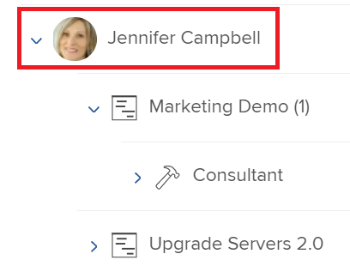

# Visão geral da navegação do Planejador de recursos

Com o Adobe Workfront Resource Planner, você pode entender facilmente a disponibilidade de seus recursos, bem como o tempo planejado necessário para concluir o trabalho em seus projetos. Você pode gerenciar a alocação de seus usuários e suas funções de trabalho nos projetos aos quais eles estão atribuídos.

>[!TIP]
>
>Não é possível gerenciar a alocação de equipes nas tarefas às quais elas são atribuídas no Planejador de Recursos.

Você deve atender aos pré-requisitos necessários para usar totalmente o Planejador de Recursos. Para obter mais informações sobre o Planejador de Recursos, consulte [Visão geral do Planejador de recursos](../../resource-mgmt/resource-planning/get-started-resource-planner.md).

As seções a seguir descrevem todas as áreas do Planejador de Recursos.

## Calendário dos projetos

Use o calendário na parte superior do Planejador de recursos para navegar na linha do tempo dos projetos que você está visualizando. A linha do tempo começa com o mês de hoje, por padrão.\
Para obter mais informações sobre como alterar o período da linha do tempo que você está exibindo no Planejador de Recursos, consulte a seção [Seleção de período](#timeframe-selection) neste artigo.

## Seleção de período  {#timeframe-selection}

Por padrão, o Planejador de Recursos mostra informações de recursos por três ou quatro meses de cada vez, começando com o mês atual. O número de períodos exibidos depende da largura da tela.

>[!TIP]
>
>Não é possível exibir mais de quatro períodos por vez no Planejador de Recursos.

Para navegar na linha do tempo:

1. Clique nas setas para trás e para a frente para retroceder e para frente na linha do tempo.
1. Selecione a partir das seguintes opções de intervalo de datas no Planejador de Recursos clicando nos botões apropriados:

   <table style="table-layout:auto"> 
    <col> 
    <col> 
    <tbody> 
     <tr> 
      <td role="rowheader">Semana</td> 
      <td>Exibe informações por semana. O número da semana é exibido ao lado das datas no cabeçalho da coluna. </td> 
     </tr> 
     <tr> 
      <td role="rowheader">Mês</td> 
      <td> Exibe informações por mês.</td> 
     </tr> 
     <tr> 
      <td role="rowheader">Trimestre</td> 
      <td>Exibe informações por trimestre. O número do trimestre é exibido ao lado das datas no cabeçalho da coluna. Os trimestres personalizados não são exibidos no Planejador de Recursos. </td> 
     </tr> 
     <tr> 
      <td role="rowheader">Hoje</td> 
      <td>Retorna ao mês, semana ou trimestre de hoje.</td> 
     </tr> 
    </tbody> 
   </table>

## Seleção de visualização do projeto/função/usuário

Você pode alterar a exibição no Planejador de Recursos dependendo de como deseja que as informações sejam exibidas.

Por padrão, o Planejador de Recursos é exibido na Visualização de Usuário. É possível alterar a exibição para Projeto ou Visualizações de função. Ao alterá-la para outra exibição, sua escolha se tornará a exibição padrão.

Quando você altera a exibição, as seguintes informações também são alteradas:

* A hierarquia do objeto (informações nas linhas do Planejador de Recursos).
* As informações de alocação de hora (informações nas colunas do Planejador de Recursos).

   Para obter mais informações sobre o que as colunas exibem no Planejador de Recursos, dependendo da exibição selecionada, consulte [Revise a disponibilidade e alocação de recursos usando o Adobe Workfront Resource Planner](../../resource-mgmt/resource-planning/resource-availability-allocation-resource-planner.md).

Para exibir informações precisas no Planejador de Recursos, é necessário atender a um conjunto de pré-requisitos. Para obter mais informações sobre os pré-requisitos, consulte a seção &quot;Pré-requisitos para trabalhar no Planejador de Recursos&quot; na seção [Visão geral do Planejador de recursos](../../resource-mgmt/resource-planning/get-started-resource-planner.md) artigo 10. o  Para alterar a exibição no Planejador de Recursos:

1. Vá para o **Planejador de recursos**.\
   Para obter mais informações sobre como acessar o Planejador de Recursos, consulte o [Localizar o Planejador de Recursos](../../resource-mgmt/resource-planning/get-started-resource-planner.md#accessing-the-resource-planner) na seção [Visão geral do Planejador de recursos](../../resource-mgmt/resource-planning/get-started-resource-planner.md) artigo 10. o

1. No **Exibir por** selecione uma das seguintes exibições no menu suspenso:

   * [Visualizar por Projeto](#view-by-project)
   * [Visualizar por Função](#view-by-role)
   * [Visualizar por Usuário](#view-by-user)

### Visualizar por Projeto {#view-by-project}

Considere o seguinte ao selecionar a Exibição do projeto no Planejador de Recursos:

* Você pode ver projetos que têm permissões para, pelo menos, visualizar.
* Ao acessar o Planejador de Recursos pela primeira vez, você pode ver projetos filtrados pelo Filtro Padrão.\
   Para obter mais informações sobre filtragem no Planejador de Recursos, consulte [Filtrar informações no Planejador de Recursos](../../resource-mgmt/resource-planning/filter-resource-planner.md).

* O número de itens que você exibe ou pode exportar da Visualização de projeto é limitado, para melhorar o desempenho.\
   Para obter mais informações sobre limitações ao visualizar o Planejador de Recursos na Exibição do Projeto, consulte o [Limitações na exibição Projeto](../../resource-mgmt/resource-planning/resource-planner-display-limitations.md#project-view-limits) na seção [Limitações de exibição do Planejador de recursos](../../resource-mgmt/resource-planning/resource-planner-display-limitations.md) artigo 10. o

* Os projetos são listados na ordem de sua prioridade na Visualização de projeto.\
   Para obter mais informações sobre a prioridade do projeto no Planejador de Recursos, consulte o [Prioridade de planejamento do projeto](#project-planning-priority) neste artigo.

* Conforme você expande cada projeto, é possível exibir as funções de trabalho associadas a ele.\
   À medida que expande cada função, é possível exibir os usuários associados a ela.\
   Role para carregar mais funções e usuários em cada projeto.

* Quando essa visualização é aplicada, as Horas de Função, FTE ou Custo são somadas às Horas do Projeto, FTE ou Custo.\
   

* Você pode exibir as seguintes informações de hora, FTE ou Custo na exibição Projeto:

   * Disponível
   * Planejado
   * Estimado
   * Variação
   * Líquido

      Para obter mais informações, consulte [Recursos de orçamento no Planejador de Recursos usando as exibições Projeto e Função](../../resource-mgmt/resource-planning/budget-resources-project-role-views-resource-planner.md).

### Visualizar por Função {#view-by-role}

Considere o seguinte ao selecionar a Exibição de Função no Planejador de Recursos:

* Você deve ter pelo menos o acesso de Exibição ao Gerenciamento de Recursos e permissões de visualização nos projetos para visualizar as funções associadas a esses projetos.
* Você pode expandir cada função para exibir uma lista de projetos e cada projeto para exibir uma lista de usuários que podem atender a essas funções nos projetos.
* O número de itens que você exibe ou pode exportar na Exibição de função é limitado, para melhorar o desempenho.\
   Para obter mais informações sobre limitações ao visualizar o Planejador de Recursos na Exibição de Função, consulte o [Limitações na exibição de funções](../../resource-mgmt/resource-planning/resource-planner-display-limitations.md#role-view-limits) seção em [Limitações de exibição do Planejador de recursos](../../resource-mgmt/resource-planning/resource-planner-display-limitations.md) .

* Os projetos são listados na função de cargo na mesma ordem de prioridade que estão listados na Exibição do projeto.
* Quando essa visualização é aplicada, as Horas do projeto, FTE ou Custo são somadas às Horas da função, FTE ou Custo.\
   

* Você pode exibir as seguintes informações de hora, FTE ou Custo na exibição Função:

   * Disponível
   * Planejado
   * Estimado
   * Variação
   * Líquido

      Para obter mais informações, consulte [Recursos de orçamento no Planejador de Recursos usando as exibições Projeto e Função](../../resource-mgmt/resource-planning/budget-resources-project-role-views-resource-planner.md).

### Visualizar por Usuário {#view-by-user}

Você pode exibir o Planejador de Recursos na Visualização de Usuário para entender a diferença entre as Horas Planejadas e Disponíveis ou o FTE para seus usuários, ou para ver a quantidade de Horas Reais que eles registraram.

Não é possível orçar seus recursos ao aplicar a Visualização de Usuário ao Planejador de Recursos. Você deve orçar seus recursos usando as exibições Projeto ou Função e usar a exibição Usuário para revisar a alocação e a disponibilidade dos usuários em relação ao trabalho planejado.*

A Exibição de Usuário é a exibição padrão do Planejador de Recursos.

Considere o seguinte ao selecionar a Exibição de Usuário no Planejador de Recursos:

* Você pode ver todos os usuários com permissões para visualizar, até 2000 usuários, que estão ativos e fizeram logon no Adobe Workfront pelo menos uma vez.\
   Filtre a lista de usuários por Equipe, Função de Trabalho ou Pools para ver os usuários associados somente a essas entidades.
* Se você tiver filtrado a lista de usuários por projetos, somente os usuários associados aos projetos filtrados poderão ser expandidos e também exibir as informações de hora.\
   Para obter mais informações sobre filtragem no Planejador de Recursos, consulte [Filtrar informações no Planejador de Recursos](../../resource-mgmt/resource-planning/filter-resource-planner.md) .

* O número de itens que você exibe ou pode exportar da Visualização de usuário é limitado, para melhorar o desempenho.\
   Para obter mais informações sobre limitações ao visualizar o Planejador de Recursos na Exibição do Usuário, consulte o [Limitações na exibição do usuário](../../resource-mgmt/resource-planning/resource-planner-display-limitations.md#user-view-limits) seção em [Limitações de exibição do Planejador de recursos](../../resource-mgmt/resource-planning/resource-planner-display-limitations.md) .

* Os projetos são listados sob o nome do usuário na mesma ordem de prioridade que estão listados na Exibição do projeto.\
   Para obter mais informações sobre a prioridade do projeto no Planejador de Recursos, consulte o [Prioridade de planejamento do projeto](#project-planning-priority) neste artigo.

* Se os usuários não tiverem nenhuma função de trabalho associada a eles, os valores de Horas ou FTE serão listados na variável **Sem função** seção.
* Quando essa visualização é aplicada, as Horas do projeto ou o FTE são adicionados às Horas do usuário ou ao FTE.

   >[!TIP]
   >
   >Não é possível exibir a alocação e a disponibilidade dos usuários por Custo na Visualização de Usuário.

* Suas permissões para projetos e tarefas determinam o que é exibido sob os nomes dos usuários que você vê na Visualização de usuário.\
   Os seguintes cenários existem:

   * Quando você não tem permissões para ver projetos e as tarefas ou problemas que são atribuídos aos usuários exibidos no Planejador de Recursos, esses itens são listados na variável **Itens inacessíveis** seções. O **Itens inacessíveis** As seções substituem as seções Projeto ou Tarefa neste caso.

   * Quando você não tem permissões para ver os projetos, mas tem acesso para ver as tarefas ou problemas nos projetos, os projetos, as tarefas e os problemas são listados sob os nomes dos usuários atribuídos a eles.
   * Quando você tem permissões para ver os projetos, mas não qualquer tarefa ou problema nos projetos, o nome do projeto é exibido e as tarefas e problemas são listados na variável **Itens inacessíveis** seção.\
      Para obter mais informações sobre permissões no Workfront, consulte [Visão geral do compartilhamento de permissões em objetos](../../workfront-basics/grant-and-request-access-to-objects/sharing-permissions-on-objects-overview.md).

      
    

* Você pode exibir as seguintes informações de hora e FTE na exibição Usuário:

   * Disponível
   * Planejado
   * Efetivo
   * Diferença entre Planejado e Real
   * Porcentagem da alocação planejada

      Para obter mais informações, consulte [Exibir Horas Disponíveis, Planejadas e Reais ou FTE no Planejador de Recursos ao usar a exibição Usuário](../../resource-mgmt/resource-planning/view-hours-fte-user-view-resource-planner.md)

## Nome do Projeto

Você pode ver os seguintes projetos no Planejador de Recursos:

* Projetos que você tem permissões para, pelo menos, visualizar.

   Você também deve ter acesso a, pelo menos, Visualizar gerenciamento de recursos em seu nível de acesso.

   Para obter informações sobre o acesso necessário para usar o Planejador de Recursos, consulte [Acesso necessário para recursos de orçamento no Adobe Workfront](../../resource-mgmt/resource-planning/access-needed-to-budget-resources.md).

* Projetos limitados pelo filtro aplicado ao Planejador de Recursos.

   Para obter mais informações sobre filtragem no Planejador de Recursos, consulte [Filtrar informações no Planejador de Recursos](../../resource-mgmt/resource-planning/filter-resource-planner.md).

   >[!NOTE]
   >
   >Recomendamos usar filtros para reduzir o número de projetos exibidos no Planejador de Recursos.

## Prioridade de planejamento do projeto {#project-planning-priority}

Os projetos são listados em ordem de prioridade no Planejador de Recursos com o projeto mais importante no topo. A prioridade é indicada por um número na frente do nome do projeto.

Você também pode ativar uma configuração para exibir as prioridades do projeto de acordo com seus portfólios, quando estiverem associados a um portfólio. Para obter informações sobre priorização de projetos e exibição de prioridades de portfólio no Planejador de Recursos , consulte [Priorizar projetos no Planejador de Recursos](../../resource-mgmt/resource-planning/prioritize-projects-resource-planner.md).

## Nome Função

As seguintes categorias de funções de trabalho são listadas no Planejador de Recursos:

* As funções de trabalho atribuídas às tarefas.
* As funções de trabalho que não são atribuídas a tarefas, mas são as principais funções de trabalho dos usuários associados aos pools de recursos dos projetos.
* As funções de job secundário dos usuários atribuídos a tarefas nessas funções de job.
* As funções de trabalho secundárias dos usuários que têm um valor válido **Porcentagem de disponibilidade de FTE** no seu perfil.\
   Para obter mais informações sobre o **Porcentagem de disponibilidade de FTE** para funções de cargo, consulte [Editar o perfil de um usuário](../../administration-and-setup/add-users/create-and-manage-users/edit-a-users-profile.md) .

>[!NOTE]
>
>As funções de trabalho atribuídas a problemas também são listadas quando a variável **Incluir horas do problema** está ativada. Para obter mais informações sobre como ativar horas de problema no Planejador de Recursos, consulte o [Configurações](#settings) seção.

## Nome do usuário

Os usuários listados nas exibições Projeto e Função no Planejador de Recursos pertencem aos pools de recursos associados aos projetos.\
Para obter mais informações sobre como preencher pools de recursos com usuários, consulte [Associar pools de recursos a usuários](../../resource-mgmt/resource-planning/resource-pools/associate-resource-pools-with-users.md).

Todos os usuários que você tem acesso a Exibir e que tiverem feito logon no Workfront pelo menos uma vez serão exibidos na Exibição do usuário.

Nas Exibições de Projeto e Função, os usuários podem aparecer listados nos seguintes tipos de funções de trabalho:

* Sua função principal de trabalho
* O seu cargo secundário, nos seguintes cenários:

   * Se a função de trabalho secundário tiver um número válido para o **Porcentagem de disponibilidade de FTE** no perfil do usuário.
   * Se o usuário for atribuído a tarefas nessas funções.

Para obter mais informações sobre o **Porcentagem de disponibilidade de FTE** para obter uma função de trabalho, consulte [Editar o perfil de um usuário](../../administration-and-setup/add-users/create-and-manage-users/edit-a-users-profile.md) .

## Seções &quot;Sem função&quot; e &quot;Sem usuário&quot;

* [Seção &quot;Sem função&quot;](#no-role-section)
* [Seção &quot;Nenhum usuário&quot;](#no-user-section)

### Seção &quot;Sem função&quot;  {#no-role-section}

Quando um usuário pertence a um pool de recursos associado a um projeto, mas não tem uma função de trabalho associada a ele, ele é exibido na variável **Sem função** , em vez de em uma função de trabalho específica.

Não é possível orçar horas para um usuário em um **Sem função** seção. O usuário deve ter pelo menos uma função de trabalho associada a ele para ser orçado para trabalho.\

### Seção &quot;Nenhum usuário&quot;  {#no-user-section}

Quando você atribui uma tarefa a uma equipe, ou deixa-a não atribuída, as Horas Planejadas aparecem sob a variável **Sem usuário** que aparece sob a **Sem função** no Planejador de Recursos. Essas tarefas não aparecem no Planejador de Recursos ao usar o **Exibir por usuário** exibir.

Você pode ver a quantidade de Horas Planejadas atribuída às tarefas no projeto no **Sem usuário** no Planejador de Recursos, mas não é possível orçar essas alocações.

 

## Filtros

Usando filtros, você pode limitar as informações exibidas no Planejador de Recursos.

Para obter mais informações sobre filtragem no Planejador de Recursos, consulte [Filtrar informações no Planejador de Recursos](../../resource-mgmt/resource-planning/filter-resource-planner.md) .

## Configurações {#settings}

Na área Configurações , é possível ativar ou desativar as opções para exibir ou ocultar informações no Planejador de Recursos.

Para ativar as configurações no Planejador de Recursos:

1. Abra o Planejador de Recursos.
1. Clique no botão **Configurações** ícone .

   

   A caixa Configurações do Planejador de Recursos é exibida.

   

1. Ative o **Incluir horas de problemas** configuração para exibir Horas Planejadas a partir de problemas no Planejador de Recursos. Esta configuração é desativada por padrão.

   Considere o seguinte ao ativar essa configuração:

   * O nome do usuário atribuído aos problemas é exibido na função de trabalho associada a eles no problema e você pode especificar Horas Orçadas para o usuário e a função de trabalho nas exibições Projeto e Função .
   * Os problemas aos quais os usuários são atribuídos são listados sob os nomes das funções de trabalho na exibição Usuário.

      >[!IMPORTANT]
      >
      >**Quando a ocorrência de Datas de início e conclusão planejadas estiver fora da linha do tempo do projeto, as Horas Planejadas para a ocorrência serão exibidas de acordo com as datas da ocorrência. Por exemplo, se a linha do tempo do projeto estiver entre janeiro e março, mas a linha do tempo dos problemas estiver em agosto, as Horas Planejadas dos problemas aparecerão no período de agosto.**

1. (Condicional e opcional) Se você selecionou a exibição Projeto , ative a configuração Exibir prioridades do Portfolio para exibir as prioridades do projeto de acordo com a Portfolio a que elas foram atribuídas. A prioridade dos projetos de acordo com seus portfólios é exibida ao lado da prioridade do Planejador de Recursos. Esta configuração é desativada por padrão.

   Para obter informações sobre priorização de projetos no Planejador de Recursos, consulte [Priorizar projetos no Planejador de Recursos](../../resource-mgmt/resource-planning/prioritize-projects-resource-planner.md).

## Opção de tela cheia

Você pode exibir o Planejador de Recursos em tela cheia, para aumentar a quantidade de informações que pode ser exibida na tela.

A opção para exibir informações em tela cheia está disponível para todas as exibições do Planejador de Recursos.

Para exibir o Planejador de recursos em tela cheia:

1. Vá para o **Planejador de recursos**.
1. Clique no botão **Ícone Tela cheia** para exibir o Planejador de recursos em tela cheia.\
   \
   O Planejador de Recursos se expande para ocupar toda a janela do navegador e o ícone se transforma em um **Feche a Tela cheia** opção de visualização.

1. (Opcional) Clique no botão **Ícone Fechar tela cheia** para reverter para a exibição anterior.

## Opção Exportar

Você pode exportar informações para um arquivo Excel (.xlsx) de qualquer exibição do Planejador de Recursos.\
Para obter informações sobre exportação de informações do Planejador de Recursos, consulte [Exportar informações do Planejador de Recursos](../../resource-mgmt/resource-planning/export-resource-planner.md).

Você pode gerenciar a quantidade de informações e a exibição do arquivo exportado.\
Para obter informações sobre quais informações você pode exportar do Planejador de Recursos e como gerenciar a aparência do arquivo exportado, consulte [Limitações de exibição do Planejador de recursos](../../resource-mgmt/resource-planning/resource-planner-display-limitations.md).
