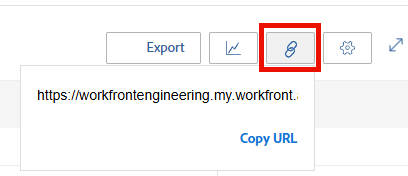

# Compartilhar a visualização de usuário do Planejador de recursos com um link

O Adobe Workfront pode gerar um URL exclusivo para a Visualização de usuário do Planejador de recursos, que você pode incorporar em um painel como uma Página externa ou abri-lo separadamente em uma nova guia do navegador. Isso é útil ao compartilhar as informações do Planejador de recursos com usuários que podem não ter acesso direto à área Recursos.

## Requisitos de acesso

+++ Expanda para visualizar os requisitos de acesso para a funcionalidade neste artigo.

Você deve ter o seguinte acesso para executar as etapas deste artigo:

<table style="table-layout:auto"> 
 <col> 
 <col> 
 <tbody> 
  <tr> 
   <td role="rowheader">plano do Adobe Workfront</td> 
    <td>
Novo: Qualquer um

       
ou

       
Atual: Pro ou superior
 </td> 
  </tr> 
  <tr> 
   <td role="rowheader">Licença do Adobe Workfront</td> 
   <td>
Novo: Padrão

       
ou

       
Atual: Plano
</td> 
  </tr> 
  <tr> 
   <td role="rowheader">Configurações de nível de acesso</td> 
   <td> 
Acesso de visualização ou superior ao Gerenciamento de recursos, Projetos e Usuários
 
Exibir acesso a Dados Financeiros para exibir informações de custo
</td> 
  </tr> 
  <tr> 
   <td role="rowheader">Permissões de objeto</td> 
   <td> 
Visualize ou tenha permissões mais altas para os projetos que você deseja exibir no Planejador de recursos
</td> 
  </tr> 
 </tbody> 
</table>

Para obter mais detalhes sobre as informações nesta tabela, consulte [Requisitos de acesso na documentação do Workfront](/help/quicksilver/administration-and-setup/add-users/access-levels-and-object-permissions/access-level-requirements-in-documentation.md).

+++

Considere o seguinte ao gerar o URL exclusivo para a Exibição de Usuário do Planejador de Recursos:

* Você pode obter um URL exclusivo somente para a Exibição de usuário. A opção para gerar o URL não existe nas Visualizações do projeto ou da função.
* Você pode compartilhar o URL com outros usuários, incluindo Trabalhar e Revisar usuários licenciados.\
  Eles devem ter acesso para exibir outros usuários para exibir as informações no Planejador de recursos do URL que você compartilha com eles.
* As seguintes informações são salvas quando você compartilha o URL com outros usuários:

   * O tipo de períodos (semana, mês, trimestre).
   * Os filtros que você aplica.
   * O tipo de exibição (Horas ou FTE).

Para obter um URL único na visualização Usuário do Planejador de recursos e compartilhá-lo com outros usuários:

{{step1-to-resourcing}}

1. Selecione **Exibir por Usuário**.
1. (Opcional) Selecione o período no qual você deseja exibir as informações no Planejador de recursos. Selecione entre as seguintes opções:

   * Semana
   * Mês
   * Trimestre

1. (Opcional) Selecione se você deseja exibir as informações por **FTE** ou **Horas**.\
   

1. (Opcional) Aplique filtros ao Planejador de recursos.\
   Para obter informações sobre como aplicar filtros, consulte [Informações de filtro no Planejador de Recursos](../../resource-mgmt/resource-planning/filter-resource-planner.md).

1. Clique no ícone de **hiperlink**.\
   

1. Clique em **Copiar URL**.\
   Isto copia o URL exclusivo do Planejador de recursos na Visão do usuário para a área de transferência.

1. (Opcional) Siga um destes procedimentos:

   * Cole o URL em outro aplicativo para enviá-lo a outro usuário.\
     O usuário deve estar conectado ao Workfront para visualizar o Planejador de recursos na visualização Usuário.
   * Abra uma nova guia ou janela do navegador e cole o link copiado e clique em Inserir no teclado para abrir o Planejador de recursos em uma nova guia ou janela.
   * Faça o seguinte:

     <!--   
     <MadCap:conditionalText data-mc-conditions="QuicksilverOrClassic.Draft mode">   
     (NOTE:&nbsp;turn this into a numbered list)   
     </MadCap:conditionalText>   
     -->

      1. Ir para **Relatórios**>**Painéis**>**Novo Painel**>**Adicionar Página Externa.**

      1. Cole o link copiado para a área de transferência no campo **URL**.
      1. Clique em **Salvar** e depois em **Salvar + Fechar**.\
         Isso incorporará o URL ao painel e a visualização Usuário do Planejador de recursos será exibida em um painel separado.

1. (Opcional) Se você incorporou o URL a um painel, considere adicioná-lo a um modelo de layout ou compartilhá-lo com outros usuários que podem não ter acesso à área Gerenciamento de recursos.\
   Para obter informações sobre como adicionar painéis a um modelo de layout, consulte [Criar e gerenciar modelos de layout](../../administration-and-setup/customize-workfront/use-layout-templates/create-and-manage-layout-templates.md).\
   Para obter informações sobre como compartilhar painéis, consulte [Compartilhar um painel](../../reports-and-dashboards/dashboards/creating-and-managing-dashboards/share-dashboard.md).\
   Ao visualizar o URL compartilhado, os usuários podem ver as informações com as configurações originalmente aplicadas ao Planejador de recursos. Eles devem estar conectados ao Workfront para exibir o URL compartilhado.\
   
